# 机器学习中常见概率分布实用指南(第二部分)

> 原文：<https://towardsdatascience.com/practical-guide-to-common-probability-distributions-in-machine-learning-part-2-5bcb910218c0?source=collection_archive---------29----------------------->

## 介绍常见概率分布的性质和数学定义。

概率是机器学习和数据科学的基本组成部分。事实上，现代机器学习算法的一些基本原理部分建立在这些统计理解上。在这篇文章中，我们将获得一些关于*如何*和*为什么*一些更常见的概率分布函数表现的直觉。我们还将定义它们的数学定义，以及如何用 Python 构建一个。

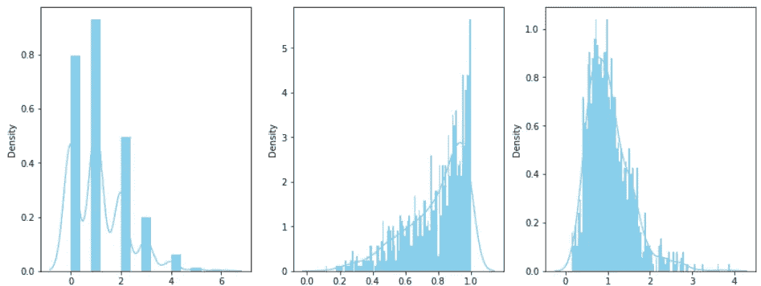

作者图片

这篇文章的部分灵感来自于我写的一篇关于贝叶斯统计的文章。我注意到这个话题很少被讨论，但它是需要学习的更重要的知识之一，尤其是对于那些正在构建机器学习模型的人来说。

</bayesian-statistical-programming-an-introduction-4ca3e2ddae76> [## 贝叶斯统计程序设计:导论

towardsdatascience.com](/bayesian-statistical-programming-an-introduction-4ca3e2ddae76) 

这篇文章是第一部分的延续，链接如下。

</practical-guide-to-common-probability-distributions-in-machine-learning-487f6137625> [## 机器学习中常见概率分布实用指南

towardsdatascience.com](/practical-guide-to-common-probability-distributions-in-machine-learning-487f6137625) 

# 目录:

1.  泊松分布
2.  t 分布
3.  卡方分布
4.  f 分布
5.  贝塔分布

# 泊松分布

泊松分布是一个离散的概率函数，它表示给定事件在整个可能结果空间中发生的概率。例如，您可以使用泊松分布来模拟一小时内在给定车站停留的公共汽车数量(例如 1 辆公共汽车、2 辆公共汽车等等)。这种分布通常用于结果可数的事件(即离散的)，例如上面的公共汽车站例子。

泊松分布的数学公式如下，其中λ(读作:lambda)是所有可能结果的期望值(例如，一小时内平均有 1.2 辆公共汽车停靠在一个公共汽车站)。

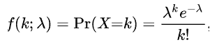

泊松分布公式

通过首先导入所需的库，您可以使用 scipy 在 Python 中创建泊松分布。

```
from scipy.stats import poisson
import seaborn as sns
import matplotlib.pyplot as plt
```

调用函数…(使用大小为 10000 的样本，平均出现 1.2 次)

```
data_poisson = poisson.rvs(mu=1.2, size=10000)
```

并绘制它…

```
sns.distplot(data_poisson,
              kde=True,
              color='skyblue',
              hist_kws={"linewidth": 15,'alpha':1})
```

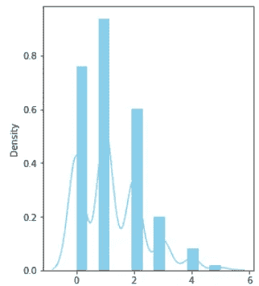

泊松分布(作者图片)

# t 分布

t 分布或学生分布是一种类似于正态分布的概率分布函数。关键的区别在于 t 分布用于模拟具有*低*样本量和/或*未知*总体方差的事件。这种分布广泛用于估计生物学、生态学、公共卫生等领域中基于人口的分布。

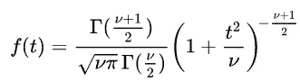

t 分布公式

上式中，γ(读作:gamma)是 Gamma 函数， *v* 是自由度的个数， *t* 是我们可能的观测值(即 *x* 。自由度， *v，*是一个可调参数，允许您调节 t 分布的宽度或宽度。

通过首先导入所需的库，您可以使用 scipy 在 Python 中创建 t-distribution。

```
from scipy.stats import t
import seaborn as sns
import matplotlib.pyplot as plt
```

通过定义自由度调用函数， *v* …(并使用大小为 1000 的样本)

```
degrees_of_freedom = 5
data_t = uniform.rvs(degrees_of_freedom, size=1000)
```

并绘制它…

```
sns.distplot(data_t,
              kde=True,
              bins=100,
              color='skyblue',
              hist_kws={"linewidth": 15,'alpha':1})
```

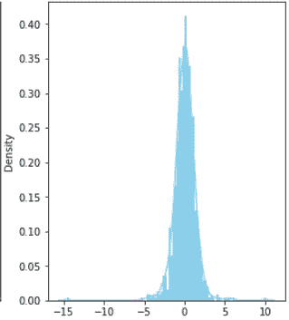

t 分布(图片由作者提供)

# 卡方分布

卡方概率通常用于比较观察值和理论值之间的差异(即拟合优度)。具有 *k* 自由度的分布是 *k* 个独立标准正态随机变量的平方和，如下式所示，其中γ(读作:γ)是[γ函数](https://en.wikipedia.org/wiki/Gamma_function):

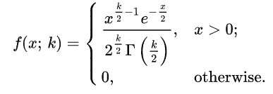

卡方公式

通过首先导入所需的库，您可以使用 scipy 在 Python 中创建卡方分布。

```
from scipy.stats import chi2
import seaborn as sns
import matplotlib.pyplot as plt
```

通过定义自由度调用函数， *k* …

```
degree_of_freedom = 25
data_chi2 = chi2.rvs(degree_of_freedom, size=1000)
```

并绘制它…

```
sns.distplot(data_chi2,
              kde=True,
              bins=100,
              color='skyblue',
              hist_kws={"linewidth": 15,'alpha':1})
```

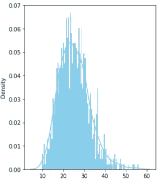

卡方分布(图片由作者提供)

# f 分布

f 分布是两个自由度为 *d1* 和 *d2* 的卡方分布，以及一个[贝塔函数](https://en.wikipedia.org/wiki/Beta_function) *、* *B* 之间的比值。f 分布可用于多种应用，包括验证多元回归方程或比较两个不同总体的方差(例如，观察值与实际值)，以确定两者之间的相似性是否仅仅是巧合。

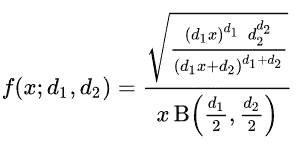

f 分布公式

通过首先导入所需的库，您可以使用 scipy 在 Python 中创建 F 发行版。

```
from scipy.stats import f
import seaborn as sns
import matplotlib.pyplot as plt
```

通过定义两个自由度 *d1* 和 *d2* 调用函数…

```
d1 = 10
d2 = 50data_f = f.rvs(d1,d2,size=1000)
```

并绘制它…

```
sns.distplot(data_f,
              kde=True,
              bins=100,
              color='skyblue',
              hist_kws={"linewidth": 15,'alpha':1})
```

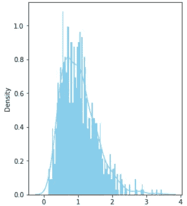

f 分布(图片由作者提供)

# 贝塔分布

Beta 分布用于模拟范围有限的事件，例如从 0 到 1。例子包括成功的概率，它可以在 0 和 1 之间变化。它们由α(读作:α)和β(读作:β)参数化，函数的形式为:

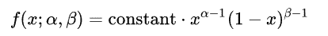

贝塔分布

通过首先导入所需的库，您可以使用 scipy 在 Python 中创建一个测试版。

```
from scipy.stats import beta
import seaborn as sns
import matplotlib.pyplot as plt
```

通过定义α和β调用函数…

```
alpha = 3.41
beta = 0.87
data_beta = beta.rvs(alpha, beta, size=1000)
```

并绘制它…

```
sns.distplot(data_beta,
              kde=True,
              bins=100,
              color='skyblue',
              hist_kws={"linewidth": 15,'alpha':1})
```

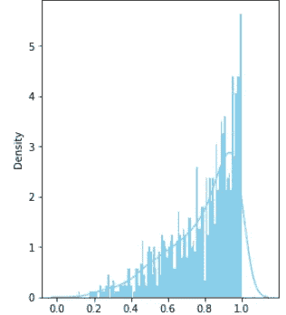

Beta 分布(图片由作者提供)

# 结论

这个帖子到此为止！希望您已经获得了一些直觉，知道为什么以及如何使用这些概率分布来模拟真实世界的场景。如果你对概率分布有进一步的建议，请告诉我！

***做订阅我的邮件简讯:***[*【https://tinyurl.com/2npw2fnz】*](https://tinyurl.com/2npw2fnz)****在这里我定期用通俗易懂的语言和漂亮的可视化总结 AI 研究论文。****