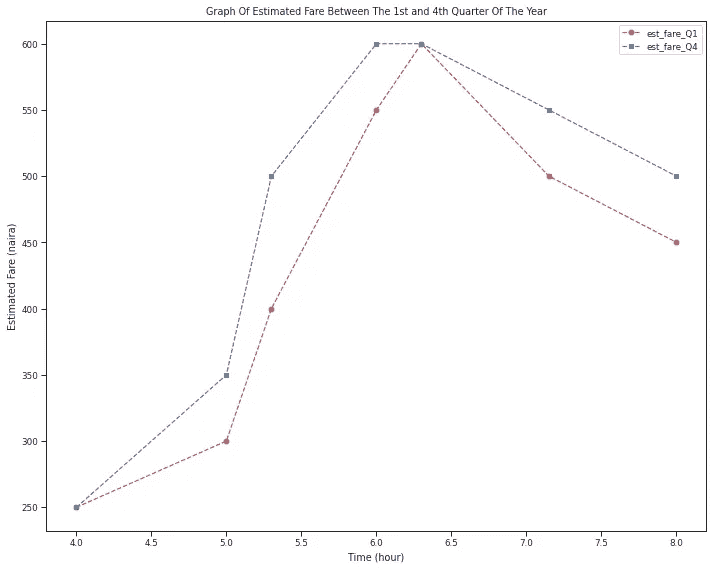
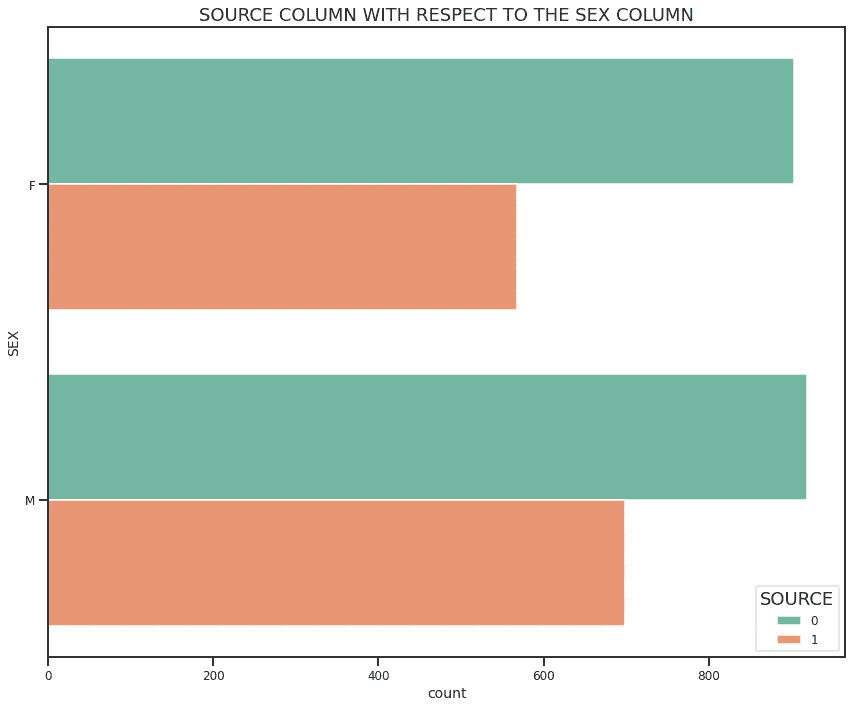
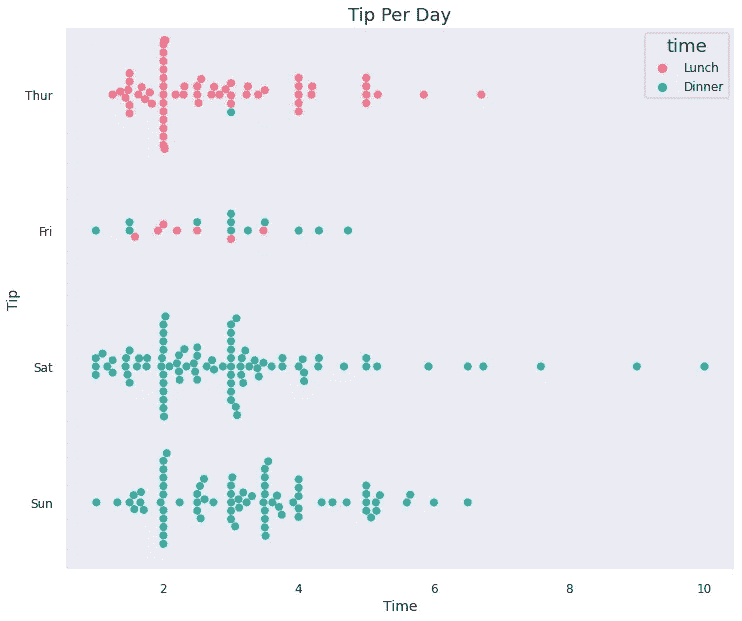

# 数据可视化实用指南:第 1 部分

> 原文：<https://towardsdatascience.com/practical-guide-to-data-visualization-83e375b0037?source=collection_archive---------12----------------------->

## 使用 Python、Seaborn 和 Matplotlib


来自[佩克斯](https://www.pexels.com/photo/person-with-body-painting-1209843/?utm_content=attributionCopyText&utm_medium=referral&utm_source=pexels)的[莎伦·麦卡琴](https://www.pexels.com/@mccutcheon?utm_content=attributionCopyText&utm_medium=referral&utm_source=pexels)的照片

如果你正在阅读这篇文章，你可能已经猜到我将要谈论数据可视化(从标题判断)，并且可能已经创建了一些或者打算这样做。

*听起来像你？*

**读下去！！！**

数据可视化是在探索性数据分析过程中传达观察结果的一种很好的方式。

> 我的意思是，一张图胜过一千个字，对吗？？？

我最近参加了由尼日利亚[数据科学](https://www.datasciencenigeria.org/)主办的 Kaggle 黑客马拉松，以此来标志一个人工智能初学者课程的完成，我也可以说这是我第一次参加任何 Kaggle 比赛，真的，我感到非常兴奋能够参加。

在做这个项目的时候，我花了一些时间研究更多关于数据可视化的资源，在我脑海中的某个地方，我知道我很乐意与你分享这些，所以在构建这个项目的整个过程中，我一直在想你。

***今天我站在这里，与你们分享我的发现……***

> 这个实用指南是一个系列，它将使你具备数据可视化的基础，我鼓励你和我一起编码！！！

我们将使用 **Python** 、 **Seaborn** 和 **Matplotlib 来看一些图表。**

不熟悉术语数据可视化？？这里有一个快速定义。

***数据可视化可以概括为这四行:***

*   给定数据中的信息表示，可以是趋势、模式、异常值。
*   这是一个跨学科的领域。
*   它包括图表、图形、绘图和其他视觉元素的使用。
*   表示大量信息的有效方式。

GIF via [giphy](https://giphy.com/)

**举个例子，**

当我们看到一个图表时，我们可以迅速发现趋势和异常值，从而轻松地将信息内化。这张图表最终总结了一个故事，你可能无法通过盯着熊猫数据框架或电子表格来理解这个故事。

> 有没有试过长时间盯着电子表格？
> 
> 理解它有多容易？

本文将重点介绍 ***Python*** 、 ***Matplotlib、*** 和 ***Seaborn 库*** 的使用，参考数据集是 Kaggle 上托管的数据科学尼日利亚黑客马拉松(Data Science Nigeria hackathon)，你可以在这里 看一下[。](https://www.kaggle.com/c/data-science-nigeria-patient-treatment/data)

*记下…*

这将是一段漫长而甜蜜的旅程！！！

***TL:*博士**

拿起你的咖啡，让我们开始吧！！！


照片由 [cottonbro](https://www.pexels.com/@cottonbro?utm_content=attributionCopyText&utm_medium=referral&utm_source=pexels) 从 [Pexels](https://www.pexels.com/photo/asian-girl-in-yellow-suit-drinking-on-chair-9656761/?utm_content=attributionCopyText&utm_medium=referral&utm_source=pexels) 拍摄

# 内容大纲

1.  导入库
2.  导入和读取数据集
3.  设置图形美学
4.  其他定制
5.  使用颜色
6.  问题陈述
7.  系列中涵盖的地块列表
8.  线形图
9.  散点图
10.  计数图
11.  箱形图
12.  分类图
13.  配对图
14.  创建多个地块
15.  在开始一个项目之前拥有领域知识的重要性。
16.  结论

> 如果你不熟悉 Seaborn 和 Matplotlib，我建议你浏览下面的文档链接；

*   [Seaborn](http://seaborn.pydata.org/introduction.html)
*   [Matplotlib](https://matplotlib.org/3.3.3/contents.html)

> 与此同时，Seaborn 是一个基于 Matplotlib 构建的 Python 库，它们都用于数据可视化。

好吧，我们开始吧！！！

## 导入库

```
pip install opendatasets --upgrade --quiet
```

## 我安装了 opendatasets，因为我直接在 google colab 上工作，我的数据集直接来自 Kaggle。

> *psst…如果你直接在你的 Jupyter 笔记中工作，你可以跳过这段代码*

```
import pandas as pdimport opendatasets as odimport numpy as npimport matplotlib.pyplot as pltimport seaborn as sns%matplotlib inline
```

*   %matplotlib inline 有助于确保我们的绘图显示并嵌入 Jupyter 笔记本本身。而不是出现在弹出窗口中。

## 资料组

我使用 opendataset 库直接从 Kaggle 导入数据集。

```
in_out_train =  '/content/data-science-nigeria-patient-treatment/train.csv'in_out_test = '/content/data-science-nigeria-patient-treatment/test.csv'sample_submission = '/content/data-science-nigeria-patient-treatment/sample_submission.csv'
```

阅读 CSV

```
train=pd.read_csv(in_out_train)test=pd.read_csv(in_out_test)sample = pd.read_csv (sample_submission)
```

现在我们有了数据集，让我们快速看一下火车 CSV 的前几行。

```
train.head(10)
```


作者图片

*   您也可以尝试 train.tail(10)来查看最后十行。

## 目标变量

我们需要使用几行代码来确定这个项目的目标变量。

```
target = [col for col in train.columns if col not in test.columns]target
```

[出局]

```
['SOURCE']
```

*   这个项目的目标变量是“源列”。因此，我们会通过我们的视觉化来引用它。

## 创建一个图来查看“源”列中出现的类别数

```
plt.figure (figsize= (10,6), tight_layout= True)  # Set figure sizesns.countplot(train['SOURCE'], label = 'counts')
```


作者图片

## 上面的图被称为计数图，它显示了每个“源”列中的观察计数。我们也可以了解目标变量的平衡程度。

> pssttt…
> 
> 尽管我们想创建易于理解的可视化效果，但我们也不想花太多时间来设置每个图的特征。

例如

*   标题
*   字体
*   风格等。

这可能很费时间，因此从一开始就定制你的情节是一个好习惯。

关于这一点，让我们来看看如何设置我们的身材美学。

# 图形美学

我们可以通过修改样式或比例来修改地块外观。

1.  风格:

*   set_style()
*   axes_style()

2.比例:

*   set_context()
*   绘图 _ 上下文()

```
sns.set_style('whitegrid') # adjust the stylesns.set_context ('paper')  # modify the scaleplt.figure (figsize= (10,6), tight_layout= True) # Set figure sizesns.countplot(train['SOURCE'], label = 'counts')
```


作者图片

首先，我们使用 sns.set_style()设置我们的绘图的背景样式。默认为*‘深色网格’*，其他选项包括*‘白色网格’，‘深色’，‘白色’，‘刻度’*

**这将给我们的图表一个更好的整体外观。**

接下来，我们通过调用 *sns.set_context()* 函数来修改绘图的比例。

默认为“笔记本”。其他预设上下文包括:*【论文】【谈话】**【海报】*。

*   探索这些选项，看看哪一个最适合您的项目。

```
plt.figure (figsize= (10,8), tight_layout= True) #set figure sizesns.set_style('ticks')  # adjust the stylesns.set_context ('poster')  # modify the scalesns.countplot(train['SOURCE'], label = 'counts')
```


作者图片

> 我已经在前面的图中设置了图形大小，即 plt.figure (figsize= (10，6)，tight_layout= True)。但是我注意到 y 轴的计数结束于“1500”，而不是“1750”。所以当你改变尺度(sns.set_context ('poster '))的时候，一定要注意你的情节发生了什么变化。

***好了，我们继续……***

有时候，我不喜欢在顶轴和右轴上有刺，所以我调用 *despine()* 函数。

> 此功能仅适用于 *set_style()* 的*‘白色’*和*‘刻度’*参数

```
plt.figure (figsize= (10,8), tight_layout= True) #set figure sizesns.countplot(train['SOURCE'], label = 'counts')sns.despine()
```


作者图片

## 你能看出上面两幅图的不同之处吗？

```
plt.figure (figsize= (10,8), tight_layout= True) #set figure sizesns.set_style('darkgrid')   # adjust the styleplt.rc('grid', c ='r', ls ='-', lw = 0.5)  # gridstyleplt.rc('axes', titlesize=18)  # axes title fontsizeplt.rc('axes', labelsize=14)   # x and y labels fontsizeplt.rc('xtick', labelsize=12)  # fontsize of the tick labelsplt.rc('ytick', labelsize=12)  # fontsize of the tick labelsplt.rc('legend', fontsize=12)  # legend fontsizeplt.rc('font', size=12)        # modify text sizessns.countplot(train['SOURCE'], label = 'counts')
```


作者图片

*   我们要做的下一件事是设置我们的字体大小(标题、轴和图例),我们不需要在随后的图中重复它。

***听起来不错 hun？***

> **但是，要切换到默认参数，可以调用 sns.set_theme()**

```
# Another quick option is to set the parameters in a dictionary and call it on the plt.rc() as shown below.#font = {'family' : 'serif',#'weight' : 'light'}# pass in the font dict as kwargs#plt.rc('font', **font)#sns.countplot(train['SOURCE'], label = 'COUNTS')# You can take out the comments in the codes above to see what the visulization looks like.
```

> 为了让你的工作更快捷、更简单，我整理了一份化名清单。

```
df= {'Alias' : ['lw', 'ls','c', 'fc', 'ec', 'ha'], 'Property': ['linewidth', 'linestyle', 'color', 'facecolor', 'edgecolor', 'horizaontal alignment']}short_forms= pd.DataFrame (df)short_forms
```


作者图片

> 快速提醒；
> 
> 不要忘记编码…

# 其他定制

就我个人而言，我不喜欢使用默认颜色，所以我调整到自己满意的程度。

这同样适用于图形大小和外观。

> **记笔记；**
> 
> **“有必要标记我们的 x 轴和 y 轴，并为我们的图表添加一个标题”**

*   让我们来看看如何实现这一点。

```
plt.figure (figsize= (12,8), tight_layout= True)sns.set(font_scale= 1.5)sns.countplot(train['SOURCE'], label = 'counts')plt.xlabel('Count')plt.ylabel('Target')plt.title ('Target Column Unique Values')plt.show()
```


作者图片

*   当我们有并排支线剧情时，tight_layout 参数就发挥作用了。我将在本文的后面详细讨论这一点。

***你还在跟踪我吗？***

# 使用颜色

将 seaborn 与 matplotlib 相结合，可以更好地使用颜色，并且在视觉上更具吸引力。

```
sns.color_palette() #calling the default seaborn colour palettes.
```


作者图片

这些调色板有一个列表的形式，因此我们可以根据它的索引调用特定的颜色，我们将得到一个 RGB 代码。

> ***eg；1.0，0.6235294117647059，0.6078431372549019***


作者图片

其他变化包括:

*   色盲
*   “深”
*   '静音'

Seaborn 还有一些其他有趣的调色板；有关更多详细信息，请参考文档；

[https://seaborn.pydata.org/tutorial/color_palettes.html](https://seaborn.pydata.org/tutorial/color_palettes.html)

*   '配对'
*   设置 2 '
*   hls 的

另一类有趣的颜色是感知均匀的颜色。

*   “火箭”(适用于热图)
*   “mako”(适用于热图)
*   '闪光'
*   “冠”

```
sns.color_palette("rocket", as_cmap=True)
```

> 我们真的有很多颜色可以选择，为什么要坚持传统的蓝色和橙色呢？

## 在我们进行的过程中，我们一定会尝试这种定制。

> 我们来看看问题陈述。

# 问题陈述

因为本文的重点是数据可视化，所以我们不会做任何数据清理或探索性的数据分析。

但如果能对问题陈述有所了解，那就太好了…

**你这么想对吗？**

*我也是！！！*

> “作为 HealthIsWealth 医院自动化系统的一部分，您已经签约成为一名专业数据科学家，他将构建一个系统，该系统将借助关于患者、其状况和实验室测试的几个数据点来预测和估计患者是否应被归类为护理中的患者或护理外的患者”

问题陈述是不言自明的，老实说，我从未想过将病人分为住院病人和门诊病人的过程，但在从事这个项目后，我不仅对这个过程有了概念，而且对它的重要性有了更清晰的理解。

> 在本文的后半部分，我将更详细地解释为什么作为一名数据分析师/科学家，拥有任何项目的领域知识都是必要的。

## 以下是这一系列中涉及的情节列表。

1.  线形图
2.  散点图
3.  计数图
4.  箱形图
5.  分类图
6.  配对图
7.  条形图
8.  圆形分格统计图表
9.  柱状图
10.  热图

## 我们还会看一看；

*   导入图像
*   创建多个地块

***走吧！！！***

# 线形图

*   折线图是最简单且广泛使用的图表之一。
*   它以直线连接的数据点或标记的形式显示数据集中的观察值。

```
sns.set_theme  # setting sns parameters to the defaults
```

上面的代码重置了主题。

```
sns.set_style('ticks')   # set the stylesns.set_context ('paper')  # set the scale
```

## 对于我们的第一个图，我们将创建一个假设的示例，说明在一年的最后一个季度和下一年的年初从 Alausa 到 Obalende 的估计票价。

```
time = [4.00, 5.00, 5.30, 6.00, 6.30, 7.15, 8.00]days= range(1,8)est_fare_Q1= [250,300,400, 550, 600, 500,450]est_fare_Q4= [250,350,500, 600, 600, 550,500]
```

绘制折线图就像运行如下所示的几行代码一样简单；

```
plt.figure (figsize= (10,8), tight_layout= True)plt.plot(time)
```


作者图片

> 这并没有给我们提供太多的信息，所以让我们添加更多的细节。

```
plt.figure (figsize= (10,8), tight_layout= True)plt.plot(time,est_fare_Q1)
plt.rc('grid', c ='b', ls ='-', lw = 0.5)  # gridstyle
plt.xlabel('Time (hour)')
plt.ylabel('Estimated Q4 Fare (naira)')
```


作者图片

*   现在我们有了更多的信息。一眼看去，我们可以知道 x 轴和 y 轴上的值是什么，并且可以看出它们之间的关系。
*   让我们来看看一个线图上的多个图。

```
plt.figure (figsize= (10,8), tight_layout= True)plt.plot(time,est_fare_Q1)
plt.plot(time,est_fare_Q4)
plt.xlabel('Time (hour)')
plt.ylabel('Estimated Fare (naira)'
```


作者图片

*   我们可以清楚地看到这两个图，但不能确切地告诉 Q1 或第四季度。
*   为了解决这个问题，我们设置了图例参数。它使我们能够区分上面的两个图。

```
plt.figure (figsize= (10,8), tight_layout= True)plt.plot(time,est_fare_Q1, marker= 'x')plt.plot(time,est_fare_Q4, marker= 'o')plt.title ('Graph Of Estimated Fare Between The 1st and 4th Quarter Of The Year')plt.legend(["est_fare_Q1", "est_fare_Q4"])plt.xlabel('Time (hour)')plt.ylabel('Estimated Fare (naira)')
```


作者图片

在上面的图中，我添加了一些标记来进一步区分 Q1 和 Q4。

> 但我们能补充的细节还不止这些。

## 这里有更多关于如何设计马克笔的选项。

*   颜色或 c:设置线条的颜色(支持的颜色)
*   *线条样式* *或 ls* :选择实线或虚线
*   *线宽或 lw* :设定线条的宽度
*   *标记大小*或 ms:设置标记的大小
*   *markeredgecolor 或 mec* :设置标记的边缘颜色
*   *标记边缘宽度或新宽度*:设置标记的边缘宽度
*   *markerfacecolor 或 mfc* :设置标记的填充颜色
*   *alpha* :图的不透明度

让我们申请看看这在我们的地块上看起来怎么样！！！

```
plt.figure (figsize= (10,8), tight_layout= True)plt.plot(time,est_fare_Q1, marker='x', c='b', ls='-', lw=2, ms=8, mew=2, mec='navy')plt.plot(time,est_fare_Q4, marker='s', c='r', ls='--', lw=3, ms=10, alpha=.5)plt.title ('Graph Of Estimated Fare Between The 1st and 4th Quarter Of The Year')plt.legend(["est_fare_Q1", "est_fare_Q4"])plt.xlabel('Time (hour)')plt.ylabel('Estimated Fare (naira)')
```


作者图片

Matplotlib 有一个可以添加到 plt.plot 的简写参数

**fmt = '[标记][线条][颜色]'**

```
plt.figure (figsize= (10,8), tight_layout= True)plt.plot(time,est_fare_Q1, 'o--r')plt.plot(time,est_fare_Q4, 's--b')plt.title ('Graph Of Estimated Fare Between The 1st and 4th Quarter Of The Year')plt.legend(["est_fare_Q1", "est_fare_Q4"])plt.xlabel('Time (hour)')plt.ylabel('Estimated Fare (naira)')
```



作者图片

***更短更快！***

数据可视化不仅仅是创造视觉效果，我们还试图传递信息，对吗？

## 快速浏览一下这个情节的见解；

上面的线图显示:

*   在一年的第四季度(Q4 ),预计票价从早上 5:50 开始上涨，并在早上 6:00 达到峰值，而在一季度(Q1)的 6:00 至 6:50 达到峰值。
*   在一年的两个季度，票价在上午 8:00 下降，估计第四季度票价为 500 奈拉，估计 Q1 票价为 450 奈拉。

> “作为一名数据分析师，在这一点上，你可能会好奇为什么在 Q1 期间票价会更高。然后你开始搜索这个国家是否有任何事件、节日或任何普遍的价格上涨，例如燃料价格

就像一个简单的线图一样，我们能够从中获得一些信息。

> **现在我们可以继续我们的原始数据集，我们将从“年龄”列的折线图开始。**

```
plt.figure (figsize= (10,8), tight_layout= True)plt.plot(train['AGE'])
```


作者图片

> 糟糕！！！
> 
> 这并没有告诉我们关于“SOURCE”列的任何有意义的内容。

在我们继续之前，为我们的项目设置我们想要的基本特性是很棒的。

```
# Customizing Our Plotssns.set_style('white')    # set the stylesns.set_context ('talk')     # set the scaleplt.rc('grid', c ='b', ls ='-', lw = 0.5)  # gridstyleplt.rc('axes', titlesize=18)    # axes title fontsizeplt.rc('axes', labelsize=14)     # x and y labels fontsizeplt.rc('xtick', labelsize=12)    # fontsize of the tick labelsplt.rc('ytick', labelsize=12)     # fontsize of the tick labelsplt.rc('legend', fontsize=12)     # legend fontsizeplt.rc('font', size=12)           # modify text sizes
```

> 然后，我们开始可视化“年龄”和“来源”列之间的关系。


作者图片

上面的结果既没有吸引力也没有信息，因为数据集中这两种属性的组合太多了。

这意味着在所讨论的两列之间不存在线性关系 。当使用线图时，注意它**不适合有太多组合的数据集，**因此不能从它中得到任何见解，正如我们在上面的例子中看到的。

对于有许多组合的变量，散点图是一个更好的选择！！！

# 散点图

*   它显示了两个数值变量之间的关系。
*   与线形图不同，即使变量有太多的组合，散点图也能提供信息。

> 我们可以用散点图来显示“年龄”栏和“白细胞”栏之间的关系。

```
plt.figure (figsize= (10,8), tight_layout= True)sns.scatterplot(x=train['AGE'], y=train['LEUCOCYTE'], hue= train['SOURCE']);
```


作者图片

*   在我们记录我们的见解之前，让我们定制上面的散点图。

```
plt.figure(figsize=(10, 8), tight_layout= True)plt.title('RELATIONSHIP BETWEEN LEUCOCYTE AND AGE')sns.scatterplot(x=train['AGE'], y=train['LEUCOCYTE'], hue= train['SOURCE'],s=70);plt.show()
```


作者图片

## 将色调添加到上面的图中使其信息量更大，我们可以注意到以下见解；

*   有更多 40 岁以上的门诊病人(用 1 和橙色表示)。
*   有一个带有一些异常值的独特聚类。
*   年龄最大的患者(100 岁左右)白细胞较低，被归类为住院患者。

设置 hue= 'SOURCE '列可以更容易地看到护理中和护理外患者类别的情况。

```
# Another option is to try the lines of code below;plt.figure(figsize=(12,10), tight_layout=True)ax = sns.scatterplot(data= train, x='AGE', y='LEUCOCYTE', alpha= 0.6 , hue='SOURCE', palette='Set2', s=70)ax.set(xlabel='AGE', ylabel='LEUCOCYTE')plt.title('RELATIONSHIP BETWEEN LEUCOCYTE AND AGE')plt.show()
```


作者图片

*   在这里，我调整了调色板

散点图是我对目标变量进行多种组合的首选图。

# 计数图

*   计数图是分类估计图的一个例子。
*   它使用条形显示每个分类箱中的估计观察计数。
*   我们还可以设置色调来查看相对于目标变量的观察计数。

```
plt.figure (figsize= (10,8), tight_layout= True)plt.title ('SOURCE COLUMN WITH RESPECT TO THE SEX COLUMN')sns.countplot (x= 'SEX', hue= 'SOURCE', data =train, palette= 'dark');plt.show()
```


作者图片

注意调色板设置为“暗”，虽然它仍然是常规的蓝色和橙色，但它看起来更暗，更饱和，更漂亮。

> 所以你所需要的只是在这里和那里做一点小小的调整，维奥拉！！！

你有一个有趣的情节。

***好了回到我们的分析……***

从上面的图表中，我们可以注意到以下观察结果:

*   女性和男性住院患者的数量(0)非常接近。男性门诊病人(1)多于女性门诊病人。

> ***问题 1。***
> 
> ***男性实验室检测结果是否存在重大差异，导致患者护理中男性患者较少？***

```
# We can also have an horizontal arrangement for a count plot.plt.figure (figsize= (12,10), tight_layout= True)plt.title ('SOURCE COLUMN WITH RESPECT TO THE SEX COLUMN')sns.countplot (y= 'SEX', hue= 'SOURCE', data =train, palette= 'Set2');plt.show()
```



作者图片

另一个可以考虑使用的有用的图是方框图。

# **方框图**

箱线图用于比较连续变量的分布，并清楚地显示异常值、数据的偏斜度，即数据的分布或接近程度、统计数据，如:

*   最小值
*   第一个四分位数(Q1)
*   中位数(Q2)
*   第三个四分位数(Q3)
*   最大值

并由此计算出四分位间距。

## 这是分类分布图的一个例子，因此，在比较多组值时很方便。

*   中间值通过方框内的线条表示。
*   “胡须”代表最小和最大值(有时不包括异常值，用黑钻石表示)。

***语法:***

制作包含多个分类变量的箱线图时，我们需要两个参数——分类变量的名称(来源)和数值变量的名称(白细胞)。

```
plt.figure(figsize=(10, 8), tight_layout=True)plt.title('Box Plot')sns.boxplot (x= 'SOURCE', y= 'LEUCOCYTE', data =train, palette= 'Set2', linewidth=2);plt.show()
```


作者图片

```
train.describe() #calling the .describe() function gives you the statistics of the numerical columns.
```


作者图片

# 检查箱线图中的异常值(1.5 IQR 规则)

已知 IQR = Q3-Q1，最小值= Q1–1.5 * IQR，最大值= Q3 + 1.5*IQR。

*   值小于最小值(Q1-1.5 * IQR)且大于最大值(Q3 + 1.5* IQR)的数据被称为包含一些异常值或某种不准确性。

对于白细胞列；

Q3= 10.4 Q1= 5.7

*   因此，IQR=4.7
*   最小值= 5.7–1.5 * 4.7 =-1.35
*   最小值= 10.4 + 1.5*4.7 = 17.45

> 因此，对于白细胞列(考虑第一个矩形，即护理中的患者表示为 0)，大多数值接近中值。

*   门诊病人的中位数较高
*   最小值应为-1.35，估计的最大值应为 17.45。
*   换句话说，数据集的最小值不应小于-1.35，而数据集中的最高值不应大于 17.45。

## 考虑到我们的数据集，住院患者的最低白细胞值是 1.2。既然 1.2 >大于-1.35，那么我们没有更低的异常值。

*   数据集中的最高值为 76.7，高于 17.45(最大值)。
*   因此，数据集包含较高的异常值。

> *上面的分布直方图肯定会给我们更多的见解。*

> 问题 2
> 
> 你能看看门诊病人的数值吗(用 1 表示&橙色矩形方框图)。
> 
> 在评论区分享你的观察。

# 分类散点图

这种类型的图可以更好地了解图表上某一点的数据数量，还可以了解数据集的密集程度或稀疏程度。

sns.catplot(x，y，data)

*   有两种类型分类散点图；
*   剥离槽()
*   群集图()

***调用 sns.catplot()时，带状图是默认的‘种类’设置。所以要创建一个蜂群图，你要设置 kind= 'swarm'***

> 还要注意，
> 
> 在处理少量数据时，通常倾向于使用 Swarmplot，否则，获得的数据会显得过于集中，对我们的分析帮助不大。

## 现在，让我们使用我们的训练数据集，看看我们可以从分类图中推断出什么。

```
plt.figure(figsize=(12,10))sns.set_style('whitegrid')sns.swarmplot(x='SEX', y='LEUCOCYTE', data=train,palette= 'husl', hue= 'SOURCE')plt.xlabel("Size")plt.ylabel("Total Bill")plt.title("Total bill per size of the table")plt.show()
```


作者图片

正如我之前所说的，这个图最适合较小的数据集。随着数据集大小的增加，分类散点图所能提供的关于每个类别中值的分布的信息变得有限。

**为了更好地理解该图的用法，我们将使用 Seaborn 的一个内置数据集。**

```
df = sns.load_dataset("tips")df.head(7)
```


作者图片

```
sns.catplot(x= 'time', y= 'tip', data=df) # default setting i.e the stripplot.
```


作者图片

我们可以添加 ***抖动*** 参数。它控制抖动的存在与否。

```
sns.catplot(x= 'time', y= 'tip',jitter= False, data=df)
```


作者图片

> 在设置抖动和不设置抖动的情况下，你能发现图中的差异吗？

在阐述我们的见解之前，让我们把这个情节变得更有美感。

此外，如果您确定要使用 swarmplot，您可以简单地调用 sns.swarmplot()而不是每次都设置类型，而不是使用上面的代码。

**好吧，让我们看看这个。**

```
plt.figure (figsize= (10,8), tight_layout= True)sns.swarmplot(x='time', y='tip', data=df,hue= 'sex')plt.xlabel('Time')plt.ylabel('Tip')plt.title("Tip Per Meal Time")plt.show()
```


好的，我认为画一个每天小费的图表会很好，因为天列有更多的类别，我们可以得到更多的见解。

```
sns.set_style('dark')plt.figure(figsize=(12,10))sns.swarmplot(x='tip', y='day', data=df,hue= 'time', palette= 'husl', size= 8)plt.xlabel('Time')plt.ylabel('Tip')plt.title("Tip Per Day")plt.show()
```



作者图片

> 使用分类散点图，我们可以更好地了解一周中每天小费的分布情况。
> 
> 即数据集的密集或稀疏程度。

> **例如，箱线图不一定向我们展示每个点的分布。所以实际上，你用于可视化的图取决于你想要实现的问题、见解和结果。**

## ***如果你已经读到这一点，大拇指给你！！！***

## ***不要停止阅读……***

# 配对图

当然是我最喜欢的情节之一！信息非常丰富，并为我想要进行更深入分析的列提供了提示。

**这里有一些关于结对图的快速要点**

*   结束本教程的一个好方法是讨论结对图。这是一个非常简单和容易的方法来可视化变量之间的关系。
*   它创建了某种矩阵，可以提示在特性选择或特性工程中应该考虑哪些列。
*   结对图在某种程度上类似于热图，因为它们都产生类似矩阵/相关性的结果，我个人喜欢在 EDA 过程的早期使用结对图或热图，特别是因为它可以提示我变量、假设之间的相关性，有时还可以指导我的 EDA 流程。

```
sns.set_style('ticks')sns.pairplot(train, hue="SOURCE", diag_kind='kde', kind='scatter', palette='Set2')plt.show()
```


作者图片

上面的配对图显示了我们的训练数据集中每个连续变量的关系和分布。

因此，即使你不熟悉你正在从事的项目领域，一眼就能看出变量之间的相关性。

这种洞察力可以为你的研究、假设以及回归分析提供信息。

> 例如，在上面的 pair 图中，设置 hue= 'SOURCE '有助于我们识别相对于' SOURCE '列的分布，并考虑它是我们的目标变量这一事实。

## 所以我会花一些额外的时间来解释这个情节的一些见解。

1.  对角行简单地显示了每个变量的直方图和出现的次数。
2.  缺少“性别”列，因为它不是一个数值(连续)变量。
3.  从我最初的研究中，我发现白细胞是白血球，它们在防御身体细菌和疾病中起着重要作用。

> **现在，考虑配对图上的“年龄”和“白细胞”栏；**

*   我可以立即发现异常值( ***使用方框图*** 确认)
*   在图的底部，年龄较低(20 岁以下)，我注意到有更多的绿色标记(护理中的病人，薄荷绿)，橙色标记相对较少。(A 类)
*   此外，这类患者的“白细胞”低于 25
*   另一方面，年龄较大的人似乎既有橙色标记又有绿色标记，橙色标记(门诊病人)更占优势，尤其是在某一年龄范围内。(B 类)
*   “白细胞”的值似乎也随着“年龄”的增加而增加。

我也可以开始问这样的问题:

> 由于甲类病人大部分年龄在 20 岁以下，而「白血球」在 25 岁以下，这是否表示「白血球」越低，病人被归类为住院病人的可能性就越高？
> 
> -为什么年轻患者的“白细胞”比年长患者低？
> 
> -根据我们的图，我们在什么年龄范围观察到“白细胞”增加？
> 
> -所有这些问题可以不断出现，然后通知我需要研究什么(与领域一致)。
> 
> 因此，我可以决定通过绘制散点图、箱线图来隔离这两个变量，以便清楚地了解分布情况。

# 花些时间研究这些配对图，并让我知道你能做出的一些推论。

> ***psttt...永远不要低估领域研究的力量。一个快速的谷歌搜索可以做到这一点。***

## 你明白我的意思，对吧？

您还可以尝试下一个代码，设置 hue = 'SEX '，并记录观察结果。

```
#sns.pairplot(train, hue="SEX", diag_kind='kde', kind='scatter', palette='Set2')#plt.show()
```

我觉得这个想法很酷也很有趣。使用 plt.subplots 在单个网格中创建多个图表

**下面是一个简单的表格，显示了我们在本教程中介绍的不同类型的图表。**

> 记下来；
> 
> -创建支线剧情需要使用 set_title，set_xlabel，set_ylabel，而不是 plt.title，plt.xlabel，plt.ylabel
> 
> `- sns.scatterplot takes in extra argument — ax= axes[0,1]`

```
fig, axes = plt.subplots(2, 3, figsize=(22,16)) # setting the number of rows, columns and figure dimensionplt.tight_layout(pad=4)  #control overlapping of the figures. # First Plot Line Graphaxes [0,0].plot(time,est_fare_Q1, 'o--r')axes [0,0].plot(time,est_fare_Q4, 's--b')axes [0,0].set_title ('Estimated Fare For The 1st and 4th Quarter Of The Year')axes [0,0].legend(["est_fare_Q1", "est_fare_Q4"])axes [0,0].set_xlabel('Time (hour)')axes [0,0].set_ylabel('Estimated Fare (naira)')# Second Plot; Scatterplotaxes [0,1].set_title('LEUCOCYTE vs AGE')sns.scatterplot(x=train['AGE'], y=train['LEUCOCYTE'], hue= train['SOURCE'], s=55, palette= 'Set2', ax= axes[0,1]);# Third Plot; Count Plotaxes[0,2].set_title ('SOURCE COLUMN WITH RESPECT TO THE SEX COLUMN')sns.countplot (x= 'SEX', hue= 'SOURCE', data =train, palette= 'dark', ax= axes[0,2]); #Fourth Plot; Box Plotaxes[1,0].set_title('Box Plot')sns.boxplot (x= 'SOURCE', y= 'LEUCOCYTE', data =train, palette= 'Set2', linewidth=2, ax= axes[1,0]); # Fifth Plot; Count Plot (horizontal arrangement)axes[1,1].set_title ('SOURCE COLUMN WITH RESPECT TO THE SEX COLUMN')sns.countplot (y= 'SEX', hue= 'SOURCE', data =train, palette= 'colorblind', ax= axes[1,1]);# Sixth Plot ; Categorical Plotsns.swarmplot(x='tip', y='day', data=df,hue= 'time', palette= 'husl', size= 7,ax=axes[1,2] )axes[1,2].set_xlabel('Time')axes[1,2].set_ylabel('Tip')axes[1,2].set_title("Tip Per Day")
```


作者图片

## 在单个网格上创建多个图表时需要注意的关键事项

1.  **Fig Size** :你设置的 Fig Size 应该能够很好地容纳你的图形，而不会让它看起来杂乱、难以阅读，更重要的是，要防止各个图形的重叠。
2.  **支线剧情维度**:你的支线剧情维度是获得一组可读图表的关键。在上面的例子中，我最初有以下设置:

> fig，axes = plt.subplots(3，3，figsize=(16，8))我意识到一些标题是重叠的，所以我调整了这些标题，并将我的设置调整为我最终在上图中使用的。
> 
> fig，axes = plt.subplots(2，3，figsize=(20，14))

3. **Tight_layout (** padding):填充和上面讨论的其他两点一样重要。

> 我的初始填充
> 
> 最终填充

*   **创建多个图的一个主要目标是使特定变量在不同图上的分布一目了然。因此，您应该确保这一目的不会落空。**
*   **确保你的单个情节可读性强，整体情节信息量大，赏心悦目。**

> 你可以为这个项目尝试更多的 figsize、column、rows 和 padding 设置，看看哪个更好看。

# 摘要

**在开展数据科学项目之前掌握领域知识的重要性**

在开始数据科学项目之前，最好至少具备该领域的基本知识，快速的谷歌搜索应该可以解决问题，并且/或者与特定领域内的某人进行对话。

由于健康领域不是我的主要领域，我简单地用谷歌搜索了一下，以获得一些关于住院病人和门诊病人护理的知识。

> 住院和门诊有什么区别？
> 
> 住院护理要求病人在医院过夜，而门诊病人只需监护几个小时，不必过夜。

正如问题陈述中提到的，被归类为护理中的患者或护理外的患者将取决于关于患者的信息、条件以及实验室测试结果。

***你会同意我的观点，这个过程非常重要，不应该管理不当*** 。

*对吧？？？*

举例来说，如果一个孕妇去做常规检查，但医生从不查阅她以前的病历来了解她的病史，这将是一场灾难。因此，她可能会告诉她一切都很好，她可以自由回家了…


照片由 [MART 生产](https://www.pexels.com/@mart-production?utm_content=attributionCopyText&utm_medium=referral&utm_source=pexels)从 [Pexels](https://www.pexels.com/photo/photo-of-gynecologist-doing-an-ultrasound-on-a-pregnant-woman-7089035/?utm_content=attributionCopyText&utm_medium=referral&utm_source=pexels)

也许患者的实验室结果甚至是正确的，但是用于对患者进行分类(护理中或护理外患者)的模型/系统不能准确地预测和估计哪个类别是合适的。

> 我绝对不希望建立这样一个模型，我相信你和我的想法是一致的，对吗？

因此，这让我想到了数据集中的实验室结果，以及我可能通过数据可视化获得的问题、观察和见解。

## 数据可视化的主题结合了艺术和数据科学。虽然数据可视化看起来很有创意，也很赏心悦目，但它还应该在数据的可视化交流中发挥作用。它应该清楚地讲述一个故事，并清楚地向读者传达你的见解。

我建议你自己尝试其中的一些情节，检查这里的<https://www.kaggle.com/c/data-science-nigeria-patient-treatment/data>****中使用的数据集和我的 [GitHub 中的完整代码。](https://github.com/Olaoluwakiitan-Olabiyi/Practical-Guide-to-Data-Visualization)****

******祝贺你坚持到最后！！！******

****GIF via [giphy](https://giphy.com/)****

******结论******

*   ****了解您正在从事的领域项目是最佳实践。****
*   ****记住你的数据可视化的目的是与你的读者交流，因此确保它是信息丰富和美观的。****
*   ****数据集、任务、问题和见解的类型将指导你用来与读者/利益相关者交流的图的类型。****

> ****希望你喜欢读这篇文章，就像我喜欢写它一样。****
> 
> ****别忘了点击拍手图标，在下面留下你的评论！****
> 
> ****我很乐意在[***LinkedIn***](https://www.linkedin.com/in/olaoluwakiitan-olabiyi/)***上与你连线。*******

*******干杯！*******