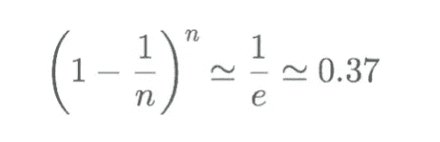
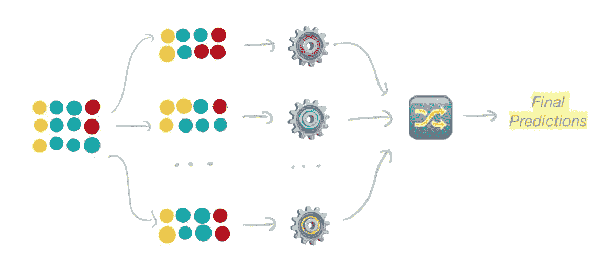

# 集成学习实用指南

> 原文：<https://towardsdatascience.com/practical-guide-to-ensemble-learning-d34c74e022a0?source=collection_archive---------10----------------------->

## 通过投票、打包、提升和堆叠来改进您的模型


由[贾斯汀·罗伊](https://unsplash.com/@justinroyphoto?utm_source=medium&utm_medium=referral)在 [Unsplash](https://unsplash.com?utm_source=medium&utm_medium=referral) 上拍摄

**集成学习**是机器学习中使用的一种技术，用于将多个模型组合成一个组模型，换句话说，组合成一个*集成模型*。集合模型旨在比单独的每个模型表现得更好，或者如果不是，至少表现得与组中最好的单个模型一样好。

在本文中，您将学习流行的集成方法: ***投票******打包******助推、******堆叠*** 以及它们的 Python 实现。我们将使用`[scikit-learn](https://scikit-learn.org/stable/index.html)`等库进行投票、装袋和升压，使用`[mlxtend](http://rasbt.github.io/mlxtend/)`进行堆栈。

在阅读本文的同时，我鼓励您查看我的 GitHub 上的 J [upyter 笔记本](https://github.com/Idilismiguzel/Machine-Learning/blob/master/Ensemble_Learning/Ensemble_Learning_Practice.ipynb)以获得完整的分析和代码。🌻

# 介绍

集成学习背后的直觉通常用一种叫做**群体智慧**的现象来描述，这意味着由一组个体做出的集合决策通常比个体决策更好。创建聚合模型(或**集成**)有多种方法，我们可以将它们分类为异类和同类集成。

在**异构集成中，**我们组合在同一数据集上训练的多个 ***不同的*** 微调模型，以生成集成模型。这种方法通常涉及*投票*、*平均、*或*叠加*技术。另一方面，在**同质系综中，**我们使用 ***相同的*** 模型，我们称之为“弱模型”,并使用诸如*打包*和*增强*的技术，我们将这个弱模型转换为更强的模型。

让我们从异构集成的基本集成学习方法开始:投票和平均。

# 1.投票(硬投票)

硬投票集成用于分类任务，它结合来自多个微调模型的预测，这些模型基于**多数投票**原则对相同数据进行训练。例如，如果我们集成 3 个分类器，它们的预测为“A 类”、“A 类”、“B 类”，那么集成模型将基于多数投票，或者换句话说，基于各个模型预测的分布模式，将输出预测为“A 类”。如您所见，我们倾向于使用奇数个型号(例如 3、5、7 个型号)，以确保我们不会获得相同的票数。


硬投票:用多个模型和集合预测新实例**投票**多数投票的最终结果—图片由作者提供

```
# Instantiate individual modelsclf_1 = KNeighborsClassifier()
clf_2 = LogisticRegression()
clf_3 = DecisionTreeClassifier()# Create voting classifiervoting_ens = VotingClassifier(
estimators=[('knn', clf_1), ('lr', clf_2), ('dt', clf_3)], voting='hard')# Fit and predict with the models and ensemble
for clf in (clf_1, clf_2, clf_3, voting_ens):
   clf.fit(X_train, y_train)
   y_pred = clf.predict(X_test)
   print(clf.__class__.__name__, accuracy_score(y_test, y_pred))
```

准确度分数:

> 近邻分类器 0.93
> 逻辑回归 0.92
> 决策树分类器 0.93
> 投票分类器 0.94 ✅

正如我们所见，投票分类器具有最高的准确性得分！由于集合将结合单个模型预测，每个模型应该已经微调，并已表现良好。在上面的代码中，我只是出于演示的目的对它进行了初始化。

# 2.平均(软投票)

软投票用于分类和回归任务，它通过**平均**对基于相同数据训练的多个微调模型的预测进行组合。对于分类，它使用*预测概率*，对于回归，它使用*预测值*。我们不需要像硬投票一样的奇数个单独的模型，但我们需要至少 2 个模型来建立一个集合。


软投票:用等权重模型(w)预测新实例，集合**通过平均选择**最终结果—作者图像

软投票的一个优点是，您可以决定是对每个模型进行平均加权(平均)还是按分类器的重要性(一个输入参数)进行加权。如果您喜欢使用加权平均值，那么集合模型的输出预测将是加权概率/值的最大和。

```
# Instantiate individual models
reg1 = DecisionTreeRegressor()
reg2 = LinearRegression()# Create voting regressor
voting_ens = VotingRegressor(
estimators=[('dt', reg1), ('lr', reg2)], weights=[2,1])# Fit and predict with the models and ensemble
for reg in (reg1, reg2, voting_ens):
   reg.fit(X_train, y_train)
   y_pred = reg.predict(X_test)
   print(reg.__class__.__name__, mean_absolute_error(y_test, y_pred))
```

平均绝对误差:

> 决策树回归器 3.0
> 线性回归 3.2
> 投票回归器 2.5 ✅

重要的是要明白**投票群体**(硬投票和软投票)的表现在很大程度上取决于单个模特的表现。如果我们集合一个好的和两个表现一般的模型，那么集合模型将显示接近平均模型的结果。在这种情况下，我们要么需要改进表现一般的模型，要么我们不应该做一个集合，而是使用表现良好的模型。📌

理解了投票和平均之后，我们可以继续最后一个异构集成技术:堆叠。

# 3.堆垛

Stacking 代表“Stacked Generalization ”,它将多个单独的模型(或基础模型)与一个最终模型(或元模型)相结合，该最终模型通过基础模型的预测进行**训练。它既可以用于分类任务，也可以用于回归任务，并且可以选择使用值或概率来执行分类任务。**

与投票集成的区别在于，在堆叠中，元模型也是一个可训练的模型，事实上，它是使用基本模型的预测来训练的。因为这些预测是元模型的输入特征，所以它们也被称为元特征。我们可以选择将初始数据集包含到元要素中，或者仅使用预测。


堆叠:元模型训练中使用的基础模型预测，以**预测**最终输出——图片由作者提供

堆叠可以用多于两层来实现:**多层堆叠**，在这里我们定义基础模型，与另一层模型聚合，然后是最终的元模型。即使这可以产生更好的结果，我们也应该考虑到由于复杂性所带来的时间成本。

为了防止**过度拟合，**我们可以使用**堆叠和交叉验证**来代替标准堆叠，mlxtend 库对两个版本都有实现。下面，我将实现:

1。分类任务的标准堆叠

```
from mlxtend.classifier import StackingClassifier# Initialize individual models
clf_1 = KNeighborsClassifier()
clf_2 = GaussianNB()
clf_3 = DecisionTreeClassifier()# Initialize meta-model
clf_meta = LogisticRegression()# Create stacking classifier
clf_stack = StackingClassifier(
classifiers=[clf_1, clf_2, clf_3], meta_classifier=clf_meta,
use_probas=False, use_features_in_secondary=False)# Fit and predict with the models and ensemble
for clf in (clf_1, clf_2, clf_3, clf_meta, clf_stack):
   clf.fit(X_train, y_train)
   y_pred = clf.predict(X_test)
   print(clf.__class__.__name__, accuracy_score(y_test, y_pred))
```

> 近邻分类器 0.84
> 高斯分类器 0.83
> 决策树分类器 0.89
> 逻辑回归 0.85
> 堆栈分类器 0.90 ✅

2。回归任务的交叉验证堆叠

```
from mlxtend.regressor import StackingCVRegressor# Initialize individual models
reg1 = DecisionTreeRegressor()
reg2 = SVR()# Create meta-model
meta_model = LinearRegression()# Create stacking classifier
reg_stack = StackingCVRegressor(
regressors=[reg1, reg2], meta_regressor=meta_model,
use_features_in_secondary=False)# Fit and predict with the models and ensemble
for reg in (reg1, reg2, meta_model, reg_stack):
   reg.fit(X_train, y_train)
   y_pred = reg.predict(X_test)
   print(reg.__class__.__name__, mean_absolute_error(y_test, y_pred))
```

平均绝对误差:

> 决策树回归器 3.3
> 支持向量回归 5.2
> 线性回归 3.2
> 堆栈回归器 2.9 ✅

# 4.制袋材料

Bootstrap 聚合或简而言之“Bagging”聚合多个估计器，这些估计器使用用训练数据的不同子集训练的*相同的*算法。它可用于分类和回归任务，使用**引导**通过随机采样为每个估计器创建训练数据。

> 自举*是一种从原始数据创建替换样本的方法。这是通过* ***替换*** *来完成的，以使每个数据点被选取的概率相等。由于替换选择，一些数据点可能被多次选取，而一些可能永远不会被选取。我们可以使用以下公式计算大小为* n *的 bootstrap 样本中某个数据点未被选中的概率。* *(优选 n 为大数)。*



这意味着使用大约 63%的训练数据集训练每个 bagging 估计器，我们将剩余的 37% **随机(OOB)** 样本**。**

综上所述，bagging 从原始训练数据中为 *n* 个估计器抽取了 *n* 个训练数据集。每个估计器在其采样训练数据集**上被并行训练**以进行预测。然后，bagging 使用硬投票或软投票等技术聚集这些预测。



Bagging:估计器和预测器使用的自举训练样本与投票技术相结合

在 scikit-learn 中，我们可以将参数`n_estimators`定义为等于*n*——我们想要生成的估计器/模型的数量，如果我们想要评估每个估计器对其出袋样本的性能，可以将`oob_score`设置为“真”。通过这样做，我们可以很容易地了解估计者对未知数据的表现，而无需使用交叉验证或单独的测试集。`oob_score_`函数计算所有 ***n*** oob_scores 的平均值，默认情况下，使用指标**准确性** **得分**进行分类，使用 **R^2** 进行回归。

```
from sklearn.ensemble import BaggingClassifier# Initialize weak model
base_model = DecisionTreeClassifier(max_depth=3)# Create bagging classifier
clf_bagging = BaggingClassifier(base_estimator=base_model, n_estimators=1000, oob_score=True)clf_bagging.fit(X_train, y_train)# Check oob score
print(clf_bagging.oob_score_)
```

> oob_score_ : 0.918

```
# Compare with test set
pred = clf_bagging.predict(X_test)
print(accuracy_score(y_test, pred))
```

> 准确率 _ 得分:0.916

随机采样的训练数据集使训练不容易偏离原始数据，因此装袋**减少了单个估计量的方差**。

一种非常流行的打包技术是**随机森林**，其中估值器被选为决策树。随机森林使用引导来创建具有替换的训练数据集，并且它还选择一组特征(没有替换)来最大化每个训练数据集上的随机化。通常，所选特征的数量等于特征总数的平方根。

# 5.助推

Boosting 使用**渐进学习**，这是一个迭代过程，专注于最小化先前估计器的误差。这是一种**顺序方法**，其中每个估计器依赖于前一个估计器来改进预测。最流行的增强方法是自适应增强(AdaBoost)和梯度增强。

**AdaBoost** 对每个 *n* 估计器使用整个训练数据集，并做了一些重要的修改。第一个估计器(弱模型)在具有相等加权数据点的原始数据集上训练。在进行第一次预测并计算误差后，与正确预测的数据点相比，错误预测的数据点被分配有**更高的权重**。通过这样做，下一个评估者将关注这些难以预测的实例。这个过程将一直持续到所有的 *n* 个估计器(比如 1000 个)被顺序训练。最后，集合的预测将通过加权多数投票或加权平均来获得。


AdaBoost:训练数据中权重更新的序列模型训练——图片由作者提供

```
from sklearn.ensemble import AdaBoostRegressor# Initialize weak model
base_model = LinearRegression(normalize=True)# Create AdaBoost regressor
reg_adaboost = AdaBoostRegressor(base_estimator=base_model, n_estimators=1000)reg_adaboost.fit(X_train, y_train)# Predict and compare with y_test
pred = reg_adaboost.predict(X_test)
rmse = np.sqrt(mean_squared_error(y_test, pred))
print('RMSE:', rmse)
```

> RMSE: 4.18

由于每个下一个估计器的目的是纠正错误分类/错误预测的数据点，增强**减少了每个估计器的偏差**。

**梯度提升**，非常类似于 AdaBoost，通过顺序迭代改进了以前的估计器，但它不是更新训练数据的权重，而是使新的估计器适应来自以前估计器的**残差**。XGBoost、LightGBM 和 CatBoost 是流行的梯度提升算法，尤其是 XGBoost 是许多竞赛的获胜者，并因非常快速和可扩展而流行。

# 结论

在本文中，我们学习了主要的集成学习技术来提高模型性能。我们介绍了每种技术的理论背景以及相关的 Python 库来演示这些机制。

集成学习在机器学习中占有很大一部分，它对每个数据科学家和机器学习实践者都很重要。你可能会发现有很多东西要学，但我相信你永远不会后悔！！💯

如果你需要关于自举的复习，或者如果你想学习更多关于采样技术的知识，你可以看看我下面的文章。

</resampling-methods-for-inference-analysis-e75fecfefcb2>  

我希望你喜欢阅读关于集成学习方法的文章，并发现这篇文章对你的分析有用！

*如果你喜欢这篇文章，你可以**[***在这里阅读我的其他文章***](https://medium.com/@idilismiguzel)**和* [***关注我上媒***](http://medium.com/@idilismiguzel/follow)*如果有任何问题或建议，请告诉我。✨***

***喜欢这篇文章吗？ [**成为更多会员！**](https://idilismiguzel.medium.com/membership)***

## ***参考***

1.  ***[合奏学习延伸阅读](https://sebastianraschka.com/pdf/lecture-notes/stat479fs18/07_ensembles_notes.pdf)***
2.  ***[mlxtend 库](http://rasbt.github.io/mlxtend/)***