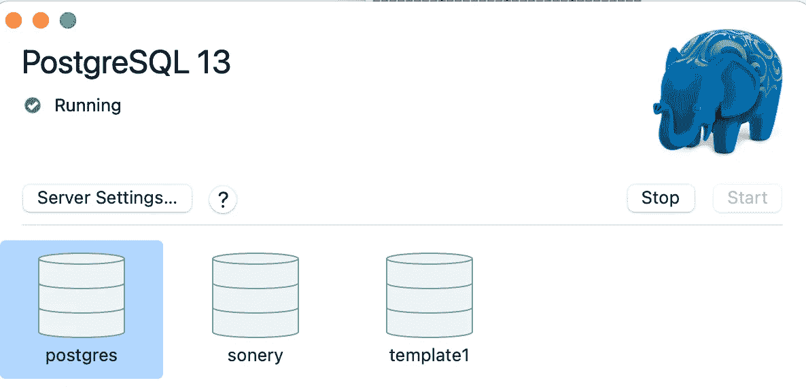
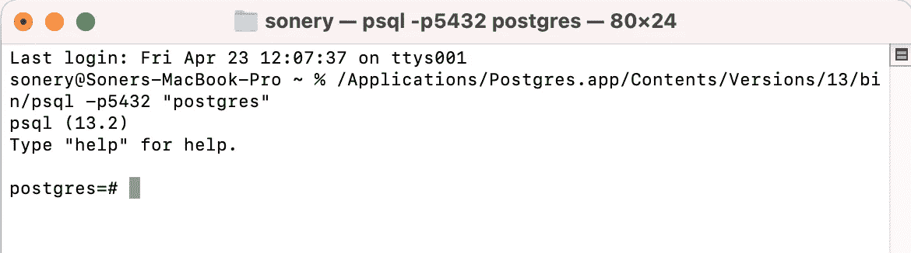
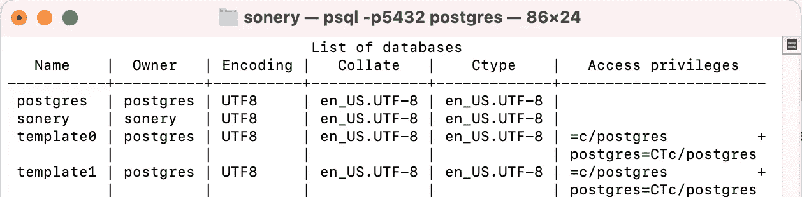

# PostgreSQL 实用介绍

> 原文：<https://towardsdatascience.com/practical-introduction-to-postgresql-5f73d3d394e?source=collection_archive---------16----------------------->

## 世界上最先进的开源关系数据库


[南安](https://unsplash.com/@bepnamanh?utm_source=unsplash&utm_medium=referral&utm_content=creditCopyText)在 [Unsplash](https://unsplash.com/s/photos/elephant?utm_source=unsplash&utm_medium=referral&utm_content=creditCopyText) 上的照片

SQL 是大多数关系数据库管理系统(RDBMS)用来管理以表格形式存储的数据的编程语言。SQL 是数据科学家、分析师和工程师的必备技能。

SQL 表由带标签的行和列组成。关系数据库包含多个通过共享列相互关联的表。

SQL 提供了许多函数和方法来高效、准确地管理存储在关系数据库中的数据。有许多不同的关系数据库管理系统(如 MySQL、PostgreSQL、SQL Server)。他们采用的 SQL 语法可能略有不同。

在本文中，我们将对全球最先进的开源关系数据库 [PostgreSQL](https://www.postgresql.org) 做一个实际的介绍。

PostgreSQL 或通常用作 Postgres，已经存在了 30 多年。由于其稳健性、可靠性和性能，它受到许多不同行业的许多企业的青睐。

官网提供说明，明确解释了[如何安装](https://www.postgresql.org/download/) PostgreSQL。安装后，您可以在 psql 中练习，psql 是一个使用 PostgreSQL 的交互式终端。

我使用 macOS 的 Postgres 应用程序。打开后，您可以选择一个数据库并单击 start。不同的项目有不同的数据库是常见的做法。



Postgres 应用程序(图片由作者提供)

我选择了 postgres 数据库。这是 psql 终端的初始屏幕:



(图片由作者提供)

为了查看所有数据库的列表，我们可以使用“\l”命令。

```
postgres=# \l
```



(图片由作者提供)

我们可以在 psql 终端中使用“\c”命令和数据库名称切换到另一个数据库。

```
postgres=# \c soneryYou are now connected to database "sonery" as user "sonery".sonery=#
```

关系数据库可能包含许多表。“\dt”命令显示当前数据库中的表列表。

```
sonery=# \dtList of relationsSchema | Name  | Type  | Owner
-------+-------+-------+--------
public | sales | table | sonery(1 row)
```

我的数据库中只有一个名为“sales”的表。这似乎与我刚才说的在一个数据库中有很多表相矛盾。但是，这只是为了练习。

让我们创建两个新表。

```
sonery=# CREATE TABLE inventory (
            product_id int,
            warehouse_id int,
            stock_qty int,
            date date
);
CREATE TABLEsonery=# CREATE TABLE orders (
            order_id int,
            product_id int,
            order_qty int,
            date date
);
CREATE TABLE
```

psql 终端返回“CREATE TABLE ”,表示已经成功创建了该表。让我们再次检查当前数据库中的表。

```
sonery=# \dtList of relationsSchema |   Name    | Type  | Owner
-------+-----------+-------+--------
public | inventory | table | sonery
public | orders    | table | sonery
public | sales     | table | sonery(3 rows)
```

我们已经创建了库存和订单表，但是它们是空的。SQL 的 insert 语句可用于手动填充表。

```
sonery=# INSERT INTO orders VALUES                                                     
(101, 1001, 2, '2021-01-04'),                                                         (102, 1423, 1, '2021-01-04'),                                                         (103, 1260, 5, '2021-01-13');INSERT 0 3
```

我们不必提供列的名称。但是，我们需要根据列顺序适当地写入值。

如果我们提供列的名称，这些值将根据我们指定的顺序插入到表中。

```
sonery=# INSERT INTO orders (order_id, date, product_id, order_qty)
         VALUES (104, '2021-05-13', 1590, 5);INSERT 0 1
```

下一个例子是关于查询一个表，这是数据库中最常用的操作。我们编写查询从数据库中检索数据。select 语句用于编写查询。

```
sonery=# SELECT * FROM orders;order_id | product_id | order_qty |    date
---------+------------+-----------+------------
     101 |       1001 |         2 | 2021-01-04
     102 |       1423 |         1 | 2021-01-04
     103 |       1260 |         5 | 2021-01-13
     104 |       1590 |         5 | 2021-05-13(4 rows)
```

“*”表示我们想要检索所有的列。我们还可以编写所需的列名。

```
sonery=# SELECT order_id, date FROM orders;order_id |    date
---------+------------
     101 | 2021-01-04
     102 | 2021-01-04
     103 | 2021-01-13
     104 | 2021-05-13(4 rows)
```

## 结论

我们已经做了 PostgreSQL 的基本介绍。有些例子是通用的 SQL 例子，所以即使您使用不同的 RDBMS，它们也会有所帮助。

我们在本文中讨论的只是 PostgreSQL 和 SQL 的一小部分。我计划写更多的文章，关注 PostgreSQL 更高级的操作。敬请期待！

感谢您的阅读。如果您有任何反馈，请告诉我。