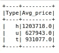

# PySpark 实用介绍

> 原文：<https://towardsdatascience.com/practical-introduction-to-pyspark-fd04b48b9672?source=collection_archive---------15----------------------->

## 简单如 Python，强大如 Spark


Marc-Olivier Jodoin 在 [Unsplash](https://unsplash.com/s/photos/fast?utm_source=unsplash&utm_medium=referral&utm_content=creditCopyText) 上拍摄的照片

Spark 是一个用于大规模数据处理的分析引擎。它让您可以将数据和计算分散到集群上，从而实现显著的性能提升。

由于收集和存储数据变得越来越容易，成本也越来越低，当我们处理现实生活中的问题时，可能会有大量的数据。因此，像 Spark 这样的分布式引擎正在成为数据科学生态系统中的主要工具。

PySpark 是 Spark 的 Python API。它结合了 Python 的简单性和 Spark 的高效性，这种合作得到了数据科学家和工程师的高度赞赏。

在本文中，我们将通过几个例子来介绍 PySpark 的 SQL 模块，它用于处理结构化数据。

我们首先需要创建一个 SparkSession，作为 Spark SQL 的入口点。

```
from pyspark.sql import SparkSessionsc = SparkSession.builder.getOrCreate()
sc.sparkContext.setLogLevel("WARN")print(sc)
<pyspark.sql.session.SparkSession object at 0x7fecd819e630>
```

我们将使用这个 SparkSession 对象与 Spark SQL 的函数和方法进行交互。让我们通过读取 csv 文件来创建一个 spark 数据帧。我们将使用 Kaggle 上的墨尔本房产[数据集](https://www.kaggle.com/anthonypino/melbourne-housing-market)。

```
df = sc.read.option("header", "true").csv(
    "/home/sparkuser/Desktop/melb_housing.csv"
)
```

我们将通过仅选择 5 列来缩小数据框。可以使用“df.columns”方法查看列列表。

```
df = df.select("Type", "Landsize", "Distance", "Regionname", "Price")df.show(5)
```


(图片由作者提供)

正如我们将在示例中看到的，PySpark 语法看起来像是 Pandas 和 SQL 的混合。因此，如果您已经在使用这些工具，那么学习 PySpark 将会相对容易。

我们可以使用 orderBy 函数对数据框中的行进行排序。让我们来看看数据集中最贵的 5 栋房子。

```
df.orderBy("Price", ascending=False).show(5)
```


(图片由作者提供)

PySpark 的 SQL 模块有许多函数可用于数据分析和操作。我们可以一次或分别导入它们。

```
# import all functions
from pyspark.sql import functions as F
```

数据集中有 3 种不同类型的房屋。我们可以使用 groupby 函数计算每种类型的平均价格。

```
df.groupby("Type").agg(F.round(F.mean("Price")).alias("Avg_price")).show()
```



(图片由作者提供)

我们来详细说明一下语法。我们按照类型列对观察值(即行)进行分组。然后我们计算每组的平均价格。round 函数用于向上舍入小数点。alias 方法更改聚合列的名称。它类似于 SQL 中的“as”关键字。

距离栏显示到中央商务区的距离。当我们离开市中心时，房价通常会下降。我们可以通过计算距离超过 3 英里的房屋的平均房价来证实我们的预测。

```
df.filter(F.col("Distance") > 3).groupby("Type").agg(
    F.round(F.mean("Price")).alias("Avg_price")
).show()
```


(图片由作者提供)

我们使用 filter 函数对距离列应用一个条件。结果证实了我们的预期。每种类型的平均价格都下降了。

另外两个有用的函数是 count 和 countDistinct，它们分别计算一个组中的总观察值和不同观察值(即行)的数量。例如，以下代码返回每种类型的房屋数量以及不同价格的数量。

```
df.groupby("Type").agg(
    F.count("Price").alias("n_houses"),
    F.countDistinct("Price").alias("n_distinct_price")
).show()
```


(图片由作者提供)

数据分析中的一个典型任务是基于现有列派生新列。这可能是你的特征工程过程的一部分。关于住房数据集，我们可以创建一个新要素来表示每单位土地面积的价格。

若要完成此任务，可以按如下方式使用 withColumn 函数:

```
df = df.withColumn(
    "Price_per_size", 
    F.round(F.col("Landsize")*1000 / F.col("Price"), 2)
)
```

新列的名称是“价格/大小”。下一行指定了导出值的步骤。我们把土地面积乘以 1000，再除以房价。结果四舍五入到小数点后两位。


(图片由作者提供)

## 结论

我们已经介绍了 PySpark 的数据分析和操作。PySpark 的 SQL 模块提供了更多的函数和方法来执行高效的数据分析。

需要注意的是，Spark 针对大规模数据进行了优化。因此，在处理小规模数据时，您可能看不到任何性能提升。事实上，在处理小数据集时，Pandas 可能会比 PySpark 表现得更好。

感谢您的阅读。如果您有任何反馈，请告诉我。