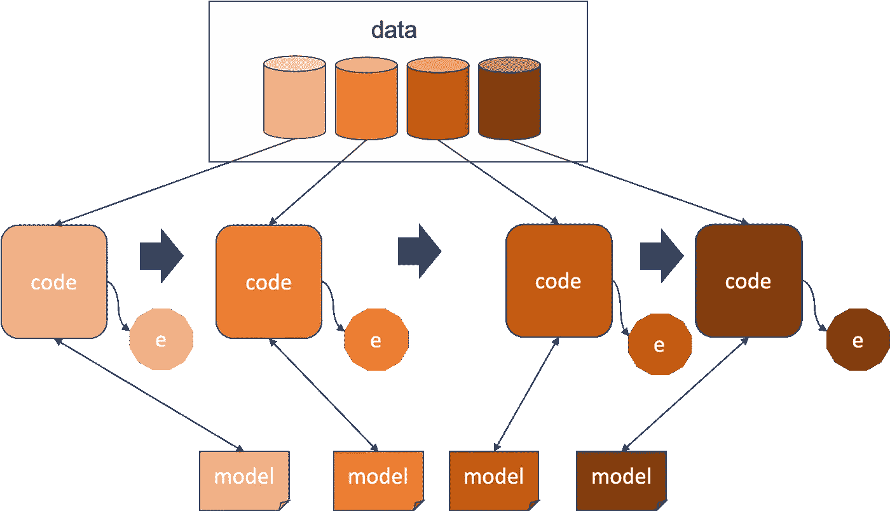
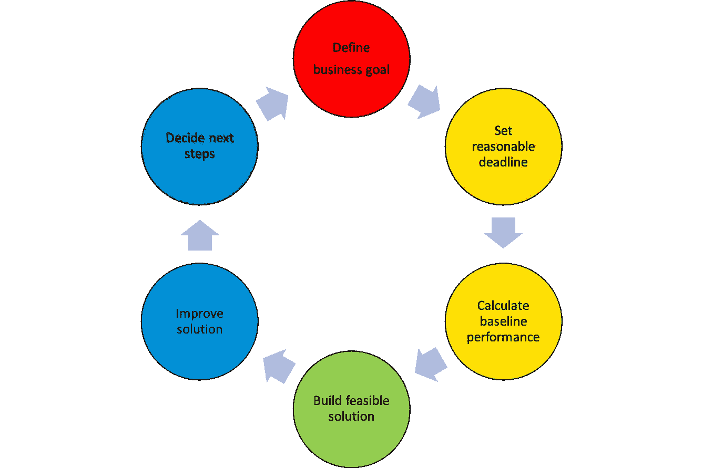

# 构建机器学习解决方案的实用方法

> 原文：<https://towardsdatascience.com/practical-method-to-framing-machine-learning-solutions-8b36a9d40efb?source=collection_archive---------34----------------------->

## 构建机器学习解决方案以实现产品目标的六步方法。

图 1:构思一个健壮的解决方案。由 [pixabay](https://www.pexels.com/@pixabay) 拍摄自[像素](https://www.pexels.com/photo/clear-light-bulb-355948/)，

我最近介绍了一种关于如何构建机器学习(ML)解决方案的[方法](/framing-machine-learning-solution-4221f5da035d)。简而言之，您应该重复一个三步流程，包括细化问题、理解数据需求和探索基线解决方案。在这篇文章中，我分享了一个实用的方法。我希望这个过程不会像图 1 所示的有了一个灯泡的想法并找出它适合的地方那样模糊。

# 进化机器学习解决方案

图 2:不断发展的机器学习解决方案。作者图。

其核心的机器学习解决方案是一个*代码*，它读取*数据*以生成一个*模型*，然后使用来自同一来源的另一组数据来生成预测。如果你遵循一个务实的方法，比如三步法，第一个解决方案草案不太可能坚持到最后。相反，如图 2 所示，您可能会对解决方案进行多次改进，其中每次迭代您都在搜索更好的数据和/或开发改进的代码。问题是你应该写多少份草稿。

从我的工程和研究背景中汲取灵感，我提倡遵循六个步骤来使这个过程更加有效和实用(见图 3)。

图 3:构建机器学习解决方案的六个步骤。作者图。

1.  与利益相关者一起定义一个有影响力的业务目标
2.  和你的利益相关者一起设定一个合理的期限
3.  计算基准性能
4.  构建简单、快速、改进的解决方案
5.  通过重复步骤 4，改进您的解决方案，直到您在截止日期内达到基线性能
6.  在截止日期到来时，与你的利益相关者一起决定下一步行动

我们将提供每个步骤的更多细节。

## 定义业务目标

你应该做的第一件事是做一个商业案例和一个合理的目标。如果你的利益相关者不相信你的目标，你需要重新审视目标和/或案例。避免过于雄心勃勃，因为在跑步之前先学会走路更好。

将目标与业务指标联系起来，例如[销售业绩](https://en.wikipedia.org/wiki/Sell-through)、[流失率](https://en.wikipedia.org/wiki/Churn_rate)等*。*前者表示一段时间内企业售出的产品占其总库存的百分比，后者表示一段时间后不再是活跃客户的客户比例。显然，卖出率越高或流失率越低越好。无论您选择什么，您应该知道减少或增加您的指标将改善业务。

## 设定合理的截止日期

一旦你确定了目标和衡量标准，选择一个既不太短也不太长的截止日期。截止日期不应该迫使你使用廉价的伎俩，但也不应该让你沉迷于轻浮的想法。使用无法在工业化中存活的现成解决方案可以被认为是一种廉价的伎俩。探索一个没有可复制结果的未经测试的算法会被认为是一个轻率的想法。没有一个是好的。选择一个合适的时间让你有时间做一些实质性的事情，同时给你机会做更多有影响力的事情。

## 计算基线性能

定义可接受性能的最简单方法是按照当前的非 ML 解决方案计算指标。它可以基于领域驱动的试探法。例如，如果一定数量的商业专家在一段时间内按照一个共同的策略调整销售价格，那么可以实现什么样的销售。

如果你的利益相关者同意计算基线的过程，继续计算。当你的涉众对基线水平满意时，你就可以开始了。避免选择一个很难达到的基线。如果业务需要模型非常精确，您应该回到绘图板，开始一个更简单的业务案例。

## 构建可行的解决方案

避免开发执行时间过长或裁剪过多的解决方案。这两者都是进一步改进的障碍。你如何知道你需要保持的简单程度？

将你的开发工作分解成冲刺阶段，并在冲刺阶段经常发布。从一开始就专注于开发一个自动化的快速反馈系统。如果您不能这样做，很可能是您的解决方案太耗时或太复杂。一开始，你可能不需要起草一个 ML 解决方案。您可以从一个简单的基于启发式的解决方案开始。例如，您如何让业务专家设定价格的过程自动化？另一种从简单开始的方法是避免从头开始。而是集中于从经过良好测试的、可复制的作品中构建一些东西。

如果你设法做到这一点，你将能够产生和分析更多的结果，这将导致一个解决方案的更快发展。

## 改进解决方案

不断寻找更好的数据或更好的解决方案，直到达到基线。为了调整解决方案，使用一组技术误差指标，例如，[表示平方误差](https://en.wikipedia.org/wiki/Mean_squared_error) , [表示绝对百分比误差](https://en.wikipedia.org/wiki/Mean_absolute_percentage_error)等。首先，通过调整算法参数、选择不同的功能等，尝试从当前设计中获得尽可能多的好处。一旦你运气不好，考虑改变算法或使算法更复杂。

如果你设法在截止日期前达到基线绩效，与你的利益相关者沟通以决定是否追求进一步的改进。如果是这样的话，就这样做，直到你到达最后期限。在这种情况下，可以考虑让模型更加健壮，比如面对数据漂移如何保持相同的性能水平。当你在那个方向碰壁时，集中精力提高速度。

## 决定下一步

当你到达最后期限时，向你的股东展示解决方案和结果。在此之前，稍微准备一下接下来的步骤。此外，探索如果没有后续步骤，你还可以做哪些优先级较低的事情。如果结果不乐观，这是特别必要的。

# 结束语

这个讨论是对复杂实践的极大简化的总结。如果你已经面对过如此复杂的实践，我很想知道你会如何概括。如果你是新手，让我知道，如果我的观点能引起你的共鸣。