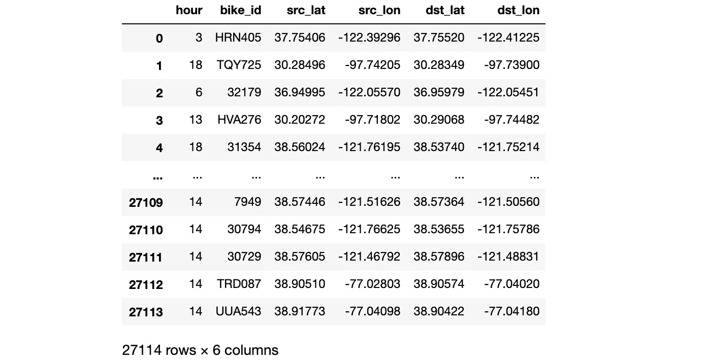
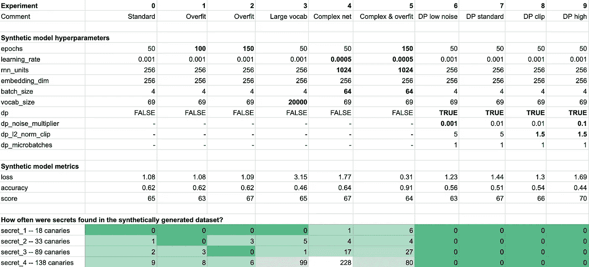

# 合成数据的实用隐私

> 原文：<https://towardsdatascience.com/practical-privacy-f5c68fae770a?source=collection_archive---------48----------------------->

## **实施实际攻击以测量合成数据模型中的无意记忆**

# TL；DR；

在本帖中，我们将对合成数据模型实施一次实际攻击，这在 Nicholas Carlini 等人的[秘密分享者:评估和测试神经网络中的非故意记忆](https://arxiv.org/pdf/1802.08232.pdf)中有所描述。艾尔。我们将利用这次攻击来看看[合成数据](https://gretel.ai/blog/what-is-synthetic-data)模型如何利用各种神经网络和差分隐私参数设置来保护数据集中的敏感数据和秘密。有一些非常令人惊讶的结果。

特征图像 Gretel.ai

# 背景

开放数据集和机器学习模型对于知识的民主化非常有价值，并允许开发人员和数据科学家以新的方式试验和使用数据。无论数据集是否包含位置数据、影像(如摄像机视频)甚至电影评论，用于创建这些数据集的基础数据通常包含并基于个人数据。

合成数据模型是一种很有前途的技术，用于生成包含与原始数据相同的洞察力和分布的人工数据集，而不包含任何真实的用户数据。潜在的应用包括允许[医学研究人员在不了解患者的情况下了解一种罕见疾病](/reducing-ai-bias-with-synthetic-data-7bddc39f290d)，或者在不暴露潜在[敏感信息的情况下训练私人数据的机器学习模型，并减少偏差](https://gretel.ai/blog/automatically-reducing-ai-bias-with-synthetic-data)。

# **数据集**

传统上，差分隐私的成功应用是通过包含高度同质数据的大规模数据集来实现的。例如，[美国人口普查数据](https://www.census.gov/programs-surveys/decennial-census/2020-census/planning-management/2020-census-data-products.html)，或者[苹果设备表情符号预测](https://www.apple.com/privacy/docs/Differential_Privacy_Overview.pdf)。这些数据集有数以亿计的行，并且维数较低，这使它们成为差分隐私等隐私保护技术的理想候选对象。对于这个例子，我们将使用一个小得多的数据集，该数据集基于电动自行车共享数据的公共源。是什么让这个数据集对我们的数据集感兴趣？它包含敏感的位置数据，这一直被认为是一个正确匿名的[挑战](https://www.nytimes.com/interactive/2019/12/19/opinion/location-tracking-cell-phone.html)。其次，我们正在处理一个不到 30，000 行输入数据的数据集，它更能代表科学家每天处理的典型数据集。

让我们看看是否可以构建一个合成数据集，它具有与原始数据相同的洞察力，但不使用真实的行程或位置。对于这个例子，我们在洛杉矶地区记录了一天的公共拼车信息，你可以在我们的 [Github](https://github.com/gretelai/gretel-synthetics/blob/master/examples/data/uber_scooter_rides_1day.csv) 上下载数据集。格式如下:

加州洛杉矶为期一天的电动自行车旅行

# **攻击**

我们将对 [Gretel.ai 的数据模型](https://gretel.ai/synthetics)(这将在任何生成语言模型上工作)实施实际攻击，方法是将金丝雀值(与训练集无关的随机生成的字符串)以各种频率随机插入模型的训练数据中。然后，我们可以使用这些数据来生成具有各种神经网络和隐私设置的模型，并测量每个模型记忆和回放金丝雀值的倾向。

这些结果与差别隐私提供的保证有何不同？嗯，如果这些攻击通过，我们不能从数学上声称一个模型是私有的。例如，有可能模型已经记住了一些非预期的信息(金丝雀值),这些信息只是还没有被模型重放。也就是说，知道您可以在数据集中插入 10 到 100 次金丝雀值，而不会看到它重复出现，这确实为您的模型提供了实际检查，_ 并且 _ 您对隐私保证的期望似乎是成立的。

让我们从生成随机秘密插入训练数据开始。

生成一组秘密来测试模型记忆

接下来，对定型集进行采样，并添加包含金丝雀值的新记录。

将金丝雀值混合到训练数据集中

我们可以使用一个简单的助手在生成的数据中搜索秘密字符串的存在。让我们看看我们将在训练数据中插入多少个秘密值。

一个在数据帧中搜索我们的秘密字符串的助手

# 进行实验

我们准备通过在包含各种数量的金丝雀值的新训练集上训练合成数据模型来运行我们的实验。在下面的实验中，我们用 10 种不同的配置训练了合成数据模型，并且在训练数据中插入了 18 到 138 次鸭翼。然后，我们计算了模型在生成过程中重放的秘密的数量。

要亲自尝试，请查看我们的[示例笔记本](https://gist.github.com/zredlined/7692fe2bb8999f933f64e62cf912245e)。

 [## 谷歌联合实验室

### Gretel . ai—colab.research.google.com 优步 DP 实验笔记本](https://colab.research.google.com/gist/zredlined/7692fe2bb8999f933f64e62cf912245e/synthetic-data-uber-differential-privacy.ipynb) 

# 检查结果

我们对合成模型实际攻击的结果

正如我们可以看到的，在实验 0、1 和 2 中没有差分隐私的标准合成数据配置提供了对稀有数据和秘密被学习的合理保护，其中秘密需要在训练数据中出现超过 18 次以被模型记忆和重放。

**差分隐私，即使 epsilon 和 delta 隐私值比理论保证的推荐值高几个数量级，在所有测试配置中很好地防止了鸭翼的记忆**。实验 9 使用了相对较高的噪声乘数(0.1)和积极的梯度削波(1.5)，这导致在生成的数据中再现了零个鸭翼，但模型精度却大大降低了。

令我们惊讶的是，在实验 6 中简单地使用梯度裁剪和最小水平的噪声到优化器中防止了我们的金丝雀值的任何重放(甚至是在数据中重复 138 次的秘密)，而模型准确性只有很小的损失。

# 后续步骤

隐私工程的挑战之一是在隐私保证与实用性和准确性之间找到正确的平衡。上面的例子特别有趣，因为它们显示了在隐私保护方面的实质性收益，与差分隐私的理论保护所要求的相比，具有远不那么激进的设置。尝试使用不同的参数配置对您自己的数据进行试验，以找到适合您的用例的平衡点。

有自己的用例可以讨论吗？我们很乐意听到你的用例——欢迎在评论中联系我们进行更深入的讨论，或者通过 [hi@gretel.ai](mailto:hi@gretel.ai) 。