# 实用 Python 因果关系:数据科学的计量经济学

> 原文：<https://towardsdatascience.com/practical-python-causality-econometrics-for-data-science-ffc074e11a1d?source=collection_archive---------7----------------------->

## [思想和理论](https://towardsdatascience.com/tagged/thoughts-and-theory)

## 使用 Python 库的计量经济学数据科学介绍:DoWhy，包括因果关系案例研究论文的详细代码演练

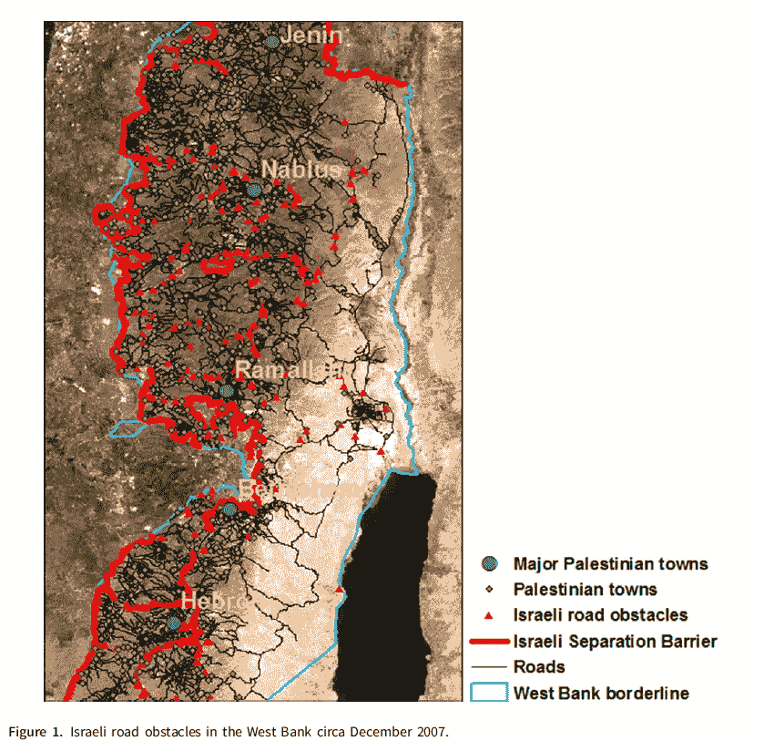

来自“艰难的旅行:政治冲突阴影下的失业和道路基础设施”([亚伯拉罕，2021](https://www.cambridge.org/core/journals/political-science-research-and-methods/article/abs/hard-traveling-unemployment-and-road-infrastructure-in-the-shadow-of-political-conflict/135F8A50F613DA3C9C4CB9335F0BFCF7) )的巴勒斯坦西岸的卫星图像

数据科学家倾向于关注描述性和预测性分析，而忽视因果分析。然而，决策需要因果分析，这是在新冠肺炎疫情期间公共卫生流行病学家公认的事实。由于我的生物学背景，我已经将格言“*相关性不等于因果关系*”内化，以至于我刻意回避所有因果关系的说法。幸运的是，我贪得无厌的好奇心引导我进入计量经济学领域，该领域包含因果关系，并建立了一套严格的数学体系来促进因果分析。

最近，我在世界银行的中东和北非地区咨询工作激发了我对计量经济学的兴趣。具体来说，最近发表在《政治学研究与方法》杂志上的一篇论文详细描述了以色列检查站对巴勒斯坦就业结果的罕见因果影响评估( [Abrahams，2021](https://www.cambridge.org/core/journals/political-science-research-and-methods/article/abs/hard-traveling-unemployment-and-road-infrastructure-in-the-shadow-of-political-conflict/135F8A50F613DA3C9C4CB9335F0BFCF7) )。在“艰难的旅行”中，作者在一个巧妙设计的实验中利用了一个工具变量，突出了以色列军队在持续占领巴勒斯坦期间部署的道路封锁的因果影响。在本文中，我通过在一个实用的 Python 教程中复制这篇有趣论文的结果，从实际应用的角度来探索因果关系。

首先，我明确了机器学习和计量经济学之间的区别，这是传达因果关系的复杂性和艰巨性的必要步骤。接下来，我将介绍本教程中使用的 Python 库，并讨论因果分析的计量经济学方法。接下来，我概述了案例研究论文中描述的实验设计，直接进入相关方程的直观演示。最后，使用 Python，我复制了这篇论文的主要结果，并实际强调了代码实现。

# **为什么是计量经济学？**

大多数数据科学家对机器学习感到满意，但很少利用计量经济学。尽管如此，计量经济学和机器学习都依赖于将统计方法应用于数据，以便根据经验建模和解决问题，表面上的区别是计量经济学对经济数据的应用。然而，重要的区别在于这两个领域中常见的问题类型。传统上，机器学习主要集中在预测上；最常见的目标是创建一个能够泛化的模型，这样就可以对新的、未观察到的数据进行预测。相反，计量经济学主要关注因果关系，目标是理解因果关系，通常在政策评估的范围内，以便建议的行动可以得到经验证据的支持。

因果关系需要从现有数据中推测因果关系，同时考虑不确定性，与预测类似，它也依赖于无法植根于地面真理的未经证实的假设。预测问“什么？”会发生，因果问“为什么？”事情发生了，更重要的是，“为什么？”这种影响不是由其他原因造成的。因此，因果问题具有更高的举证责任，其优势是由于在处理混杂因素和不确定性时所涉及的严格性，所获得的见解具有确定性。

尽管我很欣赏机器学习的效用，但预测无法回答每个问题，而且通常情况下，因果推理是支持现实生活决策的必要条件。此外，我喜欢问“为什么？”尽管很难令人满意地回答因果问题，但试图将结果归因于原因是人类的本能。通过一本名为《基本无害的计量经济学:一个经验主义者的伙伴》的通俗易懂的书( [Angrist 和 Pischke 2009](https://press.princeton.edu/books/paperback/9780691120355/mostly-harmless-econometrics) )，我被鼓励将计量经济学方法融入到我的实证工作中。作者在序言中指出，

> “任何对使用数据来制定公共政策或促进公共健康感兴趣的人都必须消化和使用统计结果。任何对从人们的数据中得出有用的推论感兴趣的人都可以说是应用计量经济学家。”

我认为，数据科学家应该提出因果问题，计量经济学方法自然适合将因果框架应用于数据驱动的研究。事实上，去年哈佛数据科学倡议启动了一项研究机器学习因果推理的计划。推动将因果关系整合到数据科学中，反映在经济学家对机器学习的缓慢接受上，这表明了一种双向关系。例如，杰出的经济学家苏珊·艾希(Susan Athey)和圭多·w·伊本斯(Guido W. Imbens)主张在实证经济工作中采用机器学习方法。在 2019 年版的*经济学年度评论*中，在一篇名为“[经济学家应该了解的机器学习方法](https://www.annualreviews.org/doi/abs/10.1146/annurev-economics-080217-053433)的论文中，艾希和伊本斯指出

> “ML 文献中开发的方法在大数据环境中特别成功，……对于这种环境，ML 工具正在成为跨学科的标准，因此经济学家的工具包需要相应地进行调整，同时保留应用计量经济学的传统优势。”

# **因果关系测试**

因果分析的过程可以分为四个阶段:第一步是建立因果问题的模型，第二步是确定需求，第三步是估计效果，第四步是反驳得到的估计。为了简单起见，在本文中，我将主要关注用微软开发的用于因果推理的 Python 库 [DoWhy](https://github.com/microsoft/dowhy) 实现因果分析的四个阶段。此外，为了复制案例研究论文的主要结果，我还利用了 Python 库 [linearmodels](https://bashtage.github.io/linearmodels/) 。

当在第一阶段对因果问题建模时，有必要明确因果假设，而 DoWhy 通过[因果图](https://en.wikipedia.org/wiki/Causal_graph)使这成为可能。借用计量经济学的术语，因果图是概率图形模型，对关于[数据生成过程](https://en.wikipedia.org/wiki/Data_generating_process)的假设进行编码；本质上，因果图编码了先验知识。对于因果图的简要介绍，我建议这篇[中的文章](/use-causal-graphs-4e3af630cf64)，对于因果图的彻底讨论，我建议由图灵奖获得者、朱迪亚·珀尔和科学作家达纳·麦肯齐所著的“[为什么](https://www.goodreads.com/book/show/36204378-the-book-of-why)的书”。

作为一名计算机科学家，Pearl 因其在人工智能和开发贝叶斯网络方面的工作而闻名，然而，对我的研究最有用的是他在因果关系方面的工作。事实上，DoWhy 中的“do”来源于“do-calculus”，是 Pearl 发明的一种讨论因果关系的形式语言；Robert R. Tucci 的这篇教学论文提供了这种语言的概述，包括证明和规则。do-calculus 的细节超出了本文的范围，但是突出的一点是，通过使用 do-calculus 来构建因果图，DoWhy 采用了一个 [Pearlian 框架](https://medium.com/@akelleh/causal-graph-inference-b3e3afd47110)。具体来说，DoWhy 依赖基于图形的标准和 do-calculus 来建模假设和识别非参数因果关系。

明确识别假设，只是使用 DoWhy 因果框架的一个优点，重要的是，DoWhy 将第二阶段的因果效应识别与第三阶段的效应估计分开。引用微软研究院的博客文章[介绍这个库，](https://www.microsoft.com/en-us/research/blog/dowhy-a-library-for-causal-inference/)

> “因果效应的识别涉及对数据生成过程做出假设，并从反事实表达到指定目标需求，而估计是从数据估计目标需求的纯统计问题。”

如下图所示，使用 DoWhy 框架，识别阶段与评估阶段是分开的。

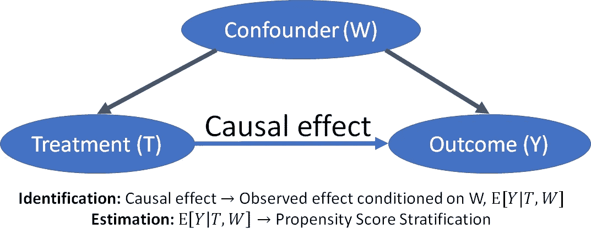

用道伊库分离因果分析的识别和估计阶段。[来源。](https://www.microsoft.com/en-us/research/blog/dowhy-a-library-for-causal-inference/)

评估阶段的分离允许实施基于潜在结果框架的评估方法，该框架依赖于[反事实条件](https://en.wikipedia.org/wiki/Counterfactual_conditional)。在 [arxiv 的一篇介绍 Do-Why](https://arxiv.org/abs/2011.04216) (2020)的论文中，研究人员将他们在估计方法中对潜在结果的使用归功于 [Guido W. Imbens 和 Donald B. Rubin](https://www.cambridge.org/core/books/causal-inference-for-statistics-social-and-biomedical-sciences/71126BE90C58F1A431FE9B2DD07938AB) (2015)。与亚伯拉罕选择的策略相似，由于案例研究论文使用了工具变量，因此在本教程中，估计方法将是[两阶段最小二乘法(2SLS)](https://www.statisticssolutions.com/two-stage-least-squares-2sls-regression-analysis/) 回归。最后一个阶段是反驳第三阶段得出的估计。在《艰难旅行》中，亚伯拉罕斯进行了几项鲁棒性检查，这些检查在技术附录中有详细说明，然而，为了简单起见，在本文中我们使用了 DoWhy 的自动化鲁棒性检查。

## **“艰难行进”实验设计**

作者将这种影响评价框定为政治学理论与经济学文献之间的分野；后者认为城市劳动力市场的失业是技术缺陷(如缺乏基础设施)的结果，而前者声称政治改革是解决失业问题的先决条件。关于这一主题，很少有政治学论文采用因果关系，也没有研究基础设施干预的因果影响，因此，“艰难旅行”填补了现有政治学文献中使用计量经济学的空白。

从表面上看，本文件的目的是评估以色列军队在西岸内部道路网沿线设置的检查站和路障对巴勒斯坦失业率的因果影响。这些障碍物是出于安全原因设置的，但实际上干扰了巴勒斯坦人的通勤出行。换句话说，提交人认为，以色列的障碍阻止近郊区的巴勒斯坦通勤者到达商业中心和过境点，造成通勤者失业。然而，这些损失被通勤者中位于更中心位置的巴勒斯坦竞争者的就业增长所充分抵消。该文件强烈主张，边际经济干预将有助于改变失业的空间分布，但不会降低总体失业水平。

这项研究之所以成为可能，是因为“时空分类数据和貌似外部的连通性冲击相结合”，也就是说，在第二次起义(2000 年至 2004 年)期间，以色列检查站的数量急剧增加——这是一种外部冲击。此外，作者通过两次前往巴勒斯坦(由于现场准入要求)，收集了 1997 年和 2007 年邻里一级的人口普查数据，这些数据得到了卫星图像的补充，为数据集增加了另一个空间组成部分，从而获得了时空分类数据。起义后竖立的障碍仍然存在，如下图所示，从 2007 年底。卫星图像显示了以色列在巴勒斯坦西岸的道路障碍，红色实线代表了[以色列隔离墙](https://en.wikipedia.org/wiki/Israeli_West_Bank_barrier)——一堵在第二次起义(2000 年)开始时修建的 708 公里长的墙，二十多年后的今天仍然存在。


2007 年 12 月，以色列在西岸设置路障。资料来源:亚伯拉罕，2021 年

根据来之不易的人口普查数据，本研究中的因变量是 1997 年至 2007 年间 480 个巴勒斯坦居民区就业结果的变化；以下简称: *%就业变化*。根据世界银行/ [巴勒斯坦中央统计局的贫困分类，这 480 个居民区可以分为 310 个超级居民区。](http://www.pcbs.gov.ps/site/lang__en/748/default.aspx)

工具化的 2sl 第一差异策略用于测试障碍对失业的因果影响，其中工具是以色列定居点与巴勒斯坦通勤路线的纵向接近度。这一工具满足了定义所要求的三个条件，允许对巴勒斯坦居民区的封锁进行 qausi 随机化。纵向上靠近以色列定居点应影响到以色列检查站的位置，因为这些检查站据称的目的是保卫定居点。由于与以色列检查站的设置有关，这种定居点的接近将对 *%的就业变化*产生间接影响。通过用稳健性检查反驳因果估计，对 *%就业变化*的纵向接近度的混杂性进行测试。

这种方法是有效的，因为这些工具隔离了部署在定居点附近的障碍子集，而不是直接回归检查站总体存在的 *%就业变化*。在这项研究中，Abrahams 使用了 2SLS 回归，因为它表明该工具与第一阶段回归的误差项不相关，但在第二阶段与因变量相关，一旦我们考虑了自变量。

自变量标有*阻碍*和*保护*，其中前者涉及障碍物的直接阻碍效应，后者代表障碍物的间接保护效应。因此，工具变量被称为 *iv_obstruction* 和 *iv_protection，*表示与以色列定居点的纵向距离。本研究中使用的因变量、自变量和工具变量的直方图如下图所示，取自论文的技术附录，可在此处访问[。](https://www.cambridge.org/core/journals/political-science-research-and-methods/article/abs/hard-traveling-unemployment-and-road-infrastructure-in-the-shadow-of-political-conflict/135F8A50F613DA3C9C4CB9335F0BFCF7#supplementary-materials)

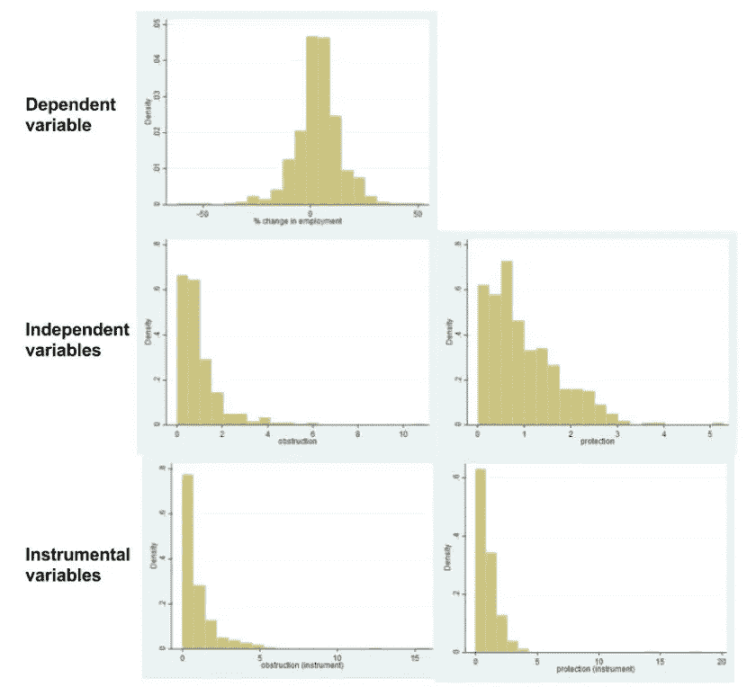

因变量、自变量和工具变量的直方图。[资料来源:亚伯拉罕，2021 年](https://www.cambridge.org/core/journals/political-science-research-and-methods/article/abs/hard-traveling-unemployment-and-road-infrastructure-in-the-shadow-of-political-conflict/135F8A50F613DA3C9C4CB9335F0BFCF7)

很明显，所有变量都有健康的变化，这意味着回归结果不太可能由异常值驱动。实际上，回归显示了抵消效应，其中阻碍效应被保护效应平衡，使得衰减的净效应将接近于零。从下面的论文节选中可以看出，作者测试了三个假设的三种效应，即阻碍效应、保护效应和衰减净效应。

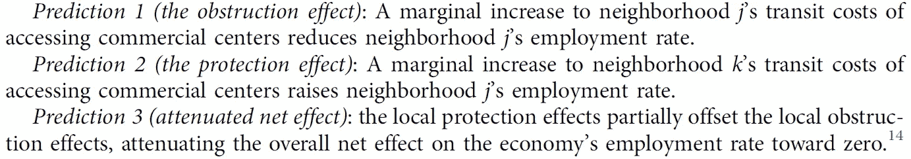

《艰难旅行》中的三个假设。来源:亚伯拉罕，2021 年

关于城市劳动力市场的经济文献将失业视为基础设施差的副产品，为注重改善城市基础设施的经济政策建议提供了支持。因此，道路障碍等交通基础设施冲击会影响从住宅区到商业中心的劳动力供应。住宅或起始邻域用 *j、*表示，而 *k* 表示目的邻域 ie。有就业机会的商业中心。

如上所述，独立变量*障碍物*和*保护*，分别描述了障碍物的直接和间接影响。亚伯拉罕斯生成了两个处理变量，即 *∆obstructionⱼ* 和 *∆protectionⱼ* ，其中第一个变量量化了来自街区 *j* 的巴勒斯坦劳工在进入街区*k*工作时受到阻碍的程度，第二个变量量化了由于障碍减少了来自街区 *j* 的劳工流动竞争而对街区 *k* 产生的反向保护效应。

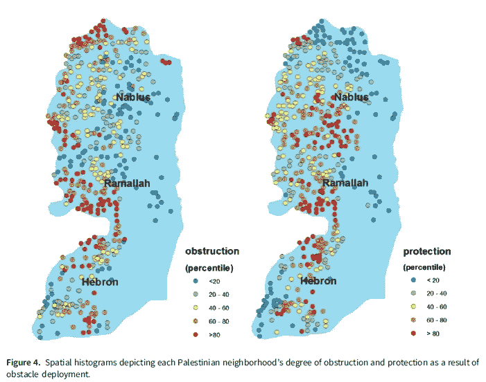

西岸的空间直方图，独立变量的百分位数分布，左图为障碍，右图为保护。[资料来源:亚伯拉罕，2021](https://www.cambridge.org/core/journals/political-science-research-and-methods/article/abs/hard-traveling-unemployment-and-road-infrastructure-in-the-shadow-of-political-conflict/135F8A50F613DA3C9C4CB9335F0BFCF7)

*∆protectionⱼ* 变量在下面的等式中定义，其中 *dₖⱼ* 代表( *k，j* )之间的道路距离， *num_obstaclesₖⱼ* 代表路径 *dₖⱼ* 上的障碍物数量。居民区经济中劳动力在起义前的份额由 nₖ代表，有 480 个居民区作为观察单位。

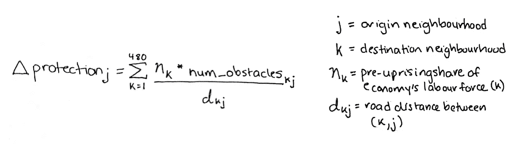

*∆protectionⱼ* 为行驶路径上障碍物的平均数量(k，j)，由 *nₖ* 加权，由 *dₖⱼ.反加权*图片由作者改编自亚伯拉罕，2021。

通往以色列边境的道路上设置的障碍物产生了额外的阻碍效应，特别是自起义前以来，21.6%的巴勒斯坦劳工每天都要前往以色列工作。为了计算 *∆obstructionⱼ，*亚伯拉罕斯首先计算一个 *∆obstruction_naiveⱼ* ，它是( *j，k* )之间路径上障碍物的平均数量，通过路径 *dⱼₖ* 进行反加权，并通过变量 *mₖ* 进行加权；其中 *mₖ* 代表邻国 *k* 在经济业务中的份额。目的地 *k* 越重要，阻碍效应越有害，因此 *mₖ* 根据商业活动确定的邻居 *k* 的相对重要性进行调整。

如下图所示，前往以色列的劳工被用来称量住宅区和以色列边境之间的障碍物数量。其中 as， *∆obstruction_naiveⱼ* 由剩余劳动力加权。

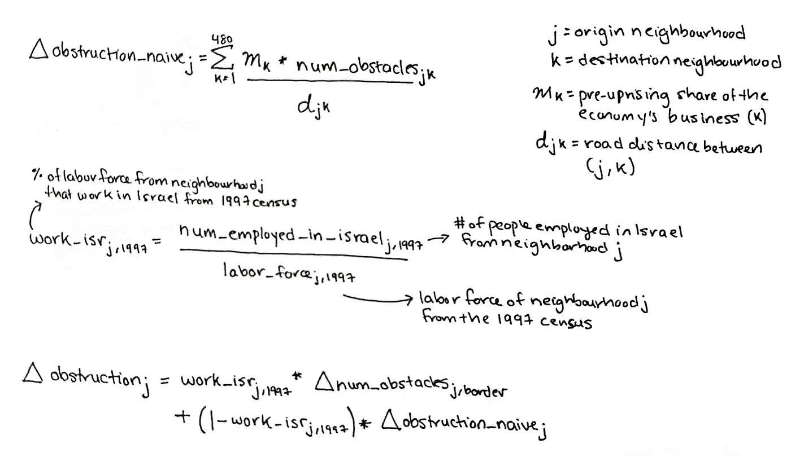

根据 1997 年人口普查的记录，计算∆obstructionⱼ的方程式也说明了在以色列就业的巴勒斯坦劳动力的百分比。图片由亚伯拉罕的作者改编，2021。

值得注意的是，为了计算 mₖ，亚伯拉罕斯利用辐射校准的夜间卫星图像来估计邻近地区的商业活动。然而，夜间卫星图像是模糊的，因此附近以色列定居点的商业活动人为夸大了巴勒斯坦居民区的计算亮度。机智的亚伯拉罕斯[发明了一种消除夜间卫星图像](https://www.sciencedirect.com/science/article/abs/pii/S0034425718301111)模糊的方法，以便更准确地计算巴勒斯坦居民区的商业活动。

接下来，工具 *∆iv_obstructionⱼ和∆iv_protectionⱼ* 遵循待遇变量的格式，其中首先计算 *∆iv_obstruction_naiveⱼ* 和 *∆iv_obstructionⱼ* 按在以工作的巴勒斯坦劳动力百分比加权。然而，使用这些仪器，效果不是通过障碍物的数量来计算的，而是通过以色列定居点与通勤道路的纵向接近度来计算的。通过假设定居点周围存在缓冲区，可通过通勤道路上位于定居点缓冲区内的路段总长度来计算接近度，从而表示道路障碍物的潜在位置。在下图中，仪器由 *mₖ* 和*nₖ*称重，与它们的治疗对应物相似。

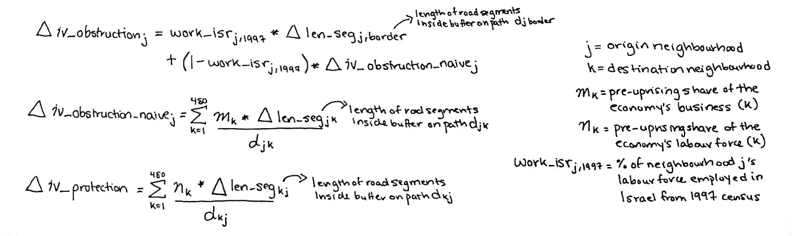

根据 1997 年人口普查的记录，计算*工具和*的方程式也说明了在以色列就业的巴勒斯坦劳动力的百分比。图片由亚伯拉罕的作者改编，2021。

在接下来的部分中，我们将构建一个因果图来模拟这个问题，我将介绍控件。虚拟变量。

## **第一阶段:因果模型**

作为第一步，本教程的数据集[可以在这里](https://dataverse.harvard.edu/dataset.xhtml?persistentId=doi:10.7910/DVN/XACHFI)访问。我建议在使用 DoWhy 时使用 Google Colab 笔记本，因为在本地环境中安装 pygraphviz 这个图形可视化库可能会很棘手。在 Colab 中运行的以下两个命令将正确安装 pygraphviz 和 DoWhy。

```
!apt install libgraphviz-dev
!pip install pygraphviz dowhy
```

如果使用 Colab，使用下面两行来加载“Hard traveling”数据集，该数据集存储为。dta”，表示 Stata 文件。

```
from google.colab import files
files.upload()
```

在下面的代码片段中，我们导入所需的库，并使用 pandas 将 Stata 文件读入数据帧。加载的数据帧中的列根据卫星图像标记的数据列进行重命名，以匹配上一节中描述的变量。接下来，有必要将独立变量和工具变量标准化，以便于比较效果。

接下来，我们添加所有必要的虚拟变量来复制论文的主要结果。480 个居民区省级就业趋势的省级虚拟控制。其余的虚拟变量代表邻近水平的协变量，如土堆和局部检查站，它们被排除在回归之外，以减少衰减偏差，因为这些“障碍”不会干扰过往交通。*设定假人*与第二阶段讨论的仪器排除条件相关。所有的虚拟变量被收集到一个列表中， *all_dummies* 。

DoWhy 使得构建因果图变得非常简单。数据帧传递给导入的*因果模型*，设置治疗变量*∏阻塞*和*∏保护*，结果(因变量)定义为就业变化，设置工具变量*∏iv _ 阻塞*和*∏iv _ 保护*。“共同原因”论点是我们通过*所有虚拟变量的地方，*这使我们能够控制省一级的趋势和社区一级的协变量。

道伊制作了下面的因果图来显示自变量、因变量和工具变量之间的关系。在下图中，我排除了省级趋势和社区级协变量，因为它们会使图表变得杂乱。我简单地运行了 CausalModel 而没有使用 common causes 参数来生成图表，但是在本教程的剩余部分中, *all_dummies* 都包含在因果模型中。

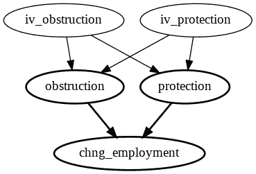

显示工具、自变量和因变量之间关系的因果图:1997 年至 2007 年间的就业变化。

## **第二阶段:确定需求**

DoWhy 使得从因果图中识别需求变得容易。以下命令描述了我们创建的模型:

```
model.interpret()
```

输出应为“寻找治疗['阻碍'，'保护']对结果['改变 _ 就业']]的因果效应的模型”。为了从模型中识别估计需求，我们运行下面两行:

```
identified_estimand = model.identify_effect(proceed_when_unidentifiable=True)
print(identified_estimand)
```

如下图所示，“identify_effect”的输出将包括我们在建立模型时指定的工具变量。

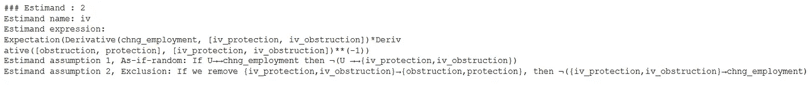

输出中包括仪器的估计和假设，这里说明了仪器的排除条件。亚伯拉罕斯对此的定义是，“以色列定居点靠近巴勒斯坦人的旅行路线，虽然显然预示着随后的封锁，但不应该通过任何其他因果渠道影响巴勒斯坦居民区就业率的变化”。在第四阶段，我们使用稳健性检查来表明 *settle_dummies* 是一个替代渠道，它与工具正交运行，因此对回归结果没有影响，settle_dummies 表示一个定居点靠近巴勒斯坦居民区(可能引发暴力)。小心地包含 *settle_dummies* 意味着我们正在考虑排除条件，这允许我们继续进行因果分析，而不违反第二阶段中确定的估计和假设。

## 第三阶段:评估效果

下一步是使用确定的估计量来估计因果效应，如前所述，亚伯拉罕使用 2SLS 作为估计方法。在 2sl 的第一阶段，如下图所示，处理变量的仪器替代是根据它们在仪器上的回归而创建的，同时考虑了省一级的趋势和社区一级的协变量。

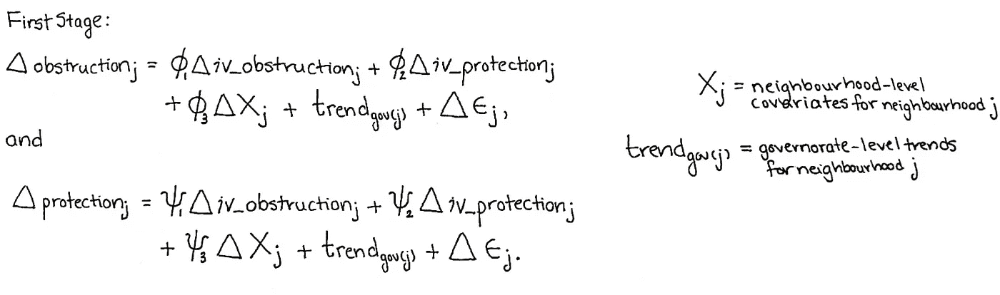

*第一阶段 2SLS，*仪器( *∆iv_obstructionⱼ和∆iv_protectionⱼ)* 用于回归 *∆obstructionⱼ和∆protectionⱼ.*图片由作者改编自亚伯拉罕，2021。

在第二阶段，如下图所示，第一阶段估计的中间变量(∆obstructionⱼ 和∆protectionⱼ*用于回归就业变化，以及省一级的趋势和街区一级的协变量。*

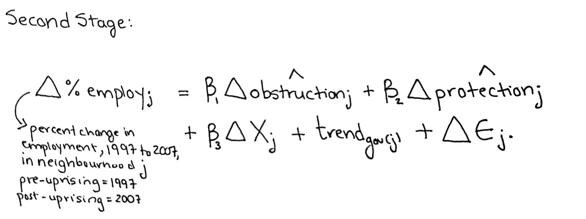

*第二阶段 2sl，*第一阶段估计的变量用于回归 1997 年至 2007 年的就业变化。图片由亚伯拉罕的作者改编，2021。

DoWhy 有一个内置的工具变量 2SLS 方法，我们可以用它来快速回归两个阶段中治疗变量的就业变化。识别出的估计需求用名为“iv.instrumental_variable”的 DoWhy 方法进行估计，该方法建立在 [statsmodels 的 IV2SLS](https://www.statsmodels.org/stable/generated/statsmodels.sandbox.regression.gmm.IV2SLS.html) 之上。

上述代码片段的输出如下所示，请注意，标准误差不是[异方差稳健的](https://en.wikipedia.org/wiki/Heteroscedasticity-consistent_standard_errors)，因为底层 statsmodels 的函数不允许为协方差估计器指定标准误差的类型。

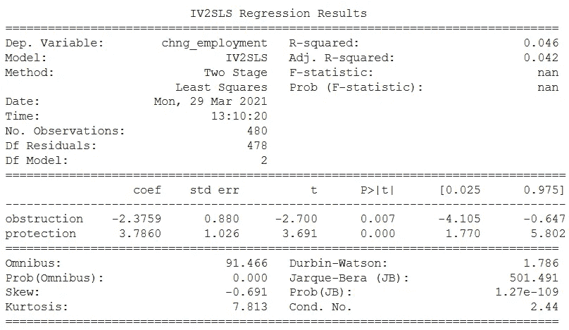

用于回归处理变量就业变化的仪器化 2SLS 结果。图片作者。

如图所示，存在与*阻塞* (-2.38)相关的负因果效应和与*保护* (+3.79)相关的正因果效应。t 检验结果足够大，表明样本数据和零假设之间存在显著差异。下面，来自“艰难旅行”的主要回归结果在空间上显示在西岸的地图上；暖色代表消极的阻挡效果，冷色代表积极的保护效果。

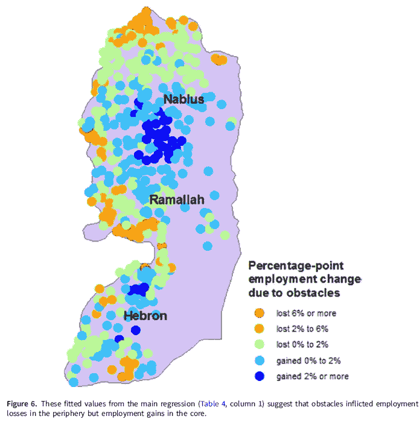

显示主要回归结果的空间直方图显示，阻碍效应在农村地区较高，保护效应在商业中心较高。来源:亚伯拉罕，2021 年

DoWhy 的结果是相似的，但它们与 Abrahams 的主要结果不匹配，因为回归没有被 2007 年人口普查的劳动力加权。在建立观察实验时，考虑了 1997 年人口普查的劳动力，然而，为了复制“艰苦旅行”的公布结果，需要用数据框架中标记为“lf_1_2007”的变量对 2sl 回归进行加权。不幸的是，由于库对 statsmodels 的依赖，DoWhy 不允许加权 2SLS 回归。此外，480 个邻近地区可以被聚类成 310 个超邻近地区，并且 statsmodels 的实现缺乏针对聚类进行调整的灵活性。因此，我有三个理由使用 Python 库 [linearmodels](https://bashtage.github.io/linearmodels/iv/iv/linearmodels.iv.model.IV2SLS.html) :测试对异方差的稳健性，添加 2007 年劳动力加权因子，以及通过 310 个超邻域进行聚类。

通过[线性模型](https://bashtage.github.io/linearmodels/iv/iv/linearmodels.iv.model.IV2SLS.html)，我首先实现了加权 OLS，其次是加权 2SLS 回归，第三是聚类(和加权)2SLS 回归。下面比较了回归的结果，我已经在 Github 上的 Jupyter 笔记本中分享了回归的完整代码。

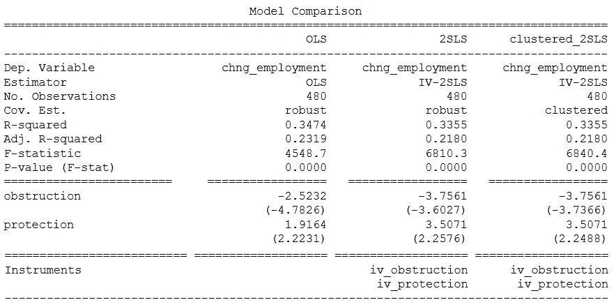

用线性模型比较 OLS、2SLS 和聚类 2SLS 回归的结果。图片作者。

对于 OLS 和仪器化 2SLS 回归，默认协方差估计是“稳健的”，产生对异方差稳健的结果，反映了“硬旅行”的主要结果。对于聚类 2SLS 回归，480 个邻域被分组为 310 个聚类，并且协方差估计器被“聚类”。从下表“艰难行驶”中可以看出，带控制装置的加权 2SLS 的主要结果是:障碍物*为-3.75，保护*为+3.50，这与上面我的线性模型结果表相匹配。**

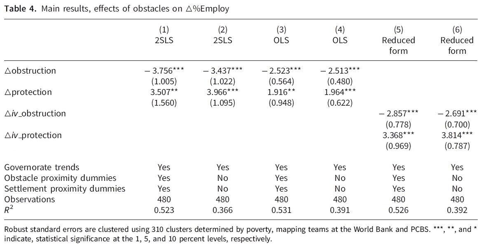

“艰难旅行”的主要结果表。来源:亚伯拉罕，2021 年

## **第四阶段:反驳估计**

最后一个阶段是用稳健性检查来反驳获得的估计值，在这个阶段测试模型对混杂因素的稳健性。在“艰苦旅行”中，有广泛的稳健性检查，例如，死亡数据被添加到回归中，以测试暴力引发的测量误差。在加载本教程的数据时，我意识到健壮性检查的广泛性；数据框有 734 列，用于 480 次观察！我将需要一个额外的帖子来涵盖这些检查的细节，所以我将重点放在由 DoWhy 提供的可用于反驳估计的一般类型的健壮性检查上。

我测试了三种类型的 DoWhy 反驳者，一种是“bootstrap _ refuter”，一种是“data _ subset _ refuter”，一种是“random_common_cause”反驳者。“bootstrap _ rejector”通过在混杂因素中包含测量误差的数据的随机样本上运行来反驳估计值。“数据子集反驳者”通过对原始数据的随机子集重新运行来反驳一个估计。“随机 _ 共同 _ 原因”通过引入一个随机产生的混杂因素来反驳一个估计，这个混杂因素可能没有被观察到。下面的代码片段改编自一本 DoWhy 示例笔记本，它详细描述了如何[迭代多个反驳者](https://microsoft.github.io/dowhy/example_notebooks/dowhy_refuter_notebook.html)。

下图显示了对第三阶段获得的 DoWhy 因果估计运行多重反驳的结果。

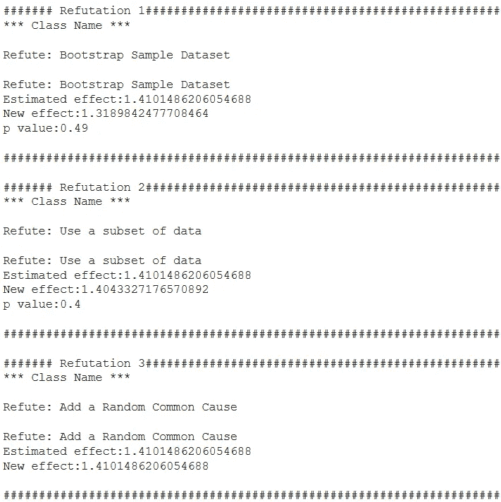

基于 DoWhy 的健壮性检查的反驳结果。图片作者。

## **最终想法**

这篇 Python 因果分析教程旨在展示计量经济学的有用性，并鼓励其他数据科学家将因果关系纳入他们的实证工作。使用“艰难的旅行”作为案例研究论文是一个非常吸引人的学习经历，它增加了发展应用计量经济学所需的必要背景。数据科学和计量经济学在因果关系方面的交叉是我打算进一步探索的一个领域，我的希望是将我的学习之旅转化为可访问的教程。

作为人类，我们自然会以因果关系的方式思考，将这种类型的思维扩展到机器学习感觉像是一种自然的扩展。杰出的人工智能研究人员，如 Yoshua Bengio，主张将因果关系扩展到机器学习；有趣的是，Bengio 最近提出了[因果学习作为解决模型泛化问题](https://medium.com/syncedreview/yoshua-bengio-team-proposes-causal-learning-to-solve-the-ml-model-generalization-problem-762c31b51e04)的方法。撇开数据科学不谈，我相信，随着机器学习在回答因果问题方面的进步，它对经济学越有用。我将在未来的一篇文章中探索这个相反的角度，我将使用 [Keras](https://keras.io/) 和 [EconML](https://www.microsoft.com/en-us/research/project/econml/) 估计条件平均治疗效果(CATE)，用机器学习解决一个经济学问题。最后，非常感谢[阿列克谢·亚伯拉罕斯](https://twitter.com/abulkhaezuran?ref_src=twsrc%5Egoogle%7Ctwcamp%5Eserp%7Ctwgr%5Eauthor)回答问题并提供周到的反馈。

如有疑问或评论，在 [Linkedin](https://www.linkedin.com/in/haaya-naushan-a4b5b61a5/) 上联系我，我很有兴趣听听别人是怎么用计量经济学进行数据科学的！