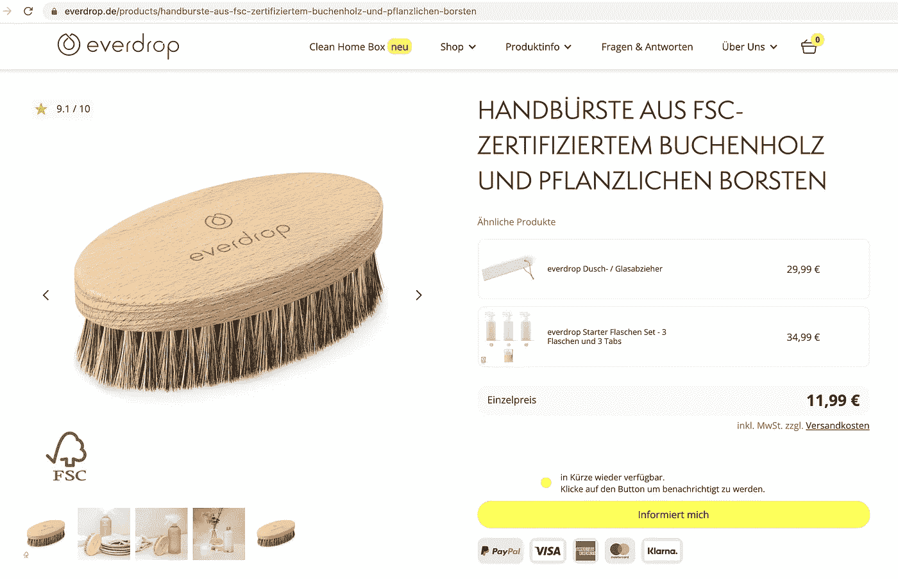
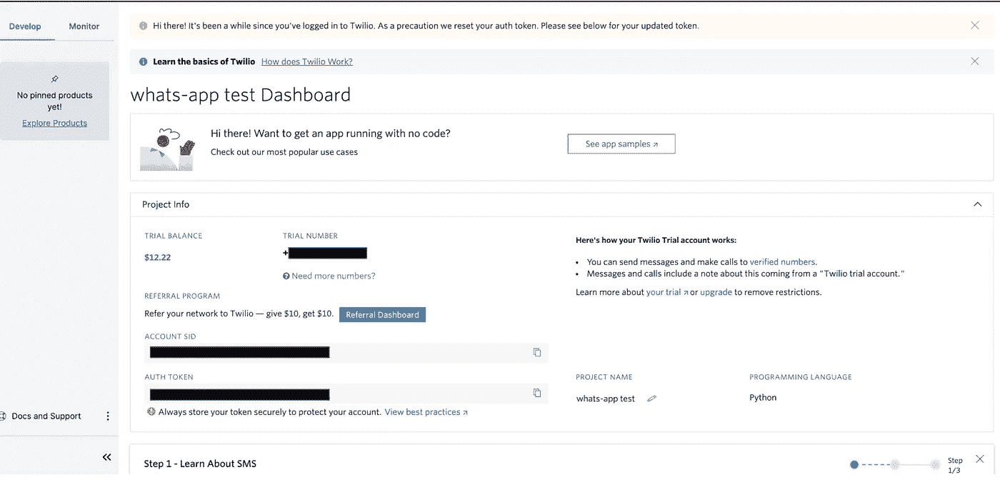
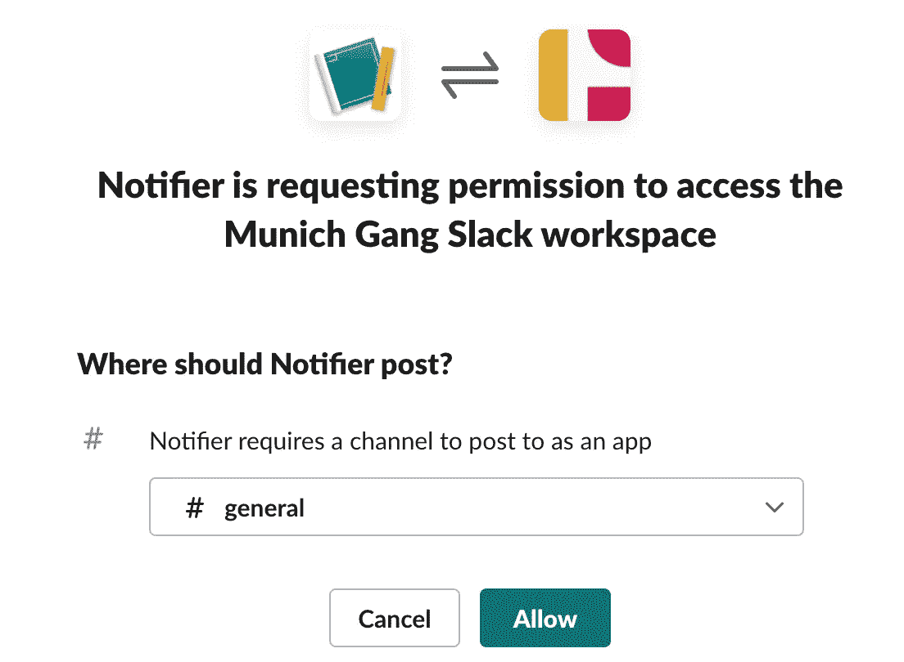
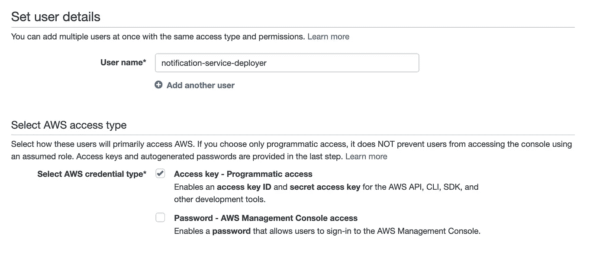

# 实用 Python:如何在几分钟内编写和部署监控和通知服务。免费的。

> 原文：<https://towardsdatascience.com/practical-python-how-to-write-and-deploy-a-monitoring-notification-service-within-minutes-for-free-b682cffa66ef?source=collection_archive---------4----------------------->

## 你曾经希望有一种服务，一旦它观察到一个特定的事件，就反复地检查和 pings 你吗？—了解如何构建和部署它。


小熊猫观察者— [来源](https://pixabay.com/photos/nature-mammal-animal-wildlife-cute-3162233/)

你有没有发现自己反复点击 f5 来查看某个网站上是否有某个商品或门票？你有没有几乎疯狂地检查 API 来查看某个速率是否超过了某个阈值？如果是的话，这篇文章可能适合你。

本文将为您提供构建和部署全自动超轻通知服务的工具。本文旨在作为代码指南。我们将涵盖选定的相关监控用例(网站、加密、API)，回顾典型的通知渠道(电子邮件、SMS 和 Slack)，并解释如何使用[无服务器框架部署服务。](https://www.serverless.com/)你可以在这里找到最终回购[。相信我，这比你想象的要容易得多。](https://github.com/FBosler/notification-service)

## 这篇文章的结构如下:

1.  设置
2.  监视
3.  通知
4.  部署

## 先决条件:

一些 Python 的经验是有帮助的，但是大多数组件都非常简单。对于我们手头的例子，我们将使用 AWS 的无服务器框架，所以理想情况下，您对 AWS 有一些经验。理想情况下，您也有一个 AWS 帐户，如果没有，您可以创建一个自由级帐户。

或者，我们可以快速重新配置服务，使用 GCP、Azure 或其他受支持的提供商之一。我们将把我们的服务部署为 lambda 函数。运行 lambda 函数的成本在免费层内(除非您每分钟运行多次检查)。

# ①设置

由于`serverless`将在引擎盖下对我们的项目进行分类，我们将需要一个不仅仅是 Jupyter 笔记本的项目结构。我选择的编辑器是 [Pycharm](https://www.jetbrains.com/pycharm/) ，但是可以随意使用。

我们的项目结构将如下所示:

```
monitoring
|-api.py
|-crypto.py
|-website.py
notifier
|-sms.py
|-email.py
|-slack.py
|-telegram.py
handler.py
.env *(includes all relevant variables)* serverless.yml *(serverless config file)* requirements.txt *(specifies dependencies)* package.json *(configures our node dependencies - think of it like a more powerful requirements.txt but for node)* .gitignore
```

在我们开始之前，请继续安装`[node, npm](https://docs.npmjs.com/downloading-and-installing-node-js-and-npm)`和`[serverless](https://www.serverless.com/framework/docs/getting-started)`(您不需要设置仪表板帐户)。虽然不是绝对必要，但我强烈建议使用某种形式的 python 环境管理。我使用 [conda](https://docs.conda.io/en/latest/) 环境，但是 [pipenv](https://pypi.org/project/pipenv/) 、 [pipex](https://github.com/pypa/pipx) 或 [pyenv](https://github.com/pyenv/pyenv) 也是不错的选择。这种选择主要取决于个人的熟悉程度和品味。一旦你这样做了，改变你的`package.json`如下(或者创建它，如果你没有它)。

```
{
  "devDependencies": {
    "serverless-python-requirements": "5.2.2"
  }
}
```

然后，这是最后的设置步骤，运行`npm install`(这将安装`serverless-python-requirements`——一个插件无服务器需要捆绑我们的 python 依赖)。

# ②监测

好吧，让我们开始吃肉，好吗？

## 从 API 中提取数据

让我们从监测外汇汇率开始，以了解什么时候将是打包所有东西并自发飞往泰国的最佳时间。我们将查询 ECB(欧洲中央银行)提供的一个官方免费端点。不幸的是，我们得到的数据是 XML，所以我们必须解析它才能使用它。

此外，我们需要`requests`来发送这些请求，所以运行`pip install requests`。

代码可用[此处](https://github.com/FBosler/notification-service/blob/main/monitoring/api.py)

如果最近的汇率高于 35 泰铢，我们将打印一条消息通知我们。

## 监控网页

假设您想要监视网页，以确定某个产品何时再次可用。为了处理 HTML，我们需要一个解析器。幸运的是 Python 提供了`[beautifulsoup](https://www.crummy.com/software/BeautifulSoup/bs4/doc/#quick-start)`，一个 HTML 解析器。所以让我们继续运行`pip install beautifulsoup4`。如果你想了解更多关于 beautifulsoup 的信息，可以看看下面这篇文章:

[](/image-scraping-with-python-a96feda8af2d) [## 使用 Python 进行图像抓取

### 学习如何用 Python 从 Google 下载图片的代码指南！

towardsdatascience.com](/image-scraping-with-python-a96feda8af2d) 

好的，现在让我们假设我们想买[这个漂亮的刷子](https://www.everdrop.de/products/handburste-aus-fsc-zertifiziertem-buchenholz-und-pflanzlichen-borsten)。



[everdrop 笔刷](https://www.everdrop.de/products/handburste-aus-fsc-zertifiziertem-buchenholz-und-pflanzlichen-borsten)，可惜卖完了(写的时候)

但是，我们不想订阅时事通讯。因此，让我们抓取带有漂亮汤的 HTML 并搜索`add-to-cart`按钮。如果我们能找到`add-to-cart`按钮，这意味着产品可用。我们可以很容易地这样做:

代码可用[此处](https://github.com/FBosler/notification-service/blob/main/monitoring/webpage.py)

## 做加密的东西

所以最近我意识到了一个叫做[仙境](https://www.wonderland.money/)的疯狂的 crypto DAO(分散自治组织)。老实说，仙境是一个相当疯狂的金融结构，很可能会爆炸，但我发现它很有趣。它的工作方式是，一旦一个人下注他们的`Time`代币，他们就会得到另一个代币(wMemos)，可以用作 [Abracadabra](https://abracadabra.money/) 的抵押品来借用`MIM`代币，然后可以再次变成`Time`代币来建立高杠杆头寸。我的主要问题是，通常贷款池会没有代币，这些代币只能定期补充。所以我想让支票自动化。我只构建了监视服务，但是也完全有可能在特定条件下与区块链交互(例如 eth-brownie)。

此处代码[为](https://github.com/FBosler/notification-service/blob/main/monitoring/crypto.py)

太好了，我们成功地编写了几个不同的监控函数。如果满足条件，这些函数返回一个字符串，否则不返回任何内容。此外，好的一面是每个文件都可以单独测试。

# ③通知

我们现在需要通知自己(或他人)我们之前监控的事件。让我们从最简单的开始。电子邮件。

## 电子邮件

在这个例子中，为了简单起见，我假设您使用的是 Gmail。此外，由于我们现在使用敏感的登录凭证，我将开始把它们放入`.env`文件，并通过`os.getenv`检索它们。如果你想复制这个，你需要把你自己的密码、电子邮件和 SMTP 服务器放到你的`.env`文件中。请注意，如果你使用的是 Gmail，你很可能需要创建一个特定于应用程序的密码(这里的[说明](https://support.google.com/accounts/answer/185833?p=InvalidSecondFactor))。你甚至可以运行你自己的 SMTP 服务器，但是我认为这会使 lambda 函数失去平衡。

此处代码[为](https://github.com/FBosler/notification-service/blob/main/notifications/send_email.py)

## 短信

接下来，短信。随着 WhatsApp 的出现，SMS(短消息服务)有点过时了，但仍然非常好用。例如，设置通过 [Twillio](https://www.twilio.com/docs/sms/quickstart/python) 发送短信非常简单。需要注意的是，每条短信都是要花钱发的。然而，Twilio 确实提供了一个免费的试用帐户，你可以先使用。理论上，你可以使用 Gmail 自动转发功能(或其他垃圾邮件服务)创建无限的试用账户。假设你的电子邮件地址是 example@gmail.com，那么 Gmail 会自动将所有发往 example+whatever@gmail.com 的邮件转发到你原来的账户。



Twilio Dashboard —注册您的收件人号码也很重要(对于试用版)

发送功能就变得愚蠢简单了。但是，不要忘记首先运行`pip install twilio`。

此处代码[为](https://github.com/FBosler/notification-service/blob/main/notifications/send_sms.py)

## 松弛的

最后，懈怠。现在几乎每个公司都在使用 Slack，所以自动向 Slack 通道发送消息是有意义的。

首先，你需要成为你的空闲工作区的管理员，然后去 slack.com/apps。点击“创建应用程序”，选择“从头开始”，命名服务并选择正确的工作空间。一旦你创建了应用程序，点击“传入网页挂钩”，切换激活开关，并点击“添加新的网页挂钩到工作区”。



现在选择一个频道

酷，我们完成了。我们现在有了自己的 webhook URL，我们也把这个 URL 放在我们的`.env`文件中，因为每个有这个 URL 的人都可以用它来发布消息。发送消息非常简单，如下所示:

太神奇了！我们现在已经成功地编写了一些监控函数和一些通知函数。让我们部署这个！

# ④部署

对于部署，我们将使用无服务器框架。假设您遵循了本指南，并做了步骤①中描述的所有事情，那么这应该意味着您可以开始了。但是，您需要设置您的本地 AWS 凭证。您可以通过运行`cat ~/.aws/credentials`来验证您的凭证是否存在，您应该会看到类似这样的内容:

```
[default]
aws_access_key_id=YOUR_KEY
aws_secret_access_key=YOUR_KEY
...
```

如果您没有看到这一点，请继续安装 [AWS-CLI](https://aws.amazon.com/cli/) 和[配置您的凭证](https://docs.aws.amazon.com/cli/latest/userguide/cli-configure-quickstart.html)。如果您还没有凭据，请登录 AWS 控制台(web)并选择 IAM。现在有两个选择，一个比另一个稍微复杂一点。

## 选项 1 —对根的权限:

出于测试的目的，我推荐使用这种方法，因为它要快得多。登录 AWS 控制台`->`搜索 IAM `->`选择用户`->`点击你的 root 用户`->`“安全凭证”`->`“创建访问密钥”就大功告成了。

## 选项 2 —新用户:

继续创建一个新用户，我们称该用户为`notification-service-deployer`并勾选`Access key — Programmatic access`框。



现在是权限的时候了。出于开发目的，您可能倾向于授予该帐户 admin 权限，但我建议不要这样做，而是授予它以下权限:

*   [AWSLambda_FullAccess](https://console.aws.amazon.com/iam/home#/policies/arn%3Aaws%3Aiam%3A%3Aaws%3Apolicy%2FAWSLambda_FullAccess) (原因很明显)
*   [awscloudformationfullacess](https://console.aws.amazon.com/iam/home#/policies/arn%3Aaws%3Aiam%3A%3Aaws%3Apolicy%2FAWSCloudFormationFullAccess)(用于部署)
*   [亚马逊 3FullAccess](https://console.aws.amazon.com/iam/home#/policies/arn:aws:iam::aws:policy/AmazonS3FullAccess) (如果你需要一些持久存储的话)

## 最终剧本

让我们快速拼凑出我们的最终脚本:

这里的代码—取消您想要使用的函数的注释

您可以随意取消注释您想要使用的任何内容。你必须根据你的需要修改剧本。

## 无服务器配置

现在，缺少的最后一件事是，我们需要像这样配置我们的`serverless.yml`(注释解释了每个部分的作用):

瞧啊。我们完成了，现在我们准备好部署我们的通知服务，只需运行:`sls deploy`(它将构建一个 zip 文件并将其上传到 S3，从那里 zip 文件可以用来创建 lambda 函数)。

太神奇了！您部署了自己的通知服务。相信我，当我告诉你这又打开了一个新的麻烦。你很快就可以开始编写自己的 API 和 bot 了。

哦，如果你喜欢阅读这样的故事，并想支持我成为一名作家，考虑注册成为一名灵媒成员。每月 5 美元，你可以无限制地阅读媒体上的故事。如果你用我的链接注册，我甚至会做一些🍩。

[](https://medium.com/@fabianbosler/membership) [## 通过我的推荐链接加入 Medium-Fabian Bosler

### 作为一个媒体会员，你的会员费的一部分会给你阅读的作家，你可以完全接触到每一个故事…

medium.com](https://medium.com/@fabianbosler/membership)