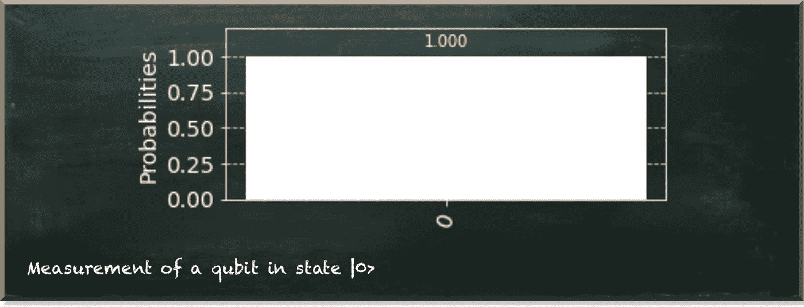
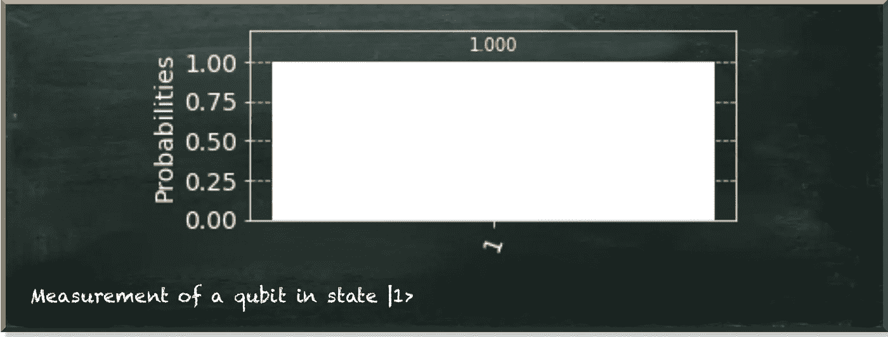
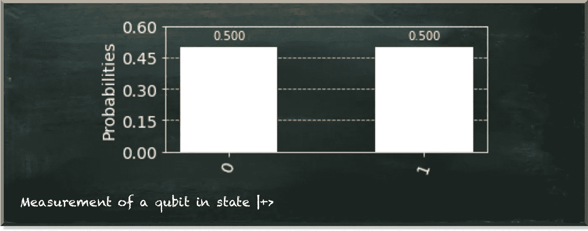
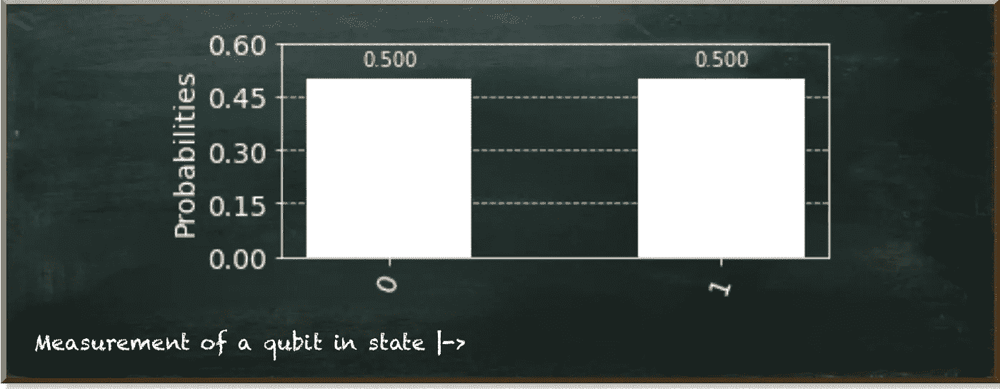
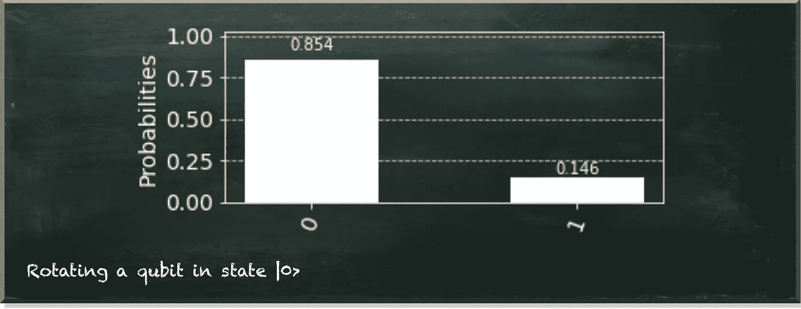
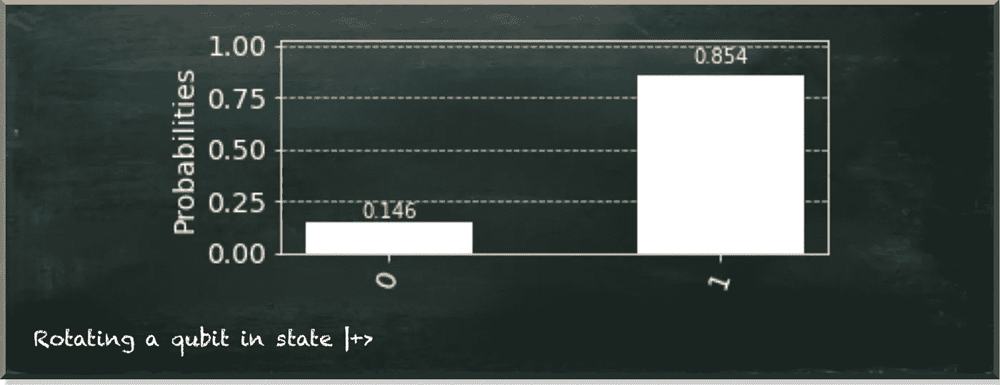

# 实践探索量子计算的公理

> 原文：<https://towardsdatascience.com/practically-exploring-the-axioms-of-quantum-computing-4413333ec0d8?source=collection_archive---------33----------------------->

## 走向量子计算的掌握

量子机器学习要不要入门？看看 [**动手量子机器学习用 Python**](https://www.pyqml.com/page?ref=medium_axioms&dest=/) **。**

在你掌握量子计算的过程中，你会遇到很多奇怪的现象。以量子叠加为例。它说一个量子位(qubit)是 0 和 1 的复杂线性组合。

如果你是一名数学家或物理学家，你会重视别人对这个术语的正确定义。但是如果你不是，你可能会喜欢一个更有趣的解释，比如量子位同时是 0 和 1。

作为一个非数学家，你似乎注定要失败。正确的定义就像一套象形文字。但是，坊间的解释是完全错误的。

作者图片

但是还有第三条路:实用的路。量子计算不再是理论上的构想。有真正的量子计算机。此外，即使您无法访问它们，也有量子 SDK，如 Qiskit，其中包含模拟器。你可以在本地计算机上开发和运行量子电路。当然，如果你使用经典计算机，你不会看到任何量子加速。但是用实际动手的方式学习量子计算已经足够好了。

那么，我们来看一个量子位。这段代码创建了一个具有单个量子位的量子电路。然后，它执行电路并输出布洛赫球。

布洛赫球是一种广泛使用的量子位表示。它突出显示了球体两极量子位的两种基本状态。更具体地说，量子位状态由从球体中心到其表面的向量来表示。这两个基本向量在极点处结束。

作者图片

我们的图显示了在北极结束的矢量|0⟩。|0⟩没什么特别的。但它只是我们在量子力学中用来描述向量的(狄拉克)符号。

一般来说，向量|0⟩也不例外。然而，实际上，我们用它作为计算的基础。这意味着如果我们在|0⟩状态下测量一个量子位，我们将总是观察到它为 0。让我们实际地做这件事。

下图描述了上面代码的输出。它显示了所有可能测量的概率。在我们的例子中，只有一个可能的结果:0。

作者图片

如前所述，量子位有两种基本状态。第二个基态是|1⟩，我们测量为 1。

作者图片

当我们看布洛赫球中的矢量|1⟩时，我们看到它指向南方。

作者图片

将我们的量子位元限制在这两种基本状态，和一般位元一样好(或简单)。但是，当然，要利用量子位的优势，我们也必须允许它们处于其他状态。

|+⟩就是其中的一个州。我们通过𝜋/2 绕 y 轴旋转量子位状态向量来达到这个状态。在这种状态下，量子位有相同的概率分别为 0 或 1–50%。

作者图片

当我们观察布洛赫球时，我们看到它终止于球赤道上的 X 轴。所以，从图形上看，到两极的距离是一样的。

作者图片

如果我们绕 y 轴旋转向量|1⟩𝜋/2，也会发生类似的情况。它产生了|−⟩.

作者图片

结果向量也位于 X 轴。所以当我们测量量子位的时候，它有相同的概率是 0 或者 1。

作者图片

实际上，你可能认为|+⟩和|−⟩是一样的。这与事实相去甚远。相比之下，正如布洛赫球的视觉表现所示，这两种状态指向相反的方向。

在量子力学术语中，它们是相互正交的。这意味着我们可以清楚地区分彼此。这听起来可能很奇怪。我们如何确定表现出相同测量概率的两个状态？

要回答这个问题，我们需要明确一个本质的方面。量子态只有在我们不测量量子位的情况下才存在。但是一旦我们测量了它，它会立刻跳到两个基态中的一个。但是，没有人要求我们在测量量子位元之前，必须让它们保持原样。事实上，量子计算最重要的部分之一就是改变量子系统，使两种不同的状态产生两种不同的测量结果。

在|+⟩和|−⟩的例子中，我们可以在测量之前将它们绕 y 轴旋转回来。当然，我们知道我们旋转了量子位。然后，如果我们测量到 0，我们可以推断出量子位一定处于|+⟩.态我们知道，如果我们测量的是 1，那一定是在|−⟩。

只有当量子态相互正交时，我们才能确定地将它们区分开来。但我们不能，否则。举例来说，有人给了你一个量子比特，它或者在|0⟩，或者在|+⟩.你怎么决定是哪一个？

如果马上测，测到 1 可能就很幸运了。然后，你知道它一定是在|+⟩态，因为在|0⟩.态，你永远不会观察到一个量子位为 1 但你幸运的几率是 50%。如果你测量 0，量子位的状态可能是|0⟩或|+⟩.

你能做的最好的事情就是旋转𝜋/4.如果量子位处于|0⟩状态，你将有 85%的机会将其测量为 0。

作者图片

如果量子位处于|+⟩态，你会看到测量它的反向概率为 1。

作者图片

最后你得到的结果是概率性的。你不能绝对确定量子位是在|0⟩还是在|+⟩.

只有当量子位状态相互正交时，你才能清楚地区分它们。但这不是通常的情况。尤其是如果你创建的量子算法表现出显著的加速。

量子机器学习要不要入门？看看 [**动手量子机器学习用 Python**](https://www.pyqml.com/page?ref=medium_axioms&dest=/) **。**

在这里免费获得前三章。