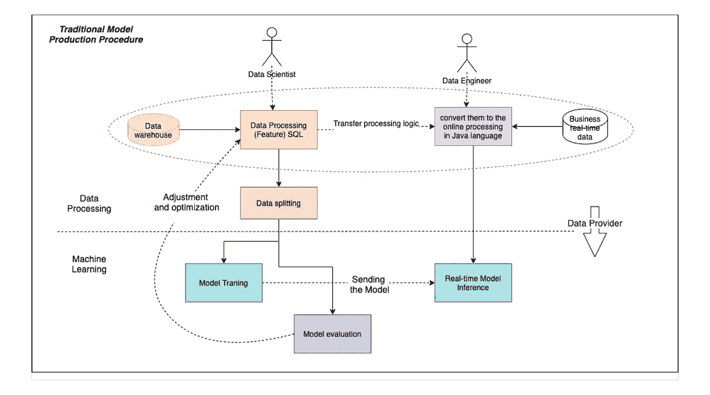
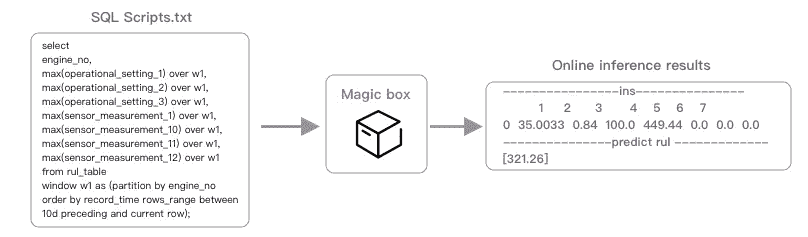
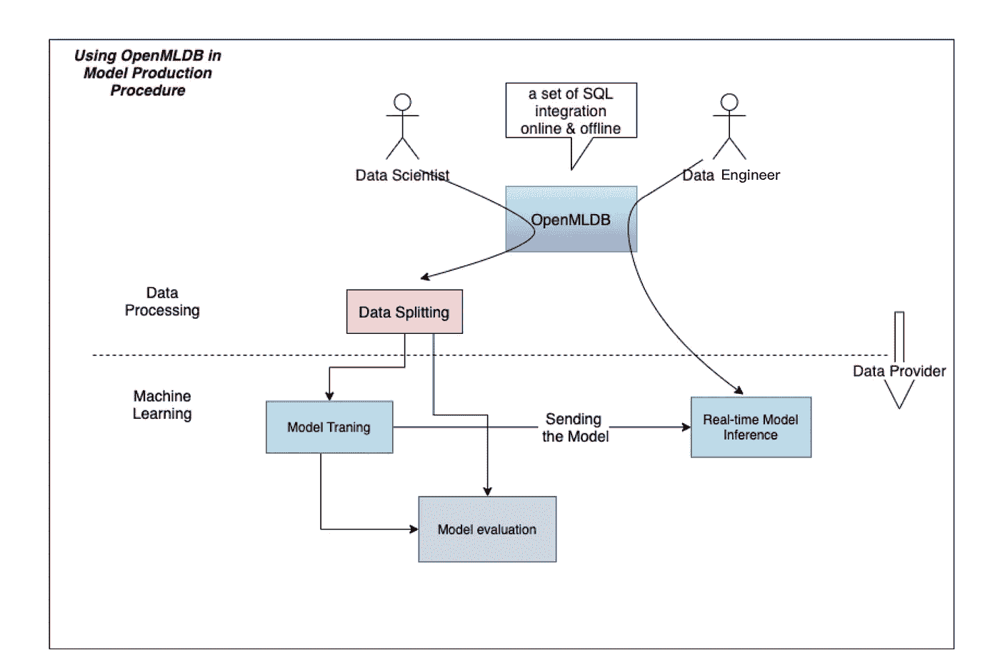
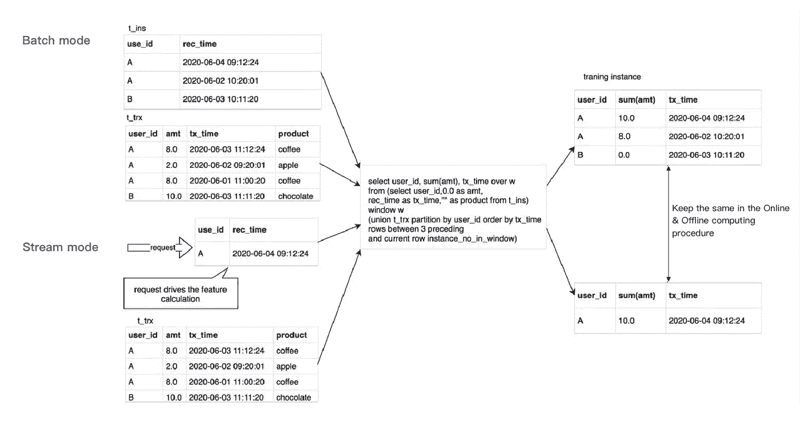
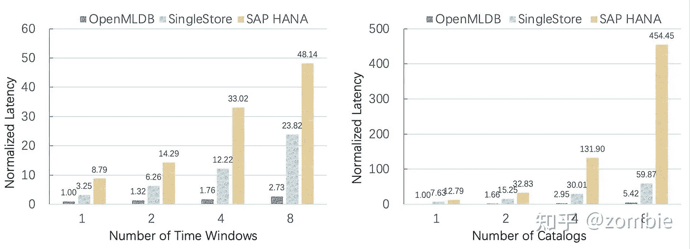
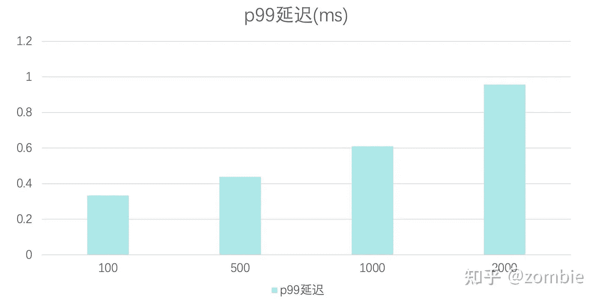
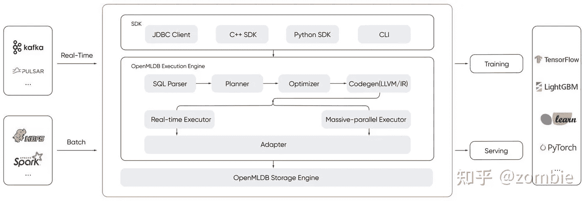

# MLOps 实践:在银行在线交易的实时反欺诈模型中使用 OpenMLDB

> 原文：<https://towardsdatascience.com/practice-of-openmldbs-transaction-real-time-anti-fraud-model-in-the-bank-s-online-event-40ab41fec6d4?source=collection_archive---------37----------------------->

## 中国在线反欺诈 MLOp 实践

# 背景

如今，许多银行已经开始引入机器学习模型来辅助规则引擎进行决策。银行也做了很多线下的机器学习模型探索，效果很好，但是很少最终应用到线上环境中，主要有以下几个原因:

1.  在风险控制场景中，在线推理需要高性能，需要 TP99 20ms，对于大多数机器学习模型来说，要达到这样的性能是具有挑战性的。
2.  对特征计算的时效性要求高，但大多数机器学习基础设施无法满足基于滑动时间窗的计时特性。
3.  特征计算复杂庞大，在线成本很高。
4.  保持离线特征计算和在线特征计算的一致性并不容易。最后，线下效果好，线上效果差。

这是因为，要完成反欺诈模型在线项目，需要做以下事情来解决一致性问题:

首先，数据科学家使用 SQL 离线处理数据。接下来，他们需要将特征工程解决方案从离线转换到在线。在此过程中，数据工程师需要使特征处理逻辑与数据科学家保持一致，并考虑数据科学家程序更改的风险(这总是发生在生产系统中)。

第二，数据工程师基于反欺诈在线系统架构设计在线和实时数据处理架构。

最后，数据工程师应该开发数据科学家已经用 SQL 手动开发的所有特征处理逻辑。在这个过程中，数据工程师作为不同计算机语言的“翻译者”工作。考虑到反欺诈机器学习项目中的数百万个特征，这种翻译工作是不必要的，并且容易出错。

下图描述了大多数 MLOps 平台的这一过程。



作者图片

那么，有没有一种方法，数据工程师只需要将数据科学家编写的 SQL 脚本扔进一个魔盒，就可以完成机器学习模型的推理工作，并使其在线工作，而无需考虑功能脚本的逻辑？



作者图片

今天，作为一个机器学习应用开发者，我将告诉你如何基于 [OpenMLDB](https://github.com/4paradigm/OpenMLDB) 解决这些问题。如果你在你的机器学习系统中使用它，你可以享受这些好处:

1.  不需要理解数据科学家的特性计划的逻辑。即使计划有所调整，我只需要将 SQL 更新到 [OpenMLDB](https://github.com/4paradigm/OpenMLDB) 。
2.  不需要设计一套完整的在线数据计算流程，使用 [OpenMLDB](https://github.com/4paradigm/OpenMLDB) 让我感觉就像使用 MySQL 开发传统应用一样简单。
3.  告别手工开发特征工程

你可以简化开发过程，如下图所示。



作者图片

# 如何使用 OpenMLDB 解决一致性问题

这里大家可能很好奇， [OpenMLDB](https://github.com/4paradigm/OpenMLDB) 怎么可以不做任何修改批量实时执行一条 SQL，因为 [OpenMLDB](https://github.com/4paradigm/OpenMLDB) 支持两种执行模式:

1.  批处理模式，为训练过程生成样本，类似于 SQL 的传统数据库执行。
2.  请求模式为推理过程实时生成样本，并且只计算与请求相关的特征。

这里让我们用银行交易数据给你举个例子:

这里我们有两张表:

1.  *t _ ins:we 查询的时间，包括 user_id/record 时间*
2.  *t_trx:所有用户的交易记录，包括每笔交易/交易时间的 user_id / a* 笔数



作者图片

# 如何使用 OpenMLDB 解决性能问题

[OpenMLDB](https://github.com/4paradigm/OpenMLDB) 自带多项列编译优化技术，如函数动态循环绑定和数据在线部分完全在内存中，可以保证非常高的执行性能。以下是 [OpenMLDB](https://github.com/4paradigm/OpenMLDB) 自带的性能数据。



作者图片

我们可以看到 [OpenMLDB](https://github.com/4paradigm/OpenMLDB) 的执行性能比 SingleStore 和 Hana 有很大的优势。接下来，我们来看一个实际的 SQL 执行效率。SQL 如下所示

```
select * from
(select
card_no,
trx_time,
merchant_id,
month(trx_time) as fea_month,
dayofmonth(trx_time) as fea_day_of_month,
hour(trx_time) as fea_hour,
week(trx_time) as fea_week,
substr(card_no, 1, 6) as card_no_prefix,
max(trx_amt) over w30d as w30d_trx_max ,
min(trx_amt) over w30d as w30d_trx_min,
sum(trx_amt) over w30d,
avg(trx_amt) over w30d,
max(usd_amt) over w30d,
min(usd_amt) over w30d,
sum(usd_amt) over w30d,
avg(usd_amt) over w30d,
max(org_amt) over w30d,
min(org_amt) over w30d,
sum(org_amt) over w30d,
avg(org_amt) over w30d,
distinct_count(merchant_id) over w30d,
count(merchant_id) over w30d,
distinct_count(term_city) over w30d,
count(term_city) over w30d,
max(trx_amt) over w10d,
min(trx_amt) over w10d,
sum(trx_amt) over w10d,
avg(trx_amt) over w10d,
max(usd_amt) over w10d,
min(usd_amt) over w10d,
sum(usd_amt) over w10d,
avg(usd_amt) over w10d,
max(org_amt) over w10d,
min(org_amt) over w10d,
sum(org_amt) over w10d,
avg(org_amt) over w10d,
distinct_count(merchant_id) over w10d,
count(merchant_id)  over w10d,
distinct_count(term_city)  over w10d,
count(term_city) over w10d
from  tran
window w30d as (PARTITION BY tran.card_no ORDER BY tran.trx_time ROWS_RANGE BETWEEN 30d PRECEDING AND CURRENT ROW),
w10d as (PARTITION BY tran.card_no ORDER BY tran.trx_time ROWS_RANGE BETWEEN 10d PRECEDING AND CURRENT ROW)) as trx_fe
last join card_info order by card_info.crd_lst_isu_dte on trx_fe.card_no = card_info.crd_nbr and trx_fe.trx_time >= card_info.crd_lst_isu_dte ;
```

首先，分析这个 SQL，影响性能的因素有

1.  时间窗口中的数据数量
2.  特征号

因为特性的数量是特定的，所以我们在不同的时间窗口中测试性能。

[OpenMLDB](https://github.com/4paradigm/OpenMLDB) 有着梦幻般的表现。一个时间窗内有 2000 条数据，可以保证 p99 在 1ms 左右快速满足反诈骗场景苛刻的性能要求。



作者图片

[OpenMLDB](https://github.com/4paradigm/OpenMLDB) 性能惊人。一个时间窗内有 2000 条数据，可以保证 p99 在 1ms 左右，这样我们就可以轻松满足反欺诈场景苛刻的性能要求。

# 使用 OpenMLDB 在线业务效果

商业效益是每个人都非常关心的事情。目前我们已经上线了多家银行的反欺诈场景。线上效果和线下评价效果一致。与客户的专家规则相比，模型结果提高了 2-8 倍，并且在线和离线过程中召回率保持相同。在这种情况下，客户非常认可我们的工作，希望我的分享能帮到你。

## 关于 OpenMLDB

[OpenMLDB](https://github.com/4paradigm/OpenMLDB) 是一个开源数据库，为机器学习应用提供正确高效的数据供应。除了机器学习数据开发效率提升 10 倍以上， [OpenMLDB](https://github.com/4paradigm/OpenMLDB) 还提供统一的计算和存储引擎，降低开发、运营和维护的复杂性和整体成本。

# 体系结构



欢迎大家参与到社区中的[HTTPS://github.com/4paradigm/Op enMLDB](https://github.com/4paradigm/OpenMLDB)。