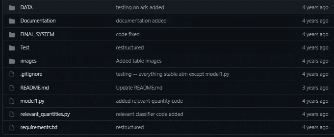
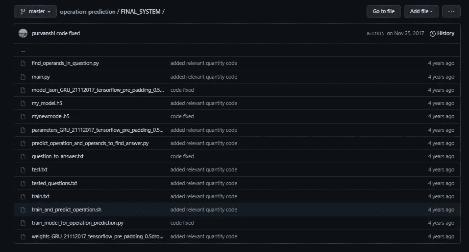
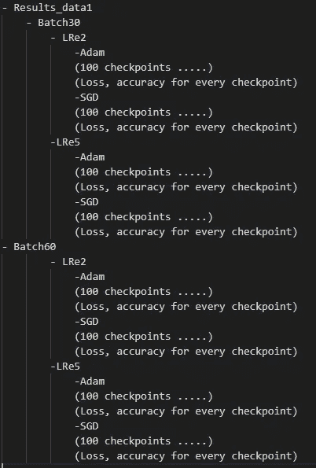
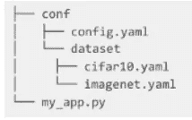

# 增强 ML 代码的实践——第 1 部分

> 原文：<https://towardsdatascience.com/practices-to-enhance-your-ml-code-part-1-e77d00db826d?source=collection_archive---------33----------------------->

## 停止编写蹩脚的 ML 代码

大约 4 年前，当我开始从事机器学习领域时，[这是我的第一个 ML 代码看起来的样子。我有一个文件用于预处理、训练、设置超参数和测试。](https://github.com/purvanshi/operation-prediction/blob/master/model1.py)



我 4 年前的代码结构

我的“主文件”名为 model1.py，为了版本控制，我有一个名为“FINAL_SYSTEM”的文件夹，我想里面有某个东西的最终代码！我现在甚至不记得了，老实说，我甚至不能阅读我自己的代码。在过去，ML dev 并不成熟，有很多缺陷，但今天情况并非如此。有许多成熟的开源库，每个人都可以使用它们来获得更好看和更有用的代码。



注意，这里我甚至没有谈论生产模型或者如何维护它们。我们整个 ML 管道可以分为两部分-

1.  管理您的数据
2.  模型代码- ML 代码包括从折叠到超参数调整以及保存和解释结果的所有内容

让我们一个接一个地看看所有这些。我将把这些分成几部分，以免信息过载！

## 数据版本控制

机器学习不仅是改变你对数据使用的模型类型，也是关于你如何处理你的数据。我们需要保持处理数据集的每一种可能的方式。记录我们所做的事情，特别是重现我们所做的事情，通常会变得非常困难。我开始使用[数据版本控制(DVC)](https://dvc.org/) 对我的数据进行 git 版本控制。它的主要目的是为有大量训练数据的项目维护 Git。您可以使用简单的命令将远程路径添加到您的数据中

```
**$** dvc remote add -d storage s3://mybucket/dvcstore
$ git add .dvc/config
$ git commit -m "Configure remote storage"
```

您还可以推送这个版本的数据，稍后再拉取，以便重现结果。

## 折叠

正确地将你的整个 ML 代码划分到不同的文件夹中有助于减少其他人的麻烦并增强可读性。这是一些更好地组织你的代码的技巧

1.  **缓存** -一个文件和文件夹缓存，用于保存生成的任何中间文件，这些文件可以被保存以便以后更快地处理。例如，如果预处理数据或要素位于本地，则加载预处理数据或要素。
2.  如果多个模型被用于基准测试，让每个模型在单独的文件中有自己的类对调试非常有帮助。在 pytorch 中，默认情况下你需要有一个类，在其中添加像推理或单元测试这样的功能会很有帮助
3.  Utils -通常一个特定的任务有一些通用的函数。假设你有一些被所有模型类使用的函数。拥有一个通用的 model_utils 类有助于减少冗余。对于特定的函数，可以有这样的独立实用程序，而不是一个全局实用程序文件。

## 超参数调谐

我的结果文件夹看起来是这样的



许多文件夹中有训练文件，其中有 100 个用于不同超参数循环的*。我的超参数调整经历了三个阶段-*

*   对几个超参数(重量衰减、时期、提前停止、动量、批量、学习率、工人等等)使用嵌套的 for 循环。这使得我的代码看起来很乱，如果你每次都不清空你的内存，进程会因为没有剩余内存而终止。
*   我转而通过命令行界面(cli)传递参数，但这有两个问题——我们不能指定超过 3 个参数，因为我们懒得查看文件中的参数名称，并在 CLI 上再次键入所有内容；其次，为了使用各种参数，您必须编写一个. sh 文件
*   我的第三个阶段涉及通过 bash 脚本遍历参数。这有两个主要问题——我每次都必须保存超参数设置的结果，现在我意识到这不是最佳实践。这也占用了不少内存。我也尝试过维护配置文件，但是从来没有发现它们非常方便。

我最喜欢的开发者之一[奥姆里·丫蛋](https://github.com/omry)开发了[九头蛇|九头蛇](https://hydra.cc/)。Hydra 允许您编写传递给应用程序的配置，从而消除了这些问题。可以通过配置文件或命令行进行组合，组合后的配置中的所有内容也可以通过命令行覆盖。

看一个非常[基本的例子，](https://github.com/omry/hydra-article-code/tree/master/basic)你需要做的就是创建一个 config.yaml 文件

```
dataset:  
        name: imagenet  
        path: /datasets/imagenet
```

我们的 my_app.py 文件看起来像

```
import hydra
from omegaconf import DictConfig @hydra.main(config_path="config.yaml")
def my_app(cfg: DictConfig) -> None:
    print(cfg.pretty())  
if __name__ == "__main__":    my_app()
```

程序打印它得到的配置对象。我们现在也可以从命令行覆盖配置文件。也可以为不同的功能创建多个 yaml 文件。



对于多次运行，hydra 具有*多次运行*功能，这有助于使用不同的配置多次运行您的函数。

这就像-

```
python my_app.py --multirun dataset=imagnet,cifar optimizer=adam,nesterov
```

## 结论

在这篇文章中，我们讨论了三个问题及其最新的解决方案——数据版本化、超参数调整和折叠。这些让我的编码生活变得更容易，也一定会让你的编码生活变得更容易。

第 2 部分可在此处找到- [增强您的 ML 代码的实践-第 2 部分|作者 Purvanshi Mehta | 2021 年 5 月| Medium](https://purvanshimehta.medium.com/practices-to-enhance-your-ml-code-part-2-e3c5eda48e8a)