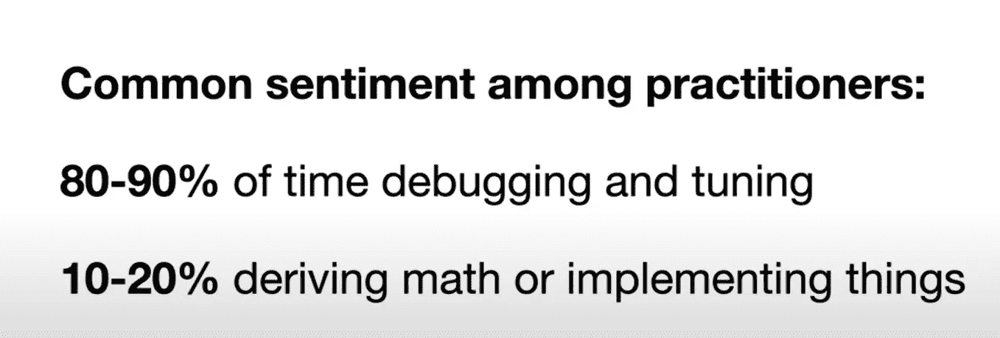
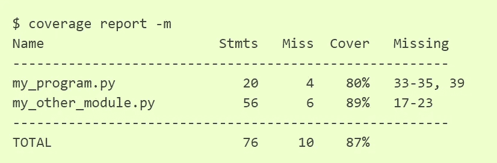

# 增强 ML 代码的实践——第 2 部分

> 原文：<https://towardsdatascience.com/practices-to-enhance-your-ml-code-part-2-e3c5eda48e8a?source=collection_archive---------28----------------------->

## 停止编写蹩脚的模型——单元测试|代码格式化

嘿，你在这里是因为你可能认为你的编码风格还有改进的空间。好的代码和管道不仅能帮助别人阅读你的代码，而且你自己也能在几天后理解你的代码。在这个系列的第一部分中，我写了我的 Keras 代码在 4 年前看起来是多么的*可怕。我还谈到了这些天我在使用什么技术使它变得可读:)，我谈到了数据版本化、文件夹和超参数调整。让我们直接进入更多的实践，这将使您的数据培训之旅更容易。*

# 单元测试



图片来自[全栈深度学习](https://fullstackdeeplearning.com/)

单元测试是软件工程中的一种常见做法，但大多数深度学习的研究代码仍然没有实现基本的单元测试。由于 ML 从业者 80–90%的时间都花在调试和调整参数上，所以在代码中进行基本的单元测试是不可避免的。这对于 ML 研究/生产代码尤其重要，这样可以很容易地为不同的数据集调整模型。这些是一些非常基本的单元测试，可以应用于任何 ML 管道-

1.  **数据点的形状/格式** -具有可变长度数据点的数据集需要在通过任何模型之前进行相等处理。如果使用非欧几里德 DL 模型，这尤其正确。例如，如果使用 transformer 模型，文本数据特别需要填充。具有检查输入形状是否等于第一层形状的功能是重要的开始步骤。
2.  **变量的变化**——这是最难发现的错误之一。我们的代码运行时没有错误，但是性能很差。你在你的整个代码中寻找可能出错的地方。一个最简单的事情是检查更新的模型值是否不同于先前的模型。我最初在这里读到了这个问题[，现在我在我的每个 ML 代码中使用这个代码片段。](https://thenerdstation.medium.com/how-to-unit-test-machine-learning-code-57cf6fd81765)

3.**过度拟合** -在一个非常小的列车组上运行整个管道，查看模型是否过度拟合，这有助于检查一切是否正常工作。如果模型没有在较小的数据集上过度拟合，那么很可能有一个错误，它也不会在整个数据上工作。

4.**目标和预测的形状** -目标和预测的形状和数据类型在传递到损失函数之前应该是相同的。

```
assert predictions.shape==target.shape
assert type(predictions)==type(target)
```

## 单元测试库

有许多用于单元测试的 python 库。最常见的是[单元测试](https://docs.python.org/3/library/unittest.html)。还有 [pytest](https://docs.pytest.org/en/6.2.x/getting-started.html) 和 [nose](https://www.lambdatest.com/blog/selenium-python-nose-tutorial/#:~:text=Nose%20is%20a%20popular%20test%20automation%20framework%20in,auto%20discovery%20of%20test%20cases%20and%20documentation%20collection.) 。我个人更喜欢 unittest。但是在选择其中一个之前，你必须先尝试一下。你可以在这里看一个单元测试[的快速例子。我不会再重复了，因为你可以找到几十个博客来开始。](https://data-flair.training/blogs/python-unittest/)

## 新闻报道

[覆盖率](https://coverage.readthedocs.io/en/coverage-5.5/)是一个 python 库，用来测试你的代码有多少百分比被单元测试覆盖。它使用起来非常简单

```
$ coverage run -m unittest discover
```

我们现在可以看到一个类似这样的报道



总的来说，我们可以看到 87%的代码被覆盖。然后，您可以检查缺失的行，并在必要时添加单元测试。

## Git 挂钩

现在我们已经为我们的代码编写了单元测试，并且准备好提交了。我们可以使用 git hooks 来代替每次手动运行单元测试，git hooks 会在每次自动提交时运行测试。

当某些重要的动作通过钩子发生时，Git 有办法触发定制脚本。默认文件在。git/hooks 文件，你可以添加任何你想被提示的动作。有许多类型的钩子，但是对于我们的应用程序，我们需要*预提交*钩子。你可以在这里找到一个例子[。](https://github.com/git/git/blob/master/templates/hooks--pre-commit.sample)

# 代码格式

我通常用黑色的[来格式化我的代码。好的一面是一个项目和所有项目的一致性。如果样式在任何地方都是一样的，那么对于直接研究你的作品的人来说，阅读和继续你的作品会变得非常容易。](https://github.com/psf/black)

您可以使用-来检查您的格式和 black 的格式之间的差异

```
$ black --diff --check train.py test_audionet.py
```

如果你喜欢这些变化，你可以应用它们

```
$ black train.py test_audionet.py
```

# 结论

在这篇文章中，我们讨论了为 ML 模型和代码格式编写单元测试。您也可以[阅读该系列的第一部分](/practices-to-enhance-your-ml-code-part-1-e77d00db826d)，其中包括超参数调整、折叠和数据版本化。