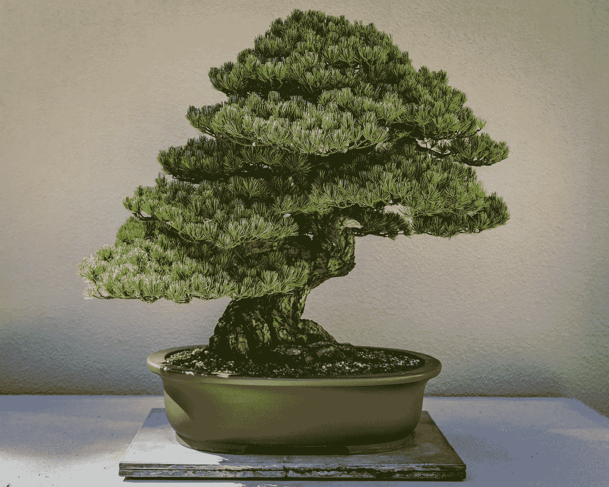
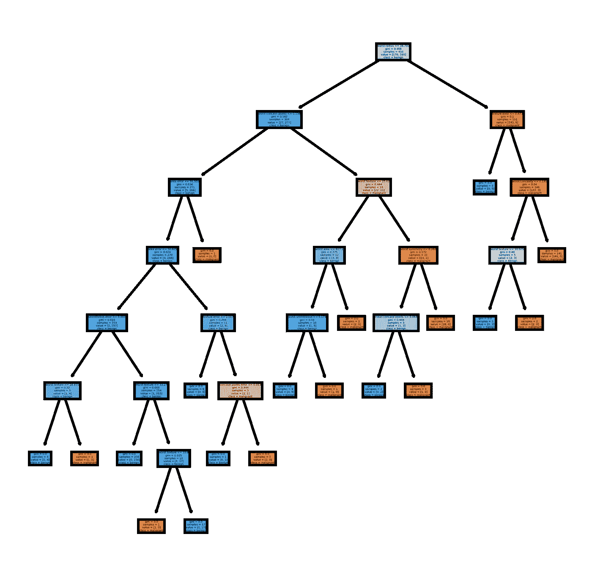
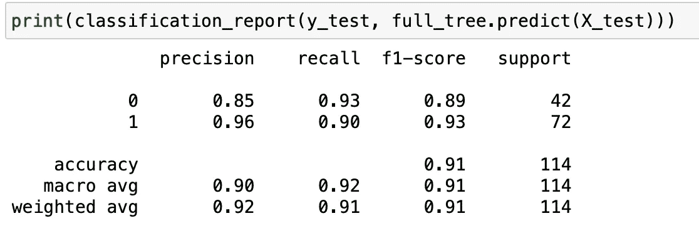
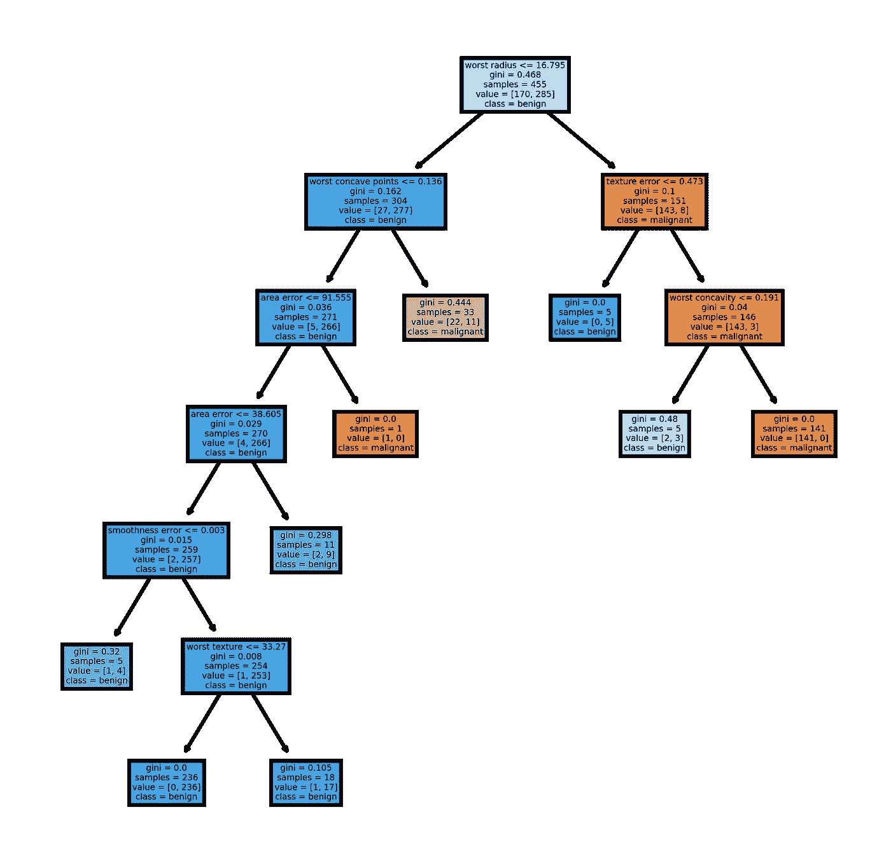
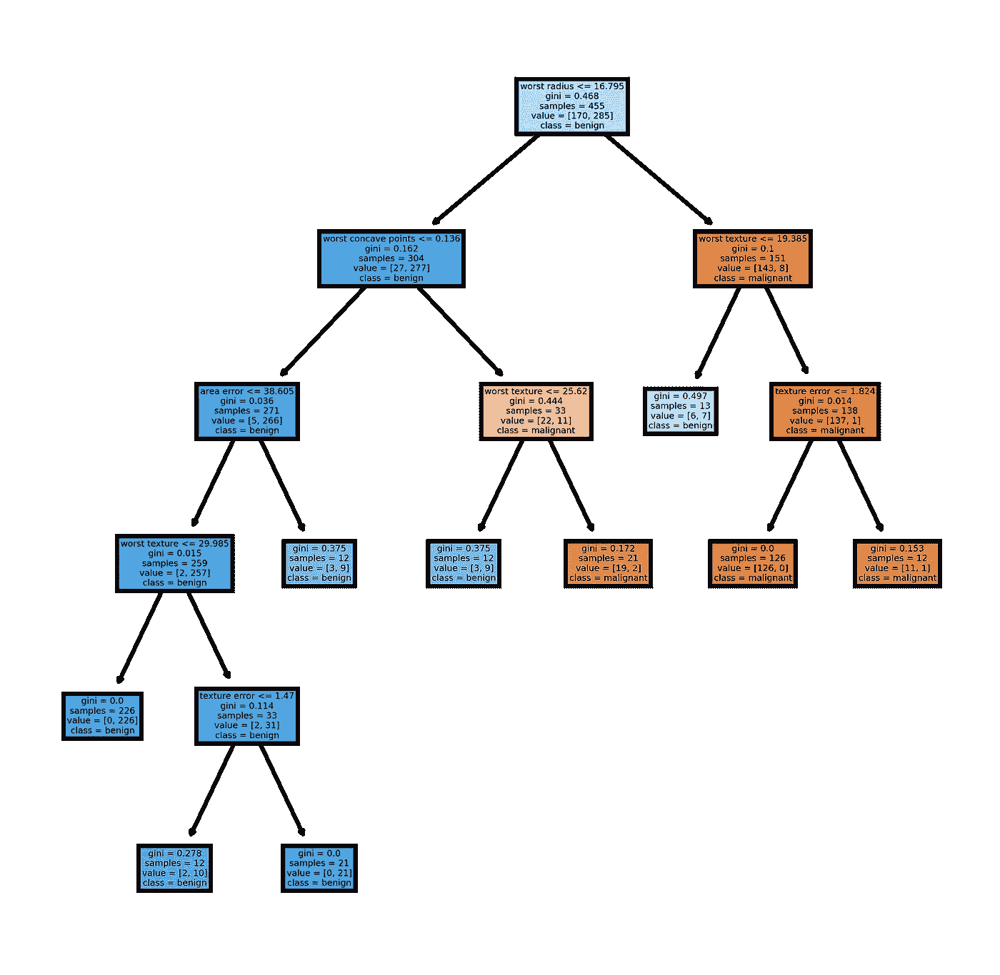

# 预修剪或后修剪

> 原文：<https://towardsdatascience.com/pre-pruning-or-post-pruning-1dbc8be5cb14?source=collection_archive---------10----------------------->

## 了解如何以及何时在 Python 中预先修剪决策树

爱德华·克鲁格

[Devin H](https://unsplash.com/@devin_photography?utm_source=unsplash&utm_medium=referral&utm_content=creditCopyText) 在 [Unsplash](https://unsplash.com/s/photos/bonsai?utm_source=unsplash&utm_medium=referral&utm_content=creditCopyText) 上的照片

在上一篇文章中，我们讨论了后期修剪决策树。在本文中，我们将重点关注预修剪决策树。

让我们简单回顾一下我们修剪决策树的动机，后修剪工作的方式和原因，以及它的优点和缺点。如果你想了解更多细节，请查看这篇文章。

决策树是使用 CART 算法生成的。CART 代表“分类和回归树”不幸的是，知道缩写代表什么并不能帮助我们理解任何事情，但继续阅读，我们会涵盖它。或者，如果你想了解更多细节，可以看看我的文章:

</learn-how-decision-trees-are-grown-22bc3d22fb51> [## 了解决策树是如何生长的

towardsdatascience.com](/learn-how-decision-trees-are-grown-22bc3d22fb51) 

本质上，该算法沿着特征检查分区，以找到根据度量优化分数的分区。然后，该算法递归地应用于分割的每一侧。当不再有可以提高分数的分割时，算法终止。由于这个原因，树有时被称为递归划分。

对于回归，MSE 是最常见的选择指标，也是 SciKit-Learn 的默认指标。对于分类问题，基尼和熵是最常见的度量。虽然它们的理论表述不同，但在实践中似乎没有什么区别。SciKit-Learn 中的分类树可以使用这两个指标，缺省值为 Gini。

为了避免过度拟合，我们可以应用提前停止规则。本文就是关于这些规则的——预修剪只是提前停止的一个花哨术语。避免过度拟合的另一个选择是应用后修剪(有时简称为修剪)。也可以同时应用这两种方法——有时，这将是加速后期修剪过程的一个很好的方法。

后期修剪考虑整个树的子树，并使用交叉验证的度量来对每个子树进行评分。为了澄清，我们使用子树来表示与原始树有相同根但没有一些分支的树。

对于回归树，我们通常使用 MSE 进行修剪。对于分类树，我们通常使用误分类率进行修剪。误分类率与二元分类问题的准确度成比例，并且选择相同的最佳子树。

实际上，有必要避免考虑每一个子树，因为二叉树的子树数量很少——在渐近上比多项式时间更差。因此，剪枝算法使用一种技巧来选择包含原始树根的所有子树集合的子序列(称为成本复杂度路径)。

即使进行了这种优化，随着要素和观测值数量的增加，后期修剪也会非常缓慢。幸运的是，我们可以并行地交叉验证子树，但是在某一点上，后期修剪增加的时间令人沮丧。

另一方面，后修剪往往比预修剪/提前停止更有效。预剪枝的问题在于它是贪婪的:早期停止规则可能会使算法避开一个分区，即使后续分区可能非常有价值。早期停止比后期修剪更快，但是值得一提的是，早期停止并没有看起来那么快。使用早期停止规则生成树花费的时间更少，但是我们仍然需要执行网格搜索来确定早期停止规则的最佳阈值。

在 SciKitLearn 中，我们可以使用一些超参数来控制早期停止。在本文中，我们将重点讨论两个问题。

*   `min_samples_split`
*   `min_samples_leaf`

我们将使用来自 SciKit-Learn 的乳腺癌数据集进行演示。数据集包含 30 个连续要素。目标是肿瘤是否是恶性的。欲了解更多信息，请访问 SciKit-Learn 文档[此处](https://scikit-learn.org/stable/modules/generated/sklearn.datasets.load_breast_cancer.htm)。

在我们开始预修剪之前，让我们先看看完整的树以及它是如何工作的。

## 完整的树

用 SciKit-Learn 训练决策树

这里，我们用默认参数来拟合决策树，只是我们设置了`random_state`。我们设置了一个随机状态，因为当多个分裂一样好时，算法会随机打破平局。通过设置状态，我们将确保在预修剪时使用同一棵树的子树。

让我们看看完整的树。

用 SciKit-Learn 绘制决策树

完整的决策树是使用上面的代码绘制的

请注意，完整的树是相当复杂的，有 18 个不同的分裂！

让我们看一下整个树的指标。

完整树的度量

它达到了 91%的准确率。对于恶性类，准确率和召回率分别为 96%和 90%。这建立了我们的基线。

## 分裂树的最佳最小样本

在这里，我们将研究如何设置一个阈值，如果一个节点上的观察值小于该阈值，那么该阈值将停止树在该节点上的生长。如果在划分之后，观察值的数量小于阈值，递归在树的这一侧停止。在 SciKit-Learn 中，我们可以用`min_sample_split`超参数来控制这种行为。它可以采用`int`或浮点值。当我们通过一个`int`时，如果一个节点的观测值少于指定的数目，那么该算法不会考虑该节点之后的进一步分裂。当我们通过一个`float`时，当一个节点的观测值少于数据集的指定比例时，递归停止。将超参数指定为浮点型更容易且更可重用，因为我们不必为更大或更小的数据集修改值的范围。

用于寻找最佳最小样本分裂树的代码

在我们的网格搜索中，我们严格地在 0 和 1 之间寻找阈值。阈值为 0 不会有任何影响，而阈值高于 1 会导致树没有分割。当生成要检查的阈值范围时，我们从略大于 0 的数字`EPS`开始，在 1 之前结束。

寻找 min_samples_split 超参数的最佳值

网格搜索发现超参数`min_samples_split`的最佳选择约为 0.075，这意味着如果节点小于数据集的 7.5%，则不允许进一步分裂。

让我们画出这棵树。

要准备绘图和评估，请从网格搜索中提取树

绘制最佳最小样本分裂树

使用上面的代码绘制了最佳最小样本分裂树

与完整的树相比，在这个数据集上，这个树更简单，只有 8 个分裂。

现在，让我们来看看指标。

最佳最小样本分裂树的分类报告

不幸的是，在这种情况下，这种预先修剪的方法不如完整的树准确，准确率为 89%。恶性类的召回率和准确率也略有下降。幸运的是，我们有另一种方法可以尝试。

## 叶树上的最佳最小样本

让我们看看，当一片叶子上的样本数低于某个阈值时，我们试图通过停止递归来限制一棵树，会得到什么结果。SciKit-Learns 用超参数`min_samples_leaf`实现了这一点。它可以接受一个`int`或一个`float`的值。当我们传递一个 int 时，当一个 split 创建的叶子少于这个数目的观察值时，算法停止。当我们通过一个`float`时，当一个分裂将导致一个叶子上的观察值下降到数据集的那个比例以下时，递归停止。一般来说，我们发现通过一个`float`更容易，因为它是一个比例；对于不同大小的数据集，我们不需要改变网格搜索的范围。

寻找最佳最小样本叶树的代码

为了对参数`min_samples_leaf`的不同值进行网格搜索，我们使用`np.arange`设置了一个严格介于 0 和. 5 之间的网格值。要求每个叶子上至少有 0%的数据集，不会约束算法，并且会导致 SciKit-Learn 的边缘情况。因此，我们从`EPS`开始网格，我们将其设置为略高于 0。如果我们要求超过 50%的数据集位于每片叶子上，那么进行任何分割都会违反规则:如果超过 50%的数据集位于分割的两片叶子上，那么超过 100%的数据集必须位于两片叶子之间。

寻找 min_samples_leaf 超参数的最佳值

网格搜索发现参数`min_samples_leaf`的最佳值大约是. 025，这意味着每个叶子需要至少有 2.5%的数据集。

让我们画出这棵树。

要准备绘图和评估，请从网格搜索中提取树

绘制最佳最小样本叶树

使用上面的代码绘制了最佳最小样本叶树

最佳最小叶子样本树比只有 8 个分裂的完整树简单得多。

让我们来看看指标。

最佳最小样本叶树分类报告

我们现在有一个更好的 95%的训练准确率。这棵树也在不损失精确度的情况下击败了基线的召回。对于这个数据集，该方法甚至执行后剪枝！请看这篇文章来比较这些方法:

</build-better-decision-trees-with-pruning-8f467e73b107>  

## 结论

在本文中，我们介绍了一些预修剪的方法，如何在 SciKit-Learn 中实现它们，并比较了预修剪和后修剪。概括地说，让我们来看看不同之处。

**预剪枝和后剪枝的优点:**

*   通过限制树的复杂性，修剪创建了更简单更易理解的树。
*   通过限制树的复杂性，修剪减少了过度拟合。
*   由于修剪选择了最佳的交叉验证子树，所以被修剪的树倾向于很好地适合数据。

**预修剪和后修剪的缺点:**

*   与原始决策树相比，没有缺点—如果修剪没有帮助，交叉验证的网格搜索可以选择原始树。
*   与诸如随机森林和 AdaBoost 之类的集成树模型相比，修剪后的树往往得不到同样的分数。

**预修剪的优点**

*   与后期修剪相比，前期修剪速度更快。这在较大(更多要素或更多数据)的数据集上尤其重要，因为后期修剪必须评估非常大的树子集。
*   预修剪有时可以获得与后修剪相似甚至更好的结果。

**后期修剪的优势**

*   后修剪通常产生比预修剪更好的树，因为预修剪是贪婪的，并且可能忽略具有后续重要分裂的分裂。

要了解更多关于决策树是如何生长的，请查看这篇文章:

</learn-how-decision-trees-are-grown-22bc3d22fb51> [## 了解决策树是如何生长的

towardsdatascience.com](/learn-how-decision-trees-are-grown-22bc3d22fb51) 

如果您对决策树的概述以及如何手工拟合决策树的演示感兴趣，请查看 Arif R 撰写的这篇文章:

<https://medium.datadriveninvestor.com/the-basics-of-decision-trees-e5837cc2aba7> 