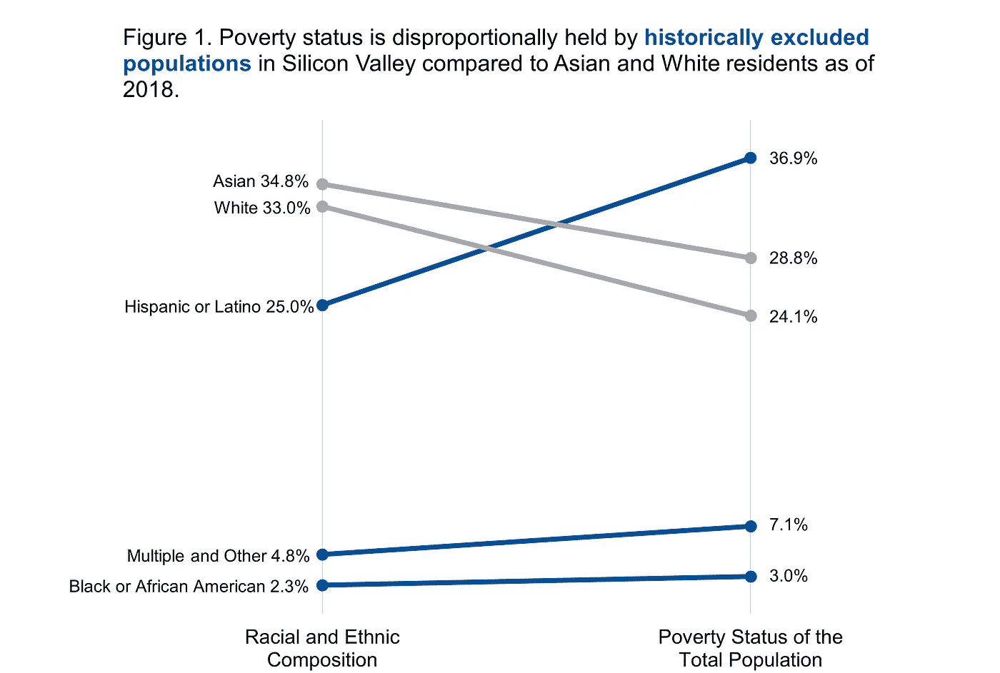

# 改变数据管理的权力动态

> 原文：<https://towardsdatascience.com/precautions-in-using-tech-for-public-health-part-iii-shifting-the-power-dynamics-of-data-987b027c3ede?source=collection_archive---------48----------------------->

## [**公共卫生技术使用注意事项**](https://towardsdatascience.com/tagged/tech-for-public-health) | **第三部分**

我们使用各种免费的服务，但它们真的是免费的吗？例如，你不需要每次想进行谷歌搜索时都输入你的信用卡信息，你也不需要每月支付费用在脸书上发帖。然而，你为这种“免费服务”付出的代价是公司收集你的信息，然后卖给有兴趣的人。你的信息的另一个术语是“数据体”，正如我们的数据体在[数字防御行动手册](https://www.odbproject.org/tools/)中所定义的。

*数据体:我们整个自我的离散部分，它们被收集、存储在数据库、云以及其他数字化网络流空间中，并用于对我们做出决策或决定。它们是我们与我们的社区和机构的关系的体现，包括特权、压迫和统治的机构*。

该资源还包括一系列主题，这些主题基于对社区成员的采访，内容涉及他们如何理解自己的数据体，以及数据收集和数据驱动系统如何被武器化，从而对他们的生活产生负面影响。一个主题是“数据是一种权力关系。数据收集往往削弱该机构，并限制目标个人和社区的自决权。”

当谈到数据控制时，我们指的是[管理权，而不是所有权](https://www.brookings.edu/blog/techtank/2018/11/19/who-should-profit-from-the-sale-of-patient-data/)。数据的管理意味着按照一套规则行事，维护访问数据的所有各方的利益。数据所有权将允许出现混乱的情况，比如让病人能够改变他们的医疗数据。在本帖中，我们将讨论数据管理的权力动态。

**大型科技公司找到了获取大量数据并从中获利的方法**

谷歌是几家声称在医疗科技领域拥有股份并获得人们数据的大型科技公司之一。正如我们在[第一篇博文](/precautions-in-using-tech-for-public-health-part-i-technology-is-not-neutral-ff533acbf7e?sk=dec7e30c0f68fb3961b85b574584802f)中提到的，谷歌在 2019 年收购了 Fitbit。这次收购是里根政府时期反托拉斯法的倒退，允许[纵向兼并](https://www.investopedia.com/articles/stocks/09/merger-acquisitions-types.asp)，并产生了这些新形式的垄断。建立垄断是赋予这些公司难以控制的数据访问权限的众多因素之一。

除了薄弱的反垄断法，美国法律中还有一些漏洞，让医疗科技公司可以自由获取和利用敏感的个人健康数据。健康保险便携性和责任法案(HIPAA) 的[隐私规则允许医疗保健提供者在未经患者同意的情况下将个人健康数据共享给业务伙伴，用于执行操作等目的。像](https://www.hhs.gov/hipaa/for-professionals/privacy/guidance/business-associates/index.html)[谷歌](https://www.wired.com/story/google-is-slurping-up-health-dataand-it-looks-totally-legal/)这样的公司可以作为商业伙伴，然后能够访问这些数据。如果去识别，公司可以使用这些数据开发产品，如机器学习模型，随后可以商业化。此外，基因数据在 HIPAA 下[没有得到完全保护](https://www.eff.org/issues/genetic-information-privacy)。出售实验室开发的测试的公司，如 23andMe 及其直接面向消费者(DTC)的基因测试，通常不在美国美国食品药品监督管理局(FDA)的管辖范围内。这些公司将[为“健康”、“生活方式”和/或低风险医疗目的营销其产品](https://www.statnews.com/2019/04/02/address-challenges-direct-to-consumer-health-products/)，以规避 [FDA 医疗器械批准程序](https://www.fda.gov/medical-devices/vitro-diagnostics/direct-consumer-tests)。因此，这些健康技术公司不仅从这些测试的销售中获利，还将客户数据出售给相关方，如制药公司。值得注意的是，FDA 正在更新其针对作为医疗设备的软件的[监管框架](https://www.fda.gov/medical-devices/software-medical-device-samd/artificial-intelligence-and-machine-learning-software-medical-device#regulation)，以包括基于人工智能/机器学习(AI/ML)的软件。

2018 年，制药公司葛兰素史克(GSK) [向 23andMe 投资 3 亿美元](https://www.gsk.com/en-gb/media/press-releases/gsk-and-23andme-sign-agreement-to-leverage-genetic-insights-for-the-development-of-novel-medicines/)；2020 年，23andMe 宣布与葛兰素史克(GSK)合作进行一项联合[临床试验，以开发癌症疗法](https://blog.23andme.com/news/23andme-and-gsk-clinical-trial/)。这种合作关系让葛兰素史克获得了 23andMe 客户的基因信息，这些客户同意分享他们的数据用于研究。除了这些基因检测产品的历史[欧洲中心](https://www.statnews.com/2020/06/10/23andme-ancestry-racial-inequity-genetics/)可能引起的偏见问题，当 23andMe 的 [12，000，000 名客户](https://mediacenter.23andme.com/company/about-us/)中的[80%](https://research.23andme.com/research-innovation-collaborations/)同意分享他们的数据用于研究时，这种合作关系肯定有可能让 GSK 获得高额投资回报。虽然这种合作关系可能会带来[有前途的药物和治疗方法](https://www.wired.com/story/23andme-glaxosmithkline-pharma-deal/)，但 23andMe 客户[放弃对使用他们自己的数据进行的这项研究产生的任何利润](https://www.23andme.com/about/tos/)的所有权利主张。

**保护数据体，尊重人**

当人们成为自己数据的管理者时，他们最好能够利用自己的数据为自己谋利。 [LunaDNA](https://www.lunadna.com/) 是一个为人们提供分享数据平台的组织，这些数据在分享之前会被去识别和加密；研究人员付费获取数据，数据股东从研究中获得收益。如果不是为了钱，那么人们应该能够使用他们自己的数据来告知他们自己对自己健康的理解。 [OpenHumans](https://www.openhumans.org/) 是另一个通过为数据共享、数据分析和学习科学方法提供工具和资源来支持自我研究的组织。这些组织是在使用技术时以人为本的典范。

虽然这些公司正在努力将数据管理的权力转移回数据生产者，但重要的是要定义与这些健康数据相关的“价值”以及从这些数据中获利的限制。对于像谷歌和 23andMe 这样的公司来说，数据的价值不在于个人；更确切地说，价值在于聚集并准备好用于分析的许多个人的干净数据。这些大型科技公司有可能通过上述策略或提供“免费服务”，以难以置信的利润规模收集大量数据。

另一个担心是，隐私在这种交换中丢失，这可能导致个人数据的武器化。尽管面临来自 DTC 基因检测公司的阻力，执法部门可以利用[法院命令](https://techcrunch.com/2020/02/04/ancestry-warrant-dna-records/)从这些公司获取个人信息。这增加了[将无辜者误认为嫌疑犯的风险](https://www.wired.com/2015/10/familial-dna-evidence-turns-innocent-people-into-crime-suspects/)，尤其是当这些测试可能[不准确的时候](https://www.theverge.com/2018/6/6/17435166/myheritage-dna-breach-genetic-privacy-bioethics)。除了这些担忧之外，数据泄露的威胁始终存在。基因数据泄露值得每个人关注，因为与电子邮件密码不同，一个人自己的基因数据是不可改变的。访问您的数据可能会决定您对资源的访问，如健康保险。在美国联邦政府层面，如果你的数据被用来对付你，目前有[有限的法律保护](https://www.vox.com/recode/2019/12/13/20978024/genetic-testing-dna-consequences-23andme-ancestry)。

如果分享你的个人数据并没有让你赚很多钱，而隐私是出售你的数据的另一个代价，我们期待萨菲亚·诺布尔博士的案例让[大科技支付赔款](https://www.noemamag.com/the-loss-of-public-goods-to-big-tech/)。诺布尔博士阐述了大型科技公司如何吸收公共资源，同时回避社会和经济责任，例如纳税以支持公共基础设施。拒绝纳税加剧了日益扩大的种族财富差距，这不成比例地影响了[硅谷](https://jointventure.org/publications/silicon-valley-index)历史上被排斥的居民群体(图 1)。系统性的种族主义加剧了种族财富差距，表现为社会和经济不平等，并进一步加剧了[种族健康差异](https://www.kff.org/policy-watch/health-disparities-symptom-broader-social-economic-inequities/)。考虑到在新冠肺炎疫情期间，你的数据可能对大科技的[过高利润](https://www.wsj.com/articles/amazon-sales-surge-amid-pandemic-driven-online-shopping-11604003107)有所贡献，赔款似乎是再合适不过了。

资料来源:地区研究所的硅谷指标。注:多个和其他仅包括一些其他种族，两个或更多种族，以及美国印第安人和阿拉斯加土著人(仅圣克拉拉县)。白人是非西班牙裔或拉丁裔。

我们不能依赖私营部门将隐私保护置于利润之上，并改变数据管理的权力动态。有必要恢复并制定法规来遏制这种垄断行为和对数据的剥削性使用。利用个人数据的公司必须对其行为负责，因为它们获取的数据会影响个人生活的许多不同方面:这些公司不仅直接影响个人的健康，还会间接影响他们所居住社区的贫困水平和种族财富差距。在下一篇博客中，我们将讨论监管大型科技公司的前景，让我们不再是产品。

[1]t .刘易斯，S. P .冈加达兰，萨巴，m .佩蒂，T. 2018。数字防御剧本:回收数据的社区动力工具。底特律:我们的数据体。

[2] Teachout，Z. 2020。*拆散他们*。圣马丁出版集团:所有要点书籍。

我们感谢加州大学圣地亚哥分校 [ReCODE Health](https://recode.health/) 的[Camille nebe ker](https://ethics.ucsd.edu/about/staff/nebeker.html)博士和[美国病理研究学会](https://medium.com/@chhavich)[的](https://www.asip.org/)ch havi Chauhan博士对本博客的建议和反馈。

*本文是“将科技用于公共卫生的注意事项”系列的第三篇——查看该系列的第一篇*</precautions-in-using-tech-for-public-health-part-i-technology-is-not-neutral-ff533acbf7e>**、* [*、第二篇*](/precautions-in-using-tech-for-public-health-part-ii-factoring-climate-change-as-an-output-of-265c6afa0e1a) *和第四篇*</landscape-for-regulating-big-tech-438c06411801>**。***

***本博客系列由*[*Priya Govil*](https://medium.com/@priya.govil)*合著。韩瑜和普里亚·戈维尔是健康研究院的工作人员。本博客系列中反映的观点是作者的观点，不一定代表 AcademyHealth 的官方立场。***