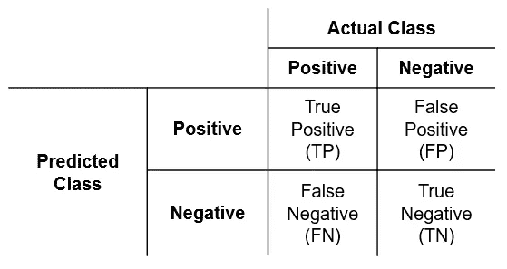
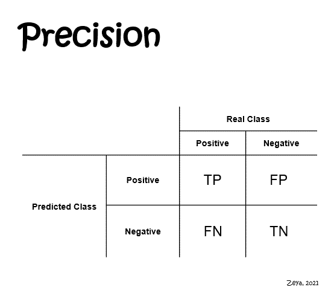
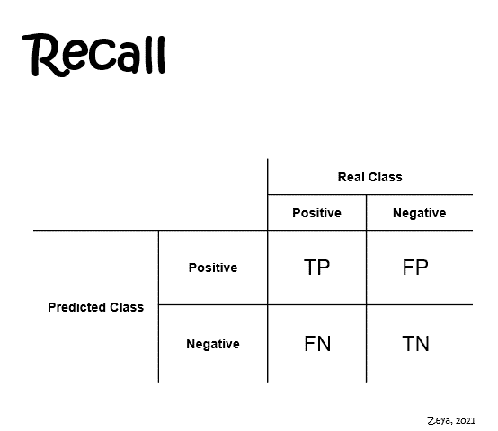
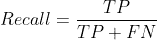
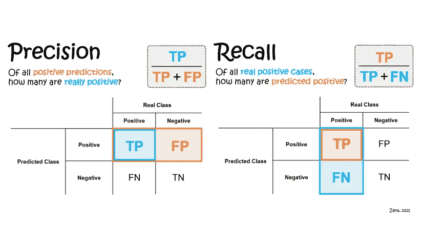

# 精确度和召回变得简单

> 原文：<https://towardsdatascience.com/precision-and-recall-made-simple-afb5e098970f?source=collection_archive---------5----------------------->

## 通过简单的例子、一步一步的解释和动画 gif，使精确度和召回容易理解

János Venczák 在 [Unsplash](https://unsplash.com?utm_source=medium&utm_medium=referral) 上拍摄的照片

# 目录

1.  [简介](#3ccc)
2.  [精确和召回背后的动机](#8130)
3.  [什么是精准和召回？](#87ae)
4.  [如何不迷茫？](#7891)
5.  [为什么精确度和召回率高于准确度？](#4bd9)
6.  [什么时候用精度和召回？](#0036)
7.  [相关资源](#a656)
8.  [结论](#3193)

# 1.介绍

在我之前的[帖子](https://medium.com/mlearning-ai/evaluating-classification-models-why-accuracy-is-not-enough-abf3d9c93a69?source=friends_link&sk=c72c3d9ccb63549d861801ce772b3cc2)中，我写了关于准确性作为二进制分类模型的评估标准。我使用癌症预测示例来说明准确性不足以评估模型在预测**少数类别**(即**感兴趣类别**或**阳性类别**)时的表现，尤其是在类别不平衡的数据集。原因是精度没有区分少数类和多数类(即**否定类**)。

在这篇文章中，我将分享 **precision** 和 **recall** 如何减轻这种准确性限制，并帮助揭示二进制分类模型的预测性能。我将使用一个简单的例子、一步一步的解释和动画 gif(附:我是一个简化事物的信徒)来浏览这些概念，甚至分享一个关于如何不混淆这两者的提示。你准备好了吗？让我们开始吧！

# 2.精确和回忆背后的动机

让我们从理解为什么精确和召回是重要的开始。我们用混淆矩阵来做这个。通常，二元分类的混淆矩阵将模型预测总结为四种不同的结果，如图 1 所示。

图 1:二元分类的混淆矩阵(图片由作者提供)

在我的[上一篇文章](https://medium.com/mlearning-ai/evaluating-classification-models-why-accuracy-is-not-enough-abf3d9c93a69?source=friends_link&sk=c72c3d9ccb63549d861801ce772b3cc2)中的癌症预测示例的背景下，这些结果描述了以下四种情况(见图 2):

图 2:癌症预测的混淆矩阵(图片由作者提供)

*   **场景#1** :模型预测癌症患者的癌症(真阳性)
*   **场景#2** :该模型预测一个没有癌症的患者患有癌症(假阳性)
*   **场景#3** :模型预测患有癌症的患者没有癌症(假阴性)
*   **场景#4** :模型预测没有癌症的患者没有癌症(真阴性)

其中，场景#1 和#4 是理想的，但是场景#2 和#3 是错误的预测，并且具有不期望的结果。原因如下:

*   场景#2 代表**误报(FPs)** 。这意味着，在 900 名真正没有患癌症的患者中，模型显示其中 80 人患有癌症。在现实生活中，这 80 名患者可能会接受昂贵和不必要的治疗，以牺牲他们的福祉为代价。
*   场景#3 代表**假阴性**。这意味着 100 名真正患有癌症的患者中，模型显示其中 20 人没有。这种情况的后果可能会更糟，因为这 20 名患者将无法确诊，也无法接受适当的治疗。

可以想象，这两个场景有着非常不同但却非常重要的后果。这不仅用于预测癌症，还可用于许多其他应用。尽管我们希望所有的模型预测都落在场景#1 和#4 中，但是我们知道在现实世界中没有模型是完美的。几乎可以肯定的是，模型预测最终会有 FPs 和 fn。目标是确保 ***尽可能少的 FPs 和 fn***，评估的方法是使用**精度**和**召回**。

# 2.什么是精度和召回率？

解释了为什么精度和召回是重要的，让我们正式介绍他们。精度和召回率本身并不是很难掌握的概念*，但是很容易迷失在 TP、FP、TN 和 FN 的术语以及它们的数学公式中。我制作了动画 gif 来帮助你更好地理解精确度和召回率是如何计算的。*

**

*图 3:计算精度(作者提供的 GIF)*

**

*图 4:计算召回(作者 GIF)*

*如果我们把概念和例子联系起来，总是更容易理解它们。所以，让我们用癌症预测的例子来做。*

*   ***精确**是关于问这样一个问题，“*所有被预测患有癌症的患者中，有多少真的患有癌症？*“在我们的例子中，160 名患者被模型预测患有癌症，但其中只有 80 人真的患有癌症。因此精度为 0.5。*
*   ***回忆**是关于问这样一个问题，“*在所有真正患有癌症的患者中，有多少人被预测患有癌症？*“在我们的例子中，有 100 名患者真的得了癌症。其中，模型正确预测了 80。因此召回率为 0.8。*

*我在上面提到过，精度和召回允许我们评估由 FPs 和 FNs 造成的错误的程度。让我解释一下。形式上，精度和召回率由下式给出:*

****

*注意 FP 和 FN 是如何分别出现在精度和召回率的分母中的。这意味着:*

*   *FPs 越少，精度越高；和*
*   *fn 越少，召回率越高。*

*这也意味着，如果根本没有 FNs 和 FPs，即模型做出完美的预测，则精度和召回率都将是 1。现实中，这是很难实现的。在精确度和召回率之间也有一个权衡——增加精确度会导致召回率降低，反之亦然。实际上，精确度和召回率越接近 1，模型的性能就越好。*

# *4.如何不迷茫？*

*精度和召回很容易混淆，因为它们太相似了。我已经无数次把它们弄混了，每次都得用谷歌搜索才能知道哪个是哪个……直到我想到一个简单的窍门。以下是帮助你更好地记住它们的窍门:*

*Precision 以字母“P”开头，所以我们把它和 ***预测*** 这个词联系起来。另一方面，recall 是以字母“R”开头的，所以我们把它与单词 ***联系起来，真的是*** 。*

*   *当你想到精度的时候，想想“R”之前的“P”(即 ***预测*** 之前的 ***真的*** )，像这样:*

> *“在所有 ***预测*** 为阳性的病例中， ***真的是*** 阳性的有多少？”*

*   *反之，为了回忆，想想“P”前面的“R”(即 ***真的*** 在 ***预测的*** 之前):*

> *在所有 ***真的*** 阳性的病例中， ***预测*** 为阳性的有多少*

*我意识到试图记忆精确和回忆的数学公式是没有帮助的。当然，如果对你有用，就去做吧。否则，你很可能会把 TP，FP，FN 和 TN 弄混，就像我一直做的那样。想想我分享的这个技巧，然后在你的脑海中想象如何获得精确度和召回率(见图 3 和图 4 中的动画 gif)。最好理解它们是如何产生的，然后简单地记忆:)*

# *5.为什么精确度和召回率高于准确度？*

## *(1)评估预测误差的程度*

*如上所述，精度和召回允许我们评估由 FPs 和 FNs 造成的错误程度。考虑到这两种类型的错误会产生非常不同的影响，使用单独的指标来评估每种错误的程度是有意义的。在这方面不能使用精确度，因为它隐含地假设两种类型的误差同等重要，而我们知道事实并非如此。*

## *(2)评估少数类的预测性能*

*我们在我的前一篇文章中确定，精确度不足以评估一个模型在预测少数类中的表现，因为它没有将它与多数类区分开来。然而，精确和回忆却恰恰相反。他们关注于**正确预测的正类**(注意两个公式的分子都是“TP”)。相反，他们真的不关心**正确预测的负类**(“TN”在两个公式中都根本没有出现)。*

# *6.什么时候使用精确和召回？*

*那么，你应该*总是*使用精度和召回吗？要考虑的一些简单的事情是:*

1.  *是二元分类问题吗？*
2.  *你的训练数据集在不同的班级中不平衡吗？*
3.  *在您的训练数据集中是否有特定的感兴趣的类别(即少数族裔类别)？*

*如果以上问题的答案是“是”，那么马上知道你应该抛弃准确性，使用精确和/或回忆。当然，现实中可能还有其他因素需要考虑，但就目前而言，这将是一个很好的起点。*

# *7.相关资源*

*我要感谢 Boaz shmu Eli[写的这篇精彩的文章，当我第一次开始学习分类指标时，它给了我很大的帮助。我强烈推荐它:](https://medium.com/u/57ee515c83c5?source=post_page-----afb5e098970f--------------------------------)*

*</multi-class-metrics-made-simple-part-i-precision-and-recall-9250280bddc2>  

我发现其他有用的资源有:

1.  [模型评测一:精度和召回](https://medium.com/towards-data-science/model-evaluation-i-precision-and-recall-166ddb257c7b)作者 [Tejumade Afonja](https://medium.com/u/44e0f445aa49?source=post_page-----afb5e098970f--------------------------------)
2.  [精确与回忆——每个机器学习者的直观指南](https://medium.com/analytics-vidhya/precision-vs-recall-an-intuitive-guide-for-every-machine-learning-person-796a6caa3842)作者 [Purva Huilgol](https://medium.com/u/457f7ae0ea51?source=post_page-----afb5e098970f--------------------------------)

# 8.结论

感谢你远道而来！我希望你已经从这篇文章中受益，并且对精确度和召回率有了更好的理解——这是评估分类模型的两个非常重要的指标。请随意保存下面的备忘单，以供将来参考。

图 5:精确度和召回备忘单

还有很多关于精度和召回的内容我还没有在这篇文章中介绍。您应该使用哪个——precision*还是* recall？哪个更好？如何使用*精度和召回来选择模型？多类分类问题怎么办？在我随后的文章中，我希望超越基础来回答这些问题。在我的下一篇文章中再见！** 

*我喜欢将数据科学的概念分解成简单的小块，并给出清晰直观的解释。毕竟，这是我发现自己最有效的学习方式。通过分享我如何简化概念，我希望帮助人们降低学习数据科学的门槛。如果你觉得这篇文章有用，请在评论中告诉我！我也欢迎的讨论、问题和建设性的反馈。也可以通过 [LinkedIn](https://www.linkedin.com/in/zeyalt/) 和我联系。祝您愉快！*

# *参考*

1.  *迈克·瓦西科夫斯基和薛·。使用特征选择解决小样本类别不平衡问题。 *IEEE 知识与数据工程汇刊*，22(10):1388–1400，2010 年 10 月。ISSN 1041–4347。*
2.  *福斯特教务长和汤姆·福塞特。*商业数据科学*。奥莱利媒体公司，第一版，2013 年 12 月。*