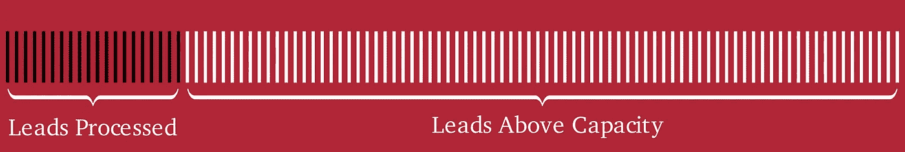
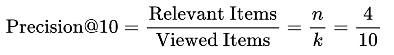
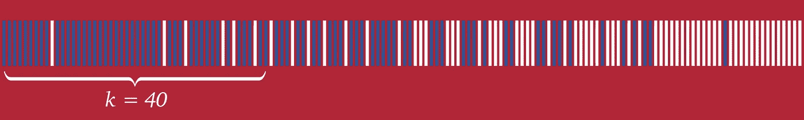
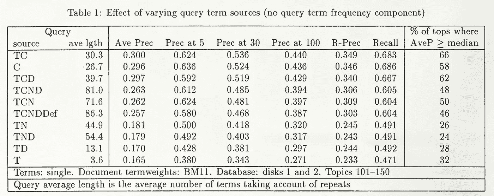

# Precision@k:欺诈和销售线索评分模型中被忽视的指标

> 原文：<https://towardsdatascience.com/precision-k-the-overlooked-metric-for-fraud-and-lead-scoring-models-fabad2893c01?source=collection_archive---------11----------------------->

## 如果您的模型产生的数据超出了人们的处理能力，Precision@k 可能是一个简单的解决方案

precision @ k .[图片由作者提供]

当我作为数据科学家在 Shopify 的零售上市团队工作，现在在 Wealthsimple 的欺诈团队工作时，我看到了一个共同的问题:我们建立的模型经常产生太多的输出，让我们的同事无法处理。

例如，在销售中，任何一天都可能有 500 个潜在的销售线索交给销售团队。但是，如果你只有 5 名销售代表，他们在工作日可能只能接触到其中的一小部分。

当您的输出超过您的容量时，P@K 非常有用。【图片由作者提供。]

像[平均精度](https://en.wikipedia.org/wiki/Evaluation_measures_(information_retrieval)#Average_precision)这样的指标——需要计算精度-召回曲线下的面积——是在整个数据集上测量的，并且需要处理所有这些线索，以便随着时间的推移监控指标的性能。

我想强调一下另一个已经存在了几十年并有助于解决这个问题的指标，但人们谈论得还不够多: **Precision@k** 。

# **什么是 Precision@k？**

Precision@k 有几个不同的名字: *P@k、Prec@k、Precision-at-k、在固定等级测量的精度*和 *P(n)* (不是一个错别字)*、*以及在过去 30 年左右的文献中你会发现的其他细微变化。这是一个简单的指标，最好用例子来解释，所以让我们从这里开始。

如果你正在研究了不起的卡尔·萨根，你在搜索引擎中只输入他的姓“萨根”，你可能会发现，在返回的前 10 篇文章中，只有 4 篇与他有关。因为在返回的 10 篇文章中，只有 4 篇是相关的，所以可以用以下公式计算 Precision@10:

萨根匹配卡尔·萨根的 P@10 是 0.4。【图片由作者提供。萨根的头像由美国国家航空航天局提供。]

换句话说, *k* 就是你查看的文章数量，Precision@k 是那些与你相关的文章的百分比。如果你看第二页的结果， *k* 会变成 20。

萨根匹配卡尔·萨根的 P@20 是 0.35。【图片由作者提供。萨根的头像由美国国家航空航天局提供。]

如果你已经熟悉[精度](https://en.wikipedia.org/wiki/Precision_and_recall)，这是完全相同的计算，只是你在以某种合理的方式排序后，将你包括的项目限制为第一个 *k* 。

如果你觉得 Precision@k 这个看起来很花哨的术语和你所习惯的精度是一样的，你并不孤单。它在 90 年代的文本检索会议(TREC)上的早期使用并没有将其作为一个值得大写的特殊术语——它仅仅是人们在确定他们的算法有多好时使用的许多测量精确度的方法之一[1]。直到 2000 年代中期，Precision@k 这个简写形式才从一种方便的表格标题方式，变成了一个完全的专有名词。

# Precision@k 什么时候有用？

Precision@k 作为一个不同于平均精度的度量变得有用的地方是在实践中如何使用它。虽然您可以在标记的训练和测试数据集上使用平均精度，但实际上每天测量它要困难得多。如上所述，如果你有 500 条线索，但你的团队只能完成 100 条，你永远也不会知道你在另外 400 条线索上做得如何。但是，你绝对可以在他们完成的工作上计算 Precision@100，并且你可以每天都这样做，不管他们能够处理的量有多大。

回到上面的搜索引擎类比，当你真正考虑它时，搜索引擎和线索评分或欺诈模型之间没有太大的区别。它们都提供了一个项目列表供人们查看，只是我们编写了一个模型而不是一个查询。在所有情况下，我们希望人们看到的结果是相关的，我们不太关心他们永远达不到的结果。

然而，与搜索引擎相比，销售和欺诈应用程序的主要区别在于，顺序通常并不重要。如果您有一个复杂的销售流程，并且您的 4 人销售团队的每个成员每天可以处理 10 个销售线索，那么您需要确保最佳销售线索位于列表的前 40 位。

如果 k=40，您需要确保尽可能多的销售线索(显示为蓝色)低于该限制。【图片由作者提供。]

11 号位的领先优势是否比 45 号位的领先优势更重要。但是，如果好的销售线索发现自己排在前 75 名之外，你应该关心这个问题，所以你的模型应该围绕这个事实进行优化。这将 P@k 与排名指标区分开来，如[标准化贴现累积收益](https://en.wikipedia.org/wiki/Discounted_cumulative_gain#Normalized_DCG)，其中排序很重要。

# Precision@k 不是一个独立的指标。但其他人也不是。

虽然 precision 的根源始于 20 世纪 50 年代早期，在命名确定 precision 之前，它被称为“相关性因子”和“相关性比率”,但 Precision@k 在 1992 年随着上面提到的 TREC 的创建而开始真正获得关注[2]。这使得研究人员聚集在一起，竞相从大量样本中检索信息。

在浏览这些早期作品时，我最感兴趣的不是他们对单一指标的选择，而是每个研究人员在并排放置多个指标以获得完整图像时的一致性。例如，下面是 TREC-2 中的一篇论文的表格，作者使用平均精度、P@5、P@30、P@100、 [R-Precision](https://en.wikipedia.org/wiki/Evaluation_measures_(information_retrieval)#R-precision) 和 Recall [3]比较了多个查询性能:

来源:[3]

我认为这是一个很好的教训:Precision@k 不应该*取代*其他指标，如平均精度和召回率，而是应该*补充*它们，让你对你的模型的性能有一个全面的了解。尤其是在输出由人审核而不是完全自动化的情况下。

# 你是怎么实现 P@k 的？

因为 P@K 只比 precision 多一点，对记录的数量有硬性限制，所以它的实现并不复杂。虽然您可以只取数据的前 *k* 行并将结果传递给 Scikit-learn 的`precision_score`函数，但这里有一个更明确的示例，它使用 Numpy 和一些 Scikit-learn 的助手来帮助那些想要详细了解它的人。关于使用一些虚假数据的完整示例，请参见笔记本[这里的](https://github.com/Brideau/whackdata-notebooks/blob/main/precision-at-k/Precision%20at%20K.ipynb)。

# 最后的想法

如果您的模型被能力有限的人使用，Precision@k 是添加到您的工具箱中的一个很好的工具。话虽如此，也没什么特别之处。如果有的话，它应该提醒你不要以表面价值来衡量精度和召回率:它们在某些用例中各有用途，但应该扩展、压缩和修改以适应你的特定情况。像所有的数据科学一样，它归结为让工具为你工作，而不是让工具为你工作。

[1] Harman，D. K. (1993 年)。*第一次文本检索会议(TREC-1)* (第 500 卷，第 207 期)。美国商务部，国家标准与技术研究所。

[2]m .桑德森(2010 年)。*基于测试集的信息检索系统评估*。现在出版公司。

[3]罗伯逊、沃克、琼斯、汉考克-比留和盖特福德(1994 年)。TREC 的 Okapi。 *NIST 特刊 SP* ，21–21。