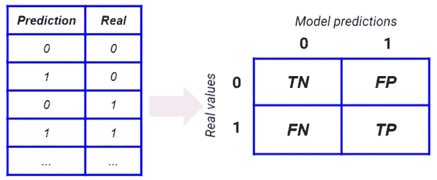
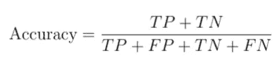
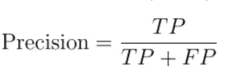
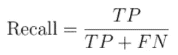

# 精确度、召回率、准确度。如何选择？

> 原文：<https://towardsdatascience.com/precision-recall-accuracy-how-to-choose-your-data-teacher-b843d69f8f44?source=collection_archive---------44----------------------->

## 让我们看看什么时候使用最常见的性能指标

作者图片

当我们不得不处理二元分类问题时，我们通常不得不选择代表我们的模型的概括能力的性能度量。我们没有通用的度量标准，因为它很大程度上取决于我们为之构建模型的问题。

三个非常常见的指标是精确度、召回率和准确度。让我们看看它们是如何工作的。

# 混乱矩阵

当我们处理一个分类问题时，我们可以建立所谓的混淆矩阵。这是一个混合实际值和预测值的交叉表，构建了一个 *NxN* 矩阵，其中 *N* 是类的数量。对于我们的例子，我们可以谈论一个二元分类问题，所以我们有 2 个类。

对于一个完美的模型，我们期望一个对角矩阵。非对角线元素(*假*)是我们的模型犯的错误，所以我们希望它们尽可能少。正确的预测(*真值*)是混淆矩阵中最重要的部分。*正数*是模型预测为 1 的那些记录，而*负数*是模型预测为 0 的那些记录。结合真/假和肯定/否定，我们得到了真肯定，真否定，假肯定，假否定。

真正的积极和真正的消极是已经被我们的模型正确分类的事件。假阳性是假 1，假阴性是假 0。

使用这 4 个数字，我们可以建立许多可以用来评估模型好坏的指标。让我们看一些。

# 准确性

准确性是成功预测占记录总数的比例。

这是最常见的性能指标，因为它让我们清楚地了解我们的模型有多真实。当您赋予 0 和 1 相同的重要性时，这非常有用，但在使用时必须小心，因为如果数据集不平衡，记录数最高的类将在分数中占主导地位，这通常不是一个好主意。非常多的 0 会造成对 1 的偏差，而这种偏差不是我们所需要的。

所以，只有当你有平衡的数据集并且你给 0 和 1 同样的重要性时，才使用准确性。

# 精确

精度是对被我们的模型分类为 1 的事件被正确分类的概率的度量。因此，我们将模型预测为 1 的所有事件(积极事件)计算为真的概率。

当你有一个模型在预测 1 时启动某种业务流程(例如营销活动)时，Precision 非常有用。所以，你希望你的模型在它说 1 的时候尽可能正确，而不要太在意它预测 0 的时候。这就是为什么我们只看到混淆矩阵的第二列，它与等于 1 的预测有关。

精准在营销活动中非常常用，因为营销自动化活动应该在预测用户会成功响应时对用户发起活动。这就是为什么我们需要高精度，也就是我们的模型预测 1 时正确的概率。低精度值会使我们的业务赔钱，因为我们联系的客户对我们的商业报价不感兴趣。

# 回忆

回忆是正确分类的 1 在所有真实 1 中所占的比例。

当你必须对已经发生的事情进行正确的分类时，回忆是非常有用的。例如，为了正确检测欺诈，欺诈检测模型必须具有高召回率。在这种情况下，我们不关心真正的 0，因为我们只对尽可能多地发现真正的 1 感兴趣。所以，我们正在处理混淆矩阵的第二行。

如前所述，召回的常见用途是欺诈检测模型，甚至是对患者的疾病检测。如果有人生病，我们需要发现他们的疾病，避免假阴性。假阴性患者可能会传染，这是不安全的。这就是为什么，当我们必须找出已经发生的事件时，我们需要使用回忆。

# 结论

准确度、精确度和召回率是可以建立在混淆矩阵上的三个度量标准。当我们对正确预测 0 和 1 感兴趣并且我们的数据集足够平衡时，我们可以使用准确性。当我们希望 1 的预测尽可能准确时，我们使用 precision 当我们希望模型尽可能多地发现真实的 1 时，我们使用 recall。为我们的模型选择正确的指标实际上可以增加它的预测能力，并给我们带来巨大的竞争优势。只要我们清楚我们的模型必须做什么，当我们必须选择一个模型时或在[超参数调整](https://www.yourdatateacher.com/2021/05/19/hyperparameter-tuning-grid-search-and-random-search/)阶段，我们可以毫无疑问地选择其中之一。

如果你对性能指标感兴趣，加入我的[在线课程](https://yourdatateacher.teachable.com/p/supervised-machine-learning-with-python)关于 Python 中的监督机器学习。

*原载于 2021 年 6 月 7 日 https://www.yourdatateacher.com*<https://www.yourdatateacher.com/2021/06/07/precision-recall-accuracy-how-to-choose/>**。**