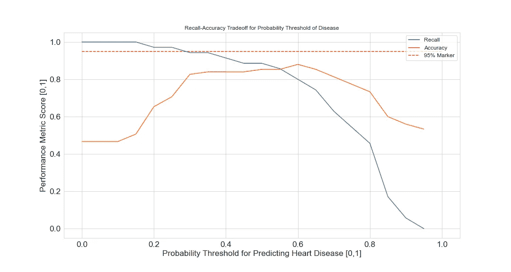

# 不平衡和医疗保健相关数据集的精确召回曲线

> 原文：<https://towardsdatascience.com/precision-recall-curves-for-imbalanced-and-healthcare-related-data-sets-e3bc76575d1e?source=collection_archive---------40----------------------->

## ROC 曲线的无名英雄双胞胎

处理二进制数据的几个分类器的精确召回图。图片作者。

我听说过 ROC 曲线，你听说过 ROC 曲线，我们都听说过 ROC 曲线。(如果你没有听说过 ROC 曲线，你可以在这里阅读它们[。)](/understanding-auc-roc-curve-68b2303cc9c5)

它们是对分类器在二进制数据上表现如何的直观评估，这已经是一个非常松散的定义。我们所说的“分类器的表现如何”是什么意思——用什么标准？为了哪些数据？现在你问了正确的问题。

ROC 曲线有一个很好的语义解释:它们是分类器的真阳性率(TPR)与其假阳性率(FPR)的关系图。它有一些很好的解释，伴随的 AUC 也是如此(再次，在这里阅读)，但非常松散地，你可以将这些事情解释为显示为了增加真阳性率，你必须开始让多少假阳性通过门。它们通常看起来像这样:

ROC 曲线由来自维基百科的 [MartinThomas](https://commons.wikimedia.org/wiki/File:Roc-draft-xkcd-style.svg) 创作，由-SA 2.0 授权[知识共享。](https://creativecommons.org/licenses/by-sa/2.0/)

你可以看到一个完全无用的分类器是什么样子，一个完全有用的分类器是什么样子，绘制出来供参考。

所有这些都是为了说明，我们在本文中不是要讨论 ROC 曲线。只是以一种迂回的方式，说 ROC 曲线对于不平衡的数据，或者对于你更关心一个类而不是另一个类的数据来说，不会提供很多信息。因为 ROC 曲线对于评估(和视觉评估)来说是如此美妙！)当你关心*整体准确性*时，分类器的表现如何，它在描述具有非常具体的[回忆一下](/choosing-performance-metrics-61b40819eae1)聚焦工作的分类器方面表现不佳，无论是异常检测，还是检测疾病，或者任何其他你关心发现一个类别比另一个类别多得多的问题。(点击阅读更多关于召回和其他性能指标的信息[。)](/choosing-performance-metrics-61b40819eae1)

想象一个分类器，它从大量患者测量值中预测患者是否患有心脏病。我们更关心这个分类器检测每个真正患有心脏病的人的能力——不让任何人漏网，检测不到对他们健康的威胁——而不是整体模型的准确性。我们可以承认该模型过度预测疾病的倾向有些宽容，因为这些人会去做进一步的测试，咨询他们的医生等。，可能会消除顾虑。然而，如果模型预测一个真正生病的病人没有疾病，那就是一个更严重的错误。那个病人未经治疗就回家了。

事实上，正是这样一个分类器存在。毫无疑问，很多人都有。让我们来看看这个例子，心脏病分类器有很好的准确性，但召回次优。

投票集成分类器的 ROC 曲线和混淆矩阵的并排比较，心脏病数据。图片作者。

ROC 曲线看起来相当不错，对吧？肯定比随机的(红色)更接近完美的(绿色)。但是看那边，混乱矩阵，在左下角，标着“4”这意味着，在 35 名真正患有心脏病的人中，有 4 人通过了我们的分类器而未被发现。你有 10%的几率会得心脏病，而这个模型不会发现它。不太好，你不能只从 ROC 曲线上看出来。对于这样的问题，我们想要一个不同的可视化。提示精确回忆曲线。

同一分类器的精度-召回曲线。图片作者。

这个东西更好地描绘了我们在这个问题上的权衡。从左到右，我们增加了模型的召回率，但是上面画的是为了更高的召回率你必须在精确度上做出的权衡；一般来说，我们从左向右移动会失去精确性。完美的分类器用绿色标出，这里你永远不会为了回忆而牺牲精度。随机猜测用红色标绘；它是集合中所有数据的正比率，在本例中略小于 1:1。对于我们的医疗保健应用程序来说，这是一个更有用的工具，我们可以尝试在不使模型的精度成为完全垃圾的情况下，找到我们可以提高回忆的程度。看这个，看起来最好的地方是 90-95%的召回范围:很好地专注于捕捉患有疾病的患者，同时保持 70-80%的精确度，所以它不只是打印出“你有高于正常的心脏病风险”的每个数据点。

事实上，一个可能更有用的图形，虽然它似乎没有在任何地方的书籍上，是回忆和准确性对各种信心阈值的绘图。

根据模型概率阈值绘制的召回率和准确度。图片作者。

记住，那些来自 [scikit-learn](https://scikit-learn.org/stable/auto_examples/classification/plot_classifier_comparison.html) 的分类器，不仅通过`model.predict()` (0 无心脏病，或 1 心脏病)输出一个类别预测，还可以输出预测概率(0.5 概率心脏病，0.38 概率心脏病，0.79 概率心脏病等。)通过`model.predict_proba()`。这对我们这些应用来说是个好消息。我们可以对模型进行微调，以获得更高的召回分数。让模型输出一个概率，你来选阈值。任何高于 0.2，或 0.4，或 0.6 机会心脏病，预测心脏病。这正是上面的图表。如果我们将 0.2 作为预测心脏病的概率阈值，这将如何影响模型的准确性和召回率。

对于这个问题，我想保持尽可能高的召回率，所以我画了一条 95%的线，以确保我选择的召回率接近或高于这条线。我还想尽可能保持模型的准确性，这样就不仅仅是笼统地预测心脏病了。最佳时机看起来发生在大约 0.35 的概率阈值:召回率接近 95%的目标，准确率也达到了相对较高的 85%左右。选择 0.35 作为我的概率阈值允许我在不完全损失准确性的情况下最大化回忆。

混淆矩阵显示回忆能力提高。图片作者。

召回率高达 33/35，或者说我们的分类器只有 5%的机会漏掉心脏病患者，比之前的 10%有了很大的提高。

*   本文所用数据:【https://www.kaggle.com/ronitf/heart-disease-uci 
*   关于 ROC 和 AUC 的更多信息:[https://medium.com/r/?URL = https % 3A % 2F % 2 ftowardsdata science . com % 2 funder standing-AUC-roc-curve-68b 2303 cc9 C5](/understanding-auc-roc-curve-68b2303cc9c5)
*   关于召回率、精确度和其他性能指标的更多信息:[https://medium.com/r/?URL = https % 3A % 2F % 2 ftowardsdata science . com % 2f 选择-性能-指标-61b 40819 ea1](/choosing-performance-metrics-61b40819eae1)
*   有关精确召回曲线的更多信息:[https://machine learning mastery . com/roc-curves-and-precision-recall-curves-for-class ification-in-python/](https://machinelearningmastery.com/roc-curves-and-precision-recall-curves-for-classification-in-python/)