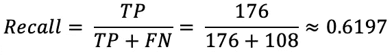

# 精确召回曲线:如何快速评估机器学习模型

> 原文：<https://towardsdatascience.com/precision-recall-curves-how-to-easily-evaluate-machine-learning-models-in-no-time-435b3dd8939b?source=collection_archive---------30----------------------->

## 包括 Python 中的例子。

精确回忆曲线是一种很好的方式来形象化你的模型如何预测正类。您将深入了解它，并通过本文中的实例进行实践。

Clem Onojeghuo 在 [Unsplash](https://unsplash.com/s/photos/abstract?utm_source=unsplash&utm_medium=referral&utm_content=creditCopyText) 拍摄的照片

顾名思义，您可以使用精度-召回曲线来可视化精度和召回之间的关系。对于不同的概率阈值，这种关系是可视化的，主要是在几个不同的模型之间。

完美的模型显示在点(1，1)处，表示精确度和召回率的完美分数。你通常会得到一个模型，这个模型向提到的那一点低头，但并不完全在那里。

下面是这篇文章的内容:

*   回顾混淆矩阵、精确度和回忆
*   数据集加载和准备
*   比较精度-召回曲线
*   结论

# 回顾混淆矩阵、精确度和回忆

在深入研究精确度、回忆和它们的关系之前，让我们快速回顾一下混淆矩阵。这是它最通用的版本:

图片 1 —混淆矩阵(图片由作者提供)

这很好，但是让我们通过输入实际值来使它不那么抽象:

图 2——带有真实数据的混淆矩阵(图片由作者提供)

你可以从这里计算几十个不同的指标，精度和召回是其中的两个。

# 精确

精度是显示正确正面预测数量的一个度量。它的计算方法是真阳性的数量除以真阳性和假阳性的总和:

图 3 —精确公式(作者提供的图片)

需要澄清两个术语:

*   **真阳性**——阳性并被归类为阳性的实例(好酒被归类为好酒)
*   **假阳性** —阴性但被归类为阳性的实例(劣酒被归类为好酒)

现在，您可以根据*图 2* 中所示的混淆矩阵轻松计算精确度分数。程序如下:

图片 4 —精度计算(图片由作者提供)

对于精确度和召回率，该值可以在 0 和 1 之间(越高越好)，所以 0.84 不算太差。

高精度值意味着您的模型不会产生大量误报。

# 回忆

召回是许多分类问题最有用的度量。它报告所有正类预测中对正类的正确预测数。可以用下面的公式计算:

图 5 —回忆公式(作者提供的图片)

需要澄清两个术语:

*   **真阳性**——一个阳性并被归类为阳性的实例(好酒被归类为好酒)
*   **假阴性**——阳性但被归类为阴性(好酒被归类为坏酒)的实例

当然，给葡萄酒分类完全是一种乐趣和游戏，但错误分类的代价可以用人命来表达:**一个病人患了癌症，但医生说他没有**。与葡萄酒的原理相同，但价格更高。

你可以用上面提到的公式计算召回分数。这里有一个完整的演练:

图 6 —召回计算(作者图片)

正如精度一样，召回率也介于 0 和 1 之间(越高越好)。0.61 没那么厉害。

低召回值意味着你的模型会产生很多假阴性。

您现在知道了这两个指标是如何独立工作的。接下来让我们将它们连接到一个单独的可视化。

# 数据集加载和准备

你将使用[白葡萄酒质量数据集](https://www.kaggle.com/piyushagni5/white-wine-quality)进行实践部分。下面是如何用 Python 加载它:

下面是前几行的样子:

图 7 —白葡萄酒数据集标题(图片由作者提供)

正如您在`quality`栏中看到的，这不是一个二进制分类问题——因此您将把它变成一个二进制分类问题。假设如果`quality`为 7 或以上，则葡萄酒为*好*，否则为*差*:

接下来，让我们可视化目标变量分布。代码如下:

这是视觉效果:

图 8 —目标变量的类别分布(作者图片)

大约 4:1 的比率，表明目标变量存在偏差。还有很多劣质酒，这意味着模型将学习更好地对劣质酒进行分类。您可以使用过采样/欠采样技术来解决这个问题，但这超出了今天的范围。

接下来，您可以进行训练/测试分割:

就是这样！接下来，您将训练几个模型并可视化精度召回曲线。

# 比较精度-召回曲线

下面的代码片段向您展示了如何训练逻辑回归、决策树、随机森林和极端梯度推进模型。它还向您展示了如何获取正类的概率:

接下来，您可以获得每个模型的精度、召回率和 AUC(曲线下面积)的值。唯一的要求是将*好的*和*坏的*类名分别重新映射为 1 和 0:

最后，您可以可视化精确召回曲线:

下面是相应的可视化:

图 9-不同机器学习模型的精确召回曲线(图片由作者提供)

如您所见，没有一条曲线延伸到(1，1)点，但这是意料之中的。AUC 值是比较不同模型的优秀指标(越高越好)。随机森林算法在这个数据集上表现最好，AUC 得分为 0.83。

# 结论

总的来说，任何时候你想要可视化假阳性和假阴性之间的权衡，你都应该可视化精确召回曲线。大量的假阳性导致低精度，大量的假阴性导致低召回率。

您应该以高精度和高召回率的模型为目标，但在现实中，一个指标更重要，因此您可以随时为此进行优化。优化后，相应调整分类阈值。

你选择模特的方法是什么？在评论区告诉我。

# 了解更多信息

*   [机器学习的三大分类指标——一劳永逸地消除准确性](/top-3-classification-machine-learning-metrics-ditch-accuracy-once-and-for-all-923beab025a4)
*   [ROC 和 AUC——如何快速评估机器学习模型](/roc-and-auc-how-to-evaluate-machine-learning-models-in-no-time-fb2304c83a7f)

*喜欢这篇文章吗？成为* [*中等会员*](https://medium.com/@radecicdario/membership) *继续无限制学习。如果你使用下面的链接，我会收到你的一部分会员费，不需要你额外付费。*

 [## 通过我的推荐链接加入 Medium-Dario rade ci

### 作为一个媒体会员，你的会员费的一部分会给你阅读的作家，你可以完全接触到每一个故事…

medium.com](https://medium.com/@radecicdario/membership) 

*原载于 2021 年 1 月 4 日 https://betterdatascience.com***。**