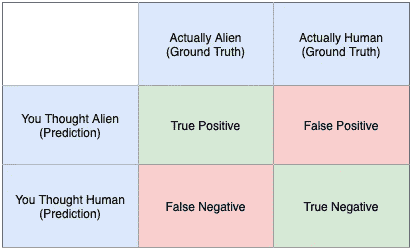
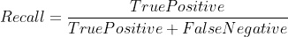
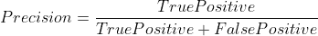
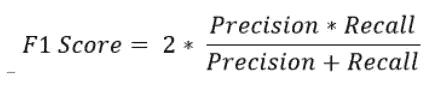

# 精确与回忆:由黑衣人解释

> 原文：<https://towardsdatascience.com/precision-recall-explained-by-men-in-black-c821a688707b?source=collection_archive---------42----------------------->

迭戈·马林在 [Unsplash](https://unsplash.com?utm_source=medium&utm_medium=referral) 上的照片

## 一个你不会忘记的解释(即使你被神经错乱了！)

> D 记者:所有表达的观点都是我个人的。

我不知道你怎么想，但是每次我碰到精确和回忆的概念，我完全理解它们…然后，突然第二天我很难解释它们。它从我的记忆中被抹去了，就好像我接受了一次**！**

*因此，[受到威尔·史密斯饰演的角色通过射杀一个小女孩而通过 MIB 考试的场景的启发](https://youtu.be/THe_hlNE3yI?t=207)，我想出了一个简单易懂的例子，可以帮助我理解和记住精确和回忆的概念。请继续阅读！*

***内容***

*0.[运行实例](#b9a3)*

1.  *[回忆](#db82)1.1
    1.2[🥱boring 定义](#f465)1.2[👽有趣的(上下文)定义](#93d7)
    1.3 [📈高回忆是什么意思？](#98d5)
    1.4 [📉低回忆是什么意思？](#69b1)
    1.5 [💵一个让 c̶e̶n̶t̶s̶有意义的真实世界的例子](#3c1f)*
2.  *[精度](#c275)
    2.1 [🥱Boring 定义](#0476)2.2[👽有趣的(上下文)定义](#e42c)
    2.3 [📈高精度是什么意思？](#2986)2.4
    2.4[📉精度低是什么意思？](#4008)
    2.5 [💵一个让 c̶e̶n̶t̶s̶有意义的真实世界的例子](#02e8)*
3.  *[F1 得分](#4ee8)*
4.  *为什么不把事情简单化，只使用准确性呢？*
5.  *[最终要点](#a08f)*

# *0.运行示例*

*你是黑衣人(MIB)的特工，这是一个负责保护人类免受伪装成人类的外星人袭击的秘密机构。你收到一个提示，万圣节派对被一些外星人渗透了。你的任务，你应该选择接受(哎呀错电影！)，是为了识别和捕捉这些伪装的外星人。*

**

*卡肖恩·埃尔南德斯在 [Unsplash](https://unsplash.com?utm_source=medium&utm_medium=referral) 上的照片*

*用机器学习的术语来说，这是一个外星人识别/分类问题:给定一个真实人类和伪装成人类的外星人的数据集，你想要识别外星人。*

*你和你的同事前往派对，抓住一些你认为是外星人的人。你确定了一些正确的和一些错误的！现在，是时候评估你使用回忆和精确度识别伪装成人类的外星人的能力了。*

# *1.回忆*

**

*照片由[米里亚姆·埃斯帕西奥](https://unsplash.com/@miriamespacio?utm_source=medium&utm_medium=referral)在 [Unsplash](https://unsplash.com?utm_source=medium&utm_medium=referral) 拍摄*

> *在所有伪装成人类的外星人中，你正确识别了多少？*

## *1.1 🥱Boring 定义*

**

*外星人识别问题的混淆矩阵*

**

## *1.2 👽有趣的(上下文)定义*

*当你冲进队伍，决定谁是外星人，谁是人类的时候，你正确地识别了一些外星人，却漏掉了一些，因为你错误地认为他们是人类。回忆是衡量你在所有人当中正确识别外星人的能力。从某种意义上来说，回忆也是对你在聚会上没有留下任何外星人的一种衡量。*

## *1.3 📈高回忆是什么意思？*

*高召回率意味着很少有伪装的外星人被你误认为是人类的情况。*

*不好的一面是，这也意味着你把太多的人判断为伪装的外星人。你可以将聚会上的每个人都识别为外星人，你的回忆将是满分(你没有假阴性，因为每个人都被认为是‘阳性’病例！).所以，可能有很多你抓到的真实人类可能不太乐意被不必要的审问。然而，如果你的首要任务是捕捉尽可能多的真实的外星人，而你又不在乎错误地捕捉一些真实的人类，那么回忆就是你的衡量标准。嘿，在一天结束的时候，人类可能会被激怒，但他们是安全的！*

## *1.4 📉低回忆是什么意思？*

*相反，低回忆率意味着你不擅长从所有真实的外星人中辨别出外星人。你也许应该接受更多的训练！*

## *1.5 💵一个让 c̶e̶n̶t̶s̶有意义的真实世界的例子*

*在在线交易领域，您可能希望欺诈检测场景的高召回率。您可能会错误地将一些交易标记为欺诈性交易，但是通过良好的回忆，您可以更加确定您已经设法捕获了大部分欺诈性交易。你的一些客户可能会因为他们的交易被认为是欺诈性的而感到有点沮丧，但是你的客户/公司不太容易遭受不公平的金钱损失。*

# *2.精确*

**

*奥利弗·布赫曼在 [Unsplash](https://unsplash.com?utm_source=medium&utm_medium=referral) 上拍摄的照片*

> *在所有你认为是外星人的人中，有多少是伪装成人类的外星人？*

## *2.1 🥱Boring 定义*

**

*外星人识别问题的混淆矩阵*

**

## *2.2 👽有趣的(上下文)定义*

*当你识别并捕获了一些自认为是外星人的人时，你捕获了一些外星人和一些无辜的人类。**精确度是一个衡量在你认为是外星人的人中，有多少人实际上是外星人的指标。从某种意义上来说，精确度也是衡量你不把真实的人误认为外星人的能力有多强的一个标准。***

## *2.3 📈高精度是什么意思？*

*高精度意味着很少会有真正的人被错误地识别为外星人。*

*可能你只识别并抓住了一个你认为是外星人的人，而这个人实际上是一个伪装的外星人。瞧啊。从数字上来说，你的精确度是完美的。不好的一面是，你可能会让很多外星人乔装打扮潜伏在派对上。然而，让我们不要忘记 MIB 是一个秘密机构，你不希望错误地逮捕一个真正的人，并危及 MIB 的隐蔽性或外星人存在并伪装潜伏在我们中间的事实的隐蔽性！在这种情况下，精确度是正确的衡量标准。*

## *2.4 📉精度低是什么意思？*

*相反，低精度意味着你可能已经捕获了太多认为自己是外星人的真实人类。在他们向世界揭露外星人和 MIB 的存在之前，你别无选择，只能用神经分析仪清除他们的记忆！*

## *2.5 💵一个让 c̶e̶n̶t̶s̶有意义的真实世界的例子*

*在银行领域，识别贷款违约者的问题是一个你想要高精度的问题。如果你错误地将太多的客户认定为贷款违约者，你的银行将无法贷款给足够多的人。银行从借款人应计和支付的利息中获得的收入将会缩水，这对银行的底线不利！*

# *3.F1 分数*

**

*由古斯塔沃·托里斯在 [Unsplash](https://unsplash.com?utm_source=medium&utm_medium=referral) 上拍摄的照片*

> *我既关心精确度又关心召回率，所以我想在两者之间取得平衡！—你在 MIB 的老板*

*现在是年底了。这也意味着，是时候和你的老板进行年终绩效评估了。为了公平地分配年终奖金，你的老板需要根据代理商的总体目标来比较所有 MIB 代理商的绩效。该机构的目标是双重的 MIB 需要成功捕获外星人，但它也需要保持其保密性，让世界幸福地不知道外星人的存在。你的老板应该使用精确还是回忆？*

*一个可能的解决方案是使用 F1 分数——它有助于在精确度和召回率之间取得平衡。*

*F1 得分是精确度和召回率的[调和平均值](https://www.investopedia.com/terms/h/harmonicaverage.asp#:~:text=The%20harmonic%20mean%20is%20a,1%204%20)%20%3D%203%201%20.):*

**

# *4.为什么不简单明了地使用准确性呢？*

**

*[钳工](https://unsplash.com/@benchaccounting?utm_source=medium&utm_medium=referral)在 [Unsplash](https://unsplash.com?utm_source=medium&utm_medium=referral) 上拍照*

*我听到了。我也喜欢机器学习的简单性，但某些问题是这样的，使用准确性作为衡量分类器性能的指标可能是不明智的。当然，我说的是不平衡类的问题，即我们的数据以不平衡的方式分布在各个类中。假设前面提到的万圣节聚会有 100 人，其中只有 5 人是伪装的外星人。在这种情况下，如果你将所有 100 个人都识别为人类，你会有 95%的准确率，但这不太可能在年底给你带来好的奖金，因为你的 F1 分数高的同事会帮助 MIB 实现其核心目标。因此，考虑到精度，召回率和 F1 分数是衡量分类性能的一个可行的替代方法。*

# *5.最终外卖*

**

*埃里克·麦克林在 [Unsplash](https://unsplash.com?utm_source=medium&utm_medium=referral) 上的照片*

*   *当类别不平衡时，精确度、召回率和 F1 分数是比精确度更明智的选择。*
*   *当您更关心发现尽可能多的真实案例时，请使用回忆。*
*   *当您更关心您确定为阳性的案例是否正确时，请使用 precision。*

# *认识作者:*

**

*艾西瓦娅·普拉巴特*

*嗨！我是艾西。我名字的前两个字母是“AI”，AI 和机器学习是我热爱的。我目前是新加坡的一名高级数据科学家和机器学习解决方案架构师。你可以通过 [LinkedIn](https://www.linkedin.com/in/aishwaryaprabhat) 联系我。*