# 像国王一样用 Excel 预测和推荐

> 原文：<https://towardsdatascience.com/predict-and-recommend-with-excel-like-a-king-d6b4065b129f?source=collection_archive---------44----------------------->

## 在 Excel 中方便地修改 LSTM 和先验参数

卢克·坦尼斯在 [Unsplash](https://unsplash.com/s/photos/king?utm_source=unsplash&utm_medium=referral&utm_content=creditCopyText) 拍摄的照片

## 动机:

我们已经在之前的帖子中学习了如何在 Jupyter Notebook 中编写[市场篮子](/market-basket-analysis-using-pysparks-fpgrowth-55c37ebd95c0)分析、时间序列[预测](/prophet-in-a-loop-a875516ef2f9)和[推荐引擎](/recommender-systems-item-customer-collaborative-filtering-ff0c8f41ae8a)。我们还知道如何 [Pyinstall](/excel-python-app-for-non-pythonists-68b4fec0fabf) 这些 Python 脚本到 exe 文件中，并与 Excel [wings](/python-excel-integration-with-xlwings-f9bf9d1332ea) 连接。本文证明了这种 Excel 独立应用程序的好处，它将客户项目销售的预测、推荐和购物篮分析都集中在一个地方。

接收方不需要安装 Python，也不需要任何深度学习的编码知识。用户只需将数据输入 Excel 表格，轻松调整算法设置，点击一个按钮即可直接在 Excel 中接收结果。之后，用户可以修改参数并重新运行，以获得舒适和直接的结果基准。这不仅对于初学者来说是理想的，对于那些想要摆弄这些算法参数并与他们的非 Pythonist 同事分享结果的高级实践者来说也是理想的。

P redReX:像王者一样用 Excel 预测推荐！

## 解决方案:

首先下载 [PredReX](https://github.com/DAR-DatenanalyseRehberg/PredReX) Excel 模板和[三个 Exe 文件](https://drive.google.com/drive/folders/1uG6j6nAzCBu_FxgB9gGZktt0bLbErgY5)并保存在一个文件夹中。

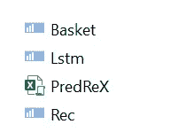

PredReX Excel 和 exe 文件。

现在打开 PredReX，看看输入表。对于这个演示，我们将坚持使用已经包含的数据，但是当然您也可以用您自己的数据替换它们。只需注意保持列标题不变，不要修改文件名 PredReX.xlsm。

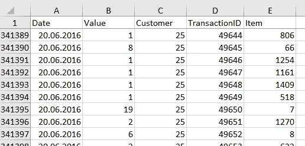

输入数据

所以我们得到的是每个销售日的销售额。该值可以是售出的物品数量或销售额，例如以美元计。客户代码 25 代表一个特定的客户，而销售项目 806 代表一个特定的销售项目(项目 66 代表另一个独特的项目，以此类推)。销售交易 id 是一个账单号，在进行购物篮分析时非常重要。

现在让我们转到有趣的部分，选项卡“参数”。

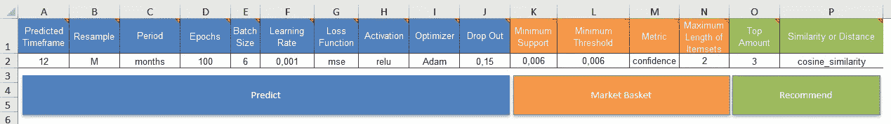

所有这些参数都是可调的。

本文将不解释长短期记忆(LSTM)背后的理论，这是一种用于深度学习领域的特殊类型的递归神经网络。另外，像购物篮分析和推荐这样的数据挖掘技术已经在其他重要的帖子中大量出现。但我对 PredReX 的想法是为您提供一种务实地尝试这些参数的相互作用的方法，以获得这些算法背后的实际直觉。

**预测**

有很多关于 LSTM 的参数，我们可以用来预测未来的销售。

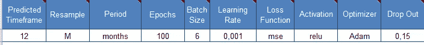

输入不同的值或从下拉列表中选择。

请注意，无论您的预测是基于每日、每周、每月还是每年的水平，为了得到有意义的结果，这都应该与重采样大小相匹配。历元的数量定义了学习算法在数据集上工作的频率。批次大小是模型更新前处理的样本数，必须> =1，而时期数可以设置为 1 到无穷大之间的整数值。你可以选择 MSE，MAE，MAPE 和 MSLE 作为损失函数。对于优化者，你可以选择亚当、阿达马克斯或 Sgd。

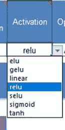

享受调整 LSTM 提供的不同超参数的乐趣。

一旦点击“预测”按钮，Lstm.exe 将被执行，预测将被保存到输出表中。您可以检查这两种评估:

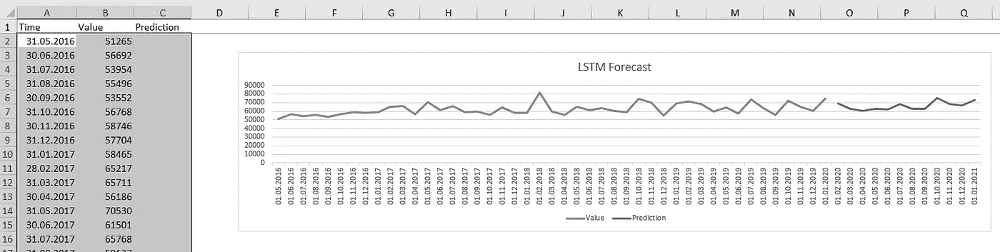

实际值用蓝色突出显示，预测值用红色显示。

..以及损失函数:

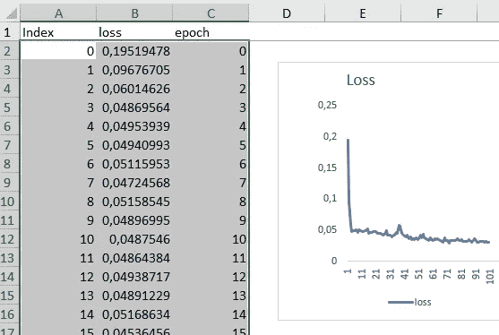

有 100 个纪元的例子。

在你调查了你的结果后，你现在可能想预测每周的水平？继续从适当的下拉列表中选择，重新运行预测并比较您的结果。请记住，没有现成的最佳总体超参数设置，但这确实取决于数据。PredReX 试图帮助你对此有一个直觉。用自己的数据试一下就好了。

**推荐**

下一步，我们希望在我们的销售交易 id 中找到模式。进行购物篮分析时，您可以更改最小支持度和阈值，以及项目集的长度。至于指标，您可以选择置信度或提升度..

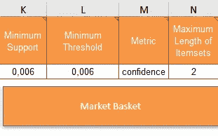

试验这四个先验参数。

..要查看它如何与您的数据交互:

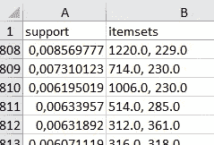

对项集的支持以逗号分隔。

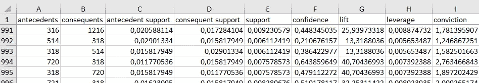

支持、信心和提升可能是市场篮子分析中最常用的指标。

从购物篮中，我们了解了经常一起购买的商品。现在，我们将继续向前，希望主动向客户推荐他们尚未购买但应该会非常感兴趣的商品。该建议将基于余弦相似性或曼哈顿/欧几里得距离，您可以从下拉列表中进行选择。

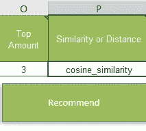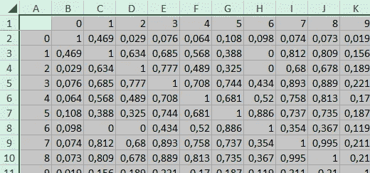

相似性或距离将显示在“输出 Sim”选项卡中。

使用“top amount ”,您可以输入要推荐的热门商品数量。因此，如果您像上面的屏幕截图中那样选择 3，输出将如下所示:

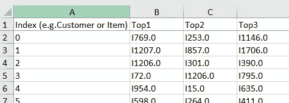

前 3 名意味着将向每个客户推荐前 3 个项目，其中前 1 个项目是最受推荐的项目，前 2 个项目是第二受推荐的项目，依此类推。为了更好的可读性，I 代表 item。

## 结论

恭喜你，你可以挑战许多参数来微调你的预测，并在 Excel 中轻松推荐商品。利用 LSTM，我们回顾了过去的销售情况，试图对未来的销售做出展望。由于有了先验知识，我们可以更好地理解哪些商品经常一起购买。并且使用客户-项目相似性，我们尝试推荐客户应该高度感兴趣的项目。PredReX 搭建了一座从过去到未来的桥梁，同时让您以动手操作的方式微调参数设置。我希望这能帮助你更好地理解这些算法。

非常感谢您的阅读！希望这篇文章对你有帮助。请随时在 [LinkedIn](https://de.linkedin.com/in/jesko-rehberg-40653883) 、 [Twitter](https://twitter.com/DAR_Analytics) 或[工作室](https://jesko-rehberg.medium.com/virtual-reality-vr-for-education-a532aa5b6272)与我联系。

<https://jesko-rehberg.medium.com/membership> 