# 使用 PyCaret 预测客户流失(正确的方式)

> 原文：<https://towardsdatascience.com/predict-customer-churn-the-right-way-using-pycaret-8ba6541608ac?source=collection_archive---------0----------------------->

## 关于如何使用 PyCaret 正确预测客户流失的分步指南，实际上优化了业务目标并提高了投资回报率

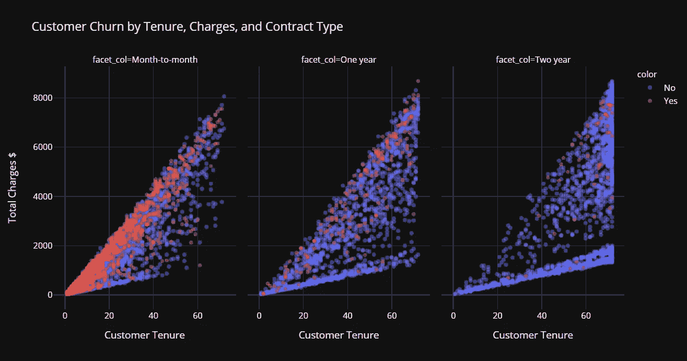

使用 PyCaret 预测客户流失(正确的方式)——作者图片

# **简介**

对于采用基于订阅的业务模式的公司来说，客户维系是主要的 KPI 之一。竞争非常激烈，尤其是在 SaaS 市场，消费者可以自由地从大量供应商中进行选择。一次糟糕的体验，客户可能会转向竞争对手，导致客户流失。

# **什么是客户流失？**

客户流失率是在一定时间内停止使用贵公司产品或服务的客户的百分比。计算客户流失率的方法之一是用给定时间间隔内流失的客户数量除以该期间开始时的活跃客户数量。例如，如果你有 1000 个客户，上个月失去了 50 个，那么你的月流失率是 5%。

预测客户流失是一个具有挑战性但极其重要的商业问题，尤其是在客户获取成本较高的行业，如技术、电信、金融等。预测特定客户面临高风险的能力，同时还有时间做些什么，对公司来说是一个巨大的额外潜在收入来源。

# 客户流失机器学习模型在实践中是如何使用的？

客户流失预测模型的主要目标是通过主动与客户接触来留住流失风险最高的客户。例如:提供礼品券或任何促销价格，并将其锁定一两年，以延长其对公司的终身价值。

这里有两个宽泛的概念需要理解:

*   我们想要一个客户流失预测模型来提前预测流失(比如提前一个月、提前三个月、甚至提前六个月——这完全取决于用例)。这意味着你必须非常小心截止日期，即你不应该使用截止日期之后的任何信息作为机器学习模型中的特征，否则这将是泄漏。截止日期之前的时期被称为**事件。**
*   通常对于客户流失预测，您需要做一些工作来创建一个 ***目标列*** ，它通常不会以您想要的形式出现。例如，您希望预测客户是否会在下一季度内流失，因此您将遍历截至事件截止日期的所有活跃客户，并检查他们是否会在下一季度离开公司(1 表示是，0 表示否)。这种情况下的季度称为**性能窗口**。

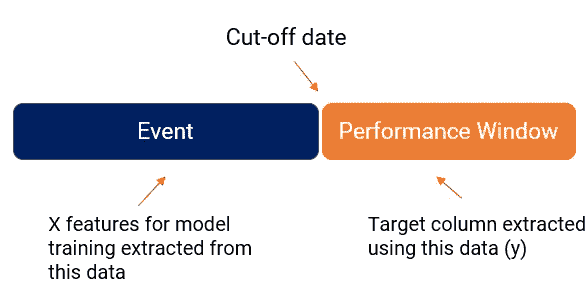

如何创建客户流失数据集—按作者分类的图像

# 客户流失模型工作流程

现在，您已经了解了数据是如何来源的以及流失目标是如何创建的(这是问题中最具挑战性的部分之一)，让我们讨论一下这种机器学习模型将如何在业务中使用。从左至右阅读下图:

*   基于客户流失历史(X 特征的事件周期和目标变量的性能窗口)训练模型。
*   每个月，活跃客户群都被传递到**机器学习预测模型**上，以返回每个客户的流失概率(在商业行话中，这有时被称为流失分数)。
*   该列表将从最高概率值到最低概率值(或他们所说的分数)排序，客户保留团队将开始与客户接触以阻止客户流失，通常通过提供某种促销或礼品卡来锁定未来几年。
*   流失率非常低的客户(或者基本上模型预测没有流失率的客户)是快乐的客户。不对它们采取任何操作。

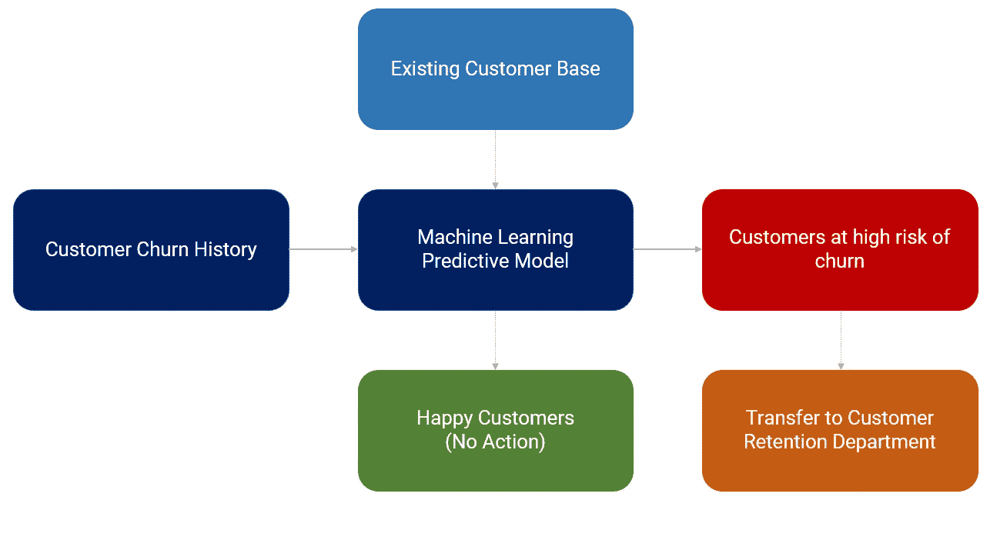

客户流失模型工作流程-按作者分类的图片

# 让我们从实际例子开始

在这一部分中，我将演示机器学习模型训练和选择、超参数调整、结果分析和解释的完整端到端工作流。我还将讨论您可以优化的指标，以及为什么 AUC、准确性、召回率等传统指标可能不适合客户流失模型。我将使用[py caret](https://www.pycaret.org)——一个开源、低代码的机器学习库来执行这个实验。本教程假设您对 PyCaret 有基本的了解。

# PyCaret

[PyCaret](https://www.pycaret.org/) 是一个开源、低代码的机器学习库和端到端的模型管理工具，内置于 Python 中，用于自动化机器学习工作流。PyCaret 以其易用性、简单性以及快速高效地构建和部署端到端机器学习管道的能力而闻名。要了解更多关于 PyCaret 的信息，请查看他们的 [GitHub](https://www.github.com/pycaret/pycaret) 。


PyCaret 的特点—作者图片

# 安装 PyCaret

```
**# install pycaret** pip install pycaret
```

# 👉资料组

对于本教程，我使用来自 Kaggle 的[电信客户流失](https://www.kaggle.com/blastchar/telco-customer-churn)数据集。数据集已经包含我们可以按原样使用的目标列。您可以直接从这个 [GitHub](https://raw.githubusercontent.com/srees1988/predict-churn-py/main/customer_churn_data.csv) 链接中读取这个数据集。(*大喊到 sres 1988*

```
**# import libraries**
import pandas as pd
import numpy as np**# read csv data** data **=** pd.read_csv('[https://raw.githubusercontent.com/srees1988/predict-churn-py/main/customer_churn_data.csv'](https://raw.githubusercontent.com/srees1988/predict-churn-py/main/customer_churn_data.csv'))
```

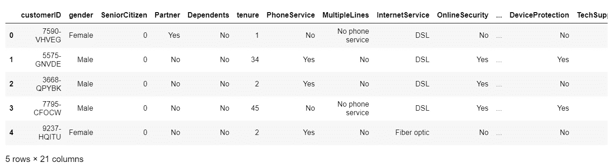

样本数据集-按作者分类的图像

# **👉探索性数据分析**

```
**# check data types** data.dtypes
```

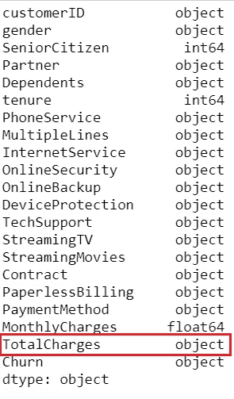

数据类型-按作者分类的图像

注意到`TotalCharges`是一个`object`类型，而不是`float64.`，经过调查，我发现这个列中有一些空格，这导致 Python 将数据类型强制为`object`。要解决这个问题，我们必须在改变数据类型之前修剪空白。

```
**# replace blanks with np.nan**
data['TotalCharges'] = data['TotalCharges'].replace(' ', np.nan)**# convert to float64**
data['TotalCharges'] = data['TotalCharges'].astype('float64')
```

从直觉上来说，合同类型、期限(客户停留的时间长度)和定价计划是客户流失或保留的非常重要的信息。让我们探讨一下这种关系:

[https://gist . github . com/moe zali 1/2624 c 9 a5 EAF 78d 9 a 7 FFA 1 b 97195 a 4812](https://gist.github.com/moezali1/2624c9a5eaf78d9a7ffa1b97195a4812)

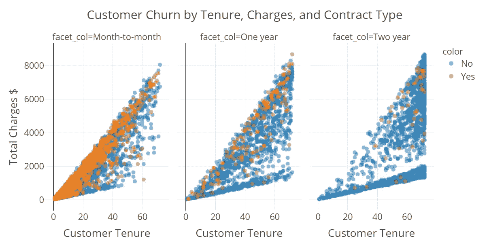

按任期、费用和合同类型划分的客户流失(图片由作者提供)

请注意，大多数流失可以在“逐月”合同中看到。当然有道理。此外，我可以看到，随着任期的增加和总费用的增加，与高任期和高费用的客户相比，高任期和低费用的客户的可能性较小。

**缺失值**

```
**# check missing values** data.isnull().sum()
```

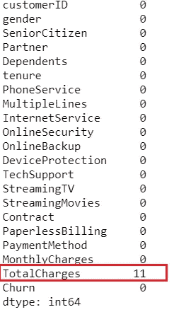

缺失值-按作者分类的图像

请注意，因为我们用`np.nan`替换了空白值，所以现在`TotalCharges`中有 11 行缺少值。没问题——我会让 PyCaret 自动估算它。

# **👉数据准备**

对于 PyCaret 中的所有模块来说，`setup`是在 PyCaret 中执行的任何机器学习实验中的第一个也是唯一一个强制步骤。该功能负责训练模型之前所需的所有数据准备。除了执行一些基本的默认处理任务，PyCaret 还提供了一系列预处理功能。要了解 PyCaret 中所有预处理功能的更多信息，您可以查看这个[链接](https://pycaret.org/preprocessing/)。

```
**# init setup**
from pycaret.classification import *
s = setup(data, target = 'Churn', ignore_features = ['customerID'])
```

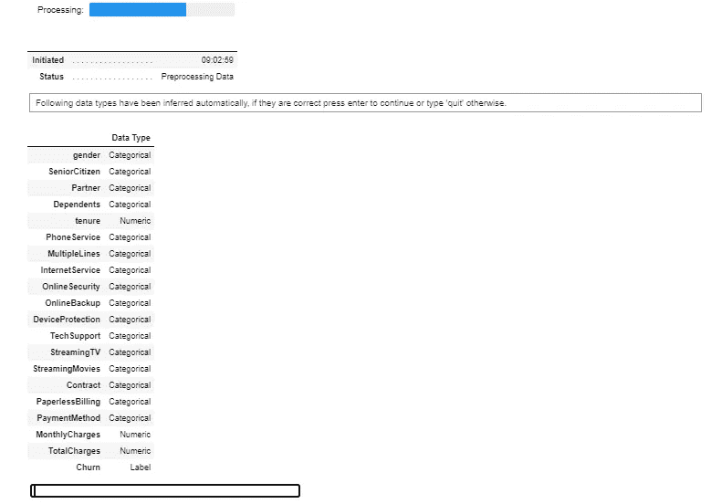

pycaret.classification 中的设置函数—按作者分类的图像

每当在 PyCaret 中初始化`setup`函数时，它都会分析数据集并推断所有输入要素的数据类型。在这种情况下，你可以看到除了`tenure` `MonthlyCharges`和`TotalCharges`之外，其他都是绝对的，这是正确的，你现在可以按回车键继续。如果数据类型推断不正确(这有时会发生)，您可以使用`numeric_feature`和`categorical_feature`来覆盖数据类型。

另外，请注意，我已经在`setup`函数中传递了`ignore_features = ['customerID']`，因此在训练模型时不会考虑它。这样做的好处是 PyCaret 不会从数据集中删除该列，它只是在模型训练的幕后忽略它。因此，当您在最后生成预测时，您不需要担心自己将 IDs 连接回来。

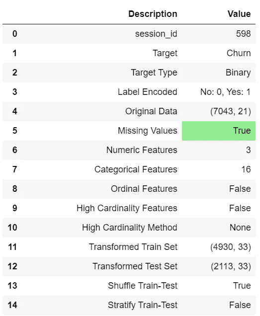

设置的输出-为显示而截断-作者提供的图像

# 👉模型训练和选择

现在数据准备工作已经完成，让我们使用`compare_models`功能开始培训过程。此函数训练模型库中可用的所有算法，并使用交叉验证评估多个性能指标。

```
**# compare all models**
best_model = compare_models(sort='AUC')
```

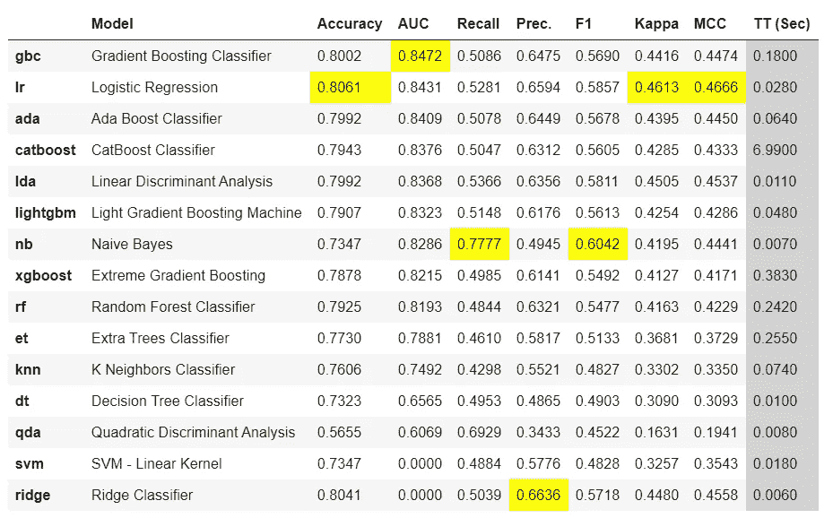

compare_models 的输出—按作者分类的图像

基于 **AUC** 的最佳模型是`Gradient Boosting Classifier` 。使用 10 倍交叉验证的 AUC 为 0.8472。

```
**# print best_model parameters**
print(best_model)
```


最佳模型参数—作者图片

# **超参数调谐**

您可以使用 PyCaret 中的`tune_model`函数来自动调整模型的超参数。

```
**# tune best model**
tuned_best_model = tune_model(best_model)
```

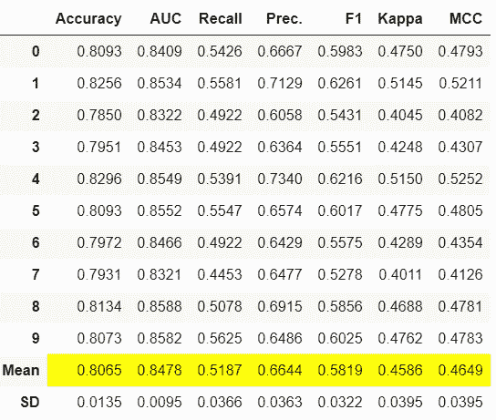

tune_model 结果—作者提供的图片

请注意，AUC 从`0.8472`到`0.8478`略有增加。

# 模型分析

```
**# AUC Plot**
plot_model(tuned_best_model, plot = 'auc')
```

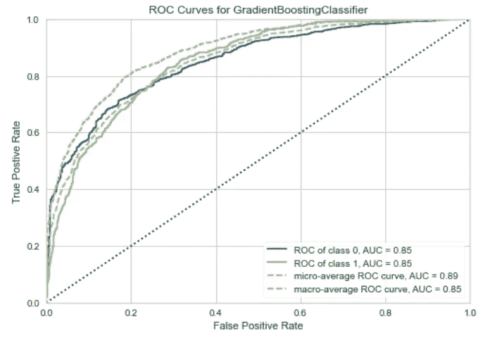

AUC 图—作者提供的图像

```
**# Feature Importance Plot**
plot_model(tuned_gbc, plot = 'feature')
```

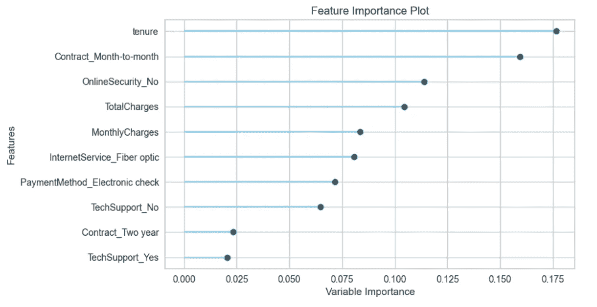

特征重要性图—按作者分类的图像

```
**# Confusion Matrix**
plot_model(tuned_best_model, plot = 'confusion_matrix')
```

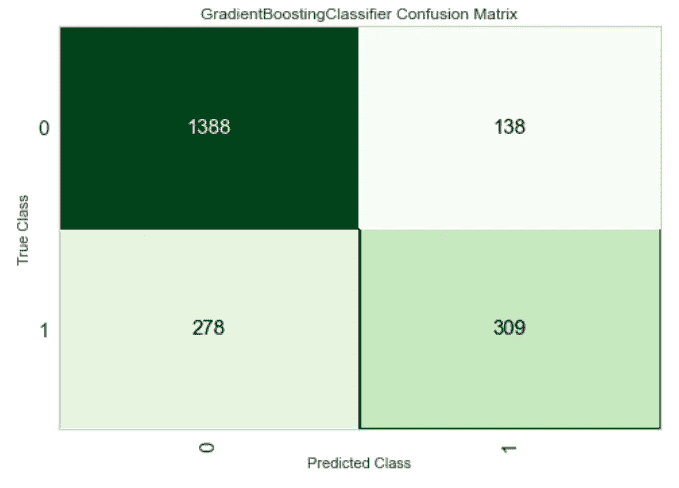

混淆矩阵梯度推进分类器—图片由作者提供

这个混淆矩阵在测试集上，测试集包括我们 30%的数据(2，113 行)，我们有 309 个 ***真阳性*** (15%) —这些是我们将能够延长生命周期价值的客户。如果我们没有预测到，那么就没有干预的机会。

我们也有 138 (7%) ***误报*** 我们将会损失金钱，因为提供给这些客户的促销只是额外的成本。

1388 个(66%)是真阴性(好客户)，278 个(13%)是 ***假阴性*** (这是错过的机会)。

到目前为止，我们已经训练了多个模型，以选择给出最高 AUC 的最佳模型，然后调整最佳模型的超参数，以在 AUC 方面获得更多一点的性能。然而，最好的 AUC 不一定转化为最好的商业模式。

在一个流失模型中，通常 ***真阳性*** 的回报与 ***假阳性*** 的成本大相径庭。让我们使用以下假设:

*   将向所有被识别为流失的客户提供 1000 美元的代金券(真阳性+假阳性)；
*   如果我们能够阻止客户流失，我们将获得 5000 美元的客户终身价值。

使用这些假设和上面的混淆矩阵，我们可以计算该模型的美元影响:

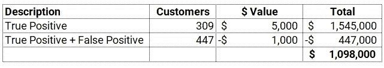

模型对 2，113 名客户的影响——图片由作者提供

这是一个很好的模式，但问题是它不是一个商业智能模式。与没有模型相比，它做得非常好，但是我们如何训练和选择一个模型来最大化商业价值。为了实现这一目标，我们必须使用业务指标来训练、选择和优化模型，而不是任何传统的指标，如 AUC 或准确性。

# **👉在 PyCaret** 中添加自定义指标

多亏了 PyCaret，使用`add_metric`函数可以非常容易地实现这一点。

```
**# create a custom function** def calculate_profit(y, y_pred):
    tp = np.where((y_pred==1) & (y==1), (5000-1000), 0)
    fp = np.where((y_pred==1) & (y==0), -1000, 0)
    return np.sum([tp,fp])**# add metric to PyCaret** add_metric('profit', 'Profit', calculate_profit)
```

现在让我们运行`compare_models`看看神奇之处。

```
**# compare all models**
best_model = compare_models(sort='Profit')
```

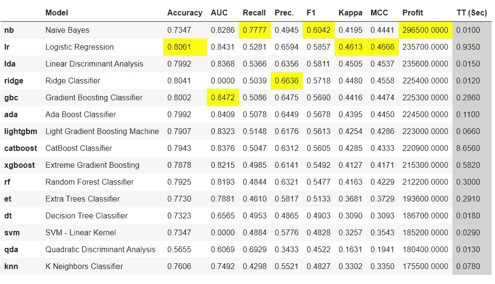

compare_models 的输出—按作者分类的图像

请注意，这次添加了一个新列`Profit`，令人惊讶的朴素贝叶斯是一个在`AUC`方面相当糟糕的模型，但在利润方面却是最好的模型。让我们看看如何:

```
**# confusion matrix**
plot_model(best_model, plot = 'confusion_matrix')
```

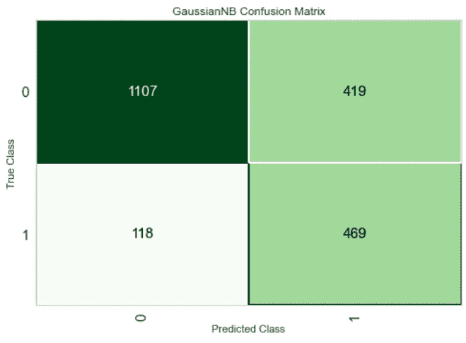

混淆矩阵朴素贝叶斯-作者图片

客户的总数仍然是一样的(测试集中有 2，113 个客户)，现在发生变化的是模型如何在误报和漏报上出错。让我们用同样的假设(如上所述),用一些美元价值来反对它:

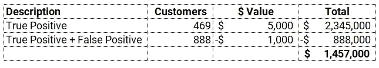

模型对 2，113 名客户的影响——图片由作者提供

> ***嘭！*** *我们刚刚增加了约 400，000 美元的利润，其 AUC 比最佳型号低 2%。这是怎么发生的？首先，AUC 或任何其他现成的分类指标(*准确度、召回率、精确度、F1、Kappa 等)。*)不是一个商业智能指标，因此它没有考虑风险和回报。添加自定义指标并将其用于模型选择或优化是一个很好的想法和正确的方法。*

我希望你会喜欢 PyCaret 的简单易用。只需几行代码，我们就能够训练多个模型，并选择对业务至关重要的模型。我是一个普通的博客作者，我主要写 PyCaret 及其在现实世界中的用例，如果你想自动收到通知，你可以在 [Medium](https://medium.com/@moez-62905) 、 [LinkedIn](https://www.linkedin.com/in/profile-moez/) 和 [Twitter](https://twitter.com/moezpycaretorg1) 上关注我。


PyCaret —作者图片


PyCaret —作者图片

使用 Python 中的这个轻量级工作流自动化库，您可以实现的目标是无限的。如果你觉得这很有用，请不要忘记给我们 GitHub 库上的⭐️。

想了解更多关于 PyCaret 的信息，请在 LinkedIn 和 Youtube 上关注我们。

加入我们的休闲频道。邀请链接[此处](https://join.slack.com/t/pycaret/shared_invite/zt-p7aaexnl-EqdTfZ9U~mF0CwNcltffHg)。

# 重要链接

[文档](https://pycaret.readthedocs.io/en/latest/installation.html)
[博客](https://medium.com/@moez_62905)
[GitHub](http://www.github.com/pycaret/pycaret)
[stack overflow](https://stackoverflow.com/questions/tagged/pycaret)
[安装 PyCaret](https://pycaret.readthedocs.io/en/latest/installation.html) [笔记本教程](https://pycaret.readthedocs.io/en/latest/tutorials.html) [投稿于 PyCaret](https://pycaret.readthedocs.io/en/latest/contribute.html)

# 更多 PyCaret 相关教程:

</machine-learning-in-alteryx-with-pycaret-fafd52e2d4a>  </machine-learning-in-knime-with-pycaret-420346e133e2>  </easy-mlops-with-pycaret-mlflow-7fbcbf1e38c6>  </write-and-train-your-own-custom-machine-learning-models-using-pycaret-8fa76237374e> [## 使用 PyCaret 编写和训练您自己的自定义机器学习模型

towardsdatascience.com](/write-and-train-your-own-custom-machine-learning-models-using-pycaret-8fa76237374e) </build-with-pycaret-deploy-with-fastapi-333c710dc786>  </time-series-anomaly-detection-with-pycaret-706a6e2b2427>  </supercharge-your-machine-learning-experiments-with-pycaret-and-gradio-5932c61f80d9>  </multiple-time-series-forecasting-with-pycaret-bc0a779a22fe> 