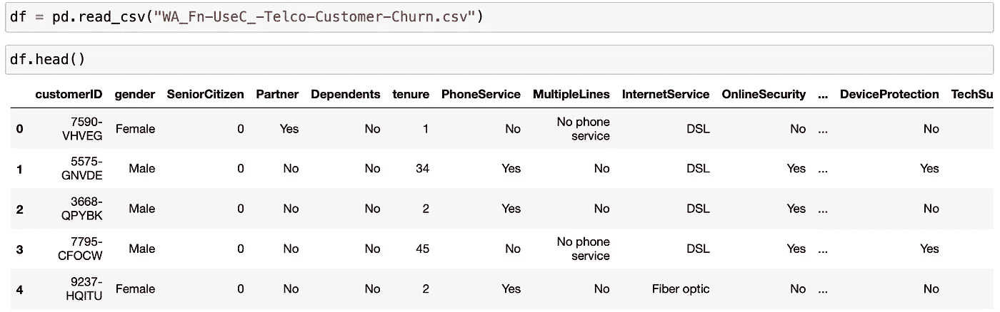
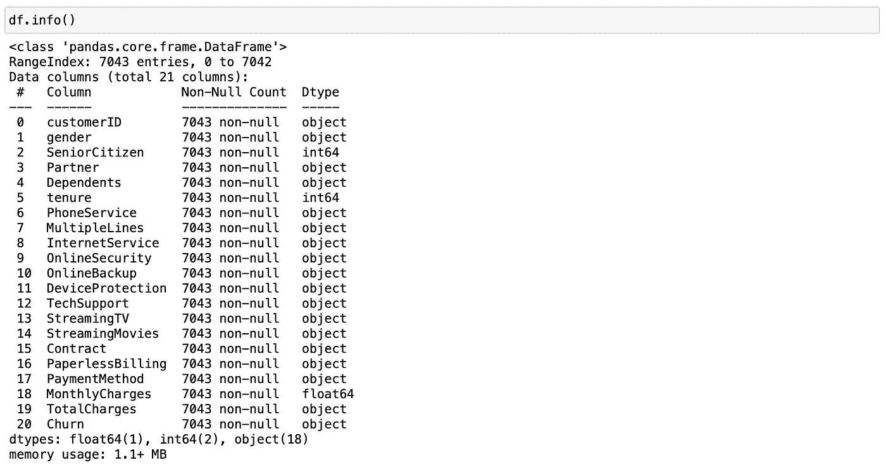
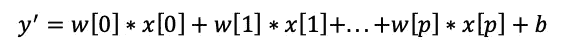
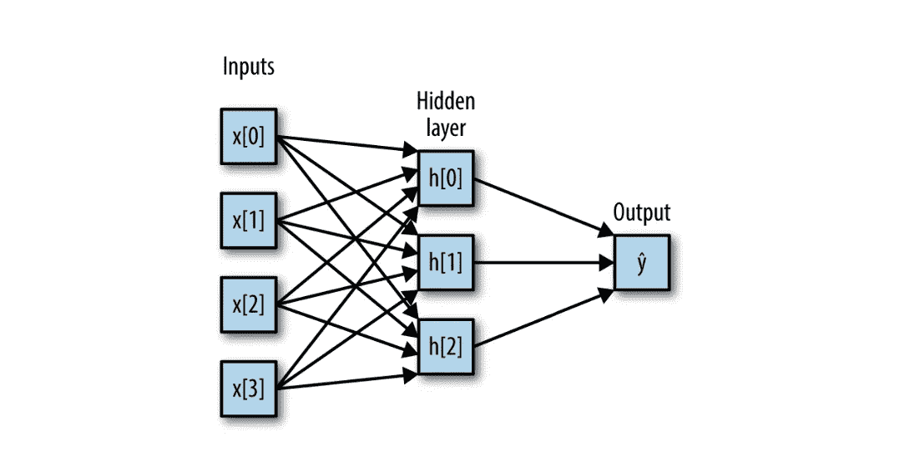
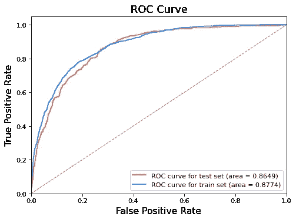
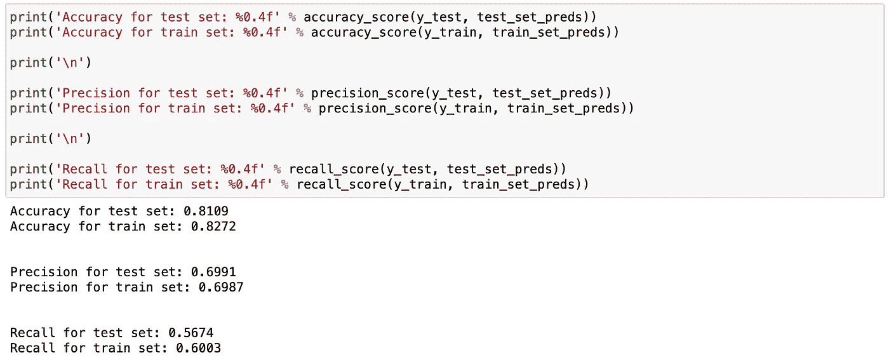

# 用神经网络预测客户流失

> 原文：<https://towardsdatascience.com/predict-customer-churn-with-neural-network-1ef8f1a1c6ab?source=collection_archive---------7----------------------->

## 运用多层感知器模型留住你的客户

> “生存还是毁灭，这是个问题…”
> 
> -威廉·莎士比亚，哈姆雷特


马修·T·雷德在 [Unsplash](https://unsplash.com/s/visual/b67d5473-01d2-4f00-8b45-2b418476294d?utm_source=unsplash&utm_medium=referral&utm_content=creditCopyText) 上的照片

# 介绍

在现实世界中，数据科学家通常从简单且易于实施的模型开始分析，如线性或逻辑回归。这种方法有各种各样的优势，比如以最小的成本获得数据的意义，并为如何解决业务问题提供思路。

在这篇博文中，我决定从反面开始，应用多层感知器模型(神经网络)来预测客户流失。我认为尝试不同的算法或者至少知道如何以更复杂的方式解决问题是非常有趣和令人兴奋的。

## **客户流失**


圣人弗里德曼在 [Unsplash](https://unsplash.com/s/photos/thinking?utm_source=unsplash&utm_medium=referral&utm_content=creditCopyText) 上的照片

*客户流失*是指客户决定停止使用某家公司的服务、内容或产品。客户流失的原因可能多种多样，最典型的是糟糕的客户服务、没有发现产品或服务的足够价值、缺乏客户忠诚度以及缺乏沟通。

## **为什么预测客户流失很重要？**

留住现有客户比获得新客户成本更低。而且回头客的收入通常高于新客户。在一个竞争激烈的行业，有很多竞争者，获取客户的成本可能会更高。这就是为什么预测客户流失对于企业在他们决定离开之前留住他们变得如此重要。

## 数据

我正在使用电信公司的客户流失数据集，这是我从 [Kaggle](https://www.kaggle.com/blastchar/telco-customer-churn) 下载的。电信公司客户流失数据包含一家虚构的电信公司的信息，该公司为加利福尼亚州的 7043 名客户提供家庭电话和互联网服务。它显示哪些客户已经离开、留下或注册了他们的服务。

# 数据争论

```
import pandas as pd
import numpy as np
import matplotlib.pyplot as plt
import seaborn as sns
%matplotlib inline
```



看着这些数据，我们可以说

*   数据类型可能有问题。像 *TotalCharges* 这样的变量可能具有整数或浮点数据类型，而不是对象。
*   将所有布尔值分别从“是”、“否”更改为 1 和 0 会很有用。

# 数据清理和转换

基于所进行的探索性数据分析(EDA)，我执行了以下操作来清理和转换数据:

*   分别用 1 和 0 替换了“是”和“否”
*   通过将*总费用列*中的缺失值替换为 Nan 来处理缺失值
*   将*总费用的数据类型改为浮动*
*   删除空值
*   标准化连续变量
*   对分类变量执行一次性编码

```
# Let us replace yes and no by 1 and 0, respectively
df['Churn'] = df['Churn'].apply(lambda x: 1 if x == 'Yes' else 0)

# Handle missing values and change the data type for TotalCharges
df['TotalCharges'] = df['TotalCharges'].replace(' ', np.nan).astype(float)

# Drop Null values
df.dropna(inplace=True)

df.reset_index(inplace=True)
df.drop(columns=['index'], inplace=True)

# Transform continuous variables
df['MonthlyCharges'] = np.log(df['MonthlyCharges'])
df['MonthlyCharges'] = (df['MonthlyCharges'] - df['MonthlyCharges'].mean()) / df['MonthlyCharges'].std()
df['TotalCharges'] = np.log(df['TotalCharges'])
df['TotalCharges'] = (df['TotalCharges'] - df['TotalCharges'].mean()) / df['TotalCharges'].std()
df['tenure'] = (df['tenure'] - df['tenure'].mean()) / df['tenure'].std()

# One-hot encoding of categorical variables
# Converting boolean variables to a format for further use
df['SeniorCitizen'].loc[df.SeniorCitizen == 1] = 'Yes';
df['SeniorCitizen'].loc[df.SeniorCitizen == 0] = 'No';

df_trans = df[['tenure', 'MonthlyCharges',
               'TotalCharges', 'Churn']].copy(deep=True)

for col in list(df.columns):
    if col not in ['tenure', 'MonthlyCharges', 'TotalCharges', 'Churn'] and df[col].nunique() < 5:
        dummy_vars = pd.get_dummies(df[col])
        dummy_vars.columns = [col+ '_' + str(x) for x in dummy_vars.columns]        
        df_trans = pd.concat([df_trans, dummy_vars], axis=1)
```

经过数据转换和清理后，数据集就可以用于建模部分了。

# **用于流失预测的人工神经网络**

*人工神经网络模型(ANN)* 是一种受人类大脑如何运作启发的模型，可以被视为“深度学习”名称下的复兴。虽然深度学习在许多机器学习方法中显示出巨大的前景，但深度学习算法通常会针对特定的用例进行非常仔细的调整和定制。

## **多层感知器模型**

*多层感知器模型(MLP)* (又名普通前馈神经网络，或有时只是神经网络)可以被视为线性模型的概括，它执行多个处理阶段来做出决策。

通过线性回归的预测给出如下:



其中 y’是输入特征 x[0]到 x[p]的加权和，由学习系数 w[0]到 w[p]加权。



具有单一隐藏层的多层感知器的插图。穆勒、A. C .、&圭多、S. (2018)的图像鸣谢[2]

查看上面的多层感知器的图示，最左边的层称为输入层，连接线表示学习的系数，右边的节点表示输出，它是输出的加权和，隐藏层表示中间处理步骤，使用加权和组合该步骤以产生最终结果。

有一个技巧使 MLP 比线性回归模型更强大，当非线性函数应用于结果时，如校正非线性(relu)或 tangens 双曲线(tanh)，在计算每个隐藏单元的加权和后发生。然后，该函数的结果用于计算输出 y' [2]。

***使用 MLP 的优点:***

*   可以学习数据中的非线性行为
*   能够实时学习模型(在线学习)

***MLP 模式的弊端:***

*   具有隐藏层的模型具有非凸损失函数，该函数具有多个局部最小值。因此，不同的随机权重初始化会产生不同的验证准确度
*   该模型需要调整几个超参数，如隐藏神经元的数量、迭代次数和层数
*   多层感知器对特征缩放很敏感[3]。

# **用 MLP 预测客户流失**

让我们用 MLP 模型来预测客户流失。

```
# import packages
from keras.models import Sequential
from keras.layers import Dense
from sklearn.model_selection import train_test_split

# define target variable and features
target = 'Churn'
features = [x for x in list(df_trans.columns) if x != target]

model = Sequential()
model.add(Dense(16, input_dim=len(features), activation='relu'))
model.add(Dense(8, activation='relu'))
model.add(Dense(1, activation='sigmoid'))

# compile the model
model.compile(loss='binary_crossentropy',
              optimizer='adam', metrics=['accuracy'])

X_train, X_test, y_train, y_test = train_test_split(df_trans[features], 
                                                    df_trans[target], 
                                                    test_size=0.2,
                                                    random_state=23)

%%time
history = model.fit(X_train, y_train, epochs=50, batch_size=100)
```

我们使用顺序模型，这是一种层线性堆叠的模型。第一层是输入层，其中 *input_dim* 为特征数，输出单元数为 *16* 。在隐藏层，我们使用 *8* 输出单元。最后，在输出层，我们只有一个输出单元，它返回客户流失的概率。在输入和隐藏层，我们使用了 *relu* 激活函数，而在输出- *sigmoid* 激活函数。

## **模型评估**

让我们使用准确度、精确度和召回率，以及*受试者操作特征(ROC)* 曲线和*曲线下面积(AUC)* 来评估该模型。

```
from sklearn.metrics import accuracy_score, precision_score, 
                            recall_score, confusion_matrix, roc_curve, auc

train_set_preds = [round(x[0]) for x in model.predict(X_train)]
test_set_preds = [round(x[0]) for x in model.predict(X_test)]

train_preds = [x[0] for x in model.predict(X_train)]
test_preds = [x[0] for x in model.predict(X_test)]

train_fpr, train_tpr, train_thresholds = roc_curve(y_train, train_preds)
test_fpr, test_tpr, test_thresholds = roc_curve(y_test, test_preds)

train_roc_auc = auc(train_fpr, train_tpr)
test_roc_auc = auc(test_fpr, test_tpr)

# Let us visualize ROC
plt.figure(figsize=(7, 5), dpi=80)
plt.plot(test_fpr,
         test_tpr,
         color='tomato',
         label='ROC curve for test set (area = %0.4f)' % test_roc_auc)
plt.plot(train_fpr,
         train_tpr,
         color='dodgerblue',
         label='ROC curve for train set (area = %0.4f)' % train_roc_auc)
plt.plot([0, 1], [0, 1], color='gray', lw=1, linestyle='--')
plt.xlim([0.0, 1.0])
plt.ylim([0.0, 1.05])
plt.xlabel('False Positive Rate', fontsize=14)
plt.ylabel('True Positive Rate', fontsize=14)
plt.title('ROC Curve', fontsize=16)
plt.legend(loc="lower right")

plt.show()
```



MLP 模型的 ROC 曲线

测试集的 AUC 约为 0.87，这表明该模型可以很好地预测客户是否会流失。

让我们看看准确度、精确度和召回率。



训练集和测试集的准确性是相似的，这很好，因为它表明我们没有过度拟合或欠拟合模型。*精度*(预测正值)约为 0.69，可见模型对会流失客户的预测有多好。

# **总结**

*   我们训练了多层感知器模型，得到测试集的 AUC = 0.87，这表明该模型可以很好地预测客户是否会流失
*   通常，神经网络需要时间来训练，这在现实世界中是很困难的。因此，最好从像逻辑回归这样的基准模型开始，然后，如果需要高精度来训练其他更复杂的模型
*   另一方面，尝试新的模式，看看它们如何带来新的见解来解决业务问题，总是那么令人兴奋。

感谢您的阅读，请在下面评论您对机器学习/深度学习在客户流失方面的想法。要查看我的更多帖子，请订阅 Medium 和 [LinkedIn](https://www.linkedin.com/in/aigerimshopenova/) 。

[Jupyter 笔记本](https://github.com/aig3rim/Predict_customer_churn_multilayer_perceptron/blob/main/churn_prediction_MLP.ipynb)可以在我的 [GitHub](https://github.com/aig3rim) 上找到。

# 参考

1.  黄耀辉(2019)。市场营销数据科学实践:使用 Python 和 R. Birmingham 通过机器学习改进您的市场营销策略。
2.  米勒，A. C .，&圭多，S. (2018)。Python 机器学习导论:数据科学家指南。塞瓦斯托波尔，加利福尼亚州:奥赖利媒体。
3.  1.17.神经网络模型(受监督的)。(未注明)。2021 年 3 月 7 日检索，来自[https://sci kit-learn . org/stable/modules/neural _ networks _ supervised . html](https://scikit-learn.org/stable/modules/neural_networks_supervised.html)