# 精确预测客户流失

> 原文：<https://towardsdatascience.com/predict-customer-churn-with-precision-56932ae0e5e3?source=collection_archive---------15----------------------->

## 平衡精确度和召回率，实现可操作的保留策略

[奥利维尔·勒莫阿尔](https://stock.adobe.com/contributor/393/olivier-le-moal?load_type=author&prev_url=detail)使用[土坯股票](https://stock.adobe.com/images/customer-churn-rate-concept-client-or-employee-attrition/298817415?prev_url=detail)许可证

准确性，请退居二线。我们今天将推广精确和召回。

> **“客户流失**，又称**客户流失**、**客户流失**，或**客户流失**，是客户或顾客的损失”——维基百科

对于这篇文章，让我们就“客户流失是坏事”和“客户保留是好事”这一普遍假设达成一致。

A**b 摘要:**本文从不同的角度分析了一个被广泛使用的客户流失数据集，该数据集没有合适的功能来盲目部署我们可以生成的最佳预测模型。下面我将分享问题陈述、数据准备步骤、特征分析、可视化，并从我尝试用于预测客户流失的 Scikit-learn 分类模型中选择 Python 代码。最重要的是，我将展示通过**沿着精确召回曲线移动决策阈值概率，您可能会发现一些流失案例，在这些案例中，您有足够的信心部署真正的保留行动。**

为了简洁起见，我没有包括这个项目中使用的全部代码。详情请参考我在 [**GitHub**](https://github.com/cutterback/p03-telco-churn-model) **上的 Jupyter 笔记本。**

# 商业目标

一家销售住宅语音和互联网服务的电信公司(以下简称“TelCo”)正经历着近 27%的客户流失率。这种程度的流失可能足以让现实生活中的公司破产。鉴于缺乏公开可用的客户数据，我们使用了 [IBM Cognos Telco 客户流失](https://www.kaggle.com/yeanzc/telco-customer-churn-ibm-dataset)模拟数据集，其中包含 7，043 个客户的标记流失。

电信公司希望部署客户维系战略来减少客户流失。公司要求我们:

*   开发预测模型，对客户流失风险进行分类
*   解释每个预测因子对模型预测的相对影响
*   提出减少客户流失的潜在方法

这里我们有一个二元分类问题要解决，所以我们将目标因变量设置为 1(流失)或 0(保留)。我们将使用度量 ROC AUC 来优化我们的估计量。ROC AUC 是一个**R**OO**C**特性下的**A**rea**U**C 曲线。

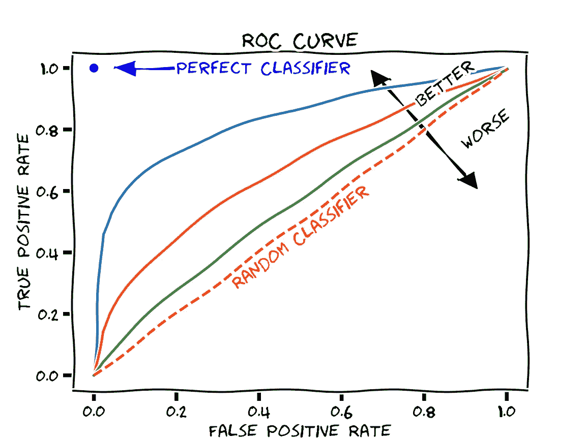

图片由 CC0 的马丁·托马斯通过[维基共享资源](https://commons.wikimedia.org/wiki/File:Roc-draft-xkcd-style.svg)

对于 ROC AUC，随机分类器得分为 0.5，而完美分类器得分为 1.0。我喜欢 ROC AUC，因为它推荐优化真阳性和假阳性率的模型，这些真阳性和假阳性率明显高于随机机会，这不能保证作为评估指标的准确性。这很重要，因为在采取保留措施时，我们需要对我们的正面类别预测(流失)有信心。

关于 ROC AUC 的更多细节，我推荐[这篇文章](/understanding-auc-roc-curve-68b2303cc9c5)。

# 客户流失原始数据

让我们先来看看我们必须处理的 33 个列。将源文件转换为 pandas 数据框后，前 5 条记录显示:

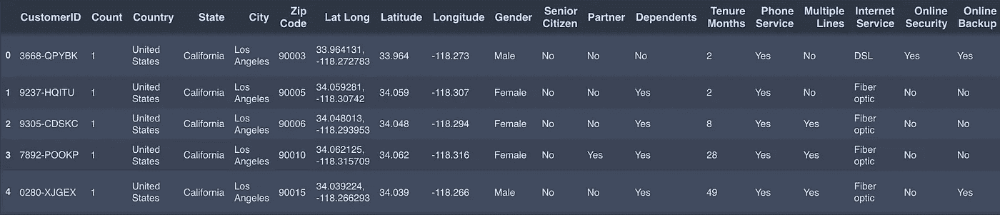

[截图](https://github.com/cutterback/p03-telco-churn-model/blob/75ef99ec1c143279752d24ba08dd7b40ebcd7a0d/Telco-Churn-Classification-Model.ipynb)作者|前 19 列…

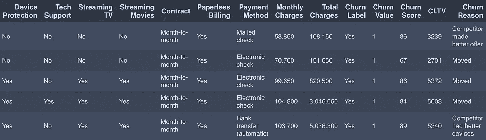

[作者截图](https://github.com/cutterback/p03-telco-churn-model/blob/75ef99ec1c143279752d24ba08dd7b40ebcd7a0d/Telco-Churn-Classification-Model.ipynb)|…最后 14 栏

当考虑列作为预测器的潜在用途时，按域对列进行分组是很有帮助的。GitHub 笔记本中有一个数据字典，但我是这样看的:

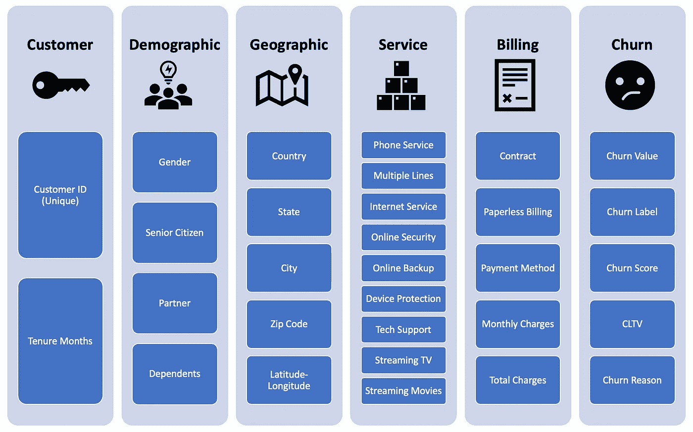

作者图片

*   客户—唯一的 customerID 表示我们的样本中有 7，043 个唯一的客户，客户期限从 0 到 72 个月不等
*   人口统计—四个有用的客户人口统计字段
*   地理—精确到地理坐标的客户位置
*   服务——八项收费服务(互联网分流到光纤、DSL 或无)和两个流指示器
*   计费—包括合同类型、计费配置和计费费用
*   流失—流失价值(我们的目标)、流失原因，以及流失分数和客户终身价值的两个内部电信指标。

这里要注意一点。该数据集仅使用来自不同的 [Kaggle 竞赛](https://www.kaggle.com/blastchar/telco-customer-churn)的 23 列进行了广泛建模。我选择了这个有 33 个专栏的版本，希望额外的地理字段能够实现更深入的见解。最后，他们没有得到回报。当 IBM 将这些数据放在一起时，他们似乎只给 1，653 个加利福尼亚邮政编码中的每一个分配了 4 或 5 个客户。经过一番努力使地理字段变得有用后，我不再感觉收益递减。

# 数据准备

我为数据准备和特征创建编写了六个函数。我使用 scikit-learn 库通过管道中的 FunctionTransformer 公开了这些函数。

我创建的最有趣的 3 个功能是:

*   将 4 种付款方式映射到“自动付款方式”(1 =是)。
*   将 8 项服务映射到描述核心服务(电话、光纤/DSL 或捆绑语音和互联网)的“产品概况”列，同时还指示分层的“附加”服务，如多线路、技术支持等。
*   创建了“客户收费指数”，衡量每个客户相对于标准价格的相对定价。我使用所有培训数据中的服务组合和增量平均定价来得出每项服务的标准独立价格。在那里，我将每个客户每月的费用与他们一揽子服务的标准价格进行了对比。

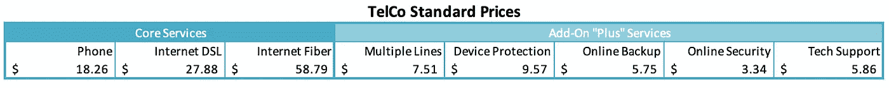

作者图片

在数据剖析和特征分析之前，我将数据分成 80%的训练和 20%的测试。所有分析仅在训练数据上执行，以避免数据泄漏到任何预测模型中。

# 客户流失特征分析

现在谈谈一些基本的见解。

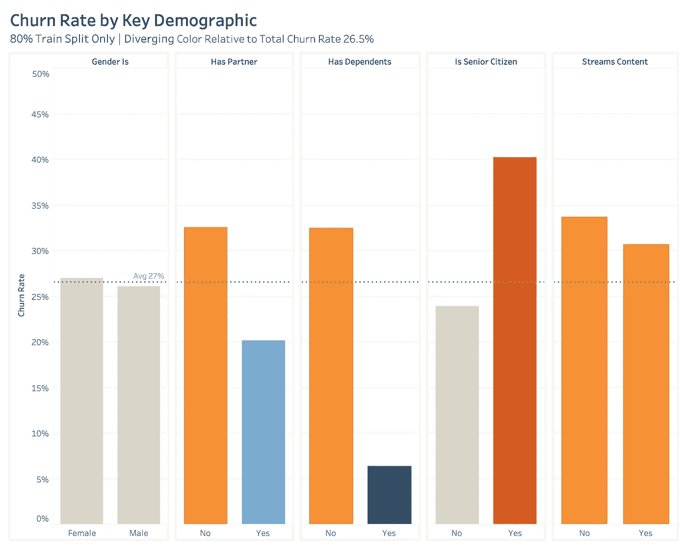

[Tableau 图](https://github.com/cutterback/p03-telco-churn-model/blob/75ef99ec1c143279752d24ba08dd7b40ebcd7a0d/Telco_Churn_Training_Analysis.twb)作者

从上面可以看出，“有伴侣”、“有受抚养人”、“不是老年人”和“流媒体内容”的流失率较低。没有区分性别。

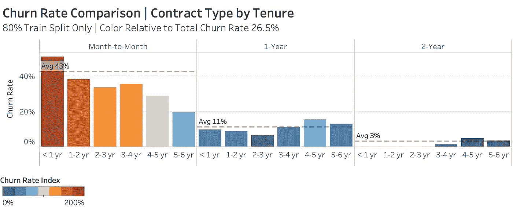

[作者 Tableau 图](https://github.com/cutterback/p03-telco-churn-model/blob/75ef99ec1c143279752d24ba08dd7b40ebcd7a0d/Telco_Churn_Training_Analysis.twb)

逐月合同存在一个主要问题，相对于定期合同的客户(11%和 3%)，逐月合同的客户流失率为 43%。更高的客户任期会降低 M-T-M 接触的流失率，但直到 4-5 年的任期，流失率才会达到 26.7%的总体平均水平。很明显，M-T-M 合同以及相关的定价是有问题的。

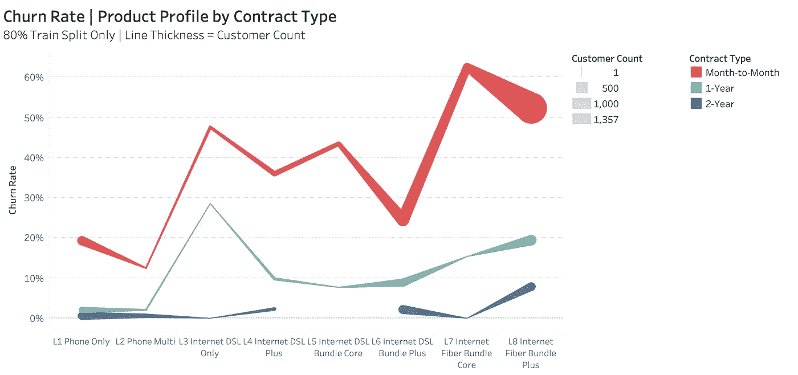

[作者制作的 Tableau 图表](https://github.com/cutterback/p03-telco-churn-model/blob/75ef99ec1c143279752d24ba08dd7b40ebcd7a0d/Telco_Churn_Training_Analysis.twb)

从产品角度来看，M-T-M 合同中的互联网光纤使客户流失率超过 50%！请注意，电信公司总是要求将电话与互联网光纤捆绑在一起，最大的客户群是签订了 M-T-M 光纤合同的客户。为其 M-T-M 合同添加“附加”服务的客户流失率略低。

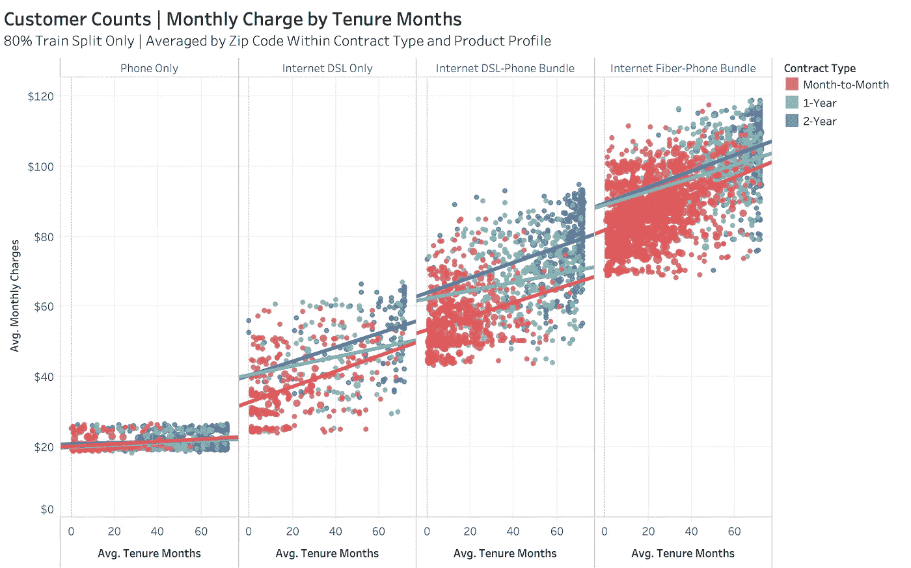

[作者制作的 Tableau 图表](https://github.com/cutterback/p03-telco-churn-model/blob/75ef99ec1c143279752d24ba08dd7b40ebcd7a0d/Telco_Churn_Training_Analysis.twb)

客户任期与较高的服务水平和月费正相关(具有统计显著性 p 值)。我在这里假设客户会随着时间的推移增加服务。我们还可以从上面的散点图中看到，任何互联网服务的 M-T-M 合同的平均月费用实际上比定期合同的*要低。鉴于流失率更高，这并不直观。这可能表明，需要 M-T-M 合约的客户比那些愿意签署条款的客户对价格更敏感。*

*在 Python 中运行 Pearson 相关性在很大程度上证实了我们在之前的图中看到的关联。*

*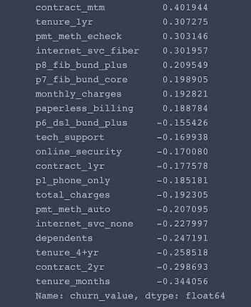*

*[作者截图](https://github.com/cutterback/p03-telco-churn-model/blob/75ef99ec1c143279752d24ba08dd7b40ebcd7a0d/Telco-Churn-Classification-Model.ipynb)*

# *预测客户流失*

*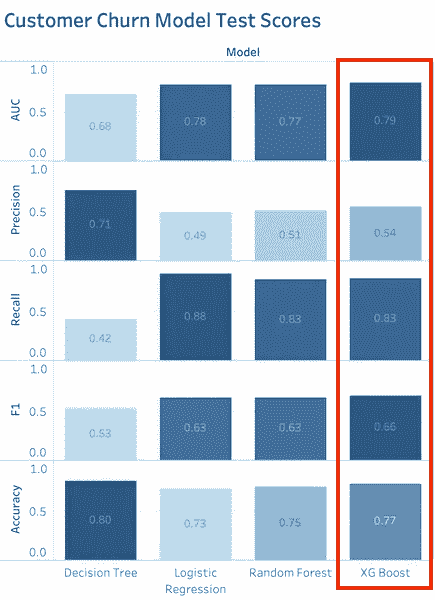*

*[作者制作的 Tableau 图表](https://github.com/cutterback/p03-telco-churn-model/blob/75ef99ec1c143279752d24ba08dd7b40ebcd7a0d/Telco_Model_Scores.twb)*

*我在 80%的训练分裂上训练了四个分类模型:决策树、逻辑回归、随机森林和 XGBoost。*

*对于后 3 个模型，我使用 GridSearchCV 迭代相关参数，并根据来自 5 重交叉验证的最高平均 ROC AUC 重新调整最佳估计值。后三种型号的性能相似。*

*我选择 XGBoost ensemble 模型，因为它具有最高的 AUC 0.79、0.83 的强召回率和 0.54 的更高精度。*

*我对 16 个特性应用了标准缩放，目标设置为“二进制:逻辑”,以预测 XGBoost 模型中的二进制流失结果。*

*instantiate_grid 函数接受模型和网格参数，并建立标准评分标准来实例化 GridSearchCV 对象。*

*通过反复试验，我迭代了 XGBoost 的特性组合和关键参数，以优化模型的评分。对于所有的迭代，我包含了一个正的类权重 2.8，以纠正发生率为 26.7%的适度的类失衡。*

*最佳估计器的最终参数只选择了 4 个最大深度级别，100 个估计器，以及更保守的 L2 正则化 2。*

*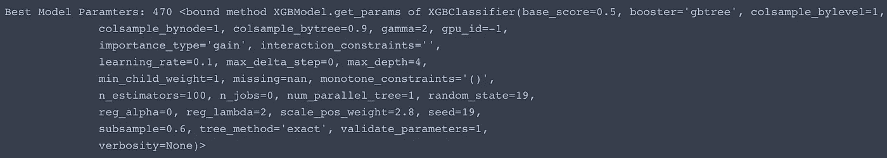*

*[作者截图](https://github.com/cutterback/p03-telco-churn-model/blob/75ef99ec1c143279752d24ba08dd7b40ebcd7a0d/Telco-Churn-Classification-Model.ipynb)*

*使用模型的系数作为特征重要性的代理，我们看到我们的 1 年和 2 年合同(超过基线 M-T-M)是迄今为止最强的影响。互联网光纤产品和有家属的客户具有中等重要性，其余特征影响较小。*

*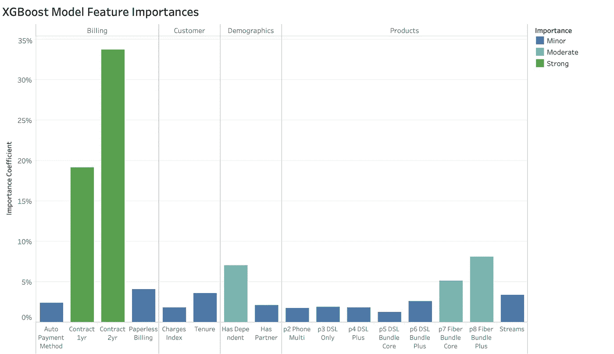*

*[Tableau 图](https://github.com/cutterback/p03-telco-churn-model/blob/75ef99ec1c143279752d24ba08dd7b40ebcd7a0d/Feature_Importances.twb)作者*

*交叉验证和其他参数有助于模型避免过度拟合，因为测试分数与训练一致。*

*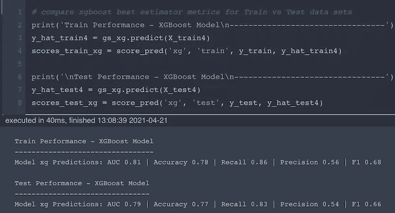*

*[截图](https://github.com/cutterback/p03-telco-churn-model/blob/75ef99ec1c143279752d24ba08dd7b40ebcd7a0d/Telco-Churn-Classification-Model.ipynb)作者*

*所以我们来看看测试预测的混乱矩阵。*

*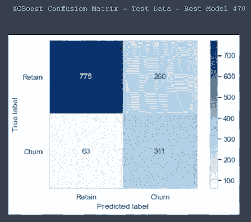*

*[作者截图](https://github.com/cutterback/p03-telco-churn-model/blob/75ef99ec1c143279752d24ba08dd7b40ebcd7a0d/Telco-Churn-Classification-Model.ipynb)*

*我对 83% (311/374)的测试预测召回率感到满意。我们的 XGBoost 模型可以正确预测 6 个真实客户流失案例中的 5 个，这非常好。*

*然而，最佳模型的精度为 54% (311/571)，这是不可接受的。我们的模型中有近 1/2 的流失预测是不正确的(误报)。为了放心地部署模型，我们需要更高的精度。*

# *移动决策阈值*

*有了这个模型，我不建议电信公司盲目地使用 0.5%流失概率的决策阈值(DT)来应用默认预测。假设所有客户有超过 50%的可能性会流失，我们可能会经历过多的成本、客户困惑和可能不必要的流失。我们希望将决策阈值提高到客户流失概率，使我们的准确率超过 80%。*

*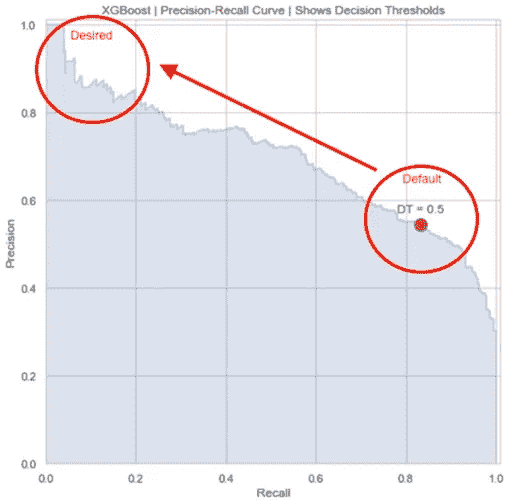*

*[作者截图](https://github.com/cutterback/p03-telco-churn-model/blob/75ef99ec1c143279752d24ba08dd7b40ebcd7a0d/Telco-Churn-Classification-Model.ipynb)*

*通过绘制作为决策阈值函数的精确度和回忆分数，我们可以看到达到我们想要的精确度所需的概率。虽然我们会将流失客户的比例限制在召回的 20%以下，但我们会更有信心采取更精确的行动。*

*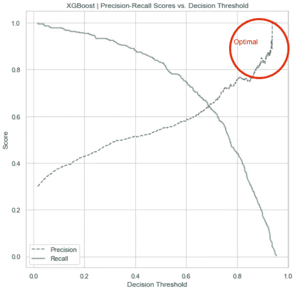*

*[作者截图](https://github.com/cutterback/p03-telco-churn-model/blob/75ef99ec1c143279752d24ba08dd7b40ebcd7a0d/Telco-Churn-Classification-Model.ipynb)*

*使用方法 predict_proba 对我们的最佳估计，我重新分配了各种决策阈值的预测类。我建议将模型分为三层方法，涵盖以下增量流失案例:*

1.  ***高精度**:DT = 0.9–1.0/84%精度/ 18%召回率(67 个真位置，13 个假位置)*
2.  ***中等精度**:DT = 0.8–0.9/71%精度/ 26%召回率(98 个真位置，40 个假位置)*
3.  ***低精度**:DT = 0.7–0.8/49%精度/ 19%召回率(70 个真位置，72 个假位置)*

*电信公司可以根据 precision groups 确定其保留行动的目标，涵盖以下 3 种情况下所有流失案例的 63%:*

1.  ***高精度** —以最积极的保留为目标，如通过折扣或增加免费服务的主动推广来保留最有可能流失的客户。*
2.  ***中等精度** —以更通用、更低成本的方法为目标，如授权客户服务代理在某些情况下拯救客户。*
3.  ***低精度** —将这些客户添加到观察名单，或一般的挽留沟通工作。*

# *扩展数据收集*

*我们已经看到，一些基本数据可能足以预测客户流失，并足以采取行动。虽然这是一个好的开始，但我强烈建议电信公司投资这些领域的数据收集，以提高客户流失预测。*

*   *产品—服务利用率、质量水平和 SLA、设备、竞争对手覆盖范围*
*   *客户服务—联系人/电话/电子邮件、票证、门户/应用程序使用、情感分析*
*   *营销—相对价格点、获得的价值、待定合同续签、营销参与、终身客户价值*
*   *人口统计—信用评分、收入、房屋所有权、家庭规模、角色/生命周期、居住时间*
*   *地理-街区/社区联系*

**感谢阅读本帖，并请留下评论。**

* [## 通过我的推荐链接加入媒体-查克·厄特巴克

### 加入我的推荐链接- Chuck Utterback，从我自己和所有的人那里获得高质量的文章

chuckutterback.medium.com](https://chuckutterback.medium.com/membership)*