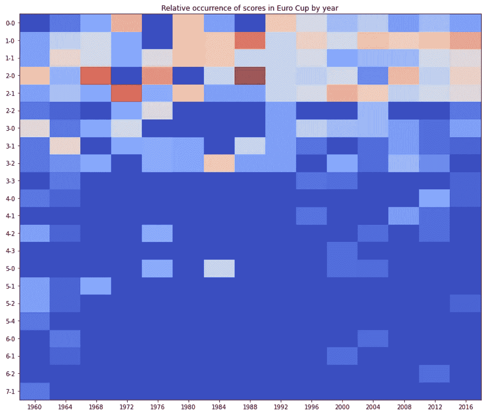

# 用简单的统计数据预测欧洲杯比赛

> 原文：<https://towardsdatascience.com/predict-euro-cup-matches-with-simple-statistics-2fc913678117?source=collection_archive---------7----------------------->

## 因为我们都知道过去的结果是未来的保证


在赢得足球友谊赛之前，我们都只是棋子

编辑:应大众要求，代码和数据现可在 [GitHub](https://github.com/sijmenw/predict-euro-cup-simple-stats) 上获得，现成代码也可在 [Kaggle](https://www.kaggle.com/sijmenvdw/predict-euro-cup-matches-with-simple-statistics) 上找到。我还添加了世界杯和欧洲杯的数据集的解析版本。你可以随意使用任何你喜欢的东西。— Sijmen

我和我的朋友们为每一届世界杯和欧洲杯开了一个足球赌局。除了巨大的荣耀和一种永恒的胜利感，这条线上没有太多东西。我想你可能会说实际上有很多风险。

无论如何，我是一个数据科学家，让我们把它用在足球比赛上。

# 这个想法

【**假设 1** 】足球不变，每届锦标赛都会出现类似的比分分布。
【**假设 2**】FIFA 排名是一个国家表现的很好指标。

我将查看欧洲杯的典型得分分布，并根据得分的发生率和国际足联在各国排名中的差异来分配得分。

例如:在一个典型的欧洲杯上，最极端的比分是 5-0，而且只出现一次。我将预测各国之间国际足联排名差异最大的比赛的得分。

之后，我寻找第二个最极端的分数，并预测它与国际足联排名第二的国家的比赛。

我继续这样做，直到所有的匹配都有一个预测的分数。

如果这没有意义，不要担心，下面有更多的例子。

# 数据

我希望找到一个网站，可以选择输出所有欧洲杯比赛，但可惜，我没有找到。 [OpenFootball](https://github.com/openfootball/euro) 看起来很有前景，但我最终没有使用它，因为 1。他们的文本文件格式令人讨厌。我不想安装他们的工具来构建数据库。

对于比赛数据，我最终使用了 [LinguaSport](http://www.linguasport.com/futbol/internacional/eurocopa/seekff.asp) ，简单的格式，容易解析，似乎什么都有。爱死了。

对于 FIFA 排名我用了[这个 Kaggle 数据集](https://www.kaggle.com/cashncarry/fifaworldranking)，非常感谢 [Alex](https://www.kaggle.com/cashncarry) 。

最后，要玩的游戏…我手工输入的。

# 履行

主表如下所示:

```
+-------------+-----------------------+------------------+-------+
|   edition   |        team 1         |      team 2      | score |
+-------------+-----------------------+------------------+-------+
| 2016-FRANCE | Wales (Cymru)         | Belgium (België) | 3-1   |
| 2016-FRANCE | Germany (Deutschland) | Italy (Italia)   | 1-1   |
| 2016-FRANCE | France                | Iceland (Ísland) | 5-2   |
| 2016-FRANCE | Portugal              | Wales (Cymru)    | 2-0   |
| 2016-FRANCE | Germany (Deutschland) | France           | 0-2   |
+-------------+-----------------------+------------------+-------+
```

每场比赛都在表格中，使用`value_counts()`和一些格式，我们得到了这个很酷的热图，显示了每个版本中出现最多的分数。请注意，只有组合才重要，即 2–1 与 1–2 相同。


欧洲杯每一届的每一个得分的出现[图片由作者提供]

下面是热图中显示的相同数据，按版本标准化。



热图显示每届欧洲杯比赛结果的相对频率[图片由作者提供]

我们可以很容易地看到最常出现的分数:1–0，1–1，2–0 和 2–1。更准确地说，下面是所有欧洲杯的每一个得分出现的百分比:

```
+-------+--------+
| score | freq.  |
+-------+--------+
| 0-0   | 9.6%   |
| 1-0   | 16.25% |
| 1-1   | 13.87% |
| 2-0   | 15.49% |
| 2-1   | 14.41% |
| 2-2   | 3.3%   |
| 3-0   | 6.6%   |
| 3-1   | 5.4%   |
| 3-2   | 6.02%  |
| 3-3   | 0.73%  |
| 4-0   | 0.98%  |
| 4-1   | 0.81%  |
| 4-2   | 1.47%  |
| 4-3   | 0.17%  |
| 5-0   | 1.78%  |
| 5-1   | 1.09%  |
| 5-2   | 0.69%  |
| 5-4   | 0.23%  |
| 6-0   | 0.41%  |
| 6-1   | 0.29%  |
| 6-2   | 0.17%  |
| 7-1   | 0.23%  |
+-------+--------+
```

我们的目标是创建与我们上面发现的分数分布相同的预测。为此，我们的下一步将是把百分比转换成出现的次数(从现在开始我们称之为 N)。

在锦标赛的第一阶段，我们将预测 36 场比赛。将这些值乘以 36 可以很好地表示 N:

```
+-------+------+
| score |  ~N  |
+-------+------+
| 0-0   | 3.46 |
| 1-0   | 5.85 |
| 1-1   | 4.99 |
| 2-0   | 5.58 |
| 2-1   | 5.19 |
| 2-2   | 1.19 |
| 3-0   | 2.37 |
| 3-1   | 1.95 |
| 3-2   | 2.17 |
| 3-3   | 0.26 |
| 4-0   | 0.35 |
| 4-1   | 0.29 |
| 4-2   | 0.53 |
| 4-3   | 0.06 |
| 5-0   | 0.64 |
| 5-1   | 0.39 |
| 5-2   | 0.25 |
| 5-4   | 0.08 |
| 6-0   | 0.15 |
| 6-1   | 0.11 |
| 6-2   | 0.06 |
| 7-1   | 0.08 |
+-------+------+
```

现在，我们必须将它们转换成离散值，因为我们无法预测一小部分匹配。我们不能简单地对数值进行四舍五入，因为这样会得出错误的总数。即舍入[0.3，0.4，0.3]将得到[0，0，0]，它们没有相同的和。

取而代之的是，我们将这些数字的底数加上一个分数，然后不断地在最大的分数上加 1，直到我们达到相同的和，见下面的代码。

```
# get the floor of each value with fraction
n = [int(x) for x in e]# create a list with only fractions
f = [x % 1 for x in e]# loop until the right sum is reached
while sum(n) < 36: # find the largest fraction, add one to N there and set to zero
    idx = np.argmax(f)
    f[idx] = 0
    n[idx] += 1
```

这导致了我们的最终 N:

```
+-------+------+---+
| score |  ~N  | N |
+-------+------+---+
| 0-0   | 3.46 | 4 |
| 1-0   | 5.85 | 6 |
| 1-1   | 4.99 | 5 |
| 2-0   | 5.58 | 6 |
| 2-1   | 5.19 | 5 |
| 2-2   | 1.19 | 1 |
| 3-0   | 2.37 | 2 |
| 3-1   | 1.95 | 2 |
| 3-2   | 2.17 | 2 |
| 3-3   | 0.26 | 0 |
| 4-0   | 0.35 | 0 |
| 4-1   | 0.29 | 0 |
| 4-2   | 0.53 | 1 |
| 4-3   | 0.06 | 0 |
| 5-0   | 0.64 | 1 |
| 5-1   | 0.39 | 1 |
| 5-2   | 0.25 | 0 |
| 5-4   | 0.08 | 0 |
| 6-0   | 0.15 | 0 |
| 6-1   | 0.11 | 0 |
| 6-2   | 0.06 | 0 |
| 7-1   | 0.08 | 0 |
+-------+------+---+
```

# 预测

现在只剩下一步了:将分数的分布与要进行的比赛相匹配。

为此，我们将创建一个包含要进行的比赛的数据框架，并添加国家的 FIFA 排名，以便我们可以对此进行排序。该表如下所示:

```
+-----------+-------------+--------+--------+-----------+
| country 1 |  country 2  | rank 1 | rank 2 | rank diff |
+-----------+-------------+--------+--------+-----------+
| turkey    | italy       |     29 |      7 |        22 |
| wales     | switzerland |     17 |     13 |         4 |
| denmark   | finland     |     10 |     54 |       -44 |
| belgium   | russia      |      1 |     38 |       -37 |
| england   | croatia     |      4 |     14 |       -10 |
+-----------+-------------+--------+--------+-----------+
```

排名 1 和排名 2 描述了该国目前的国际足联排名，排名差异描述了两者之间的差异。

最后，我们根据进球差异对得分 N 进行排序，根据 FIFA 排名差异对比赛进行排序，并将它们放在一起，从而获得我们的最终预测:

```
+-----------------+-----------------+-----+-----+--------+------+
|    country 1    |    country 2    | r 1 | r 2 | r diff | PRED |
+-----------------+-----------------+-----+-----+--------+------+
| turkey          | italy           |  29 |   7 |     22 | 1-2  |
| wales           | switzerland     |  17 |  13 |      4 | 0-0  |
| denmark         | finland         |  10 |  54 |    -44 | 3-0  |
| belgium         | russia          |   1 |  38 |    -37 | 3-1  |
| england         | croatia         |   4 |  14 |    -10 | 1-0  |
| austria         | north macedonia |  23 |  62 |    -39 | 4-2  |
| netherlands     | ukraine         |  16 |  24 |     -8 | 1-1  |
| scotland        | czech           |  44 |  40 |      4 | 1-1  |
| poland          | slovakia        |  21 |  36 |    -15 | 1-0  |
| spain           | sweden          |   6 |  18 |    -12 | 1-0  |
| hungary         | portugal        |  37 |   5 |     32 | 0-2  |
| france          | germany         |   2 |  12 |    -10 | 1-0  |
| finland         | russia          |  54 |  38 |     16 | 1-2  |
| turkey          | wales           |  29 |  17 |     12 | 0-1  |
| italy           | switzerland     |   7 |  13 |     -6 | 1-1  |
| ukraine         | north macedonia |  24 |  62 |    -38 | 3-1  |
| denmark         | belgium         |  10 |   1 |      9 | 2-2  |
| netherlands     | austria         |  16 |  23 |     -7 | 1-1  |
| sweden          | slovakia        |  18 |  36 |    -18 | 2-1  |
| croatia         | czech           |  14 |  40 |    -26 | 3-2  |
| england         | scotland        |   4 |  44 |    -40 | 3-0  |
| hungary         | france          |  37 |   2 |     35 | 0-2  |
| portugal        | germany         |   5 |  12 |     -7 | 1-1  |
| spain           | poland          |   6 |  21 |    -15 | 2-1  |
| italy           | wales           |   7 |  17 |    -10 | 1-0  |
| switzerland     | turkey          |  13 |  29 |    -16 | 2-1  |
| ukraine         | austria         |  24 |  23 |      1 | 0-0  |
| north macedonia | netherlands     |  62 |  16 |     46 | 1-5  |
| finland         | belgium         |  54 |   1 |     53 | 0-5  |
| russia          | denmark         |  38 |  10 |     28 | 0-2  |
| czech           | england         |  40 |   4 |     36 | 0-2  |
| croatia         | scotland        |  14 |  44 |    -30 | 2-0  |
| slovakia        | spain           |  36 |   6 |     30 | 0-2  |
| sweden          | poland          |  18 |  21 |     -3 | 0-0  |
| portugal        | france          |   5 |   2 |      3 | 0-0  |
| germany         | hungary         |  12 |  37 |    -25 | 3-2  |
+-----------------+-----------------+-----+-----+--------+------+
```

从表中可以看出，当国际足联排名差异较大时，国际足联排名较好的国家将获得较大的净胜球。预计两国国际足联排名相近的比赛将以平局告终。

现在只要等到比利时 5:0 击败芬兰，我就会看起来像个天才。


画了我，在事情发生后向大家展示了我对“比利时 5-0 芬兰”的预测。[图片由 [Clker](https://pixabay.com/users/clker-free-vector-images-3736/) 提供]

目前，比赛结果只能通过他们的净胜球来判断，这意味着 0-0 和 1-1(以及所有其他平局)被平等对待。通过观察得分高的国家和得分低的国家，预测可能会有所改进，但这是下一版的内容。

# 结束了

感谢阅读，如果你想了解更多，你可以在 [LinkedIn](https://www.linkedin.com/in/sijmen-van-der-willik/) 或 [GitHub](https://github.com/sijmenw?tab=repositories) 上关注我。

# 阅读更多

这个故事有第 2 部分:[用简单的统计数据预测欧洲杯比赛，但是更好(pt。2)](https://sijmenvdw.medium.com/predict-euro-cup-matches-with-simple-statistics-but-better-pt-2-b48687a6d579)

第三部分，用简单的统计数据预测欧洲杯比赛:我应该下注吗？(第三部分)。