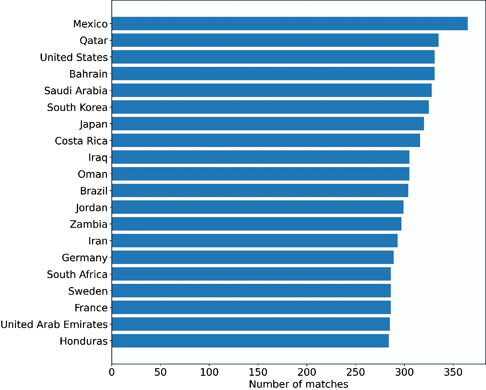
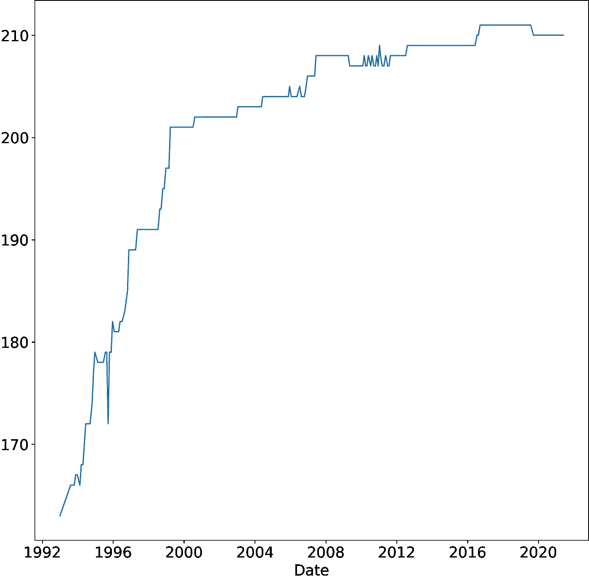
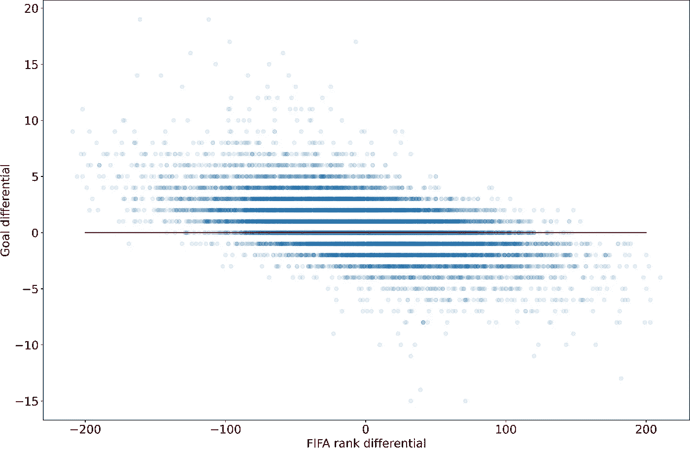
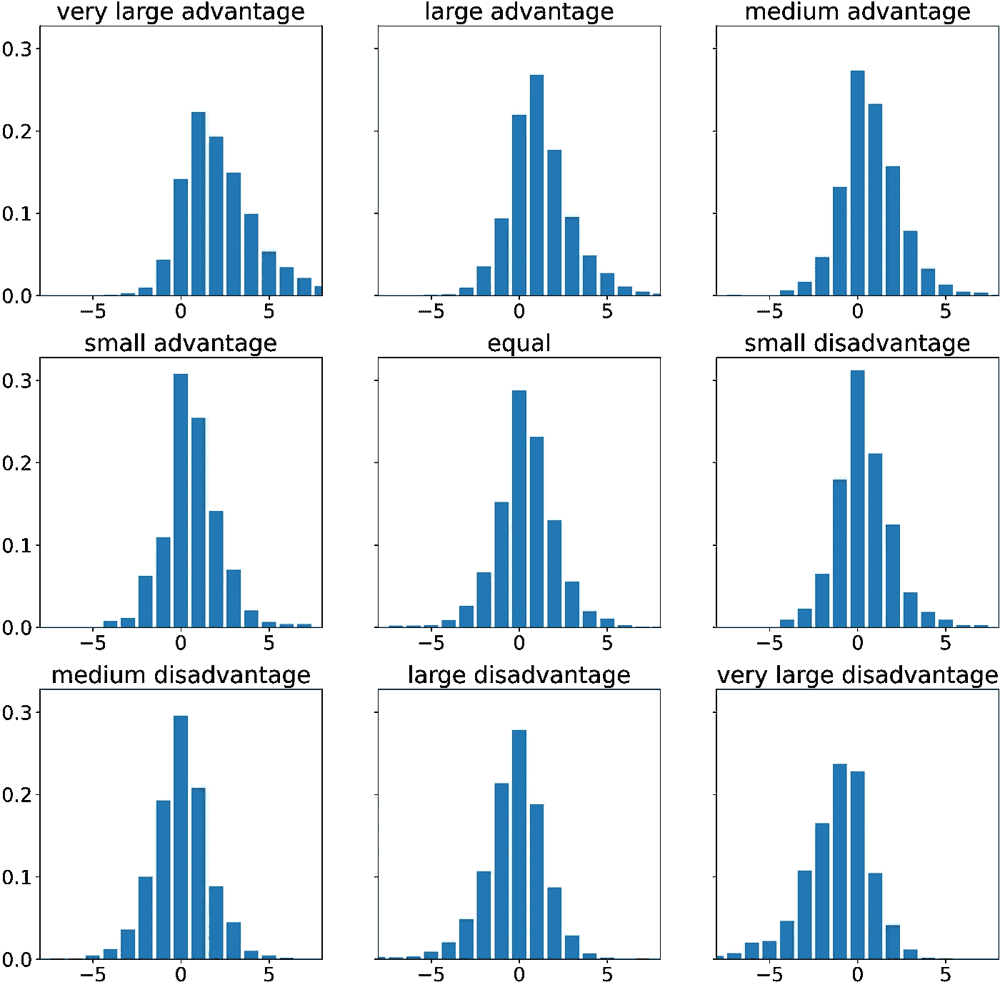
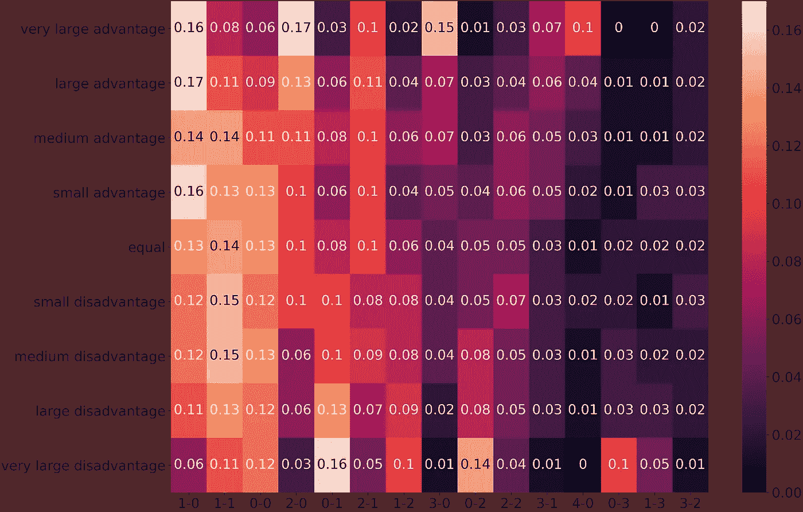

# 用简单的统计数据预测欧洲杯比赛，但更好(第二部分)

> 原文：<https://towardsdatascience.com/predict-euro-cup-matches-with-simple-statistics-but-better-pt-2-b48687a6d579?source=collection_archive---------34----------------------->

## 谁能想到大假设是危险的？

# 介绍

在我之前的文章中，我们用两个假设和统计数据预测了欧洲杯比赛。在这一集里，正好赶上淘汰阶段，我们将提升自己，对假设更加小心。

让我们更深入地了解国际足球。


仔细观察数据有助于做出更好的预测[图片由[马腾](https://unsplash.com/@laughayette)

# 数据

我们将使用两个数据集:
1。国际足球比赛
2。国际足联排名

国际足球比赛数据，我在 Kaggle by [Mart](https://www.kaggle.com/martj42) 上找到了[这个](https://www.kaggle.com/martj42/international-football-results-from-1872-to-2017)。它在 1872 年到 2017 年之间有超过 40，000 场比赛，太棒了！

对此，我在玩的时候加入了 FIFA 排名。我使用了与上一篇文章相同的数据集。再次感谢，[亚历克斯](https://www.kaggle.com/cashncarry)。

## 匆匆一瞥

我们总共和 313 个不同的国家进行了 42369 场比赛。

每个国家的比赛数量相差很大。前 20 名的出场次数总和为 17.521 次，而后 20 名只有区区 63 次。

另一个值得注意的事情是，它总是主队对客队，按照这个顺序，这意味着主场优势现象可能会扭曲对他们有利的结果。奖金部分还有更多关于主场优势的内容。



按比赛次数排序的前 20 个国家。[图片由作者提供]

## 国际足联排名

我们的国际足联排名数据集有 216 个不同的国家，从 1992 年 12 月 31 日开始。有点失望，因为我们的比赛有超过 100 个额外的国家和超过 100 年的额外比赛。



随着时间的推移，拥有国际足联排名的国家数量。[图片由作者提供]

在上面的图中，我们看到大多数国家都在 2000 年以后，所以让我们以此为分界点。

除去 2000 年以前的比赛或与没有国际足联排名的国家的比赛，我们剩下 17.701 场比赛。在我看来已经很多了。

# 第一个问题

> 国际足联的排名是判断谁将赢得比赛的好指标吗？

为了回答这个问题，我们将首先寻找一场比赛的净胜球和国家排名之间的关系。换句话说:如果一个国家的国际足联排名比他们的对手高，他们会进更多的球吗？下图表明答案是肯定的。



散点图，x 轴表示国际足联排名数字的差异，y 轴表示进球的差异。每个点代表一场比赛。红线穿过没有净胜球的比赛，意味着比赛以平局结束。请注意，国际足联的排名越高意味着排名越靠后，越好的球队排名越低。

为了可读性，上面的情节中排除了三场比赛:澳大利亚对汤加(2001 年 22-0)，澳大利亚对美属萨摩亚(2001 年 31-0)，关岛对朝鲜(2005 年 0-21)。澳大利亚在 2001 年一定是一支很无情的队伍，很高兴我不用和他们比赛。

从图中可以明显看出，国际足联排名有一定的预测价值。拥有一个较低的排名，意味着你在列表中的位置较高，与拥有一个较大的积极目标差异相关。

简而言之:如果你有一个更好的国际足联排名，你可能会得分更多。

> 但是...多了多少？

为了更深入地了解这一点，让我们来看看在比较具有相似 FIFA 级别差异的比赛组时的得分差异分布。一句话就这么多，我就分解一下。

1.  分数差异分布显示每个分数差异出现的频率
2.  上面提到的小组是由我决定的，尽管我确实问过一些更了解足球的人什么是合理的。这些组如下:

```
+-------------------------+--------------------------+
|       Group name        |   FIFA rank difference   |
+-------------------------+--------------------------+
| Very large advantage    |  over 50 ranks           |
| Large advantage         |  between 20 and 50 ranks |
| Medium advantage        |  between 10 and 20 ranks |
| Small advantage         |  between 5 and 10 ranks  |
| Equal                   |  less than 5 ranks       |
| Small disadvantage      |  between 5 and 10 ranks  |
| Medium disadvantage     |  between 10 and 20 ranks |
| Large disadvantage      |  between 20 and 50 ranks |
| Very large disadvantage |  over 50 ranks           |
+-------------------------+--------------------------+
```

优势意味着排名较低，因此在列表中的位置较高。劣势意味着相反。



各组得分差异分布。小组是由国际足联等级差异在比赛时创建的。另外，请参见上表。[图片由作者提供]

从上面的分布中，我们可以看到，在国际足联排名方面对你的对手有非常大或非常大的优势，最有可能产生 1 分差，超过 20%的结果有这种差异。拥有非常大的劣势使得-1 成为最有可能的结果。

所有其他等级差异的最高值为零，这意味着没有分数差异仍然是最有可能的结果。

# 最大的问题

> 任何一场比赛最有可能的结果是什么？

这是一个终极问题，因为预测最有可能的结果应该会给我在足球友谊赛中带来很好的结果，这就是我做这些的原因。


记住主要目标是赢得足球友谊赛。[图片由[乔治](https://unsplash.com/@giorgiotrovato)提供]

我们现在知道了最有可能的比分差距，但是差距为 1 仍然可能是 1–0、2–1 或 3–2，我们应该预测什么？

为了从一个组中得到最可能的结果，我们做了与我们用来生成上面的分布几乎相同的计算，但是这次我们看的是整个分数，而不仅仅是差值。

例如，当我们查看“非常大的优势”组时，我们发现 397 场比赛以 2-0 结束，390 场比赛以 1-0 结束，346 场比赛以 3-0 结束，等等。这意味着我们预测 2-0，因为这是最有可能的结果。

```
Top 15 most common outcomes of a match with a very large advantage for the Home Team.+---------+--------------+
| Outcome |  Occurrences |
+---------+--------------+
| 2 - 0   |          397 |
| 1 - 0   |          390 |
| 3 - 0   |          346 |
| 4 - 0   |          235 |
| 2 - 1   |          234 |
| 1 - 1   |          187 |
| 3 - 1   |          157 |
| 0 - 0   |          152 |
| 5 - 0   |          134 |
| 4 - 1   |           96 |
| 6 - 0   |           93 |
| 0 - 1   |           77 |
| 2 - 2   |           75 |
| 5 - 1   |           56 |
| 7 - 0   |           55 |
+---------+--------------+
```

请注意，在这 15 个最常见的结果中，11 个是赢，3 个是平，只有 1 个是输。

为了便于使用，我们将重复计算并将结果放在热图中。



最有可能的比赛结果热图由国际足联排名差异组。值是相对发生率，即 0.17 表示该组中所有匹配的 17%导致该结果。[图片由作者提供]

# 做预测

> 酷，我如何使用这个？

要使用此热图预测匹配:

1.  以 FIFA 排名确定主队优势。即荷兰(排名第 16)对捷克(排名第 40)将是:“巨大优势——20 到 50 名之间的排名差异”。
2.  找到最亮的地方。从热图中查找最有可能的结果，在“大优势”行中，我们发现结果 1–0 的值最高。
3.  就是这样。

如果你觉得特别勇敢，你可以考虑选择一个低价值的结果。

这里还有一个更大版本的热图。

# 实际的预测

```
+-------------+-------------+----+----+--------------+-------+
|  Country 1  |  Country 2  | r1 | r2 |     group    |  PRED |
+-------------+-------------+----+----+--------------+-------+
| Belgium     | Portugal    |  1 |  5 | equal        | 1-1   |
| Italy       | Austria     |  7 | 23 | med adv      | 1-0   |
| France      | Switzerland |  2 | 13 | med adv      | 1-0   |
| Croatia     | Spain       | 14 |  6 | small disadv | 1-1   |
| Sweden      | Ukraine     | 18 | 24 | small adv    | 1-1   |
| England     | Germany     |  4 | 12 | small adv    | 1-1   |
| Netherlands | Czech       | 16 | 40 | large adv    | 1-0   |
| Wales       | Denmark     | 17 | 10 | small disadv | 1-1   |
+-------------+-------------+----+----+--------------+-------+
```

# 结束*

如果你读了整本书，我很感动，非常感谢你。如果你只是向下滚动来获得我的预测，那也没问题。

如果你想了解更多，你可以关注我[这里](https://sijmenvdw.medium.com/)，在 [LinkedIn](https://www.linkedin.com/in/sijmen-van-der-willik/) 或 [GitHub](https://github.com/sijmenw?tab=repositories) 。

*但是有奖励

# 附加注释

如果你打算打赌，请理解我没有水晶球。你承担的任何风险都是你自己的。

# 奖金

一个额外的步骤:主场优势是一个真实的东西，我应该调整它。

以下是另外两张热图:

1.  仅使用具有主场优势的游戏(非中立比赛场地)[ [link](https://i.imgur.com/YH6wRiK.png) ]
2.  使用没有主场优势的游戏(中立比赛场地)[ [链接](https://i.imgur.com/O1EpTrN.png) ]

接下来的 8 场比赛只有一场是有主场优势的:英格兰在伦敦打。

使用相应的热图更新预测会得到以下最终预测表:

```
+-------------+-------------+----+----+--------------+-------+
|  Country 1  |  Country 2  | r1 | r2 |     group    |  PRED |
+-------------+-------------+----+----+--------------+-------+
| Belgium     | Portugal    |  1 |  5 | equal        | 1-0   |
| Italy       | Austria     |  7 | 23 | med adv      | 1-1   |
| France      | Switzerland |  2 | 13 | med adv      | 1-1   |
| Croatia     | Spain       | 14 |  6 | small disadv | 1-1   |
| Sweden      | Ukraine     | 18 | 24 | small adv    | 1-1   |
| England     | Germany     |  4 | 12 | small adv    | 1-1   |
| Netherlands | Czech       | 16 | 40 | large adv    | 1-0   |
| Wales       | Denmark     | 17 | 10 | small disadv | 1-1   |
+-------------+-------------+----+----+--------------+-------+
```

# 太多领带

更新:我正在玩一个在 90 分钟后给你打分的球，不管是否会有加时赛。

如果你玩的是基于可能延长后的最终结果得分的球赛，1-1 就不太可能了。在这种情况下，选择 1-0 或 0-1，取决于哪个国家有优势。

# 结束了

如果你读了整本书，还有奖金，我会更加印象深刻。谢谢你。

以下是我的链接:

*   [中等](https://sijmenvdw.medium.com/)
*   [领英](https://www.linkedin.com/in/sijmen-van-der-willik/)
*   [GitHub](https://github.com/sijmenw?tab=repositories)

# 阅读更多

这个故事有一个第 3 部分，用简单的统计数据预测欧洲杯比赛:我应该打赌吗？(第三部分)。