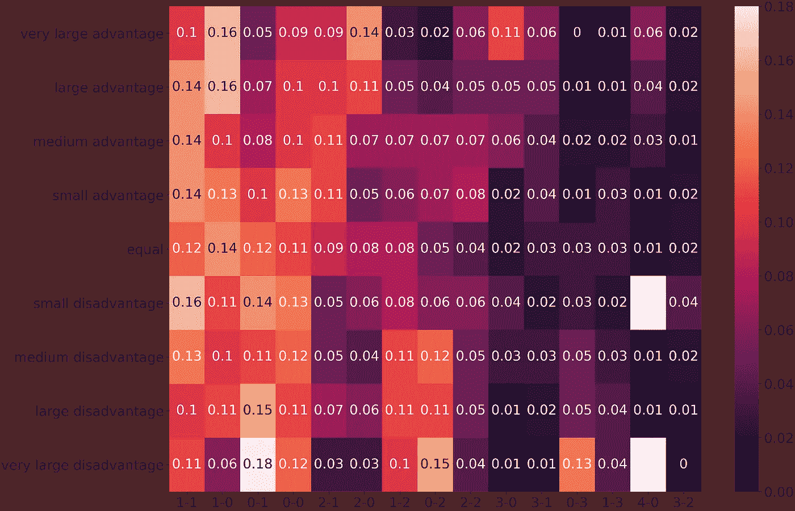
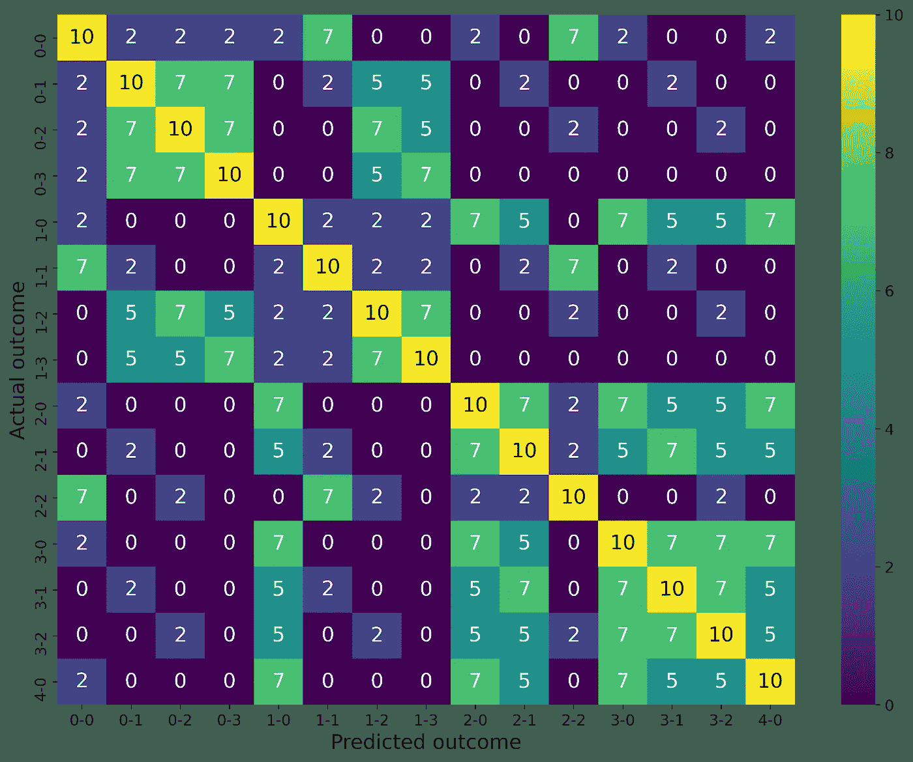
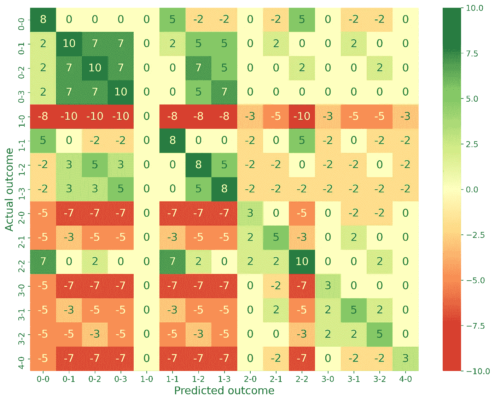
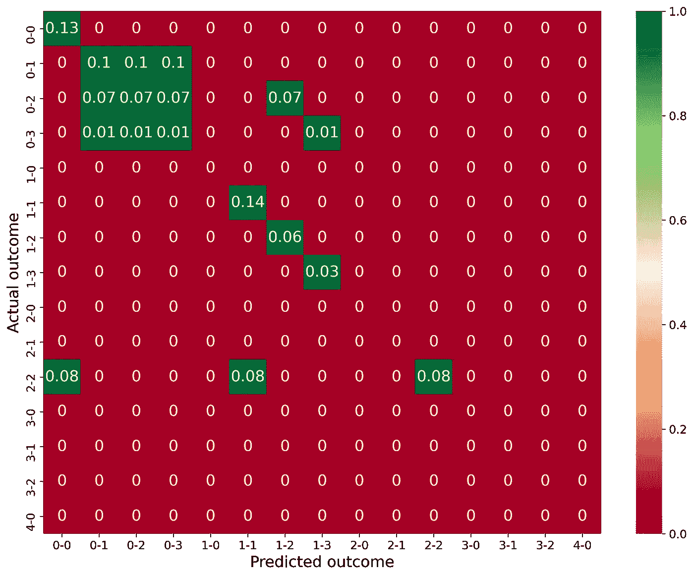

# 用简单的统计数据预测欧洲杯比赛:如何提高排名(pt。4)

> 原文：<https://towardsdatascience.com/predict-euro-cup-matches-with-simple-statistics-how-to-rise-the-ranks-pt-4-d076f3dbf763?source=collection_archive---------36----------------------->

## 足球不是单人游戏

我们已经讨论了[如何找到一场比赛最有可能的结果](/predict-euro-cup-matches-with-simple-statistics-but-better-pt-2-b48687a6d579)和[如何计算每个预测结果](https://sijmenvdw.medium.com/predict-euro-cup-matches-with-simple-statistics-should-i-take-that-bet-part-3-22df3d2ad882)的预期分数。

在锦标赛接近尾声的时候，我们还有一件事要弄清楚。

> 落后了怎么赢？

# 为什么期望值不再起作用

在真正的锦标赛中，比赛的次数是有限的。由于还有无限多的比赛要打，用最高期望值预测结果总是能得到最好的结果。没有例外，这是大数定律。

在匹配数量有限的情况下，这种方式会有所不同。请考虑以下情况:

在还剩 1 场比赛的情况下，你和你的对手打成平手，你们都有两个相同的选择:
—预测 2–2 作为比赛结果，如果正确，提供 10000 分
—预测非 2–2 作为比赛结果，如果正确，提供 1 分

第一个选项的期望值会更高。对于实力相当的球队，使用中性热图，2-2 的概率约为 0.04%或 4%。



中立竞争环境下不同结果可能性的热图。[图片由作者提供]

第一个选项的期望值:

`E = 0.04 * 10000 + 0.96 * 0 = 400`

第二个选项的期望值:

`E = 0.04 * 0 + 0.96 * 1 = 0.96`

显然，第一种选择更好，对吗？

如果你只是想打败你的对手就不会。如果我们的对手选择第一个选项，你有 96%的机会用第二个选项打败他。你只会领先他一分，但这可能是最重要的。

# 形势

有几个因素会影响超越对手的最佳策略:

1.  得分差距
2.  剩余的匹配数
3.  计分系统
4.  可能结果的可能性
5.  对手预测的结果

这是我们需要考虑的五个因素，以提高我们赢得奖金的机会。您可能还想考虑为 poule 中不同的结束位置授予的任何奖励。

# 真实的例子

假设，我的对手领先我 6 分，只剩下一场比赛，使用与[之前博客](https://sijmenvdw.medium.com/predict-euro-cup-matches-with-simple-statistics-should-i-take-that-bet-part-3-22df3d2ad882)相同的计分系统，一国优势较小，我们的对手使用最大期望值策略。我们做什么呢

首先，我们看看我们的对手在每种结果下会得到多少分。小优势最高 EV 的结果是 1–0，所以这将是我们对手的预测。下表列出了每项成果的得分:

```
+---------------+---------+
| Match outcome |  points |
+---------------+---------+
| 1-0           | +10     |
| 2-0           | +7      |
| 3-0           | +7      |
| 4-0           | +7      |
| 2-1           | +5      |
| 3-1           | +5      |
| 3-2           | +5      |
| 1-1           | +2      |
| 0-0           | +2      |
| 1-2           | +2      |
| 1-3           | +2      |
| 0-1           | +0      |
| 0-2           | +0      |
| 2-2           | +0      |
| 0-3           | +0      |
+---------------+---------+
```

我们至少需要比对手多得 6 分。我们无法预测任何会给我们的对手 5 分或更多分的结果。毕竟，如果我们的对手得到 5 分或更多，我们至少需要得到 11 分，这是不可能的。

我们需要另一个专栏来添加我们自己的分数，并将其与我们对手的分数进行比较。让我们看看如果我们预测 1-1 会发生什么。

```
+---------------+-----------+-----+------+--------+
| Match outcome |  opponent |  me |  net |  beat? |
+---------------+-----------+-----+------+--------+
| 1-0           | +10       | +2  | -8   |        |
| 2-0           | +7        | +0  | -7   |        |
| 3-0           | +7        | +0  | -7   |        |
| 4-0           | +7        | +0  | -7   |        |
| 2-1           | +5        | +2  | -3   |        |
| 3-1           | +5        | +2  | -3   |        |
| 3-2           | +5        | +0  | -5   |        |
| 1-1           | +2        | +10 | +8   | Yes    |
| 0-0           | +2        | +7  | +5   |        |
| 1-2           | +2        | +2  | +0   |        |
| 1-3           | +2        | +2  | +0   |        |
| 0-1           | +0        | +2  | +2   |        |
| 0-2           | +0        | +0  | +0   |        |
| 2-2           | +0        | +7  | +7   | Yes    |
| 0-3           | +0        | +0  | +0   |        |
+---------------+-----------+-----+------+--------+
```

从上表中，我们发现如果我们预测 1-1，只有两种可能的结果会导致接管我们的对手。

为了计算发生这种情况的可能性，我们在上面的热图中查找相应的值，并将它们相加。

1–1 和 2–2 的几率分别为 0.14 和 0.08。

这意味着我们有 22%的机会以 1:1 的预测击败我们的对手。顺便说一下，p 代表概率。

> 我们能做得更好吗？

# 更多计算

当然，只要计算所有合理的选项，然后选择最好的。

我们已经知道我们的对手在每个结果中得到的分数。接下来，我们计算每一个结果，每一个预测的分数。这导致了下表:



热图显示了每个预测结果的得分。[图片由作者提供]

现在，我们根据我们的对手将获得的分数来调整这些值，从而生成一个热图，其中包含与对手相比所获得的分数值。



热图显示了与我们的对手相比，在每个预测结果中的每个结果所获得的分数。[图片由作者提供]

我们仍然需要增加可能性来计算哪个预测最有可能为我们赢得胜利。但是，我们已经可以看到，一些预测从来没有为我们赢得足够的分数。例如，1–0 总是与我们的对手得分相同，3–0 最多比我们的对手多得 3 分，2–1 最多多得 5 分。

让我们把可能性加起来，决定我们的最佳预测。



热图显示了在每种预测结果下击败对手的几率。[图片由作者提供]

上面的热图显示了击败对手的几率，将一列中的所有值相加显示了在特定预测下击败对手的总几率。绿色表示我们击败了对手，红色表示我们不会击败对手。

例如，我们看到预测 0–0:

`P(win) = P(0-0) + P(2-2) = 0.13 + 0.08 = 0.21`

对于 0–1、0–2 和 0–3:

`P(win) = P(0-1) + P(0-2) + P(0-3)= 0.1 + 0.07 + 0.01 = 0.18`

对于 1–1:

`P(win) = P(1-1) + P(2-2) = 0.14 + 0.08 = 0.22`

其他选择击败我们对手的可能性要低得多。我们的第一次猜测是 1-1，实际上是正确的，尽管 0-0 是非常接近的第二次猜测。

# 如果不止有一场比赛要打呢？

要计算多个匹配的几率，您必须找到得分足够多的可能组合。这将变得太复杂，无法放入热图，你可能更适合模拟比赛，即使用[蒙特卡洛模拟](https://en.wikipedia.org/wiki/Monte_Carlo_method)。

那是以后的事了！

# 结束了

感谢您的阅读。

如果你喜欢这个，这里还有更多:

*   [中](https://sijmenvdw.medium.com/) — sijmenvdw
*   [LinkedIn](https://www.linkedin.com/in/sijmen-van-der-willik/)—Sijmen van der Willik
*   [GitHub](https://github.com/sijmenw?tab=repositories) — sijmenw