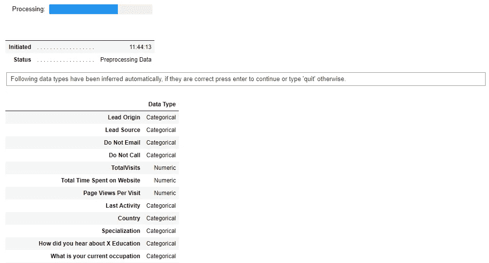
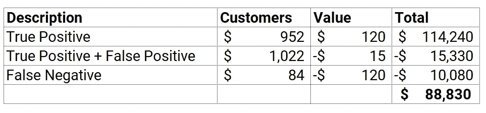

# 使用 PyCaret 预测销售线索得分(正确的方式)

> 原文：<https://towardsdatascience.com/predict-lead-score-the-right-way-using-pycaret-332faa780cfc?source=collection_archive---------4----------------------->

## 关于如何使用 PyCaret 构建销售线索评分模型并提高营销活动投资回报率的分步指南。


使用 PyCaret 预测潜在客户转化(正确的方式)——作者图片

# **简介**

线索是当今许多企业的驱动力。随着基于订阅的商业模式的发展，尤其是在初创领域，将潜在客户转化为付费客户的能力是生存的关键。简单来说,“线索”代表有兴趣购买你的产品/服务的潜在客户。

通常，当您通过第三方服务或自己开展营销活动获得销售线索时，通常会包括以下信息:

*   潜在顾客的姓名和联系方式
*   销售线索属性(人口统计、社交、客户偏好)
*   来源(脸书广告、网站登陆页面、第三方等。)
*   花在网站上的时间，点击次数等。
*   推荐详情等。

# 销售线索管理流程一览


销售线索管理流程一览—作者图片

市场营销和销售部门在销售线索管理上花费了大量的时间、金钱和精力，我们将采用这一概念来涵盖销售线索生成、资格认定和货币化这三个关键阶段。

# 👉线索挖掘

潜在客户生成是客户对您企业的产品或服务产生兴趣或进行调查的开始。创建销售线索的目的是将兴趣或询问转化为销售。互联网上有无限数量的第三方公司承诺提供最佳线索。然而，你也可以通过营销活动自己来做。产生潜在客户的方法通常属于广告范畴，但也可能包括非付费来源，如有机搜索引擎结果或现有客户的推荐。

# 👉**领导资格**

销售线索资格是指确定哪些潜在客户最有可能进行实际购买的过程。这是销售漏斗中不可或缺的一部分，销售漏斗通常会吸纳许多线索，但只能转化其中的一小部分。简单来说，销售线索资格意味着**评估销售线索并对其进行优先排序，以得出转化的可能性**，这样您的市场营销和销售部门就可以追踪优先排序的销售线索，而不是所有的销售线索，因为这些线索通常可能有数千条。

# 👉**导联转换**

销售线索转化是您最终将合格的销售线索转化为付费客户的阶段。它包括所有刺激购买产品或服务的欲望并引导购买决策的营销实践。这是一个货币化或结束阶段，其结果通常决定了整个营销活动的成功。

# 👉**销售线索评分的真正含义是什么？**

想象一下，你的团队有很多潜在客户，但是没有足够的资源去追踪他们。无论你是一家拥有大量免费增值用户的产品导向型企业，还是一个巨大的潜在客户渠道，或者仅仅是一个令人惊叹的上门销售团队，在一天结束时，**你都需要优先安排销售团队的时间，给他们“最好的”潜在客户。**

> 问题是你怎么做才能**最大化你的胜率**？

一种简单的方法是分析历史数据，并查看销售线索转化为销售额的属性。例如，在某个特定的国家、城市或邮政编码中，历史上 90%的销售线索都转化为销售。同样，你的数据也可以告诉你，在你的网站上停留超过 20 分钟的客户，大部分时间都转化为销售额。使用这些业务规则，您可以创建一个**销售线索评分系统**，使用这些业务规则为每个销售线索打分(越高越好)。

这种方法的问题是，业务规则只能涵盖这么多。随着您业务的扩展，您可以收集的数据类型和种类将呈指数级增长。在某种程度上，基于规则的手动系统将不足以继续增加价值。

> **机器学习来了**

您可以从机器学习的角度接近**领先评分系统**，在这里您可以就客户属性、潜在客户来源、推荐和其他可用的详细信息训练 ML 模型，目标将是**潜在客户转换(是或否)**。

你如何得到目标变量？大多数 CRM 系统，如 Salesforce、Zoho 或 Microsoft Dynamics，都可以跟踪单个线索及其状态。销售线索的状态将帮助您创建目标变量。

> 需要注意的一点是，你必须确保不要泄露训练数据集中的任何信息。例如，您的 CRM 系统可以存储关于在销售线索转换时向第三方支付的推荐费的信息，想象一下，如果您在培训数据中使用该信息，从技术上讲，这是一种泄漏，因为您将只在转换时支付推荐费，这是您事后才知道的事情。


预测性销售线索评分工作流—作者的图像许可

# 让我们从实际例子开始👇

# PyCaret 是什么？

[PyCaret](https://www.pycaret.org/) 是一个开源、低代码的机器学习库和 Python 中的端到端模型管理工具，用于自动化机器学习工作流。使用 PyCaret，您可以高效地构建和部署端到端的机器学习管道。要了解更多关于 PyCaret 的信息，请查看他们的 GitHub。


PyCaret 的特点—作者图片

# 安装 PyCaret

```
**# install pycaret** pip install pycaret
```

# 👉资料组

对于本教程，我使用的是来自 Kaggle 的[销售线索转换](https://www.kaggle.com/ashydv/leads-dataset)数据集。该数据集包含超过 9000 个具有客户特征的销售线索，例如销售线索来源、销售线索来源、在网站上花费的总时间、在网站上的总访问量、人口统计信息和转换的目标列(*表示 1 表示转换，0 表示没有转换*)。

```
**# import libraries**
import pandas as pd
import numpy as np**# read csv data** data **=** pd.read_csv('[Leads.csv'](https://raw.githubusercontent.com/srees1988/predict-churn-py/main/customer_churn_data.csv'))
data.head()
```


样本数据集-按作者分类的图像

# 👉探索性数据分析

```
**# check data info** data.info()
```


data . info()-按作者分类的图片

请注意，有几列缺少许多值。有几种方法可以处理缺失值。我将让 PyCaret 自动处理丢失的值。如果您想了解更多关于在 PyCaret 中输入缺失值的不同方法，请查看这个[文档链接](https://pycaret.org/missing-values/)。

从直觉上来说，在网站上花费的时间和活动分数以及线索来源是转化线索时非常重要的信息。让我们直观地探索一下这种关系:


按在网站上花费的总时间、活动分数和来源(按作者分类的图片)进行线索转化

请注意，来自“添加表单”的销售线索很可能会转化为销售额，而与在网站上花费的时间或分数无关。对于通过 API 或网站登陆页产生的线索来说，情况就不一样了。得分越高，在网站上花费的时间越长，就越有可能将销售线索转化为最终销售额。

# 👉数据准备

对于 PyCaret 中的所有模块来说，`setup`是在 PyCaret 中执行的任何机器学习实验中的第一个也是唯一一个强制步骤。该功能负责训练模型之前所需的所有数据准备。除了执行一些基本的默认处理任务，PyCaret 还提供了一系列预处理功能。要了解 PyCaret 中所有预处理功能的更多信息，可以查看这个[链接](https://pycaret.org/preprocessing/)。

```
**# init setup**
from pycaret.classification import *
s = setup(data, target = 'Converted', ignore_features = ['Prospect ID', 'Lead Number'])
```



pycaret.classification 中的设置函数—按作者分类的图像(图像被截断)

在 PyCaret 中初始化`setup`函数时，它会自动分析数据集并推断所有输入变量的数据类型。如果一切推断正确，您可以按 enter 键继续。您也可以使用设置中的`numeric_features`和`categorical_features`参数来强制/覆盖数据类型。

另外，请注意，我已经在`setup`函数中传递了`ignore_features = ['Prospect ID', 'Lead Number']`，因此在训练模型时不会考虑它。这样做的好处是 PyCaret 不会从数据集中删除该列，它只是在模型训练的幕后忽略它。因此，当您在最后生成预测时，您不需要担心自己将 IDs 连接回来。


设置输出—为显示而截断—按作者列出的图像(图像被截断)

# 👉模型训练和选择

现在数据准备工作已经完成，让我们使用`compare_models`功能开始培训过程。此函数训练模型库中可用的所有算法，并使用交叉验证评估多个性能指标。

```
**# compare all models**
best_model = compare_models(sort='AUC')
```


compare_models 的输出—按作者分类的图片

基于 **AUC** 的最佳模型是`**Catboost Classifier**`，具有`**0.9864**` **的平均 10 倍交叉验证 AUC。**

```
**# print best_model parameters**
print(best_model.get_all_params())**# except for catboost you can do this:**
print(best_model)
```


Catboost 超参数-作者图片

# 👉模型分析

# **AUC-ROC 图**

AUC-ROC 曲线是在各种阈值设置下对分类问题的性能测量。ROC 是概率曲线，AUC 代表可分性的程度或度量。它告诉我们这个模型在多大程度上能够区分不同的类。AUC 越高，模型在预测阳性和阴性类别方面就越好。虽然评估和比较不同模型的性能非常有帮助，但将这一指标转化为业务价值并不容易。

```
**# AUC Plot**
plot_model(best_model, plot = 'auc')
```


最佳模型的 AUC 图—作者提供的图像

# **SHAP 值**

与 AUC-ROC 不同，shap 值不会告诉您任何关于模型性能的信息，相反，它解释了给定特征具有某个值与我们在该特征采用某个基线值时所做的预测相比所产生的影响。在下图中，y 轴(左侧)包含模型的所有重要特征，x 轴是关联特征的 Shapley 值，色标(右侧)是该特征的实际值。图中每个特征处的每个点都是一个客户线索(来自测试集)——彼此重叠。

shap 值(x 轴)越高，正类的可能性越高(本例中为转换)。因此，从顶部开始阅读，我会将其解释为标记为“将在阅读电子邮件后回复”的线索与基础相比具有较高的 shap 值，这意味着转化的可能性较高。相反，如果您看到标签“Ringing ”,则 shap 值位于基本值的左侧，即 shap 值为负，表示此功能不利于转换。要更详细地了解 shap 值，请看这个[链接](https://github.com/slundberg/shap)。

```
**# Shapley Values**
interpret_model(best_model)
```


作者最佳模型图像的 Shapley 特征重要性图

# 特征重要性图

特征重要性图是解释模型结果的另一种方式。虽然 Shap 值仅适用于复杂基于树的模型，但特征重要性绘图更常见，可用于不同系列的模型。与 shap 值不同，要素重要性不会告诉我们该要素对特定类的影响，它只会告诉我们该要素是否重要。

```
**# Feature Importance** plot_model(best_model, plot = 'feature')
```


作者最佳模型图像的特征重要性图

# 混淆矩阵

混淆矩阵是观察模型性能的另一种方式。在所有可能的工具中，这可能是最简单的一个。它基本上将预测与实际标签进行比较，并将它们分成四个象限:

*   真正(**预测:**换算，**实际:**换算)
*   真负值(**预测:**无转换，**实际:**无转换)
*   假阳性(**预测:**转换，**实际:**无转换)
*   假阴性(**预测:**无转换，**实际:**转换)

如果将所有四个象限相加，它将等于测试集中的客户线索数(1667 + 70 + 84 + 952 = 2，773)。

*   952 个客户(右下象限)是真阳性，这些是模型预测将转化并且它们已经转化的潜在客户；
*   70 条线索是假阳性的(*这可能是你所付出的努力将会白费的地方*)；
*   84 条线索为假阴性，即(*错失机会*)；和
*   1，667 条线索为真阴性(*无影响*)。

```
**# Confusion Matrix** plot_model(best_model, plot = 'confusion_matrix')
```


最佳模型的混淆矩阵—作者图像

到目前为止，我们已经准备好了用于建模的数据(当您运行`setup`函数时，PyCaret 会自动完成)，训练了多个模型以根据 AUC 选择最佳模型，通过不同的图(如 AUC-ROC、特征重要性、混淆矩阵和 Shapley 值)分析了性能。然而，我们还没有回答最重要的问题:

> **这种模式的商业价值是什么，我们为什么要使用这种模式？**

为了给这个模型赋予商业价值，让我们做几个假设:

*   转化为销售额的铅将在第一年产生 120 美元的收入
*   花费在追踪优先销售线索上的时间和精力(根据模型预测)是 15 美元
*   模型错过的机会(假阴性)产生负 120 美元的机会成本(*您可以添加也可以不添加，因为这不是真实成本，而是机会成本，这完全取决于用例*

如果你在这里做一点数学计算，你会得到 88，830 美元的利润。方法如下:



模型对 2，773 名客户的影响——图片由作者提供

这可能是一个好模型，但它不是一个商业智能模型，因为我们还没有加入成本/利润的假设。默认情况下，任何机器学习算法都会优化 AUC 等常规指标。为了实现业务目标，我们必须使用业务度量来训练、选择和优化模型。

# 👉在 PyCaret 中添加自定义指标

多亏了 PyCaret，使用`add_metric`函数可以非常容易地实现这一点。

```
**# create a custom function** def calculate_profit(y, y_pred):
    tp = np.where((y_pred==1) & (y==1), (120-15), 0)
    fp = np.where((y_pred==1) & (y==0), -15, 0)
    fn = np.where((y_pred==0) & (y==1), -120, 0)
    return np.sum([tp,fp,fn])**# add metric to PyCaret** add_metric('profit', 'Profit', calculate_profit)
```

现在让我们再次运行`compare_models`:

```
**# compare all models**
best_model = compare_models(sort='Profit')
```


compare_models 的输出—按作者分类的图像

请注意，这次添加了一个新列`**Profit**`，并且 **Catboost 分类器**不再是基于利润的最佳模型。是**光梯度助推器。**虽然在本例中差异并不显著，但根据您的数据和假设，这有时可能是数百万美元。

```
**# confusion matrix**
plot_model(best_model, plot = 'confusion_matrix')
```


LightGBM 的混淆矩阵—作者图片

客户总数仍然相同(测试集中有 2，773 个客户)，现在发生变化的是模型如何在误报和漏报上出错。让我们用同样的假设(如上所述),用一些美元价值来反对它:


模型对 2，773 名客户的影响——图片由作者提供

与使用 Catboost 分类器时的 88，830 美元相比，现在的利润为 89，925 美元。这是 1.2%的提升，根据假阳性和假阴性的大小和成本，可能会转化为数百万美元。除此之外，您还可以做一些其他事情，例如通过显式优化`**Profit**`而不是 AUC、准确性、召回率、精确度或任何其他传统指标来调整最佳模型的超参数。

# 如何使用模型生成销售线索得分？

那么，您一定会问，既然我们已经选择了最佳模型，我该如何将该模型应用于新的销售线索以产生得分呢？嗯，这并不难。

```
**# create copy of data** data_new = data.copy()
data_new.drop('Converted', axis=1, inplace=True)**# generate labels using predict_model** predict_model(best_model, data=data_new, raw_score=True)
```


使用最佳模型生成的预测-作者提供的图像

请注意，最后三列被添加到数据集-Label(1 =转换，0 =无转换)、Score_0 和 Score_1 是每个类在 0 到 1 之间的概率。例如，第一个观察值 Score_0 是`0.9973`,表示没有转换的概率为 99.7%。

我是一个普通的博客作者，我主要写关于 PyCaret 及其在现实世界中的用例，如果你想自动得到通知，你可以在[媒体](https://medium.com/@moez-62905)、 [LinkedIn](https://www.linkedin.com/in/profile-moez/) 和 [Twitter](https://twitter.com/moezpycaretorg1) 上关注我。


PyCaret —作者图片


PyCaret —作者图片

使用 Python 中的这个轻量级工作流自动化库，您可以实现的目标是无限的。如果你觉得这很有用，请不要忘记给我们 GitHub 库上的⭐️。

要了解更多关于 PyCaret 的信息，请关注我们的 LinkedIn 和 Youtube。

加入我们的休闲频道。此处邀请链接[。](https://join.slack.com/t/pycaret/shared_invite/zt-p7aaexnl-EqdTfZ9U~mF0CwNcltffHg)

# 重要链接

[文档](https://pycaret.readthedocs.io/en/latest/installation.html)
[博客](https://medium.com/@moez_62905)
[GitHub](http://www.github.com/pycaret/pycaret)
[stack overflow](https://stackoverflow.com/questions/tagged/pycaret)
[安装 PyCaret](https://pycaret.readthedocs.io/en/latest/installation.html) [笔记本教程](https://pycaret.readthedocs.io/en/latest/tutorials.html) [投稿于 PyCaret](https://pycaret.readthedocs.io/en/latest/contribute.html)

# 更多 PyCaret 相关教程:

</predict-customer-churn-the-right-way-using-pycaret-8ba6541608ac> [## 使用 PyCaret 预测客户流失(正确的方式)

towardsdatascience.com](/predict-customer-churn-the-right-way-using-pycaret-8ba6541608ac) </build-with-pycaret-deploy-with-fastapi-333c710dc786>  </time-series-anomaly-detection-with-pycaret-706a6e2b2427>  </supercharge-your-machine-learning-experiments-with-pycaret-and-gradio-5932c61f80d9>  </multiple-time-series-forecasting-with-pycaret-bc0a779a22fe> 