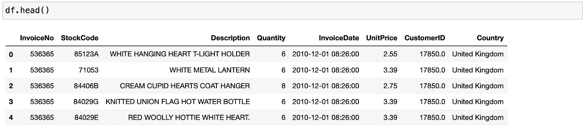
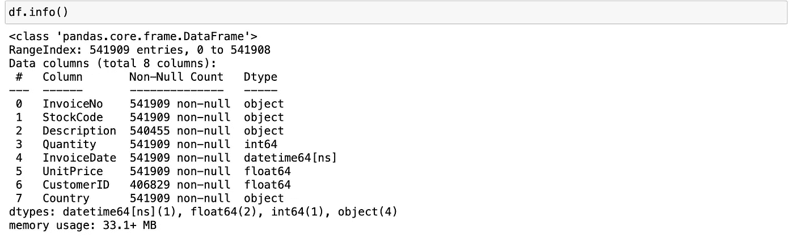
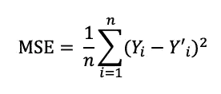
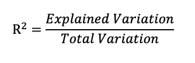
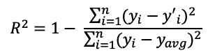
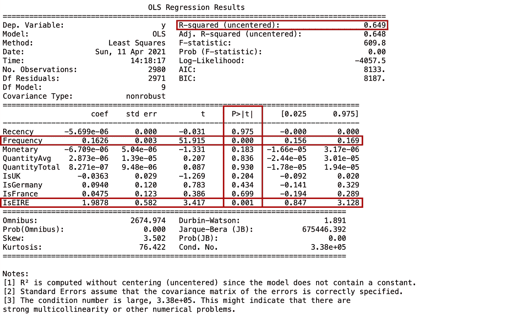

# 预测下个月具有 RFM 功能的交易

> 原文：<https://towardsdatascience.com/predict-next-month-transactions-with-rfm-features-f6db106fe8d9?source=collection_archive---------5----------------------->

## 通过线性回归预测客户行为的近期、频率和货币指标

> *“没有人能打开另一个人，我们能做的只有等待。然后当它发生时，以开放的态度去工作。”
> ――彼得·霍格，安静的女孩*


照片由[凯丽·通盖](https://unsplash.com/@kellitungay?utm_source=unsplash&utm_medium=referral&utm_content=creditCopyText)在 [Unsplash](https://unsplash.com/s/photos/minimalism-photo-art?utm_source=unsplash&utm_medium=referral&utm_content=creditCopyText) 上拍摄

# 介绍

在这篇博客文章中，我想重点谈谈预测下个月客户交易的特性工程。作为一名在市场营销领域工作的数据科学家，我发现理解我为什么要做一些工作以及它如何解决业务问题非常重要。我认为特征工程是分析的一部分，领域知识和硬技能同等重要，混合在一起可以找到更好的问题解决方案。

让我们创建 RFM(近期、频率和货币)特征来预测客户下个月的交易数量。为了简化分析，我将使用线性回归来预测下个月的交易。即使线性回归(也称为普通最小二乘法)是解决回归问题的一个很好的起点，你也可以尝试其他模型，如多项式、岭或套索模型。

# **近期、频率和货币(RFM)**


图片由 Aigerim Shopenova 提供

新近性、频率和货币是营销分析工具，通过使用以下衡量标准来识别公司的最佳客户:

*   **最近度**:顾客购买的时间
*   **频率**:顾客购物的频率
*   **货币价值**:顾客在购物上花了多少钱[1]

通常，RFM 模型用于给每个用户分配分数，通常在 1 到 5 的范围内(数字越大，结果越好)。“最佳”客户将在每个类别中获得最高分。然后，营销人员/分析师可以创建用户细分，并开发量身定制的营销活动/行动。

但是，在此分析中，我们将仅使用 RFM 概念并创建新功能来预测下个月的交易。

# 数据

我使用的是来自 UCI 机器学习知识库的公共数据集，可以在这里找到。该数据集包含 2010 年 1 月 12 日和 2011 年 9 月 12 日之间英国注册的无店铺在线零售商的交易信息。该公司主要销售独特的适合各种场合的礼品。这家公司的许多客户都是批发商。

**属性信息:**

*   *发票号*:发票号。名义上，分配给每笔交易的 6 位整数。
*   *库存代码*:产品(物品)代码。名义上，一个 5 位数的整数，唯一分配给每个不同的产品。
*   *描述*:产品(物品)名称。名义上的
*   *数量*:每笔交易每种产品(物品)的数量。数字的
*   InvoiceDate:发票日期和时间。数字，每笔交易生成的日期和时间
*   *单价*:单价。数字，单位为英镑的产品价格
*   *CustomerID* :客户编号。名义上，一个唯一分配给每个客户的 5 位整数
*   *国家*:国家名称。名义上，每个客户居住的国家的名称。

# 数据争论

```
# import necessary packages
import pandas as pd
import numpy as np
import datetime as dt
import matplotlib.pyplot as plt
import seaborn as sns
%matplotlib inline

# Read data
df = pd.read_excel('online_retail_dataset.xlsx', sheet_name='Online Retail')
```



*描述*和 *CustomerID* 列为空值。

# **数据清理和转换**

为了清理和转换数据，我执行了以下操作:

*   *CustomerID* 有*空记录。让我们删除包含空值的行*
*   *数量*栏有*负值*，可能是采购后退货造成的。让我们删除数量为负的行
*   *单价*栏也有*负记录*。我也决定放弃负价格的唱片
*   购买记录的时间段是从 2010 年 1 月 12 日到 2011 年 9 月 12 日。上个月*的*数据*不完整*。让我们忽略不完整月份的记录
*   因为我们计划预测上个月的交易，所以让我们删除客户 id，它们出现在上个月，并且没有以前的购买记录
*   我通过将*数量*和*单价*相乘来计算总销售额
*   为进一步的特性工程定义的发票月份。

```
# Let's drop rows containing NULL values
df.dropna(subset=['CustomerID'], inplace=True)

# Keep positive records for quantity column
df = df.loc[df['Quantity'] > 0]

# Remove negative price
df = df.loc[df['UnitPrice'] > 0]

# Let's ignore the records for the incomplete month
df = df.loc[df['InvoiceDate'] < '2011-12-01']
```

# 特征工程

让我们使用清理后的数据创建 RFM 特征。此外，我决定添加定义在哪个国家购买的列。

```
# Calculate total sales
df['TotalSum'] = df['Quantity'] * df['UnitPrice']

# Define invoice month
df['InvoiceMonth'] = df['InvoiceDate'].dt.to_period('M')
df['InvoiceMonth'] = df['InvoiceMonth'].astype(str)

# Split into 2 dataframes to check customer ids
df_nov = df[df['InvoiceMonth'] == '2011-11']
df_other_months = df[df['InvoiceMonth'] != '2011-11']

cust_ids_nov = df_nov['CustomerID'].unique().tolist()
cust_ids_others = df_other_months['CustomerID'].unique().tolist()

# Let's exclude customer ids, which appeared for the first time in November 2011
new_cust_ids = list(set(cust_ids_nov) - set(cust_ids_others))
df = df[~df['CustomerID'].isin(new_cust_ids)]

# Create a column to mark purchases from the UK, Germany, France and EIRE
df['IsUnitedKingdom'] = df['Country'].apply(lambda x: 1 if x == 'United Kingdom' else 0)
df['IsGermany'] = df['Country'].apply(lambda x: 1 if x == 'Germany' else 0)
df['IsFrance'] = df['Country'].apply(lambda x: 1 if x == 'France' else 0)
df['IsEIRE'] = df['Country'].apply(lambda x: 1 if x == 'EIRE' else 0)

# Let's choose only records for previous months
df_X = df[df['InvoiceMonth'] != '2011-11']
now = dt.datetime(2011, 11, 1)

# RFM features
df_features = df_X.groupby('CustomerID').agg({'InvoiceDate': lambda x: (now - x.max()).days,
                                              'InvoiceNo': pd.Series.nunique,
                                              'TotalSum': np.sum,
                                              'Quantity': ['mean', 'sum'],
                                              'IsUnitedKingdom': np.mean,
                                              'IsGermany': np.mean,
                                              'IsFrance': np.mean,
                                              'IsEIRE': np.mean}).reset_index()
df_features.columns = ['CustomerID', 'Recency', 'Frequency', 
                       'Monetary', 'QuantityAvg', 'QuantityTotal',
                       'IsUK', 'IsGermany', 'IsFrance', 'IsEIRE']

# Get monthly transactiins for customers
cust_month_trans = pd.pivot_table(data=df,
                                  index=['CustomerID'],
                                  values='InvoiceNo',
                                  columns=['InvoiceMonth'],
                                  aggfunc=pd.Series.nunique,
                                  fill_value=0).reset_index()
cust_month_trans = cust_month_trans.rename_axis('index',axis=1)

customer_id = ['CustomerID']
target = ['2011-11']

# Define X and y
y = cust_month_trans[target]

cols = [col for col in df_features.columns if col not in customer_id]
X = df_features[cols]
```

# 线性回归

*线性回归*是回归问题最简单最经典的线性方法。线性回归找出参数 *w* 和 *b，*使得最小化预测值和实际值之间的*均方误差(MSE)* ， *y* 。MSE 是预测值和实际值之差的平方和除以样本数。通常，线性回归这样简单而经典的模型是一个很好的起点，它易于应用，可以成为更复杂的机器学习模型的基准。线性回归没有参数，这是一个好处，但它也没有办法控制模型的复杂性[3，4]。

线性模型的一般预测公式:


其中， *x[0]* 到 *x[p]* 表示单个数据点的特征(在本例中，特征数为*p+1*),*w*和 *b* 是学习到的模型参数，*y’*是预测模型 makes。

让我们看看实例化和训练线性回归模型的代码。

```
from sklearn.model_selection import train_test_split
from sklearn.linear_model import LinearRegression

X_train, X_test, y_train, y_test = train_test_split(X, y,
                                                    test_size=0.25,
                                                    random_state=23)

linreg = LinearRegression()
model = linreg.fit(X_train, y_train)
train_pred_y = model.predict(X_train)
test_pred_y = model.predict(X_test)
```

# **模型评估**

让我们看一下指标，我们将使用这些指标来评估线性回归模型。

## **均方误差**



其中 *Y* 为实际值，*Y’*为预测值。

MSE 测量平方误差的平均值，其中误差是预测值和实际值之间的差异。MSE 对异常值非常敏感，并受到异常值的严重影响[2]。

## **R 平方**



r 平方或决定系数衡量拟合优度。它表明回归模型对数据的拟合程度。r 平方的范围从 0 到 1，决定了模型中考虑的数据变化的比例[2，4]。

```
from sklearn.metrics import mean_absolute_error
from sklearn.metrics import mean_squared_error
import statsmodels.api as sm

# Calculate MAE & MSE
mse_train = np.sqrt(mean_squared_error(y_train, train_pred_y))
mae_train = mean_absolute_error(y_train, train_pred_y)
mse_test = np.sqrt(mean_squared_error(y_test, test_pred_y))
mae_test = mean_absolute_error(y_test, test_pred_y)

# OLS regression
y_train = np.array(y_train)
ols_reg = sm.OLS(y_train, X_train)
ols_reg = ols_reg.fit()
```

测试集的 set = 0.944，训练集的 set = 0.878，这没有太大的差异，表明我们没有模型的显著过拟合或欠拟合。

让我们看看 OLS(普通最小二乘法)回归结果的总结



如果我们将统计显著性确定为 95%，那么具有小于或等于 5%的 *p 值*的特征被认为具有统计显著性。查看 *p 值*，我们可以说*频率*和 *IsEIRE* 特征对于预测下个月的交易数量具有统计意义。

r 平方= 0.649，这意味着模型解释了约 64.9%的变异，这是相对较好的。

# 摘要

在这篇博文中，我想强调特征工程在营销数据科学中的重要性。我相信特性工程部分应该与我们试图解决的业务问题直接相关。

总的来说，这篇博文

*   我们使用线性回归，根据工程 RFM 特征预测了下个月的交易
*   查看 *p 值*，我们可以说*频率*和 *IsEIRE* 特征对于预测下个月的交易数量具有统计意义
*   r 平方= 0.649，这意味着模型解释了约 64.9%的变异，这是相对较好的。但是，我们可以创建更多的功能和/或拟合其他模型，如多项式、山脊或套索模型，以改善度量或尝试其他模型。

感谢您的阅读，请在下面评论您对通过功能工程解决营销问题的想法。要查看我的更多帖子，请订阅 Medium 和 [LinkedIn](https://www.linkedin.com/in/aigerimshopenova/) 。

[Jupyter 笔记本](https://github.com/aig3rim/Predict_next_month_transactions)可以在我的 [GitHub](https://github.com/aig3rim) 上找到。

# 参考

1.  t .西格尔(2021 年 2 月 15 日)。内部新近性、频率、货币价值(rfm)。2021 年 4 月 29 日检索，来自[https://www . investopedia . com/terms/r/RFM-recency-frequency-monetary-value . ASP](https://www.investopedia.com/terms/r/rfm-recency-frequency-monetary-value.asp)
2.  黄耀辉(2019)。市场营销数据科学实践:使用 Python 和 R. Birmingham 通过机器学习改进您的市场营销策略。
3.  米勒，A. C .，&圭多，S. (2018)。Python 机器学习导论:数据科学家指南。塞瓦斯托波尔，加利福尼亚州:奥赖利媒体。
4.  布鲁斯，P. C .，布鲁斯，a .，&格德克，P. (2020)。*数据科学家实用统计学:使用 R 和 Python 的 50 多个基本概念*。塞瓦斯托波尔，加利福尼亚州:奥赖利媒体。