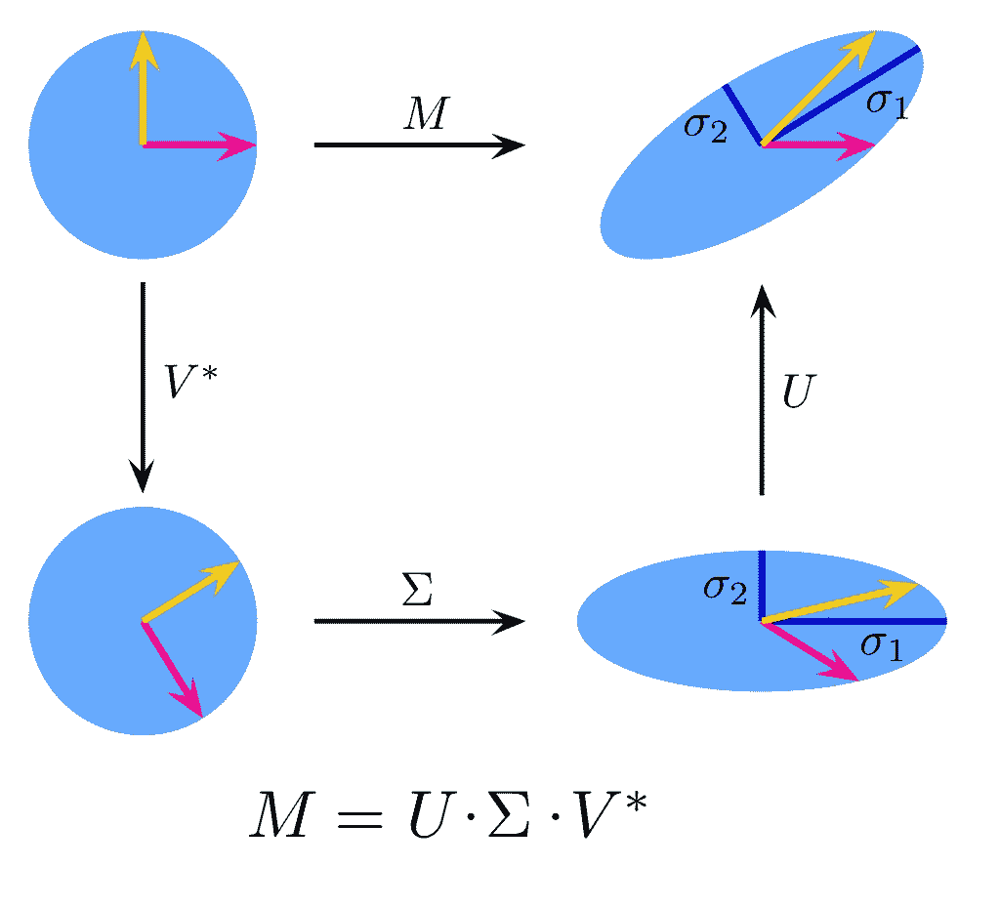

# 协同过滤推荐系统中用 SVD 预测评分的一个例子

> 原文：<https://towardsdatascience.com/predict-ratings-with-svd-in-collaborative-filtering-recommendation-system-733aaa768b14?source=collection_archive---------15----------------------->

## 如何将奇异值分解转换为 k 维并进行预测



来自维基的乔治-约翰的照片

我们知道 SVD 在现实中进行预测有缺点，例如，它甚至不能预测数据集中是否有 NaN，但因为这是协作过滤的起点，我想用 SVD 重现这个过程，看看它是如何工作的，并对数据集进行一些压缩。

这个故事将集中在 SVD 的代码实现上，没有离线测试(没有训练测试数据集的分割)，并且包括一些与线性代数相关的基本术语。

**线性代数基础**

**奇异值分解**是奇异值分解。详细说明见[维基](https://en.wikipedia.org/wiki/Singular_value_decomposition)。在这里，我更喜欢推荐系统(RS)的这种解释:它是原始 SVD 的 k 阶近似。


来自 StackExchange 的信息[3]

**潜在特征**:对应于 SVD 中的σ。在数据中不能直接观察到的值，但当查看观察到的数据值之间存在的关系和趋势时，可能会识别出这些值[2]。最新特征的数量是西格玛在 SVD 中的等级。

**欧氏距离:**

欧几里德距离可以看作是两个向量之间的直线距离。对于两个向量 **x** 和 **y** ，我们可以计算为[2]:


> **我想强调的难点**(至少从我的学习经验来看)是一旦我们知道了 U、σ和 Vt，如何将原始的 SVD 转换成 k 维空间，以及如何将它们与预测联系起来。榜样永远是有效的学习方式。

**代码示例**

**数据集妥协**

协作过滤(这里是基于用户项的)中的 RS 的目标是预测评级，并且在用户没有评级的情况下做出推荐。

但是 SVD 无法预测矩阵中是否有 NaN 值，用户必须存在于当前已知的费率系统中并给出费率。

我觉得有矛盾，但也许我错在这里(如果你找到原因，会感激地指出来)。

> 要创建数据集，这里**折衷**:如果用户没有给电影评分，那么用 0 填充(如果评分中有 0，就会有冲突)。

请不要在此处推荐 Funk SVD。因为我想在这个故事中了解 SVD 过程的优点和缺点。

让我们开始吧。参考代码在这里(中文)【1】。我对它做了一些修改。

该代码由以下步骤组成:

1.  创建数据集
2.  计算相似度
3.  决定 k
4.  将原始 SVD 转换为 k 维
5.  通过预测评分(原始评分为零)为特定用户进行推荐

**导入库:**

**创建数据集:**

**计算相似度**

使用欧几里德距离来度量相似性:

**决定 k**:k 的值由前 k 个奇异值的平方和占总奇异值平方和的百分比决定。

例如，如果百分比是 0.9，那么当前 k 个单值的平方和与 sigma 的总平方和之比大于 0.9 时，我们已经占了 90%以上的权重，可以将矩阵降维到 k 维。

**将原始 SVD 转换为 k 维空间:**

**如何将原始 SVD 转换为 k 维，下面是关键:**

原始分解的维数为:

u:11x11，sigma:对角矩阵 11，vt: 11x11

结果是 k=3，则量纲为:

u:11x3，sigma:对角矩阵 3，vt: 3x11

下面的代码可以构造 k 维矩阵:

```
formed_items=np.around(np.dot(np.dot(u[:,:k], sigma_K),vt[:k, :]),decimals=3)
```

**预测收视率:**

运行以下命令获得结果:

```
testdata=loadExData()
recommend(testdata,0,sim_meas=ecludSim,est_method=svdEst, percentage=0.9)
```

使用具有欧几里德距离的测试数据，如果前 k 个奇异值的平方和与总奇异值的平方和的百分比大于或等于 0.9，则预测用户 0 的未分级电影的分级。

**用户 0 的预测评级:**


对于用户 1:


第一列显示列索引，第二列是预测评级。

在用户 0 的原始数据中，位置 0，1，2，3，4，6，7，8，9 为零，如下所示:

```
[0, 0, 0, 0, 0, 4, 0, 0, 0, 0, 5]
```

为了简单起见，完整的代码如下，您可以使用上面的最后两个建议来运行它:

在今天的故事中，我介绍了一个例子，展示了如何在获得 SVD 后将 SVD 转换到 k 维空间来预测收视率，特别关注如何将 SVD 转换到 k 维空间并进行预测收视率。

感谢您的阅读。

**参考文献**:

1.  https://blog . csdn . net/weixin _ 41988628/article/details/83217255
2.  Udacity 数据科学家 Nanodegree —实验设计和建议
3.  [https://stats . stack exchange . com/questions/33142/what-happens-when-you-apply-SVD-to-a-collaborative-filtering-problem-what-is-th/35460 # 35460](https://stats.stackexchange.com/questions/33142/what-happens-when-you-apply-svd-to-a-collaborative-filtering-problem-what-is-th/35460#35460)
4.  【https://en.wikipedia.org/wiki/Singular_value_decomposition 号