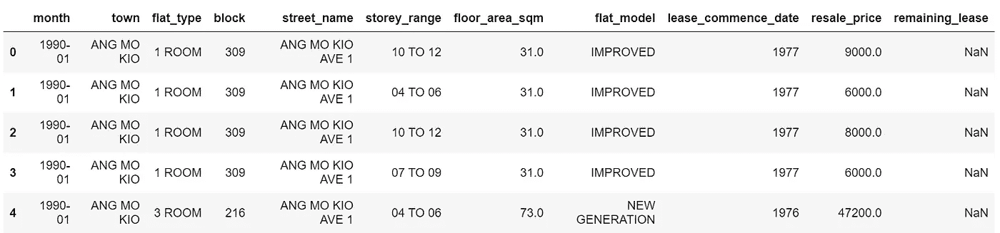
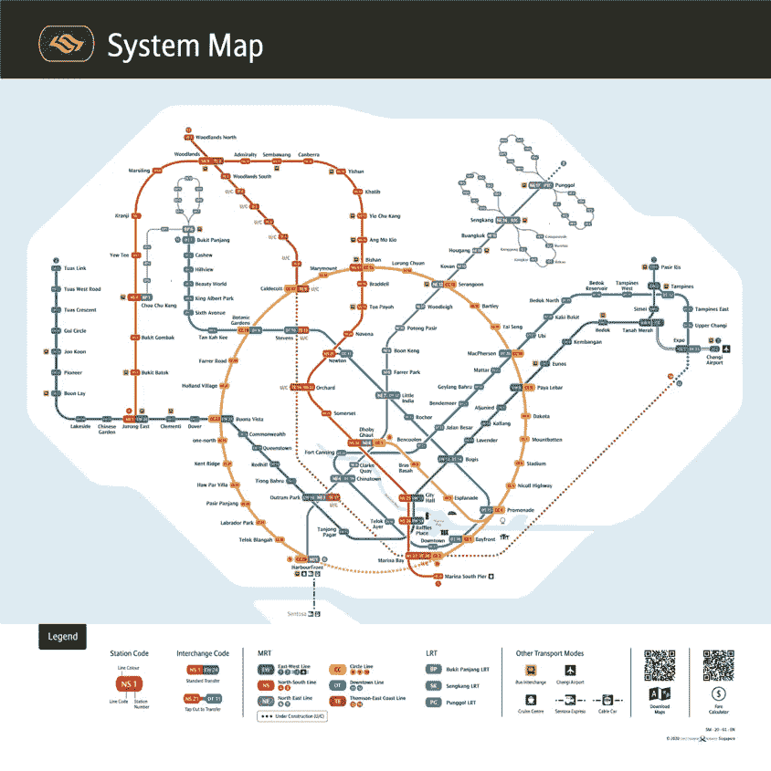
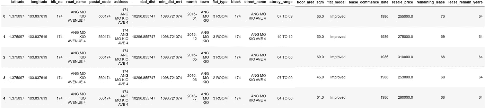
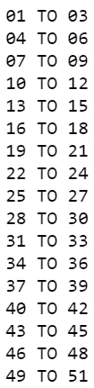
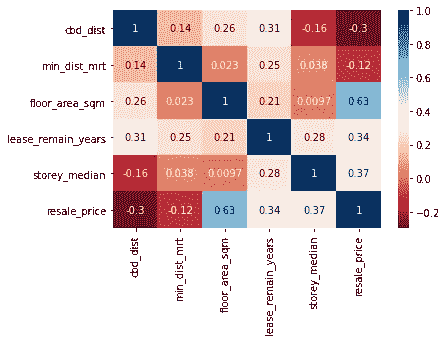
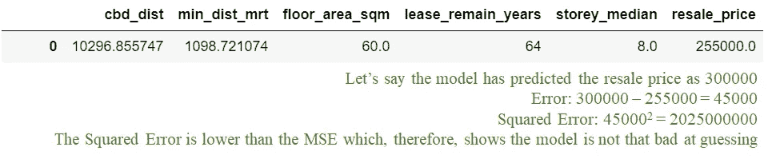
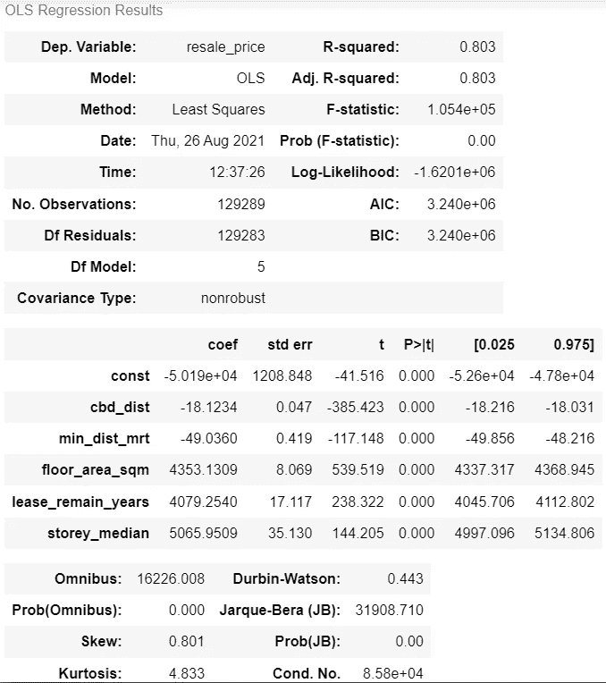
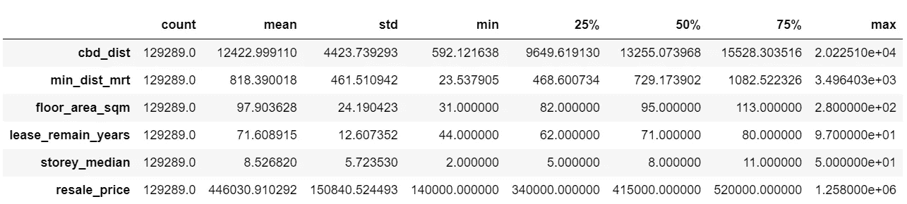
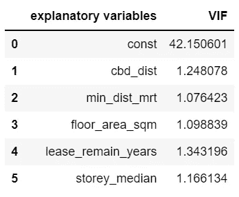

# 预测 HDB 转售公寓的售价

> 原文：<https://towardsdatascience.com/predict-the-selling-price-of-hdb-resale-flats-50530391a845?source=collection_archive---------12----------------------->

## 进行线性回归以预测 1990 年 1 月至 2021 年 4 月 HDB 转售单位的售价


照片由 [Nguyen Thu Hoai](https://unsplash.com/@thwhoai?utm_source=unsplash&utm_medium=referral&utm_content=creditCopyText) 在 [Unsplash](https://unsplash.com/s/photos/hdb?utm_source=unsplash&utm_medium=referral&utm_content=creditCopyText)

# 问题陈述

有多种因素影响 HDB 转售公寓的销售价格。因此，通过使用线性回归，我有兴趣在这个小练习中找出 HDB 转售公寓的销售价格如何基于其以下特征而变化:

*   它到中央商务区(CBD)的距离
*   到最近的捷运站的距离
*   它扁平的尺寸
*   它的楼层
*   剩余的租赁年数

这个小练习的参考资料可以在 [my GitHub](https://github.com/jimmeng-kok-2017/hdb_resale_lr_predict) 上找到，其中包括数据集和 Python 笔记本文件——数据预处理和数据处理(包括构建线性回归)。

# 资料组

以下是这个小型练习中使用的数据源:

*   [来自 Data.gov.sg 的 HDB 转售统一价格](https://data.gov.sg/dataset/resale-flat-prices)(截至 2021 年 5 月 3 日)
*   [OneMap API](https://www.onemap.gov.sg/docs/#onemap-rest-apis)

# 数据预处理

HDB 转售统一价格数据集中有 5 个不同时间段的逗号分隔值(CSV)文件，分别为 1990 年至 1999 年、2000 年至 2012 年、2012 年至 2014 年、2015 年至 2016 年以及 2017 年以后。

在这个小练习中，分析中考虑了所有时间段。因此，需要将所有 5 个不同的 CSV 文件组合成一个完整的数据集。

```
import glob
import pandas as pddf = pd.concat([pd.read_csv(f) for f in glob.glob("./data/*.csv")], ignore_index=True)
```



原始 HDB 转售统一价格数据集的样本行，按作者分类的图像

正如我们从数据集看到的，它还不够全面，不足以回答这个迷你练习的问题陈述。此后，需要计算今年(2021 年)以后的剩余租约，并使用 OneMap API 进行地理编码，以计算每个公寓与其最近的 MRT 站之间的距离，以及每个公寓与 CBD 之间的距离(基于莱佛士广场)。

在进行地理编码之前，原始数据集的缺失值和重复值将被移除。此外，构建每个 HDB 公寓的地址，以便检索其地理位置。

```
df['address'] = df['block'] + " " + df['street_name']
address_list = df['address'].unique() # to be iterated in order to retrieve the geo-location of each address
```

使用 JSON 请求进行地理编码，以进行查询，从而获得每个 HDB 公寓的地理位置和捷运站的地理位置，如下图所示。有了这些，我们可以计算出每套公寓和最近的捷运站之间的距离。此外，根据所有 HDB 公寓的地理位置，我们可以计算出每套公寓与中央商务区之间的距离。

以下是从 OneMap API 中检索数据的代码模板，以及用作检索其地理位置的列表的捷运站。

```
import json
import requestsquery_string = '[https://developers.onemap.sg/commonapi/search?searchVal='+](https://developers.onemap.sg/commonapi/search?searchVal='+'Raffles)query_address+'&returnGeom=Y&getAddrDetails=Y' # define your query_address variable (e.g. HDB address)
resp = requests.get(query_string)
data = json.loads(try_resp.content)
```



数据预处理地理编码中使用的新加坡捷运站(来源:陆地运输局)

我们数据集的最后一个板块是计算从今年开始每套公寓的剩余租金。HDB 租约为 99 年，为了计算剩余租约，使用了一个新变量，定义如下:

```
df['lease_remain_years'] = 99 - (2021 - df['lease_commence_date'])
```

哒哒！生成了新的已处理数据集！



带有样本行的新组合数据集，按作者列出的图像

# 数据争论

处理新生成的数据集的一个必要步骤是确保每个变量分别处于正确的数据类型中。

```
df['resale_price'] = df['resale_price'].astype('float')
df['floor_area_sqm'] = df['floor_area_sqm'].astype('float')
df['lease_commence_date'] = df['lease_commence_date'].astype('int64')
df['lease_remain_years'] = df['lease_remain_years'].astype('int64')df.dtypes
```

其中一个要考虑的因素是楼层。楼层变量是具有不同楼层范围的分类变量。



楼层范围，作者图像

因此，中位值用于绘制每套 HDB 公寓的楼层平面图。

```
import statisticsdef get_median(x):
    split_list = x.split(' TO ')
    float_list = [float(i) for i in split_list]
    median = statistics.median(float_list)
    return mediandf['storey_median'] = df['storey_range'].apply(lambda x: get_median(x))
```

现在是时候提取回答问题陈述的相关变量作为我们的新数据框架，用于构建**线性回归**模型。

```
#cbd_dist = CBD distance
#min_dist_mrt = Distance to the nearest MRT station
#floor_area_sqm = Flat size
#lease_remain_years = Remaing years of lease
#storey_median = Floor level
#resale_price = Selling price (dependent variable)df_new = df[['cbd_dist','min_dist_mrt','floor_area_sqm','lease_remain_years','storey_median','resale_price']]
```

## 相关分析



相关变量的相关矩阵，作者图像

综上所述，我们可以推断楼层大小对转售价格的影响关系最大，因为这种关系是正的**适度的**。距离最近的捷运站的距离对转售价格的影响最小，因为这种关系是负的**弱的**。无论是正相关还是负相关，影响转售价格的其他变量的强度都是**适中**。

## 线性回归

最新的数据集将被分成 75%的训练数据集和 25%的测试数据集。在这个小练习中，因变量(y)是**转售价格**变量，而其他变量是自变量(X)。

```
from sklearn.model_selection import train_test_splitX=scope_df.to_numpy()[:,:-1]
y=scope_df.to_numpy()[:,-1] #resale_price is at the last column of the latest datasetX_train, X_test, y_train, y_test = train_test_split(X,y,random_state=42,test_size=0.25)
```

现在，是时候建立线性回归模型了！

```
from sklearn.linear_model import LinearRegressionline = LinearRegression()
line.fit(X_train,y_train)line.score(X_train, y_train) # 0.8027920069011848
```

该模型的 R 平方得分为 0.803，实际上被认为相当不错！

让我们进一步检查模型的结果——均方误差(MSE)、系数的统计显著性、平均绝对误差(MAE)和均方根误差(RMSE)以及方差膨胀因子(VIF)。

```
def MSE(ys, y_hats): # Mean Squared Error function
    n = len(ys)
    differences = ys - y_hats
    squared_diffs = differences ** 2
    summed_squared_differences = sum(squared_diffs)
    return (1/n) * summed_squared_differencesMSE(line.predict(X_train),y_train) # 4490363021.170545
```

MSE 表明，平均而言，预测 HDB 转售公寓售价的误差约为 67010.171 (+/-)。



使用 MSE 预测 HDB 转售公寓销售价格的示例，图片由作者提供

MSE 可以作为一个指标来检查预测售价与实际售价的接近程度。



OLS 回归结果，图片由作者提供

从表中可以看出，模型中的 p 值为 0，小于 0.05，说明自变量与转售价格变量有统计上的显著关系。

通过回答问题陈述，该模型有助于估计影响 HDB 转售公寓售价的以下变量:

*   离中央商务区每远 1 米，售价下降 18.12 美元
*   离最近的捷运站每远 1 米，售价下降 49.04 美元
*   公寓面积每增加 1 平方米，售价就上涨 4353.13 美元
*   每剩余 1 年租约，销售价格上涨 4079.25 美元
*   每上升一层，售价就会上升 5065.95 美元



变量的统计摘要，按作者分类的图像

```
from sklearn import metricsmetrics.mean_absolute_error(scope_df["resale_price"], predictions)
# 51060.924629381385
np.sqrt(metrics.mean_squared_error(scope_df["resale_price"], predictions))
# 66948.4376270297
```

与数据集转售价格的平均值相比，MAE 相对非常小，大约是转售价格平均值的 1%。

对于 RMSE，与数据集的转售价格的平均值相比，该模型的预测将遗漏平均 66948.44 美元，其中包含约 15%的误差率。因此，模型的预测误差率相对较高。



多重共线性使用 *VIF 值表，由作者提供的图像*

从表中，我们可以看到 VIF 值都低于 4。因此，所有不应该相互关联的独立变量都是不相关的。

# 结论

总之，我们可以说，解释变量与 HDB 公寓的转售价格有着统计上的显著关系。这样，它有助于我们解释每个解释变量如何影响 HDB 转售公寓售价的变化。此外，与其他解释变量相比，HDB 公寓的楼层面积和转售价格之间的关系强度是最高的，具有积极的中度关系。然而，为了改进分析，可以考虑诸如 HDB 公寓的城镇(规划区)以及 HDB 公寓所在的政治边界等因素来回答问题陈述。

# 参考

<https://www.channelnewsasia.com/singapore/ndr-2018-hdb-lease-99-years-flat-national-day-rally-804611> 