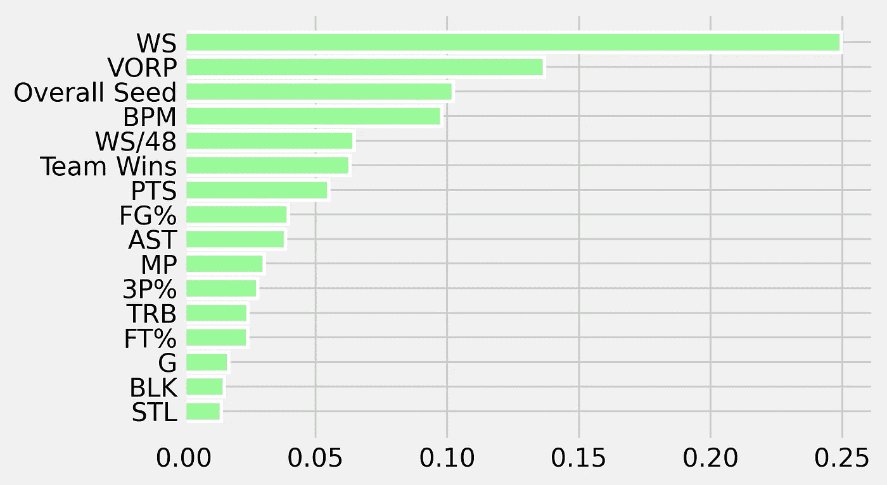
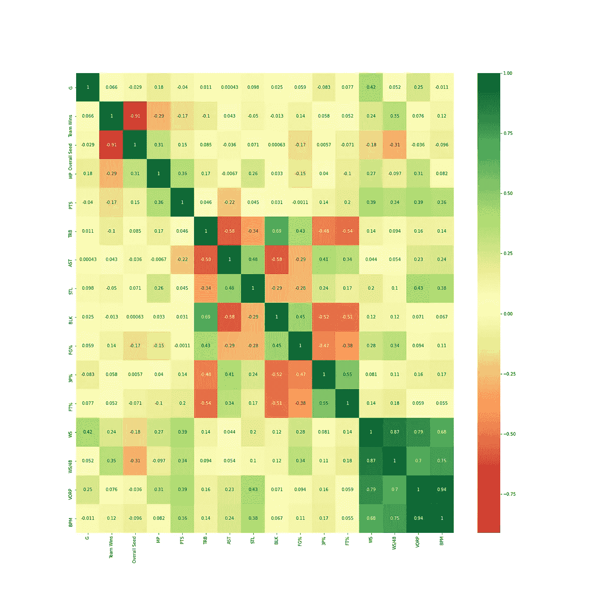
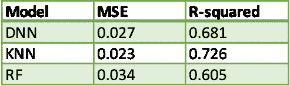
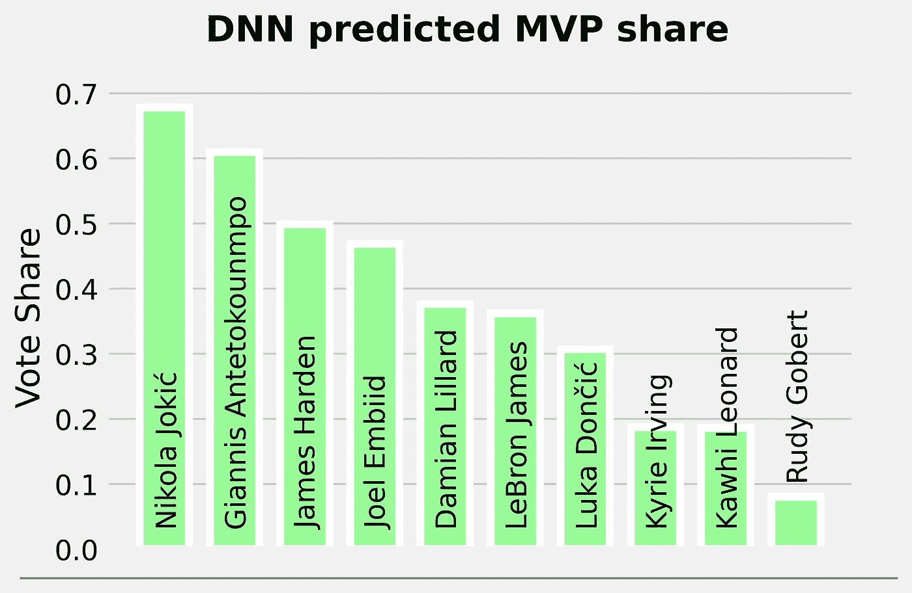
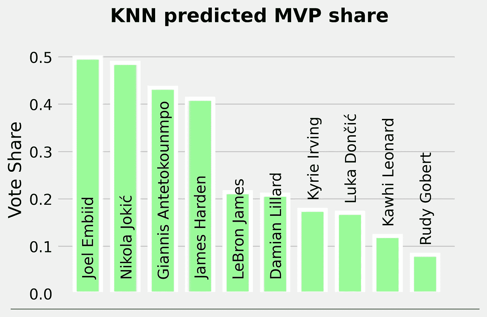
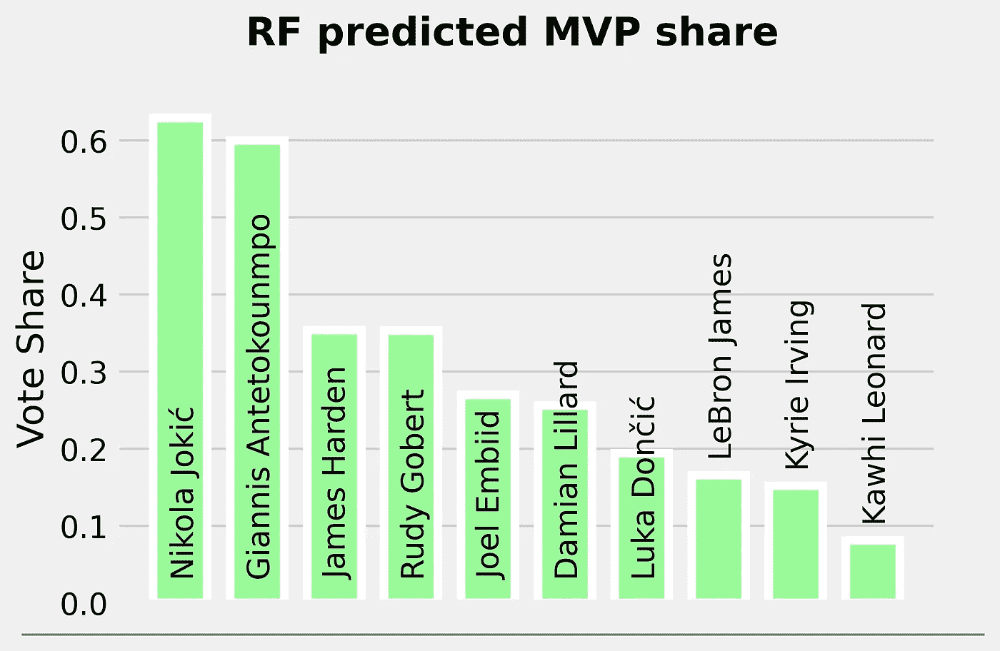
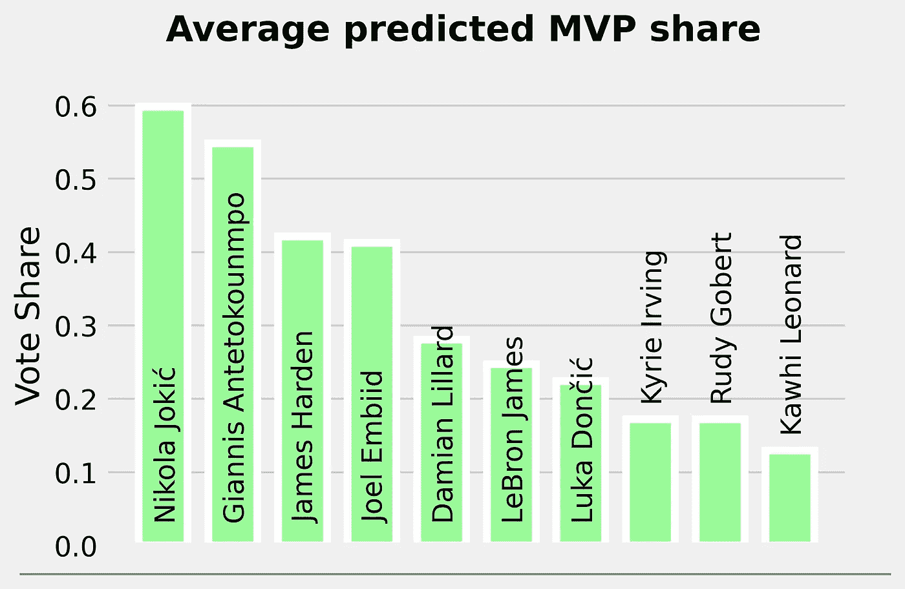

# 使用机器学习预测 2020-21 年 NBA 最有价值球员

> 原文：<https://towardsdatascience.com/predicting-2020-21-nbas-most-valuable-player-using-machine-learning-24aaa869a740?source=collection_archive---------19----------------------->

## ML 模特对 MVP 比赛有什么看法？


基思·艾利森在[维基共享资源](https://commons.wikimedia.org/wiki/File:Giannis_Antetokounmpo_(24845003687).jpg)上的照片

在每个赛季结束时，全国篮球协会(NBA)的媒体成员被要求决定联盟最受欢迎的个人常规赛奖的获胜者:最有价值球员(MVP)。创立于 1955-56 赛季，旨在奖励常规赛中表现最佳和最稳定的球员。

每年都会在篮球迷和分析师中引发很多争论，MVP 竞赛通常是 NBA 赛季中最有趣(也是最激烈)的故事情节之一。虽然叙述在最终决定获胜者的过程中发挥了重要作用，但它主要归结于对其团队的成功具有最大统计影响的球员。

随着本赛季的比赛超过一半，谁是真正的 MVP 候选人变得越来越清楚。但是谁最终会赢得它呢？基于已经进行的比赛和历史数据，本文的目标是使用 ML 模型预测 MVP 的结果。

# 数据

对于历史数据，我们利用了[运球分析的数据集](https://github.com/dribbleanalytics/ml-mvp-predict/blob/master/2018-19-season/mid-season/final-csv-data/historical-mvps.csv)，它包含了从 1979-80(三分时代的开始)到 2017-18 每个赛季 MVP 投票中前 10 名球员的数据。除此之外，我们还收集了以下两个赛季(2018-19 和 2019-2020)的相同数据。

至于本赛季，我们收集了目前在 [Basketball Reference 的 2020-21 NBA MVP 奖项追踪器](https://www.basketball-reference.com/friv/mvp.html)上的 10 名球员的数据:尼古拉·约基奇、乔尔·恩比德、扬尼斯·阿德托昆博、詹姆斯·哈登、达米恩·利拉德、勒布朗·詹姆斯、科怀·伦纳德、卢卡·东契奇、凯里·欧文和鲁迪·戈贝尔。

所有的数据都可以在[篮球参考](https://www.basketball-reference.com)上找到。

# 特征选择

在提到我们模型的特性之前，定义我们的目标值是很重要的。我们试图预测的目标值是每个球员获得的 MVP 总票数的*份额*。

```
Share = (MVP votes on Player)/(Total MVP votes)
```

至于特性，我们从总共 16 个开始:

```
Games
Team Wins
Overall Seed
MP
PTS/G
TRB/G
AST/G
STL/G
BLK/G
FG%
3P%
FT%
WS
WS/48
BPM
VORP
```

前四个是简单的统计数据。它们分别代表每个球员参加的比赛次数，他们的球队赢了多少场，他们的球队在联盟中的位置以及每场比赛的上场时间。

PTS/G，TRB/G，AST/G，STL/G，BLK/G 代表每场比赛的得分，篮板总数，助攻，抢断和盖帽。

FG%，3P%，FT%代表投篮命中率，三分命中率，罚球命中率。

WS，WS/48，VORP 和 BPM 是高级统计。WS 和 WS/48 代表[赢份额](https://www.basketball-reference.com/about/ws.html)和每 48 分钟赢份额。这些数据旨在将团队的成功划分到团队的个人成员身上。

[BPM](https://www.basketball-reference.com/about/bpm2.html) 代表 Box Plus/Minus，是一个衡量球员在球场上对球队贡献的指标。

最后， [VORP](https://www.basketball-reference.com/about/glossary.html) 代表价值超过替代，是一名球员在替代级别球员之上贡献的每 100 分球队财产的积分估计，转换为平均球队，并按比例分配到 82 场比赛的赛季。

为了帮助我们决定使用哪些特性，我们拟合了一个随机 Forrest 回归，并检查了该模型的特性重要性结果。



射频特征重要性结果

接下来，我们还找到了相关矩阵。我们希望识别它们之间高度相关的特征，并删除一个以避免给模型提供重复的信息。



在研究了相关矩阵之后，我们确定了一些有意义的相关性。例如，功能总体种子与成功的数量密切负相关。没有必要使用这两个功能。我们还可以看到变量 WS 和 WS/48、BPM 和 VORP 之间的一些强相关性。这也是有意义的，因为度量 WS/48 和 VORP 分别依赖于 WS 和 BPM。

在最初的 16 个特性中，我们最终删除了其中的 7 个。我们模型的最终特征是:

```
Overall Seed
PTS/G
TRB/G
AST/G
STL/G
BLK/G
FG%
WS
VORP
```

# 培训和测试

为了训练和测试我们的模型，我们需要一个训练集和一个测试集。正如机器学习技术中常见的那样，两个数据集的划分是随机进行的，训练集由完整数据集的 75%组成。

我们用来评估模型在测试集上的性能的指标是均方误差(MSE)和 R 平方。

在我们的实验中，我们使用了以下模型:

*   深度神经网络(DNN)
*   k 近邻回归(KNN)
*   随机福里斯特回归

下表显示了三种模型的 MSE 和 R 平方。众所周知，较低的 MSE 和较高的 R 平方表示模型更精确。



查看结果，模型没有非常高的 R 平方，但我们实现了非常低的 MSE 值。考虑到大多数 MVP 得主比他们的亚军有 0.1 以上的投票份额优势，这些都是好结果。正如我们所见，KNN 是测试集上表现最好的模型，具有最高的 R 平方和最低的 MSE。

# 预言

下面的 4 张图显示了每个型号对 2020–21 MVP 投票份额的预测。



我们的两个模型有 Joki 作为获胜者，一个有 Embiid。两个模特预测詹尼斯是亚军。詹姆斯·哈登在两种模式中排名第三，在另一种模式中排名第四。一个奇怪的结果:与其他模型相比，我们的 RF 模型绝对喜欢鲁迪·戈贝尔的机会(出于某种原因)，在 MVP 投票份额中排名第四。



平均值显示，乔基奇以微弱优势赢得 MVP，超过詹尼斯。哈登和恩比德在份额上也遥遥领先于其余候选人。

# 结论

我们的模型冠乔基奇为最有价值球员，但对这个奖项的争夺仍然非常激烈。

约基奇的 MVP 案例比以往任何时候都强。除了他在球场上令人难以置信的统计影响外，*小丑*到目前为止参加了本赛季的每一场比赛。这是能使他从其他候选人中脱颖而出的一点。

恩比德拥有一个历史性的赛季，但他最近的受伤可能会永久性地损害他赢得比赛的机会。

詹尼斯是一个常年 MVP 候选人，如果他最终成为投票中的第一名，任何人都不会感到惊讶。

詹姆斯·哈登可以被视为这场比赛中的*黑马*，但不可否认的是，他的影响已经在他的新团队中感受到了。如果他保持最近的表现，他在赛季结束时肯定会成为 MVP 的有力竞争者。

很多事情仍然可以(也将会)改变，但有一点似乎很清楚:在约基奇、詹尼斯、恩比德和哈登之间，我们可以自信地预测，奖项将会颁给这些球员中的一人。

[**Github 资源库**](https://github.com/duartevfreire/nbamvp)