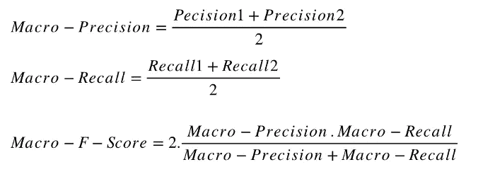
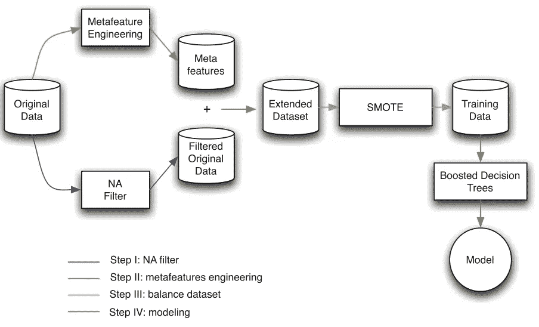
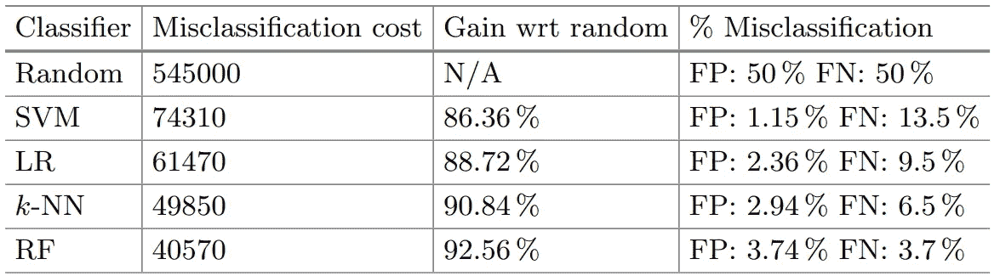
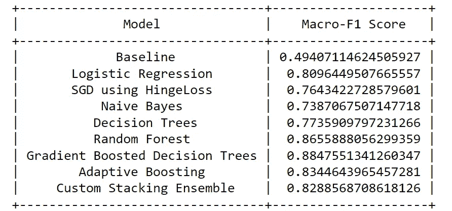
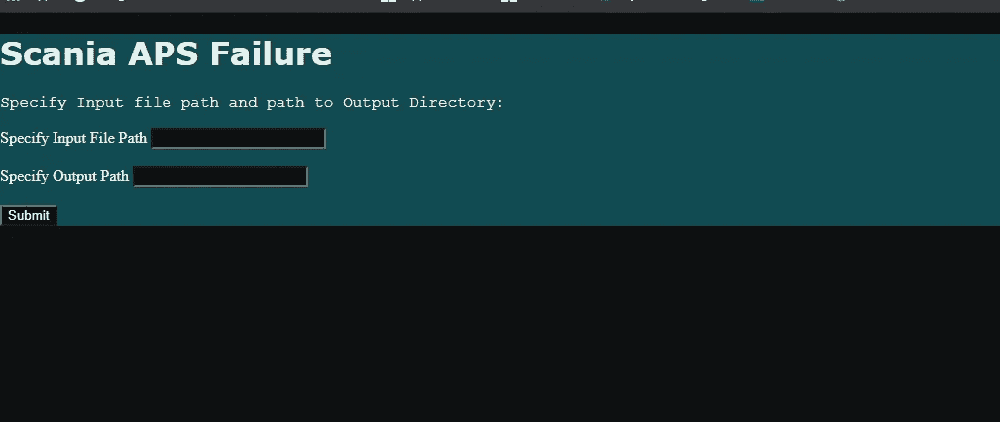

# 预测斯堪尼亚气压系统故障

> 原文：<https://towardsdatascience.com/predicting-a-failure-in-scanias-air-pressure-system-aps-c260bcc4d038?source=collection_archive---------15----------------------->

## 使用机器学习降低维护成本


图片由[皮克斯拜](https://pixabay.com/?utm_source=link-attribution&utm_medium=referral&utm_campaign=image&utm_content=2920533)的[彼得 H](https://pixabay.com/users/tama66-1032521/?utm_source=link-attribution&utm_medium=referral&utm_campaign=image&utm_content=2920533) 拍摄

**气压系统(APS)** 是重型车辆的重要组成部分，压缩空气使活塞在刹车垫上施加压力，使车辆减速。用 APS 代替液压装置的优点是容易从自然中获得可持续的空气。

该数据集包括从日常使用的重型斯堪尼亚卡车上收集的数据。这些是卡车在运行过程中的故障案例，我们的任务是预测给定的故障是否是由空气压力系统的特定组件引起的。这有助于避免卡车运行过程中的故障，从而降低维护成本。

> 数据可以在:[https://archive . ics . UCI . edu/ml/datasets/APS+Failure+at+Scania+Trucks](https://archive.ics.uci.edu/ml/datasets/APS+Failure+at+Scania+Trucks)找到

# 内容:

1.  ML 公式
2.  业务限制
3.  数据集概述
4.  绩效指标
5.  文献评论
6.  第一次切割溶液
7.  入门指南
8.  移除单值要素
9.  处理缺失值
10.  分离特征进行分析
11.  直方图特征分析
12.  数字特征分析
13.  总结我们的探索性数据分析
14.  准备数据
15.  实验经典 ML 模型
16.  使用 Flask API 在本地服务器上部署
17.  结论
18.  未来范围
19.  参考

# ML 公式

这是一个**二元分类**问题，正类告诉我们故障是由 APS 的特定组件引起的，而负类告诉我们故障与该组件无关。因此，*给定一个新的数据点(传感器信息)，我们可以建立一个 ML 模型，告诉我们故障是否是由卡车的 APS 引起的*。

# 业务限制

1.  **延迟**必须相当低，以检测 APS 中的故障并避免维护成本增加。
2.  **错误分类的成本非常高**,因为 APS 部件未被检测到的故障会导致卡车在运行过程中出现故障，从而增加维护成本。

# 数据集概述

训练数据集由**60000 个数据点**和 **171 个特征**组成，其中一个是类标签。这些特征是数字数据和直方图箱数据的组合。**功能名称因专有原因保持匿名*。59，000 个数据点属于负类，剩余的 1，000 个数据点属于正类。这告诉我们，我们正在处理一个**高度不平衡的数据集**，并且通常是我们在真实世界场景中可以预期的数据类型。*

*观察到的另一个问题是大部分**数据缺失**。在极端情况下，一些实例会丢失 80%的值。数据集被分类为**完全随机缺失(MCAR)** ，因为数据点是否缺失与数据集中的任何值是否缺失或观察到没有关系。因此，我们必须通过特征工程的方法来解决这些问题。*

# *绩效指标*

*我们将使用**宏 F1 分数**作为我们该项目的绩效指标。宏 F1 分数考虑了每个类别的 *F1 分数。基于两个类的正确分类点的数量向我们展示我们的模型的性能可能是有益的。这是有用的，因为错误分类的成本非常高，因为未被检测到的 APS 故障会导致卡车在运行期间发生故障，并增加维护成本。**

**

*[宏精度、宏召回和宏 F1](https://medium.com/@ramit.singh.pahwa/micro-macro-precision-recall-and-f-score-44439de1a044)*

# *文献评论*

> *Cerqueira，Vítor 等. ***将提升树与元特征工程结合起来进行预测性维护。*** “智能数据分析国际研讨会。施普林格，查姆，2016。*

*这篇论文提到作者解决这个问题的方法包括 4 个步骤。(I)基于缺失值的数量排除特征和数据点的子集的过滤器；(ii)用于基于现有信息创建新特征的元特征工程程序；㈢处理类别不平衡问题的有偏抽样方法(SMOTE)；以及(iv)使用提升的树进行分类。*

*缺失值百分比高的要素已被移除。在他们的分析过程中，他们发现一些特征有 80%的数据缺失，170 个特征中有 8 个有超过 50%的缺失值。在移除所述特征之后，可以看到存在重复的数据点，这表明移除的特征对于获得好的分数几乎没有影响。*

*他们提到，他们将该问题视为异常检测问题，因为数据的正类的特征是该领域中罕见的事件。他们在元特征工程中使用了*箱线图分析*(对于每个特征，将每个值与在该特征中找到的典型值进行比较)*局部异常值因子*(通过密度估计将数据点与其局部邻域进行比较)和*分层凝聚聚类*(每个步骤合并两个相似的组，合并的最后一个观察值可能是异常值)。*

*[**SMOTE**](https://www.geeksforgeeks.org/ml-handling-imbalanced-data-with-smote-and-near-miss-algorithm-in-python/#:~:text=SMOTE%20(synthetic%20minority%20oversampling%20technique)%20is%20one%20of%20the%20most,instances%20between%20existing%20minority%20instances.) 是一种复制不平衡数据集的少数类数据点的方法，以平衡它。将 SMOTE + MetaFeature 工程与 XGBOOST 库一起使用可以获得最佳结果。*

**

*来源:[研究论文](https://link.springer.com/chapter/10.1007/978-3-319-46349-0_35)*

*本文提出了利用箱线图分析、LOF 和层次凝聚聚类来创造新特征的思想。它还向我们展示了 SMOTE 的一个使用案例，以及所有这些特征工程技术与使用 GBDT 模型相结合的结果。*

> *科斯塔、卡蜜拉·费雷拉和马里奥·纳西门托。" ***IDA 2016 工业挑战赛:使用机器学习预测故障。*** “智能数据分析国际研讨会。施普林格，查姆，2016。*

*这篇论文是这次挑战的获胜方案。作者尝试了不同的算法，即*逻辑回归、K-NN、SVM、决策树和随机森林*来解决这个问题。他们通过实施*软估算算法*来处理缺失数据。这是一个大规模矩阵完成算法，用当前猜测值替换缺失值，并解决一个优化问题。通过设置高阈值(截止值)来处理不平衡数据，这意味着模型只有在非常确定的情况下才会预测负类。*

*最终结果显示， *Random Forest 表现最好的是*，其总成本(给定指标)比基准模型低 92.56%。KNN 模型是第二好的分类器，具有 90.84%的改进，而逻辑回归模型工作良好，具有 88.72%的改进。基于 RBF 核的 SVM 仅提高了 86.36%的总成本。*

**

*来源:[研究论文](https://link.springer.com/chapter/10.1007/978-3-319-46349-0_33)*

*本文比较了不同模型在缺失值使用更复杂的算法而不是简单的均值/中值进行估算的数据上的表现。我们看到，集合模型将很好地解决这个问题，高阈值在处理不平衡数据中起着关键作用。*

# *首次切割方法*

1.  *由 16，000 个数据点组成的测试数据集也可供我们使用。因此，我们不需要分割我们的训练数据集。*
2.  *执行 EDA 并查看特征之间的相关性，并执行降维技术来检查数据在二维空间中的分布情况。*
3.  *所有上述论文都关注这样一个事实，即大量数据缺失，数据集高度不平衡。为了处理缺失数据，我将使用链式方程多重插补(MICE)算法，该算法被证明是相当好的。我们也可以使用基于 K-NN 的插补。*
4.  *缺失值超过 50%的特性对于模型性能的改善并不重要，因此我们可以选择删除它们。(或者我们可以选择将值归入所有特征并执行特征选择过程)。*
5.  *每个可用要素的新二元要素集，其中 0 表示该值最初缺失，现在被估算，1 表示该值已经存在。这样我们可以保留一些关于我们收到的原始数据的信息。*
6.  *为了处理不平衡的数据集，我们可以应用 95%的高阈值来将一个点分类为负，或者使用 SMOTE 之类的上采样方法来平衡数据集，并选择最有效的方法。*
7.  *对于模型构建，我们可以尝试在不同的模型上工作，看看它们在不同插补方法的数据上表现如何，但从之前的工作中，我们可以看到梯度增强决策树、随机森林和朴素贝叶斯在大多数情况下都工作得很好。*
8.  *最后，我们可以根据数据计算所有模型的性能指标，并选择最佳模型。*

# *入门指南*

*首先，让我们导入所需的包并读取我们的培训数据。*

*数据集由 171 个要素组成，包括类别标注。此外，在类标签属性中，我们将用 0 替换“neg ”,用 1 替换“pos”。*

*类别分布图显示了数据不平衡的严重情况，因为在总共 60，000 个训练点中，大约 59，000 个点属于负类别，而只有 1，000 个点属于正类别。我们可以选择对少数类数据点进行上采样，或者使用改进的分类器来解决这个问题。此外，在某些特性中，缺失数据的百分比非常高(在一个特性中高达 82%)。*

# *移除单值要素*

*在可用的特征中，对于所有数据点具有相同值的特征对于提高我们模型的性能并不重要。因此，我们可以丢弃这些特征。我们可以删除标准偏差为 0 的特征。*

*其中一个特征，(' ***cd_000*** *'* )被视为对于所有数据点都具有恒定值。我们可能会删除此功能。*

# *处理缺失值*

*在对预测任务进行建模之前，识别并替换输入数据中每一列的缺失值始终是一种很好的做法。这被称为[缺失数据插补](https://machinelearningmastery.com/statistical-imputation-for-missing-values-in-machine-learning/)，简称插补。*

*我们可以通过以下方式对缺失数据进行一些基本的处理:*

*   **我们将丢弃缺失值超过 70%的特征。**
*   **对于缺失值小于 5%的特性，我们可以删除那些行。**
*   **对于缺失值在 5–15%之间的特征，我们将使用平均值/中值估算这些缺失值。**
*   **现在，对于缺失值百分比在 15–70%之间的其余特征，使用基于模型的插补技术。**

*128 个特性的丢失值不到 5%,因此我们删除了这些特性中包含丢失值的行(4027 行)。7 个特征( *'br_000 '，' bq_000 '，' bp_000 '，' bo_000 '，' ab_000 '，' cr_000 '，' bn_000'* )缺少超过 70%的值。这些功能已被删除。*

*然后，类标签从我们的数据集分离出来，留给我们一个形状为 **(55973，162)** 的数据集。*

*14 个特征的值有 **5%到 15%** 缺失，并通过 sklearn 的**简单估算器**，缺失值使用'*中值*估算。接下来，对于具有 **15%到 70%** 缺失值的特征，我们将执行一种基于迭代模型的插补技术，称为 [**鼠标**](https://scikit-learn.org/stable/modules/impute.html#iterative-imputer) 。在每一步中，具有缺失值的特征被指定为输出 y，其他特征列被视为输入 X。回归器(我们使用了**岭回归器**)适用于已知 y 的(X，y)。然后，回归器用于预测 y 的缺失值。以迭代方式对每个特征执行此操作，然后对 max_iter(默认为 10)插补轮次重复此操作。返回最后一轮插补的结果。*

> *保存所有上述模型，并在测试数据集上执行预处理步骤。*

# *分离特征进行分析*

*给我们的是，某些特征是直方图仓信息，并且前缀(在' _ '之前的字母)是标识符，后缀是仓 _id(标识符 _ 仓)。*

*为了找到包含直方图柱信息的特征，我们知道来自单个直方图的所有特征具有相同的前缀。*

*我们可以看到有 7 组特征，每组有 10 个箱。换句话说，有 **7 个直方图被分成 10 个仓，每个仓有**。例如:标识符“ag”由 ag_000、ag_001、ag_002、ag_003、ag_004、ag_005、ag_006、ag_007、ag_008 和 ag_009 组成。*

> *直方图标识符为:['ag '，' ay '，' az '，' ba '，' cn '，' cs '，' ee']。*

```
*There are **70 features that contain histogram bin information** and they are: 
 ['ag_000', 'ag_001', 'ag_002', 'ag_003', 'ag_004', 'ag_005', 'ag_006', 'ag_007', 'ag_008', 'ag_009', 'ay_000', 'ay_001', 'ay_002', 'ay_003', 'ay_004', 'ay_005', 'ay_006', 'ay_007', 'ay_008', 'ay_009', 'az_000', 'az_001', 'az_002', 'az_003', 'az_004', 'az_005', 'az_006', 'az_007', 'az_008', 'az_009', 'ba_000', 'ba_001', 'ba_002', 'ba_003', 'ba_004', 'ba_005', 'ba_006', 'ba_007', 'ba_008', 'ba_009', 'cn_000', 'cn_001', 'cn_002', 'cn_003', 'cn_004', 'cn_005', 'cn_006', 'cn_007', 'cn_008', 'cn_009', 'cs_000', 'cs_001', 'cs_002', 'cs_003', 'cs_004', 'cs_005', 'cs_006', 'cs_007', 'cs_008', 'cs_009', 'ee_000', 'ee_001', 'ee_002', 'ee_003', 'ee_004', 'ee_005', 'ee_006', 'ee_007', 'ee_008', 'ee_009']*
```

> ***我们将使用完整的估算集从两个数据集中选择顶级特征。但是将对具有缺失值的数据进行分析。***

# *直方图特征分析*

*我们将对直方图数据集的前 15 个特征执行 EDA。为了选择特征，我们将使用随机森林分类器执行**递归特征消除***

*前 15 个功能是:*

```
*['ag_001', 'ag_002', 'ag_003', 'ay_005', 'ay_006', 'ay_008', 'ba_002', 'ba_003', 'ba_004', 'cn_000', 'cn_004', 'cs_002', 'cs_004', 'ee_003', 'ee_005']*
```

*[PDF](https://en.wikipedia.org/wiki/Probability_density_function) 、 [CDF](https://en.wikipedia.org/wiki/Cumulative_distribution_function) 和[框描绘了这些特征中的每一个特征的](https://en.wikipedia.org/wiki/Box_plot)，以试图理解我们的数据的分布。提出的意见如下:*

> *特性图 **ag_003、ay_008、ba_002、ba_003、ba_004、cn_004、cs_002、cs_004、ee_003 和 ee_005** 显示，特性的较低值表明 APS 部件没有故障。较高的值清楚地表明 APS 组件故障*
> 
> *APS 组件中没有故障时，特性 **ag_001 和 ay_005** 的大约 99%的值为 0。*
> 
> *我们可以说，在这些顶级特性中，较高的值可能表明卡车的气压系统出现故障*
> 
> *但是，在极少数情况下，这些值高于正常情况，但仍不会导致 APS 故障。示例:特征 **ee_005***

*考虑到每个特征如何与目标变量(“类别”)相关，我们可以观察到特征**“ay _ 005”**是我们的顶级属性中最不相关的特征。我们可以进一步进行**双变量分析**,分析其他顶级特性相对于‘ay _ 005’特性的变化情况。*

> ***ag_002，ag_001，cn_000** :从散点图可以看出，对于其他顶级特性的任意值，当特性‘ay _ 005’中的值接近 0 时，APS 组件(class label = 1)存在故障。*

# *数字特征分析*

*我们将对直方图数据集的前 15 个特征执行 EDA。为了选择特征，我们将使用随机森林分类器执行**递归特征消除***

*前 15 个功能是:*

```
*['aa_000', 'al_000', 'am_0', 'ap_000', 'aq_000', 'bj_000', 'bu_000', 'bv_000', 'ci_000', 'cj_000', 'cq_000', 'dg_000', 'dn_000', 'do_000', 'dx_000']*
```

*[PDF](https://en.wikipedia.org/wiki/Probability_density_function) 、 [CDF](https://en.wikipedia.org/wiki/Cumulative_distribution_function) 和[方框绘制了这些特征中的每一个的](https://en.wikipedia.org/wiki/Box_plot)，以试图理解我们的数据的分布。提出的意见如下:*

> ***aa_000 :** 如果 APS 中没有故障(class label = 0)，大约 95%的点的值在 *0.1x1e6* 以下。高于该值通常表示 APS 组件出现故障。*
> 
> ***al_000，am _ 000:**APS 组件的故障实例和非故障实例的值在此特性中无法明确区分。虽然失败案例的点确实具有稍高的值。*
> 
> ***ap_000，aq_000，bj_000，bu_000 :** 与非故障情况相比，故障情况具有更高的值。但是 APS 组件的非故障实例很少，这在该特征中看到更高的值。*
> 
> *在所有特性中，除了 **dg_000、cj_000、am_0 和 al_000** 之外，特性中较高的值通常表示 APS 组件出现故障。但是由于数据的不平衡性质，这可能是不确定的。*

*考虑到每个特征如何与目标变量(“类别”)相关，我们可以观察到特征**“dx _ 000”**是我们的顶级属性中最不相关的特征。我们可以进一步进行**双变量分析**,了解其他顶级功能相对于功能‘dx _ 000’的变化情况。*

> *此处所有图中的主要观察结果是，对于剩余特征的任何值，如果特征‘dx _ 000’具有低值(接近 0)，则可能指示 APS 组件中存在故障(类别标签=1)。*

# *总结我们的探索性数据分析*

1.  *数据集由 60，000 个数据点和 171 个要素组成，包括类别标签。*
2.  *在绘制每个类别标签的计数后，我们发现在 60000 个点中，59000 个点属于类别 0，剩余的 1000 个点属于类别 1。我们正在处理一个高度不平衡的二进制分类问题。*
3.  *然后，我们继续检查数据集中缺失的值。我们观察到一些特性丢失了超过 70%的值。我们决定从数据集中移除这些要素。7 个特征因此被移除。*
4.  *有一个要素(cd_000)对于所有数据点都只有一个值。我们决定去掉它，因为它不会给我们的模型性能增加多少价值。*
5.  *对于缺失数据少于 **5%** 的特征，由 NA 值组成的行被移除。具有 **5% — 15%** 缺失值的特征使用**中值**进行估算。具有 **15% — 70%** 缺失值的特征使用基于**模型的插补技术**进行插补。*
6.  *有 70 个特征由来自 7 个直方图的 bin 信息组成。每个直方图有 10 个柱。直方图特征是具有标识符的特征: **['ag '，' ay '，' az '，' ba '，' cn '，' cs '，' ee']** 。直方图和数字特征被分成两个数据集，我们对两个数据集的前 15 个特征进行了**单变量和双变量分析**。*
7.  *通过使用随机森林分类器执行递归特征消除，我们发现直方图数据集中的前 15 个特征是: **['ag_001 '，' ag_002 '，' ag_003 '，' ay_005 '，' ay_006 '，' ay_008 '，' ba_002 '，' ba_003 '，' ba_004 '，' cn_000 '，' cn_004 '，' cs_002 '，' cs_004 '，' ee_003 '，' ee_005']***
8.  *对这些特性的分析表明，在这些顶级特性中，较高的值可能表明卡车的空气压力系统有故障。但是，在极少数情况下，这些值高于正常情况，但仍不会导致 APS 故障。示例:特征 **ee_005** 。对最不相关特征与目标变量( **ay_005** )的单变量分析我们看到，对于 **ag_002、ag_001、cn _ 000**——对于这些其他顶级特征的任何值，当特征‘ay _ 005’中的值接近 0 时，APS 组件(类别标签= 1)存在故障。*
9.  *通过使用随机森林分类器执行递归特征消除，我们发现来自数值数据集的前 15 个特征是: **['aa_000 '，' al_000 '，' am_0 '，' ap_000 '，' aq_000 '，' bj_000 '，' bu_000 '，' bv_000 '，' ci_000 '，' cj_000 '，' cq_000 '，' dg_000 '，' dn_000 '，' do_000 '，' dx_000 '***
10.  *从单变量分析中，我们看到在所有特征中，除了 **dg_000、cj_000、am_0 和 al_000** 之外，特征中较高的值通常表示 APS 组件中的故障。但是由于数据的不平衡性质，这可能是不确定的。特征**‘dx _ 000’**是顶部特征中最不相关的特征。我们执行了类似于直方图顶部特征的**双变量分析**，此处所有图中的主要观察结果是，对于剩余特征的任何值，如果特征‘dx _ 000’具有低值(接近 0)，则**可能指示**APS 组件(类标签=1)中存在故障。*

# *准备我们的数据(标准化+ SMOTE +欠采样)*

*[**标准化**](https://towardsai.net/p/data-science/how-when-and-why-should-you-normalize-standardize-rescale-your-data-3f083def38ff) 一个向量最常意味着减去一个位置的度量，再除以一个尺度的度量。例如，如果向量包含具有高斯分布的随机值，您可以减去平均值并除以标准差，从而获得平均值为 0、标准差为 1 的“标准正态”随机变量。我们将使用 sklearn 的 **MinMaxScaler** 来缩放我们的数据。*

*不平衡分类的一个问题是少数类的例子太少，模型无法有效地学习决策边界。解决这个问题的一个方法是对少数类中的示例进行过采样。*

> *SMOTE 和欠采样的组合比简单的欠采样执行得更好。*

*最后我们有*33226 分属于负类，16613 分属于正类*。我们将通过线性模型(逻辑回归和支持向量机)传递我们的缩放数据集。*

# *实验经典 ML 模型*

*现在，我们已经准备好执行 EDA、数据预处理和特征工程，让我们继续建模。我们将通过各种模型传递我们的数据，执行超参数调整，并根据我们的性能指标(宏观 F1 得分)和混淆矩阵对每个模型进行评估。我们将在这里尝试的不同模型是**逻辑回归、支持向量机、朴素贝叶斯、决策树、随机森林、梯度增强决策树、Adaboost 分类器和自定义集成**。*

*作为基线模型，我们将预测所有类别标签为 0(多数类别)，并计算相同类别的 F1 分数。我们可以使用 sklearn 的 **DummyClassifier** 来获得基线结果。*

*对于我们的定制套装:*

1.  *将列车组分成 D1 和 D2(50-50)。*
2.  *从 D1，用替换的执行**取样以创建 *d1、d2、d3 …dk* (k 个样本)。***
3.  *现在，创建“k”个模型，并用这 k 个样本中的每一个来训练这些模型。*
4.  *让 D2 通过每个“k”模型，这给了我们每个模型对 D2 的“k”预测。*
5.  *使用这些“k”预测创建一个新的数据集，对于 D2，因为我们已经知道它的相应目标值，我们现在可以用这些“k”预测作为特征来训练一个元模型。*
6.  *对于模型评估，我们将通过每个基础模型传递我们的测试集，并获得“k”个预测。然后，我们可以用这些“k”个预测创建一个新的数据集，并将其传递给之前训练过的元模型，以获得我们的最终预测。*
7.  *现在，使用这个最终预测以及测试集的目标，我们可以计算模型的性能分数。*

*我们可以用决策树作为基础模型，用 GBDT 作为元模型。这是一个自定义实现的模型。*

*在执行超参数调整和试验各种模型之后，我们看到梯度提升决策树工作得最好，因为它获得了最高的宏 F1 分数(如下所示)。*

**

*建模概述*

# *使用 Flask API 在本地服务器上部署:*

*该模型可以使用 Flask API 部署在我们的本地服务器上。相同的代码包括加载所需的模型，从。csv 文件，并将最终输出存储在输出目录下的. csv 文件中。*

****下面给出了相同的 HTML 代码****

*HTML 代码*

*在运行上面的代码时，我们本地服务器上的 html 页面看起来像这样，您可以在这里指定输入文件和输出目录的路径:*

**

*用于指定路径的 HTML 页*

> *输出目录将由一个. csv 文件(包含时间戳)组成，该文件包含预处理数据集以及模型预测。*

***为了更清晰的画面，可以查看** [**这段视频**](https://youtu.be/48_wGY20BQg) **，演示了完整的过程:***

*展示模型部署的 YouTube 视频*

# *结论:*

*总而言之，我们首先移除具有最大量缺失值的特征，然后使用中位数和 MICE 插补方法的组合从剩余特征中插补缺失值，然后通过我们训练的梯度增强决策树模型传递该预处理数据集。取得的成果相当不错，并已部署。我希望这个项目能让你对如何着手任何数据科学项目有一个公平的想法，尤其是如果你刚刚起步的话:)*

*你可以在我的 [Github](https://github.com/rithwikshetty/scania_aps.git) 查看完整的代码。并随时通过 [LinkedIn](https://www.linkedin.com/in/rithwik-shetty-003019113) 或 [Twitter](https://twitter.com/RithwikShetty1) 联系我。*

# *未来范围*

1.  *深度学习方法可以用来解决这个特定的问题，我们可以使用我们的性能度量来评估神经网络。*
2.  *可以使用各种其他插补方法，例如软插补算法。*

# *参考*

1.  ***ka ggle:**[https://www . ka ggle . com/UC IML/APS-failure-at-Scania-trucks-data-set](https://www.kaggle.com/uciml/aps-failure-at-scania-trucks-data-set)*
2.  ***IDA 2016 工业挑战赛:利用机器学习预测故障:**[https://link . springer . com/chapter/10.1007/978-3-319-46349-0 _ 33](https://link.springer.com/chapter/10.1007/978-3-319-46349-0_33)*
3.  *【https://www.appliedaicourse.com/】应用人工智能课程:*
4.  ***机器学习掌握:**[https://machinelearningmastery.com/](https://machinelearningmastery.com/)*