# 用 DNA 甲基化数据预测年龄

> 原文：<https://towardsdatascience.com/predicting-age-with-dna-methylation-data-99043406084?source=collection_archive---------23----------------------->

## [实践教程](https://towardsdatascience.com/tagged/hands-on-tutorials)

## 建立模型从 DNA 甲基化数据预测年龄，包括比较组织和疾病队列的表现。

*这个项目是作为* [*哈佛顶点 IACS 课程*](https://www.capstone.iacs.seas.harvard.edu/) 的一部分进行的

*小组成员:丹尼尔·考克斯、雷亚新、埃莉诺拉·尚西拉、亚伦·雅各布森*

*特别感谢我们的课程导师克里斯·坦纳博士和 TF 黄家仪的指导和支持*。

**问题描述**

你多大了…生理上？科学家们发现，衰老的过程不仅在我们整个身体中，而且在我们的每个细胞中都引起了可观察到的变化，而且这一过程在不同的人之间不一定以相同的速度进行。某些特定年龄的人在生理上可能比其他人更年轻或更老。我们如何判断一个人的生理衰老速度是快于还是慢于平均水平？加速老化在多大程度上反映了当前或未来的疾病？这些问题是该团队旨在用生物数据来回答的，以评估给定个体的细胞以异常方式老化的程度，这可能表明需要治疗干预。

我们解决这个问题的方法是建立模型来预测真实的年龄，然后用这些模型作为比较特定个体的基线。

起初，还不清楚哪种生物数据是衰老的良好标志，我们考虑了几种:各种生物分子的血液水平、大脑的 MRI 扫描、各种组织中的 DNA 表达水平等。最终，在初步实验和文献回顾后，我们决定将 DNA 甲基化作为最有希望的年龄预测指标。

**什么是 DNA 甲基化？**

在人类中(几乎)所有的细胞都有一个包含称为染色体的长双链 DNA 的细胞核。每条染色体由一个主链组成，主链上有成对的含氮碱基 A、G、T 和 C，它们以不同的顺序重复排列，就像串珠一样(图 1)。在这条串珠状细绳的某些地方，有一些被称为甲基的额外装饰，它们是由特定于这项工作的酶放在那里的，更有趣的是，这些甲基连接的位置会随着年龄的变化而变化。

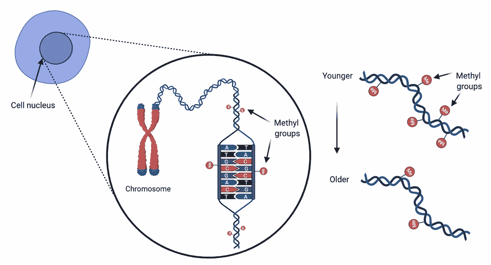

*图一。DNA 甲基化。*图片作者。

一般来说，老年人的 DNA 甲基化程度低于年轻人，但在任何特定的位点，甲基化程度都可能是双向的。甲基化可能在某些位置随年龄增长而增加，而在另一些位置则降低。我们说的是多少个职位？几百万。一般来说，DNA 甲基化的位点是 G 跟在 C 后面，中间有一个磷酸基团。这些位点被称为 CpG 位点，在我们的 DNA 中有大约 2000 万个，所以问题很快就变成了哪一个最能代表年龄？

**数据**

为了检验这个问题，我们从表观基因组数据中心(EWAS)的数据开始，这是一个 DNA 甲基化库。我们从健康个体的血细胞数据开始工作。该数据中的 CpG 站点数量约为 480，000 个。下面的图 2 显示了经过处理的数据的一小部分。

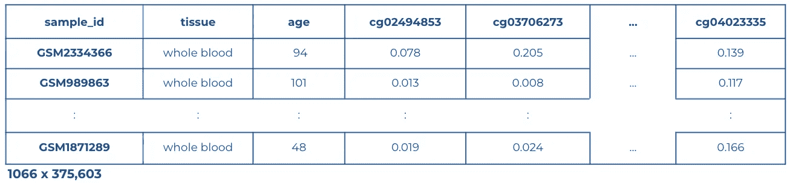

*图二。全血组织样本的 EWAS 健康队列数据的子部分。*图片作者。

每行对应一个个体的样本，每列对应一个 CpG 站点。表中的值表示该样品中 DNA 特定位点被甲基化的概率。通过选择年龄在 20-110 岁之间的个体并删除缺失值超过 10%的列进行初始预处理后，数据集包含 1066 行和 375，603 列。

该数据被分成训练集(75%)和测试集(25%)，两者都用训练集的列平均值进行估算。然后我们开始建模。

**基线模型:使用所有特征的线性和 XGBoost 模型**

我们最初的方法是利用所有可用的 CpG 位点(特征),确定我们从健康对照全血数据中预测人类实足年龄的准确度。为了研究这一点，我们使用年龄作为因变量对所有特征进行了线性回归。在我们的整个分析中，我们使用平均绝对误差(MAE)作为精度指标。MAE 是指预测年龄和真实年龄之间的平均绝对差值。结果如图 3 所示。令人鼓舞的是，无论有没有调整，线性模型都可以很好地预测整个生命周期的年龄，最好的模型在测试数据集(267 人)上达到了 4.43 年的平均寿命。我们还对该数据使用了一种基于非线性树的回归方法 XGboost，并发现了一些改进，实现了 4.32 年的平均寿命。

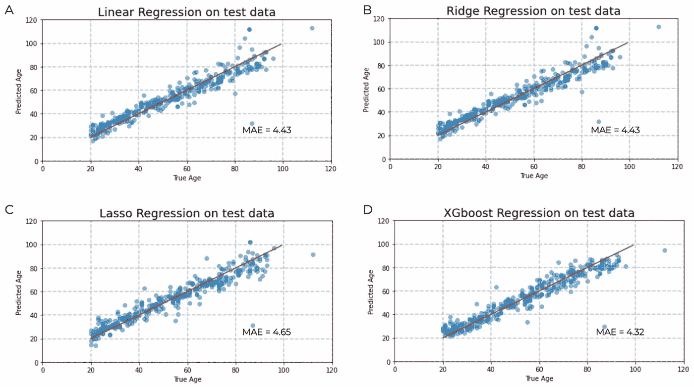

*图三。使用所有 375，603 个特征，1066 个样本，从全血 DNA 甲基化数据预测年龄。*图片作者。

与样本数量相比，大量的特征使模型容易过度拟合，导致下一个自然问题:哪些 CpG 网站与年龄预测最相关？

**功能选择**

为了回答这个问题，我们试图用几种方法来减少特征的数量:线性拟合的统计测试、自举相关分析、Shapley 评分的排序，以及使用 XGboost 回归的特征重要性。其中，线性拟合、Shapley 评分和 XGboost 回归的统计测试得出了类似的结果。我们选择了下面描述的 XGboost 方法(图 4 ),用于所有后续的模型构建。我们对数据进行了 80/20 的测试分类。我们将 XGBoost 模型应用于这一拆分，并记录了哪些 CpG 进入了前 100 名的重要性分数。这被重复了 50 次，然后每个 CpG 站点出现在前 100 个重要性分数中的频率被用来按照重要性排序。

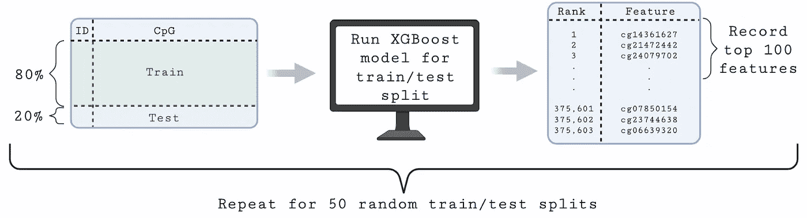

*图 4。使用 XGBoost 进行特征选择的工作流。*图片作者。

下面的图 5 显示了前 100 个 CpG 站点的这些频率的直方图。换句话说，它显示了在我们的 50 次试验中，每个 CpG 站点出现在前 100 个重要性分数中的频率。例如，图中的前 6 个特征的频率为 50，这意味着它们出现在所有 50 次随机试验的前 100 名中。这个结果是极不可能偶然出现的。事实上，任何 CpG 在 50 次试验中偶然出现 4 次以上的概率是 p = 7.66e-7。因此，这种方法是有选择性的，它可能选择那些甲基化与衰老最相关的 CpG。

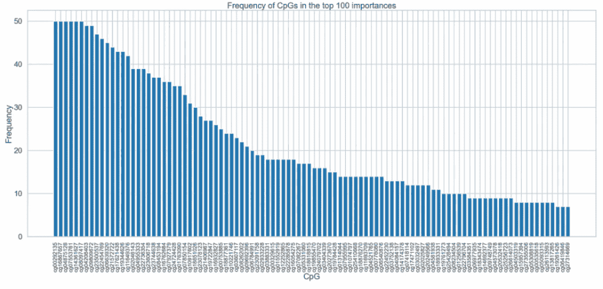

*图五。CpG 在前 100 个重要性分数中出现的频率。*图片作者。

有了这个过程，我们接着讨论应该使用多少这些顶级特性的问题。

**模型 1:使用精选功能的线性和 XGBoost 模型**

为了了解这种选择过程如何挑选出与年龄最相关的特征，我们首先将特征的数量从不到 40 万个减少到前 100 个。对这 100 个 CpG 位点重复了年龄预测基线模型，产生了图 6 中的结果。

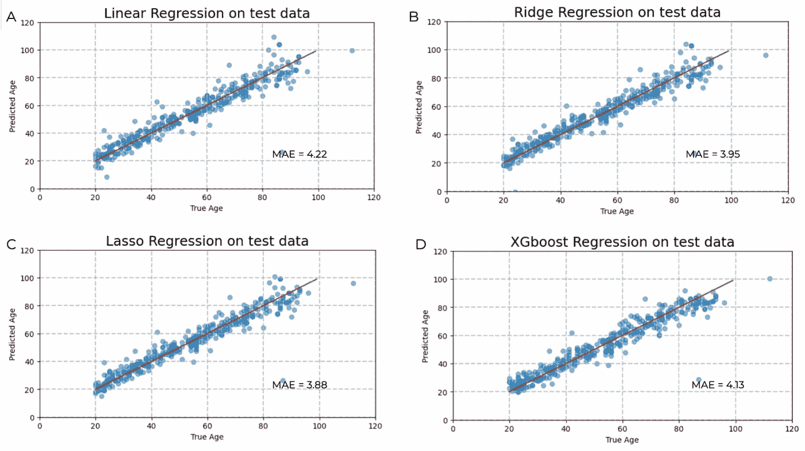

*图六。使用 XGboost 交叉验证排名的前 100 个 CpG 站点预测年龄。*图片作者。

值得注意的是，在将模型的特征从超过 40 万个削减到 100 个后，较小的模型表现相当。当使用 100 个 CpG 的随机集合时，情况并非如此，这表明我们的 CpG 排名方法有一些优点，并且数据集中的许多 CpG 位点可能与年龄预测无关。

接下来，为了找到在我们的模型中使用的最佳数量的特征，我们用不同数量的排名靠前的 CpG 站点来拟合数据。我们重复做了 50 次，每次用不同的 80/20 测试验证分割，然后确定最佳的 CpG 数。每种条件下 50 次实验的平均 MAE 值绘制在图 7 中。

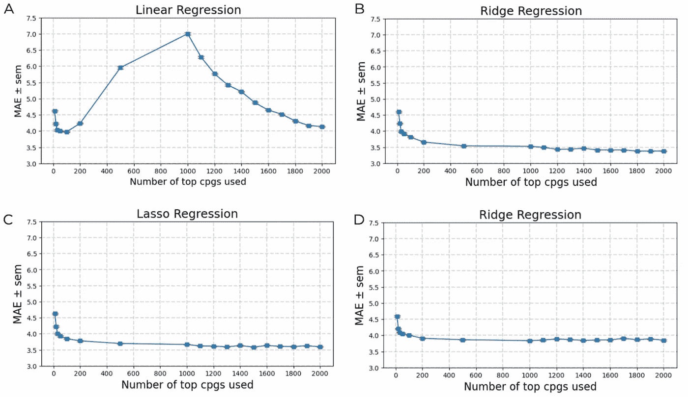

*图 7。平均绝对误差是所用分级 CpG 数量的函数。*图片作者。

有趣的是，对于非正则化线性回归(图 7-A ),最佳 CpG 数在大约 100 处开始趋于稳定，对于岭回归、Lasso 回归和 XGboost 回归(图 7 B-D ),最佳 CpG 数在大约 1000 处开始趋于稳定。对排名前 1000 的 CpG 重复建模，获得了相对于 100 CpGs 的适度改进，最佳模型是岭回归模型，该模型使用排名前 1000 的 CpG 并获得了 3.73 年的 MAE，如图 8 所示。

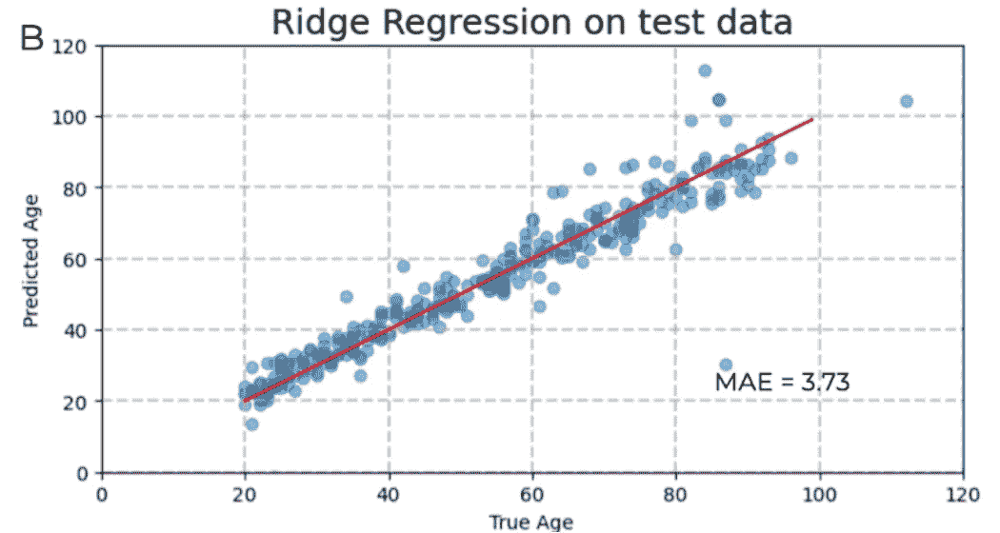

*图 8。使用通过 XGboost 交叉验证和岭回归排序的前 1000 个 CpG 站点预测年龄。*图片作者。

这是我们能达到的最高精度吗？或者我们可以用更复杂的模型比如神经网络做得更好吗？

**模型 2:神经网络**

类似于线性和 XGBoost 模型分析，神经网络(NN)建模的第一步是测试有多少特征是最佳的。从两个 NN 结构开始:NN A)包含 3 个隐藏层(节点号 128->56>28)，NN B)包含 2 层(节点号 128->56)。我们再次改变了 CpG 的数量，现在寻找用于神经网络建模的最佳数量(图 9)。

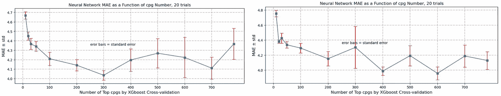

*图九。NN A)具有 3 个隐藏层(左)和 NN B)具有 2 个隐藏层(右)的不同数量的顶部特征的平均平均误差。*图片作者。

从图 9 中，我们可以看到，具有 3 个隐藏层的 NN A)在 300 到 700 CpGs 时性能最佳，NN B)的性能在 400 CpGs 左右处于平稳状态。有了这些信息，我们随后改变其他模型超参数—隐藏层节点数、激活函数—来调整神经网络模型以获得最佳性能。我们获得的最佳模型是一个具有 2 个隐藏层(隐藏层节点编号 128->64)的神经网络，它使用了前 700 个 CpG，并实现了 3.597 年的平均寿命(图 10)。

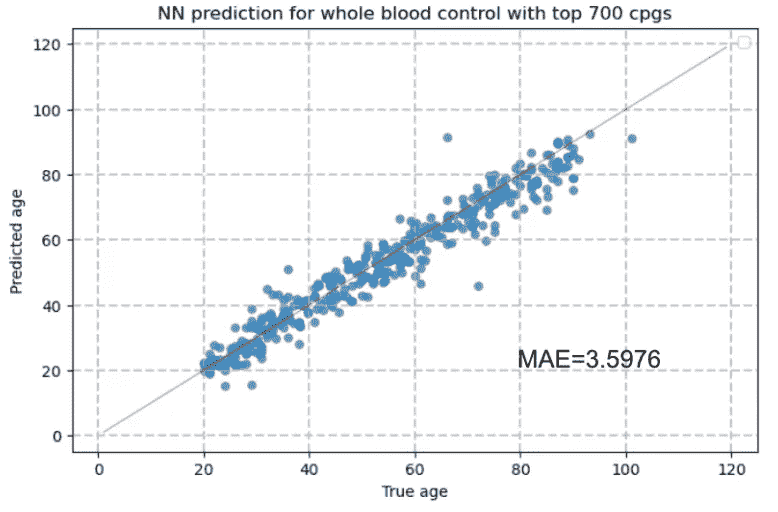

*图 10。使用具有三个隐藏层的神经网络预测年龄，其中包含 700 个顶级 CpG。*图片作者。

下面图 11 中的表格总结了我们用来自健康队列的全血的 DNA 甲基化数据的建模结果。具有 1000 或 100 CpGs 的 Ridge 和 Lasso 模型表现良好(MAE 分别= 3.73 和 3.88 年)，但神经网络表现最好(MAE = 3.60)。将这些结果与文献进行比较，我们的神经网络模型的误差与(2013)[1]和 Hannum (2013)[2]的误差相当，但不如张等人(2019)[3]的误差，后者报告的一些数据集的 rMSE 低至 2.04 年。

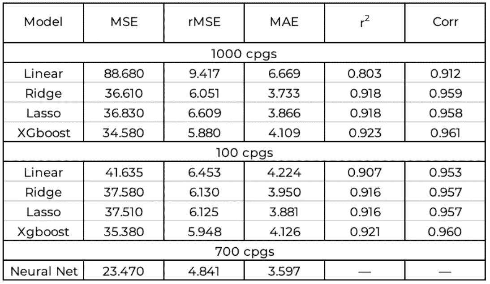

*图 11。适用于血液 DNA 甲基化数据(测试数据)的模型总结。*图片作者。

使用全血的 DNA 甲基化数据建立了这些模型后，我们考虑的下一个问题是这些模型是否可以不加改变地用于其他组织的数据。

**对其他组织的可转移性**

为了检验这一点，将两个最好的血液模型应用于大脑和乳房数据，而无需重新训练。岭回归模型的结果如图 12 所示，神经网络的结果如图 13 所示。答案很清楚:不，这些模型不能在组织间转移。

当我们的血液拟合脊模型应用于来自大脑的甲基化数据时，其年龄预测是平坦的，总是接近 40 岁。(图 12-A)。并且，当它被应用于乳房组织数据时，它的预测再次是平坦的，但是现在接近 80 岁(图 12-B)。

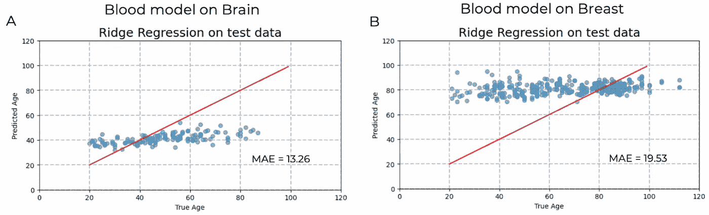

*图 12。应用由全血 DNA 甲基化数据开发的脊模型，使用来自其他组织的数据(1000 CpGs)。*图片作者。

当使用血液训练的神经网络模型预测年龄时，也观察到类似的系统预测变化(图 13)。当血液拟合神经网络应用于来自脑组织的甲基化数据时，我们看到了普遍的预测不足，而当其应用于乳腺数据时，我们看到了预测过度。

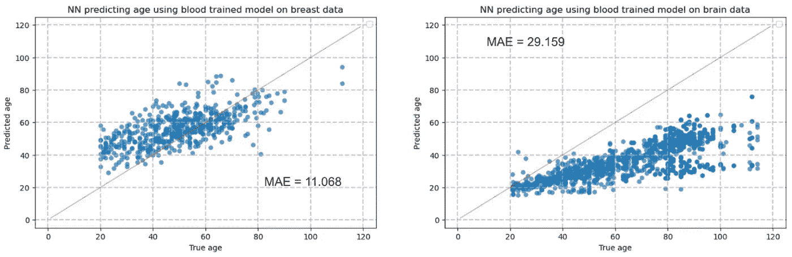

*图十三。应用由全血 DNA 甲基化数据开发的神经网络模型，使用来自其他组织的数据。*图片作者。

这种模型可转移性的缺乏可能是因为 1)不同的 CpG 位点可能与不同组织中的年龄预测最相关，或者 2)血细胞中 DNA 甲基化的一些特殊之处使其比其他组织中的 DNA 甲基化更能预测年龄。这些要点将在下面进行研究。

1.  **功能的可转移性**

我们首先询问排名靠前的血液特征是否可以用来预测其他组织甲基化数据的年龄。事实证明，答案是肯定的。我们发现，用血液数据预测年龄的最重要的特征也可以有效地用于用白细胞、乳腺和脑甲基化数据进行年龄预测建模。也就是说，虽然模型不能直接转移，但是特性是可以转移的。

对于白细胞数据，使用 782 个排名靠前的血液 CpG 的具有 2 个隐藏层(隐藏层节点编号 128->56)的 NN 实现了 3.51 的 MAE(图 14)，事实上略好于根据全血数据训练的类似模型。然而，这种令人印象深刻的性能并不适用于所有组织，因为用血液排序的 CpGs 训练的最佳乳房神经网络达到了 5.97 的 MAE，而用血液排序的 CpGs 训练的最佳大脑神经网络达到了 6.02 的 MAE。但是，这些结果确实证明了组织间某种程度的可移植性。

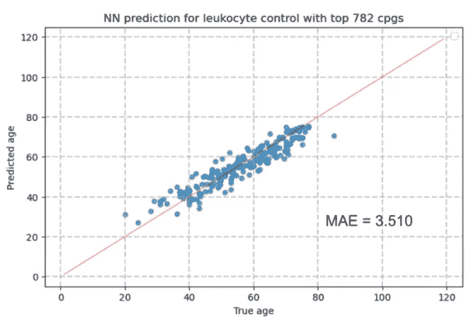

*图 14。使用拟合白细胞数据的神经网络来预测年龄，该数据具有两个隐藏层，其中 782 个顶级 CpG 通过 XGBoost* 从全血交叉验证中生成。图片作者。

**2。其他组织预测的准确性**

我们考虑的下一个问题是，来自全血以外的组织的 DNA 甲基化数据是否同样适用于预测年龄。我们通过重复对来自其他组织的全血数据使用的特征选择过程来检验这一点。然后，我们分别为每个组织建立模型，只考虑每个组织特定的排名靠前的 CpG 位点。脑和乳腺组织的岭回归结果如下图 15 所示。

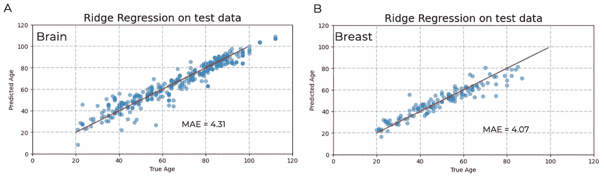

*图 15。使用来自大脑和乳房数据的前 1000 个 CpG 开发的线性模型。*图片作者。

有趣的是，用这些组织的数据建立的模型在预测年龄方面不如用血液数据建立的模型好。它们的 MAEs 要大得多，所以也许血细胞有一些独特的东西可以很好地预测年龄。

**向不健康群体转移的可能性**

既然我们知道模型在组织之间是不可转移的，但是这些特征在某种程度上是可转移的，我们问的下一个问题是用健康个体的数据建立的模型可转移到不健康的个体吗？为了这个项目的目的，我们将“不健康”定义为患有神经退行性疾病的个体，例如，亨廷顿舞蹈症、帕金森氏症和阿尔茨海默氏症。这些群组的数据也可以在 EWAS 上获得，尽管在下载的数据中只有大约 225，000 个 CpG 站点。在这项分析中，我们使用了来自健康对照和亨廷顿舞蹈症和阿尔茨海默氏症患者的大脑 DNA 甲基化数据。

使用健康个体的前 100 个中的 55 个 CpG 位点(由 XGBoost 选择)在健康群组上训练线性模型，所述健康个体在不健康群组中可用。这些模型中最好的是 lasso 回归模型，其 MAE 达到 5.431。

将这些模型直接应用于阿尔茨海默氏症和亨廷顿氏症患者，我们看到健康模型在两个不健康群体中都表现非常好。表现最好的线性模型(lasso 回归)实现了阿尔茨海默氏病患者的 MAE 为 4.771，亨廷顿氏病患者的 MAE 为 4.471(图 16)。换句话说，使用 55 个健康 CpG 的脑组织模型可转移到不健康群组，并在它们身上实现比在健康群组上更好的测试准确性。

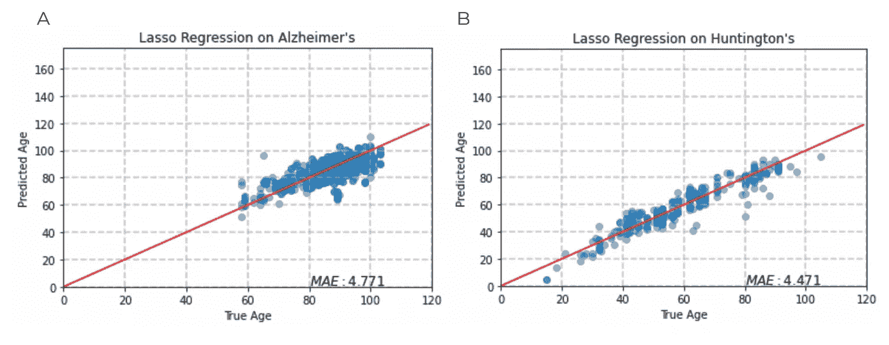

*图十六。55 个 CpG 位点的脑组织健康对照模型应用于 A)阿尔茨海默氏病脑组织数据(811)和 B)亨廷顿氏病脑组织数据(270)。*图片作者。

该模型的可转移性表明，健康个体中与年龄高度相关的 CpG 位点也与不健康个体中的衰老相关，这提出了一个问题，即与这些 CpG 位点相关的体重在健康和不健康队列之间是否不同。使用相同的 55 个 CpG 重新训练该模型，但现在对不健康的队列进行训练(单独进行)，我们在三个模型中得到了 MAE 的改善。图 17 显示了 lasso 回归的结果，这也是我们的最佳模型，阿尔茨海默病患者的 MAE 为 4.171，亨廷顿舞蹈病患者的 MAE 为 4.184。

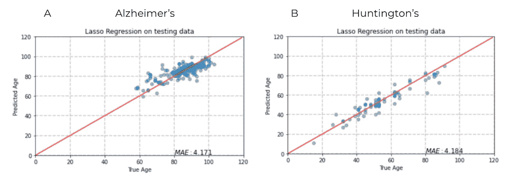

*图 17。A)阿尔茨海默氏病 B)亨廷顿氏病使用来自健康队列的 55 个显著 CpG 位点的不健康队列的脑组织模型的结果应用于测试集。*图片作者。

查看与这三个模型(健康、阿尔茨海默氏症和亨廷顿氏症)相关的权重，并为每个 CpG 位点绘制它们，我们可以在图 18 中看到结果。从图中，我们可以看到，对于大多数 CpG 位点，权重的大小在三个组群之间发生变化，但其方向(符号)没有变化。

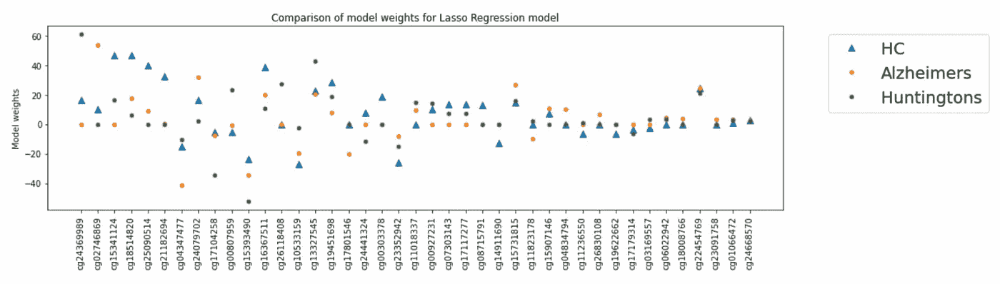

*图 18。健康对照(HC)、阿尔茨海默氏病和亨廷顿氏病模型的 55 个 CpG 位点的 lasso 回归模型权重图。*图片作者。

**健康与不健康的分类**

考虑到队列之间的体重量级差异有多大，我们训练了一个逻辑回归分类器，以确定我们是否可以使用与衰老最相关的 CpG 位点区分健康和阿尔茨海默氏症队列。使用类别准确度(分配给其真实类别的点的比例)作为评估度量，我们训练了许多分类器。

这些包括:使用前 55 个健康大脑 CpG 和年龄作为特征(分类准确度为 0.73)；使用来自应用在健康群组上训练的脑模型的年龄和残差值作为特征(分类精度为 0.73)，并且使用来自应用在阿尔茨海默氏症群组上训练的脑模型的年龄和残差值，使用该群组中与老化最相关的 CpG 位点(分类精度为 0.69)。给定分类准确度值，我们得出结论，与衰老最相关的 CpG 位点只能区分健康人群和阿尔茨海默病人群，并取得中等成功。

**生物学意义**

关于我们的结果，一个自然的问题是甲基化可能影响哪些基因，从而可能影响衰老？下面的图 19 显示了前 23 个血液 CpG 位点到基因的映射。一些基因与一个以上的顶级 CpG 位点相关，例如 KLF14，一种被认为是脂肪组织中基因表达的主要调节因子的转录因子。

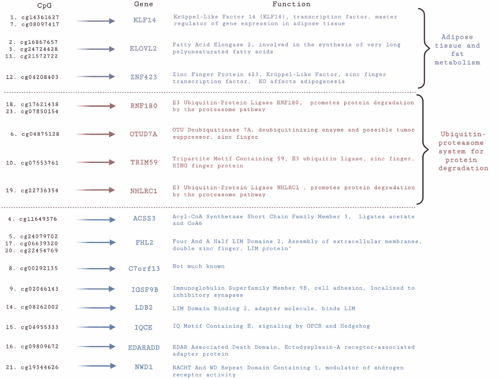

*图 19。与排名前 23 位的 CpG 位点相关的基因，血液数据。*图片作者。

KLF14 和另外两个以紫色显示的基因(ELOVL2 和 ZNF423)与脂肪细胞或脂肪代谢有关。因此，脂肪代谢和储存过程可能对衰老有重要影响。此外，还有四个与泛素-蛋白酶体途径(red)相关的基因，即 OTUD7A、TRIM59、RNF180 和 NHLRC1(蛋白质降解的重要途径)。事实上，其中三个基因是 E3 泛素连接酶，负责标记降解蛋白。因此，就寻找衰老过程中的干预措施而言，靶向该途径可能是一种有希望的研究途径。事实上，尽管存在 DNA 甲基化，但已有多项研究确定该途径对衰老具有重要影响(Bergsma 和 Rogaeva (2020)[4]，Kevei 和 Hoppe(2014)[5])。

**结论**

从上述分析中得出的结论是:

*   我们已经能够构建预测年龄的模型，在整个成人寿命期间，平均误差为 3.6 年。
*   从开始的约 400，000 个 DNA 甲基化位点(CpG 位点)中，我们确定了约 700 个最适合年龄预测建模的位点。
*   模型不能跨组织转移，但许多 CpG 可以。
*   使用健康个体的脑组织开发的模型也可以预测神经退行性疾病患者的年龄。
*   我们的顶级 CpG 通常与调节脂肪组织基因表达和泛素-蛋白酶体蛋白降解途径的基因相关。

**参考文献**

1.  人类组织和细胞类型的 DNA 甲基化年龄。Genome Biol，2013。14(10):第 R115 页。
2.  Hannum，g .，等，全基因组甲基化谱揭示了人类衰老速率的定量观点。Mol Cell，2013。49(2):第 359-367 页。
3.  Zhang，q .，等，跨组织表观遗传时钟估计的精度提高及其对生物衰老的意义。基因组医学，2019。11(1):第 54 页。
4.  Bergsma，t .和 E. Rogaeva，DNA 甲基化时钟及其对衰老表型和健康寿命的预测能力。《神经科学洞察》，2020 年。15: p. 2633105520942221。
5.  Kevei，e .和 T. Hoppe，泛素设定时间:对衰老和寿命的影响。Nat Struct Mol Biol，2014。21(4):第 290-2 页。