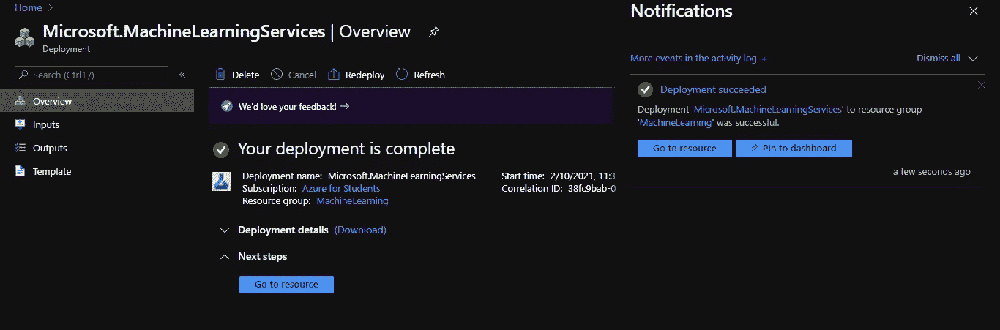
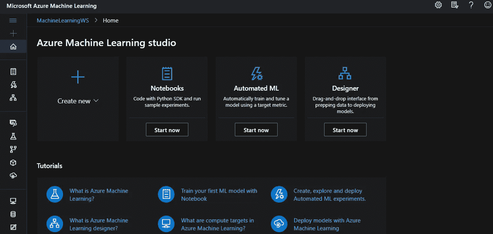
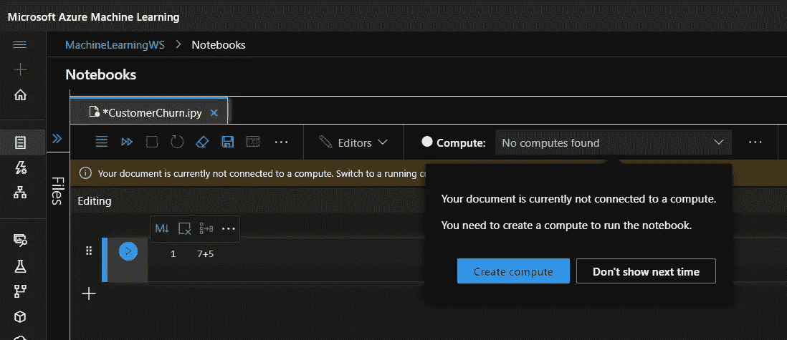
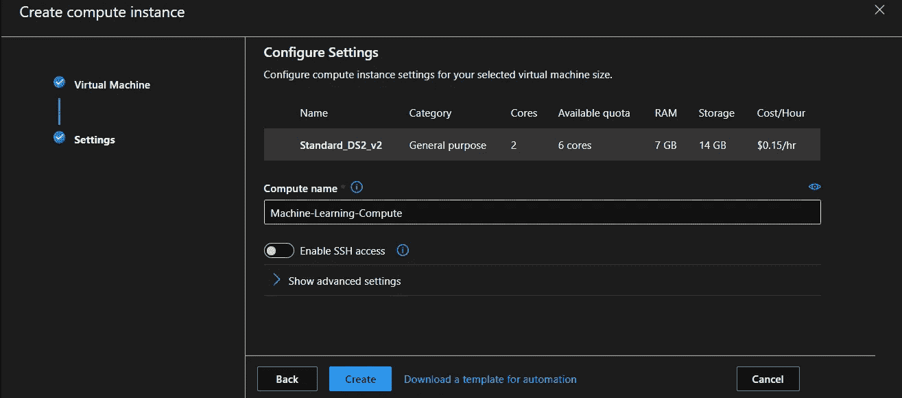
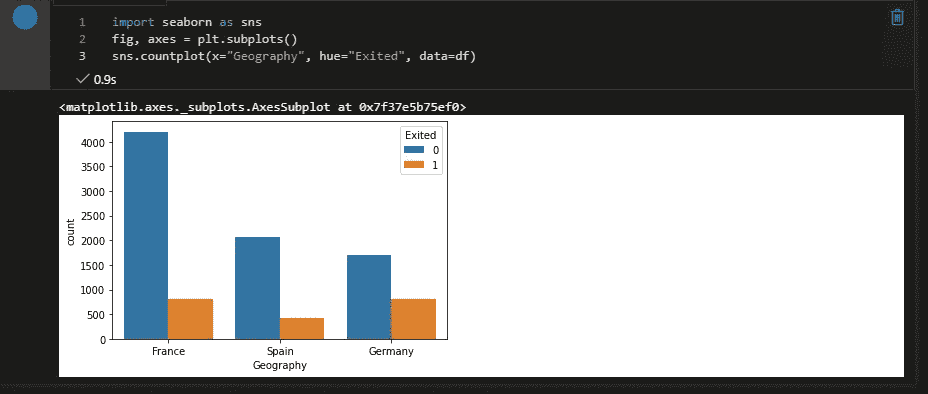

# 在 Jupyter 笔记本中使用 Microsoft Azure 机器学习和 Python 预测银行客户流失

> 原文：<https://towardsdatascience.com/predicting-bank-customer-churn-using-microsoft-azure-machine-learning-python-in-jupyter-notebook-cbac39e3012a?source=collection_archive---------31----------------------->

## 了解使用 Azure 资源和 Python 编写和运行笔记本有多简单


凯文·Ku 摄于 [Unsplash](https://unsplash.com/)

在本教程中，我们将使用 python notebook 和 Microsoft Azure services 构建一个人工神经网络(ANN)来预测银行客户流失。请注意，Azure Machine Learning (ML)提供了很多东西，在本文中，我将展示使用 Azure resources 和 python 编写和运行笔记本是多么容易。

# **先决条件**

1.  你应该熟悉机器学习。即使你不明白，也要试着跟着做，坚持练习。
2.  你应该知道张量流。你可以在网上找到大量的资料并了解它。
3.  您必须订阅 Microsoft Azure。Azure 向学院或大学学生提供免费学分。在这里创建一个账户[。](https://azure.microsoft.com/en-in/free/students/)

# **创建 Azure 机器学习服务**

1.  转到 Azure [门户](https://portal.azure.com/#home)并点击“+”符号创建一个资源。
2.  搜索“机器学习”并点击创建。
3.  输入详细信息，然后单击“审查和创建”
4.  最后，单击“创建”开始部署过程。
5.  大约 3-4 分钟后，您的服务应该可以使用了，您应该会看到类似这样的内容:



# **Azure 机器学习**



Azure 机器学习工作区

1.  去 Azure 机器学习[门户](https://ml.azure.com/selectWorkspace)。
2.  确保您使用与登录 Azure 门户时相同的电子邮件 id 登录。
3.  花点时间理解被询问的信息。
4.  选择正确的订阅和工作区。请记住我们之前创建的工作区，您将在这里找到它以供选择。
5.  完成后，点击“开始”。您的工作区已经可以使用了！
6.  这是它应该有的样子。我强烈建议你花大量的时间来看看所提供的服务。在底部，您可以找到很好的文档来帮助您开始。
7.  在 Azure 机器学习工作区中，选择“新建”，然后选择“笔记本”。
8.  会弹出一个对话框，要求您命名文件。在这里，我创建了一个名为“CustomerChurn.ipnyb”的文件。
9.  从 Kaggle 下载[这个](https://www.kaggle.com/barelydedicated/bank-customer-churn-modeling)数据集，并将其与 ipnyb 文件一起上传到笔记本文件夹下的 Azure ML 门户上。

# **创建计算**

打开笔记本，在第一个单元格中输入“7+5 ”,并使用该单元格左侧的小三角形(运行)按钮运行它。您应该看到以下内容:



创建计算

计算是一个重要概念，没有它你将无法运行一个单元(或整个笔记本)。继续创建一台计算机:

1.  如上所示，点击“点击计算”。
2.  选择您希望用于计算实例的虚拟机大小。
3.  在 CPU 或 GPU 虚拟机类型之间切换。当使用支持 GPU 的虚拟机时，确保编写的代码能够利用可用的 GPU 设备。
4.  根据需要选择其他选项。如果你只是尝试 Azure，我建议你总是选择免费的或者花费最少的选项。
5.  选择“create ”,大约需要 10-12 分钟来创建一个可供使用的虚拟机。现在你应该可以运行你的手机了。



# **数据可视化，分析&清洗**

现在，我们已经准备好了所有的组件(数据集、计算、笔记本电脑设置)，是时候施展魔法了！

为了简单起见，这里我只解释重要的代码片段。你可以在 [Github](https://github.com/semicolon123/Customer-churn) 上查看整个笔记本。

第一步是读取数据集并理解属性的数据类型、不需要的属性等。

第二步是将分类值转换为数值，因为 ML 模型处理的是数值数据。例如，下面的代码在整个数据集中用 1 替换值“女性”,用 0 替换值“男性”。

```
df['Gender'].replace({'Female':1,'Male':0},inplace=**True**) 
```

拥有一个缩放的数据有助于训练一个人工神经网络。在我们的数据集中，一些属性没有缩放。

```
col_to_scale = ['CreditScore','Age','Tenure','Balance','EstimatedSalary','NumOfProducts']

**from** **sklearn.preprocessing** **import** MinMaxScaler
scaler = MinMaxScaler()

df1[col_to_scale] = scaler.fit_transform(df1[col_to_scale])
```

下面的代码根据地理位置绘制了离开和不离开的人数。



Microsoft Azure 机器学习笔记本中的输出

# **创建训练和测试分割**

我们需要将数据集分为训练数据集和测试数据集。由于 sklearn 模块，这是一个非常简单的任务。要了解更多，请观看这个非常棒的视频。

```
**from** **sklearn.model_selection** **import** train_test_split
X_train, X_test, y_train, y_test = train_test_split(X, y, test_size=0.2, random_state=5)
```

# **创建人工神经网络**

我将使用 TensorFlow/Kera 建立模型。点击了解更多信息[。花些时间真正理解代码。请记住，下面的值是基于点击和尝试。在最终确定这些值之前，我多次运行这个模型(用这些值获得了最大的准确性)。](https://www.tensorflow.org/)

```
**import** **tensorflow** **as** **tf**
**from** **tensorflow** **import** keras

model = keras.Sequential([
    keras.layers.Dense(12, input_shape=(12,), activation='relu'),      *#12 because number of inputs is 12*
    keras.layers.Dense(6, activation='relu'),                           *# hidden*
    keras.layers.Dense(1, activation='sigmoid')
])

*# opt = keras.optimizers.Adam(learning_rate=0.01)*

model.compile(optimizer='adam',
              loss='binary_crossentropy',
              metrics=['accuracy'])

model.fit(X_train, y_train, epochs=100)
```

# 预测和准确性

一旦所有时期都运行了，您就可以使用

```
model.evaluate(X_test,y_test)
```

# **分类报告&混淆矩阵**

分类报告是获取每个预测类的精度、召回率、f1 值和支持值的一种很好的方式。

混淆矩阵，也称为误差矩阵，是一种特定的表格布局，允许算法性能的可视化。

# **注意事项**

如果您得到一个错误“没有名为 seaborn 的模块”，请在使用 seaborn 之前运行下面的命令。

> pip 安装 seaborn

以上命令将安装必要的库。

# **删除蔚蓝资源**

由于 Azure 对正在使用的服务收费，因此总是建议删除您不再使用的资源。

在这篇博客中，你创建了两个资源——机器学习和资源组。

去 Azure 门户主页找这两个资源。打开它们并删除资源。一旦删除成功，您将不会为该资源付费。

# **结论**

我演示了如何创建一个 ML 服务。此外，在 Microsoft Azure ML 中创建了一个工作区。然后，我们从 Kaggle 下载了数据集，并对其进行了分析，以便将其输入到 ANN 中。在 TensorFlow 的帮助下，创建并训练了一个 ANN。正如已经提到的，根据手头的工作和您的偏好，您可以利用大量的集成和功能。这篇博客一定给了你一个小小的窥视，并帮助你今天开始！

还有，你可以在 [Twitter](https://twitter.com/SwatiRajwal) 和 [LinkedIn](https://www.linkedin.com/in/swati-r-84682b12b/) 上问我一个问题！

# **参考文献**

[1]教程:Jupyter 笔记本入门(Python)——Azure 机器学习。[https://docs . Microsoft . com/en-us/azure/machine-learning/tutorial-1st-experiment-SDK-setup](https://docs.microsoft.com/en-us/azure/machine-learning/tutorial-1st-experiment-sdk-setup)

[2]代码基础。(2018 年 8 月 6 日)。*机器学习教程 Python — 6:虚拟变量&一热编码*【视频】。YouTube。[https://www.youtube.com/watch?v=9yl6-HEY7_s&list = pleo 1 k3 hjs 3 uvcetyteyfe 0-rn 5 r 8 Zn 9 rw&index = 6&ab _ channel = code basics](https://www.youtube.com/watch?v=9yl6-HEY7_s&list=PLeo1K3hjS3uvCeTYTeyfe0-rN5r8zn9rw&index=6&ab_channel=codebasics)

希望这对你有帮助。

谢谢你。