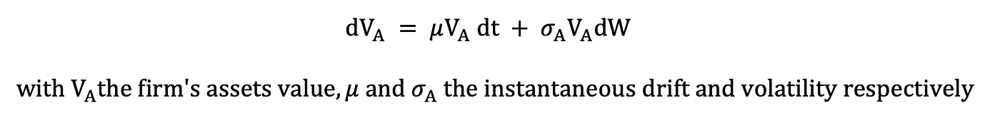
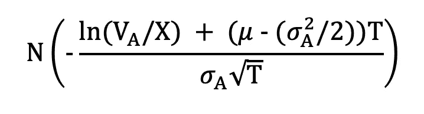
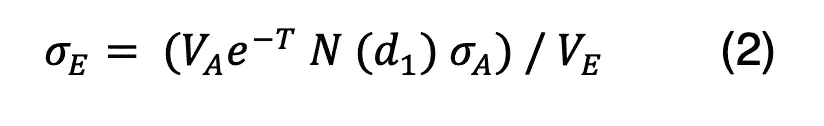
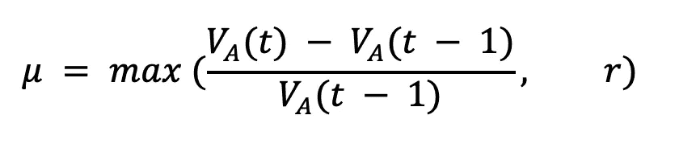
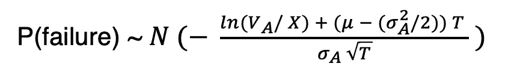
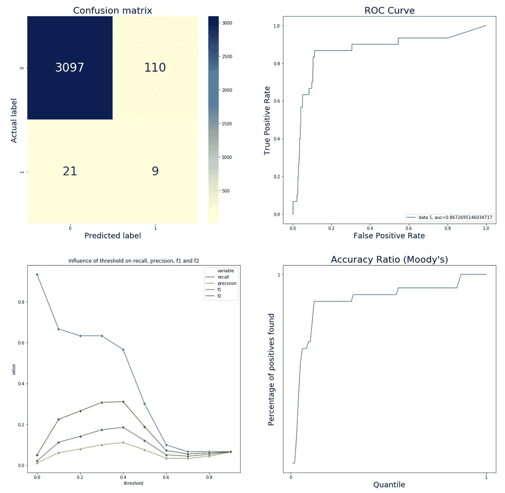

# 预测破产:或有索赔模型

> 原文：<https://towardsdatascience.com/predicting-bankruptcy-the-contingent-claim-model-3701636b3ae9?source=collection_archive---------24----------------------->

## 穆迪对公司进行评级时使用的另一种方法


迪伦·吉利斯在 [Unsplash](https://unsplash.com?utm_source=medium&utm_medium=referral) 上的照片

多年来，崩溃预测一直是一个非常活跃的研究领域。重要的论文包括爱德华·奥特曼 1968 年的[财务比率、判别分析和企业破产预测](https://www.jstor.org/stable/2978933)，这催生了他著名的 *Z 分数*，至今仍在使用，以及詹姆斯·奥尔森 1980 年的[财务比率和破产概率预测](https://math.ryerson.ca/ramlab/projects/crd/ohlson1980.pdf)及其 *O 分数*，至今仍在使用。这些论文以及之后的许多论文都是基于会计数据和财务比率。他们使用不同的分类和优化技术:逻辑回归、判别分析、神经网络、蚁群算法等，并主要根据来自损益表、资产负债表和现金流量表的财务数据对它们进行训练。


罗伯特·默顿([麻省理工学院，CC BY-SA 4.0](https://commons.wikimedia.org/wiki/File:Robert_Merton_November_2010_03(1).jpg)

其他方法使用**市场数据**得出破产风险。一种基于市场的方法特别使用了 Black 和 Scholes 在 1973 年和 Merton 在 1974 年提出的思想，使用可能是金融数学中最具代表性的结果:Black-Scholes 方程和 Black-Scholes 公式来为期权和公司债务定价。这种公司债务定价方法是信用分析师 Kealhofer、McQuown 和 Vasicek (KMV)使用的方法，2002 年被评级机构 Moody's 收购。

在我们转到方法之前，让我们快速定义一下什么是选项。期权是一种金融衍生工具，允许其所有者在未来某一特定日期以特定价格买入(买入期权)或卖出(卖出期权)基础资产(通常是股票)(对于欧式期权，是指在该日期之前的任何时间)。默顿提出了这样一个观点:一旦债务得到偿还，一家公司的股权可以被视为该公司资产的欧式看涨期权。由于股权所有者的有限责任，如果资产不足以支付债务，股权价值就等于零。债务清偿后剩余的任何资产都可以由股权所有人主张。

我们如何给期权定价，或者说，股权定价？这就是布莱克-斯科尔斯模型的用武之地。它的基本思想是公司的资产遵循几何布朗运动:



上式中，W 是一个标准的[维纳过程](https://en.wikipedia.org/wiki/Wiener_process)。我们看到**引入了波动性**使得这种方法不同于更传统的基于会计的方法。

权益的市场价值可以通过 Black 和 Scholes 公式获得，用于欧式看涨期权，如下所示:


随着

Ve:权益价值的市场
T:债务的到期时间
X:债务的账面价值，相当于看涨期权的履约价格的履约价值
r:无风险利率
sigma_a:资产收益的波动率
N:标准正态分布的累积密度函数；

现在，破产概率是指资产的市场价值小于在时间 T 到期的负债的面值的概率，计算方法如下:



但是，我们不知道 Va 和 sigma_a 的值，因此为了计算它们，我们同时求解上面给出的等式(1)和下面给出的“最佳对冲”等式(2 ):



我们现在可以计算漂移量μ。它表明了资产价值波动的总趋势。取无风险利率和资产收益之间的最大值:



最后是故障概率，它服从正态分布:



我们对模型输出的概率使用 0.5 的阈值来将公司分为破产和非破产。

值得一提的是，我们在该模型上使用了一个非常简单的实现，具有以下假设/限制:

*   我们不考虑支付股息
*   没有交易成本
*   借贷利率相同
*   无风险利率没有变化

# 用 Python 实现

我们现在将看到一个使用上述思想的 Python 实现。

我们将定义一个名为 *prob_default()* 的函数，该函数将一个 ticker 作为参数，并对 2018 年纽约证券交易所、纳斯达克和场外交易市场的所有 ticker 的数据运行该函数。

该函数选择与作为参数传递的股票价格相对应的每日股票价格数据，用于我们正在考虑的时间范围，我们称之为 dataframe *daily_*

```
"""DATA SELECTION"""    
start_date='2018-01-01'    
end_date='2018-12-31' 

# get data for that ticker    
daily_=daily[(daily.ticker==ticker)&(daily.date>=start_date)&(daily.date<=end_date)] # if get an empty dataframe, we skip that ticker    
if daily_.shape[0]==0:        
    print(ticker+" is empty")        
    return False
daily_=daily_.reset_index()
# we show the marketcap in the right unit   
daily_.marketcap=daily_.marketcap*1e6
```

然后，我们使用相隔 1 天的权益价值之间比率的对数来计算该期间的每日权益回报:

```
"""CALCULATING EQUITY RETURNS"""    
for j in range(1,daily_.shape[0]):        
    daily_.loc[j-1, 'returns'] = np.log(daily_.loc[j-1, 'marketcap'] /daily_.loc[j, 'marketcap'])
```

然后，我们可以使用这些数据来计算股票的年波动率。为了计算年波动率，我们将日收益率的标准差乘以 252 的平方根(一年中的交易日数)

```
"""CALCULATING THE VOLATILITY OF EQUITY: SIGE"""  sige=np.std(daily_.returns)*np.sqrt(252)
```

我们现在可以求解上面描述的联立方程(1)和(2)来找到 Va 和 sigma_a。我们分别使用 2018 年和 2017 年无风险利率的值 1.7%和 1.5%。对于债务的价值，X，我们用流动债务的价值+非流动债务价值的 50%。

然后，我们可以使用 SciPy 上的[优化库的根函数来求解资产的市场价值及其波动性。](https://docs.scipy.org/doc/scipy/reference/optimize.html)我们需要找到 2018 年和 2017 年的数值。为什么是 2017 年？因为我们还想知道资产的平均年回报率。所以我们从 2018 年开始。

```
"""SOLVE SIMULTANEOUS EQUATIONS for 2018"""    
#2018    
# Initialising values    
T=1    
r=0.017    
ve=daily_.loc[0,'marketcap']   
X=df[df.ticker==ticker]['debtc'].values[0]+.5*df[df.ticker==ticker]['debtnc'].values[0] sol = optimize.root(fun, [X+ve, sige*ve/(ve+X)])    
va=sol.x[0]    
siga=sol.x[1]
```

接着是 2017 年。

```
#2017    
T=1    
r=0.015    
ve=daily_.loc[daily_.shape[0]-1,'marketcap']    X=df[df.ticker==ticker]['debtc'].values[0]+.5*df[df.ticker==ticker]['debtnc'].values[0] sol = optimize.root(fun, [X+ve, sige*ve/(ve+X)])    
va_1=sol.x[0]    
siga=sol.x[1]
```

接下来是我们的最后一步，我们通过使用 2018 年和 2017 年的 va 和 va_1 变量来计算资产的年回报率。当由此产生的回报率低于无风险利率时，我们使用无风险利率。

我们现在可以使用正常的 cdf 计算“违约距离”DDt 和违约概率。

```
#this gives the annual return    
mu=max((va-va_1)/va_1,r)    
DDt=(np.log(va/X)+(mu-0.5*siga**2)*T)/siga*np.sqrt(T) return norm.cdf(-DDt)
```

我们可以在苹果公司(“AAPL”)和琼斯能源公司(“JONEQ”)上测试我们的函数，我们得到苹果的概率为 1e-19%，琼斯能源的概率为 60%。我们将在下一节看到该方法如何对整个数据集执行。

完整的代码可以在下面找到

# 2018 年数据的结果

我们现在可以在 2017 年和 2018 年的整个数据集上运行该模型，看看它对 2019 年发生的破产的预测有多好。这是一个高度不平衡的数据集，因为我们有 3237 家公司，其中只有 30 家在 2019 年宣布破产，即 0.9%。在这些情况下，最好使用 [F1 分数](https://en.wikipedia.org/wiki/F-score)来判断我们模型的性能，因为在这种情况下，精确度和召回率比准确性更有意义。

我们使用 0.5 的阈值将公司分为破产和非破产，但看起来更低的阈值会提高我们的 F1 分数。

从下面的数据来看，我们获得了 8%的准确率、30%的召回率和 12%的 F1 值(以及 96%的准确率)。AUC 为 87%。



或有索赔预测模型的结果:混淆矩阵、ROC 曲线、指标与阈值和准确率。

虽然这些结果可能看起来很糟糕，但值得注意的是，我们实现了一个非常基础的模型版本。我们可以通过以下方式显著改善它:

*   更好地校准概率的截止点。较低的阈值提高了召回率(但也产生了许多误报)。
*   将股息支付纳入模型
*   使用正态分布以外的其他分布(这是穆迪/KMV 使用的方法)
*   不包括场外交易市场，因为报告要求没有纽约证券交易所或纳斯达克严格

***注来自《走向数据科学》的编辑:*** *虽然我们允许独立作者根据我们的* [*规则和指导方针*](/questions-96667b06af5) *发表文章，但我们不认可每个作者的贡献。你不应该在没有寻求专业建议的情况下依赖一个作者的作品。详见我们的* [*读者术语*](/readers-terms-b5d780a700a4) *。*

## 参考

Hillegeist，S. A .，Keating，K. E .，Cram，D. P .，& Lundstedt，K. G. (2004 年)。[评估破产概率](https://link.springer.com/article/10.1023/B:RAST.0000013627.90884.b7)。会计研究回顾，9(1)，5–34

默顿，R. C. (1974)。[论公司债务的定价:利率的风险结构](https://www.jstor.org/stable/2978814)，金融杂志，29(2)，449–470。

瓦萨苏，m .，&邢，Y. (2004)。[股权收益违约风险](https://onlinelibrary.wiley.com/doi/full/10.1111/j.1540-6261.2004.00650.x)。金融杂志，59(2)，831–868