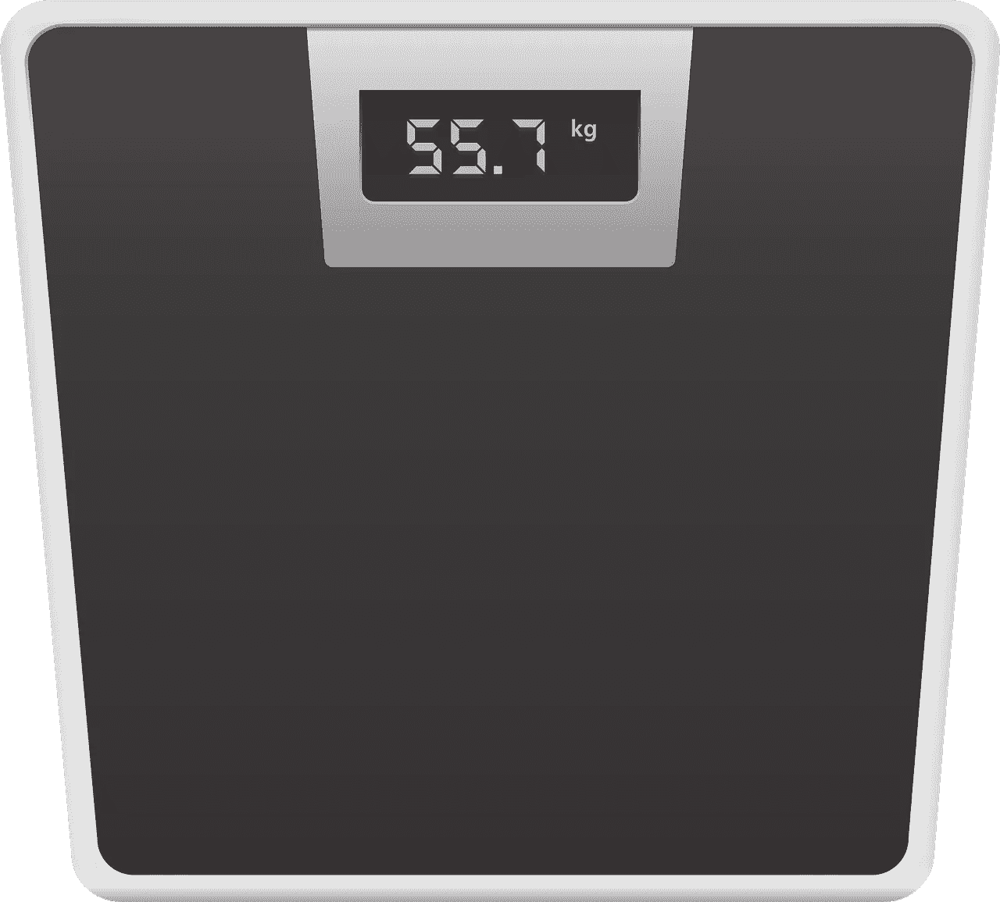
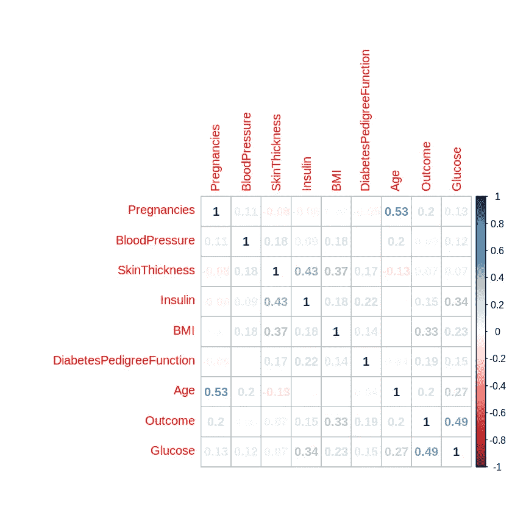

# 用线性支持向量回归预测身体质量指数值

> 原文：<https://towardsdatascience.com/predicting-bmi-values-with-linear-support-vector-regression-ba21eddf6938?source=collection_archive---------59----------------------->

## 线性回归模型



来源:图片由 [JJuni](https://pixabay.com/users/jjuni-27151/) 从 [Pixabay](https://pixabay.com/illustrations/scale-weigh-in-mass-weight-scales-1133910/) 拍摄

在本例中，来自 sklearn 的 [LinearSVR](https://scikit-learn.org/stable/modules/generated/sklearn.svm.LinearSVR.html) 用于预测来自[皮马印第安人糖尿病数据集](https://www.kaggle.com/uciml/pima-indians-diabetes-database)的一组患者的身体质量指数值。

具体来说，我们将观察如何使用 LinearSVR 来拟合上图所示问题中的观测值的超平面，并在该超平面内拟合尽可能多的实例，同时限制边界违规。在这方面，LinearSVR 是 LinearSVC 类的基于回归的等价物。

# 特征选择

为此，我们将分析特征的简单相关图，以确定哪些特征要包含在模型中。

当查看相关变量的相关图时，我们可以看到结果(无论该人是否患有糖尿病)、葡萄糖和皮肤厚度与身体质量指数(在本例中为结果变量)表现出相对较强的相关性。



资料来源:RStudio

也就是说，我们看到结果和血糖变量的相关性为 0.49。这表明变量可能是多重共线性的，即它们都在解释同一件事(在这种情况下，这个人是糖尿病患者)，因此包括两者可能是多余的。

在这种情况下，我们将包括葡萄糖和皮肤厚度作为建模身体质量指数的两个特征。

# 训练 LinearSVR 模型

加载变量并进行列车测试分割:

```
y1 = np.array(bmi)x1 = np.column_stack((skinthickness, glucose))
x1 = sm.add_constant(x1, prepend=True)X_train, X_val, y_train, y_val = train_test_split(x1, y1)
```

现在，LinearSVR 模型是用不同的ε值定义的。

```
from sklearn.svm import LinearSVRsvm_reg_0 = LinearSVR(epsilon=0)
svm_reg_05 = LinearSVR(epsilon=0.5)
svm_reg_15 = LinearSVR(epsilon=1.5)svm_reg_0.fit(X_train, y_train)
svm_reg_05.fit(X_train, y_train)
svm_reg_15.fit(X_train, y_train)
```

使用验证数据生成预测:

```
predictions0 = svm_reg_0.predict(X_val)
predictions05 = svm_reg_05.predict(X_val)
predictions15 = svm_reg_15.predict(X_val)
```

RMSE(均方根误差)值是通过将预测值与验证集进行比较而生成的。

```
>>> mean_squared_error(y_val, predictions0)
>>> math.sqrt(mean_squared_error(y_val, predictions0))6.776059607874521>>> mean_squared_error(y_val, predictions05)
>>> math.sqrt(mean_squared_error(y_val, predictions05))8.491111246123179>>> mean_squared_error(y_val, predictions15)
>>> math.sqrt(mean_squared_error(y_val, predictions15))5.905569225428098
```

我们可以看到，当ε值设置为 **1.5** 时，获得最低的 RMSE。然而，这仅略低于当 epsilon 设置为 **0** 时获得的值。根据上面引用的 sklearn 文档，ε的值取决于数据的规模。如有任何疑问，该值应保留为 0。

在这点上，ε0 将被用于生成对测试集的预测和分析随后的 RMSE。

# 针对看不见的数据进行测试

一部分数据来自用于训练 LinearSVR 的原始数据集。

现在，该模型用于对保留的要素数据进行预测，并将预测值与未知的身体质量指数值进行比较。

```
atest = np.column_stack((t_skinthickness, t_glucose))
atest = sm.add_constant(atest, prepend=True)t_bmi = h3data['BMI']
btest = t_bmi
btest=btest.valuesbpred = svm_reg_0.predict(atest)
bpred
```

产生的 RMSE 值为 7.38，大约是 32.82 处测试平均值大小的 22%。对于这个特定的数据集，其他要素(包括最终从分析中删除的要素)不太可能解释身体质量指数的所有变化。生活方式因素，如每天消耗的卡路里、每天的运动量等，可能会对整体身体质量指数指数产生重大影响。

在这一点上，我们可以判断，所确定的特征在解释身体质量指数的大部分变化方面做了相当好的工作。

# 结论

在这个例子中，您看到了如何使用 LinearSVR 解决回归问题。具体来说，我们看到:

*   相关图如何帮助特征选择
*   线性向量回归机的构型和ε的作用
*   如何使用 RMSE 测试模型准确性

正如我们所见，虽然模型在估计身体质量指数值方面表现得相当好，但考虑到某些对影响身体质量指数值很重要的要素没有包含在数据集中，这一点也很重要。因此，在缺乏数据的情况下，在缺乏可用数据的情况下，LinearSVR(或任何模型)能够最大限度地提高准确性是有限度的。

非常感谢您的时间，任何问题或反馈都非常欢迎。

*免责声明:本文是在“原样”的基础上编写的，没有任何担保。本文旨在提供数据科学概念的概述，不应以任何方式解释为专业建议。*

# 参考

*   Aurélien Géron:使用 Scikit-Learn 和 TensorFlow 进行机器学习
*   [ResearchGate:在支持向量回归的回归问题中，ε= 0 有什么问题？](https://www.researchgate.net/post/What_is_the_problem_with_epsilon0_in_regression_problems_with_Support_Vector_Regression2)