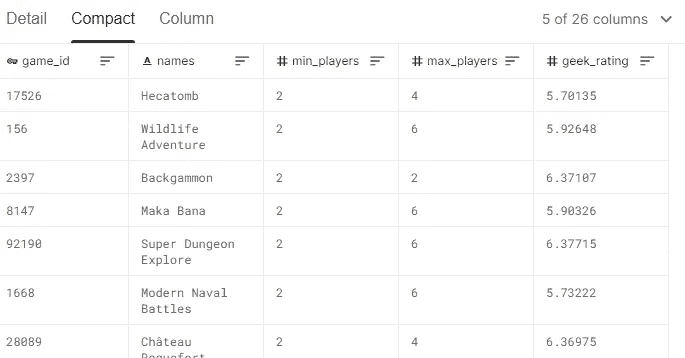
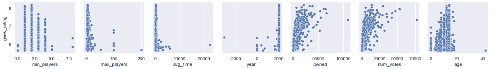
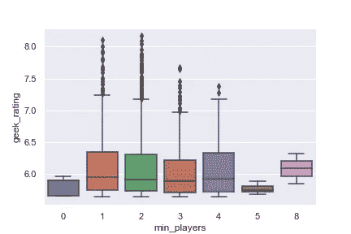
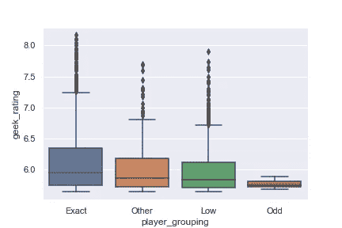
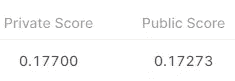
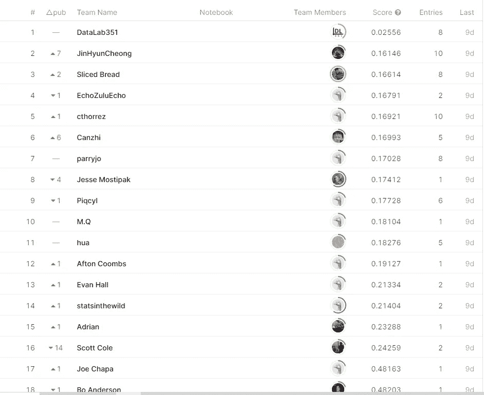

# 用 Python 预测桌游评分

> 原文：<https://towardsdatascience.com/predicting-board-game-ratings-with-python-60c9de9ee067?source=collection_archive---------20----------------------->

## 为实时数据科学竞赛编写解决方案

# 切片背景

SLICED 是一个竞争性的数据科学游戏节目，参与者有两个小时的时间来探索和预测他们刚刚看到的数据。如果你对数据分析、数据科学或机器学习感兴趣，我强烈推荐你去看看这些剧集。

尼克·万和[梅格·里斯达尔](https://twitter.com/MeganRisdal)是《切片》的主持人。在第一周，参赛者被要求预测棋盘游戏的评分，给出一系列特征(游戏发布的年份，游戏持续的时间等)。

你可以在 Twitch 上查看《T4》第一集，在上了解更多关于该剧的内容和时间安排[。](https://www.notion.so/SLICED-Show-c7bd26356e3a42279e2dfbafb0480073)

# 两小时后的数据科学

作为一个挑战，我想尝试在两个小时内建立一个预测——类似于参赛者，尽管在我编码时没有 200 人看着我，压力要小得多。

## 问题概述

该数据集包含约 3，500 个棋盘游戏，具有各种描述性栏目和我们试图预测的“极客评级”。目标是预测另外 1，500 个棋盘游戏的未知极客评级。你可以在下面看到几个专栏的样本，在 [kaggle](https://www.kaggle.com/c/sliced-s01e01/overview) 上可以获得完整的数据(和得分)。



数据概述

## 探索性数据分析

我做的第一件事(导入库和数据之后)是用我们的目标变量 geek_rating 绘制各种特性的 pairgrid。有些列是文本或者有点难以解析，我把它们留到后面的步骤中。这样做的时候，我注意到一些有趣的关系:

1.  棋盘游戏的特征(最少玩家、最多玩家、平均游戏时间)似乎与预测评级有松散的关系。就有多少玩家和一款游戏需要多长时间才能被评为优秀而言，可能存在一个最佳点。
2.  在有多少人拥有一个游戏/对一个游戏投票和它的评价有多高之间似乎有一个更强的(和非线性的)关系。
3.  游戏在被高度评价之前已经存在了一段时间。

```
pg = sns.PairGrid(train_df, x_vars=['min_players', 'max_players', 'avg_time', 'year', 'owned', 'num_votes', 'age'], y_vars=['geek_rating'])
pg.map(sns.scatterplot)
```



成对网格图

进一步挖掘，绘制出玩家的最小数量和等级，我们看到 1-2 个玩家的最小平均得分最高。对最大玩家的类似分析表明，最“正常”的游戏配置似乎很受欢迎。

```
sns.boxplot(data=train_df, x='min_players', y='geek_rating')
```



最小玩家盒图

视觉扫描一些游戏机制，我挑选了一些导致更高分数的关键词。一个更好的方法是解析出各种短语，并使用游戏机制和评级之间的汇总统计数据建立关系……但两个小时很快就过去了！

```
train_df.groupby('mechanic')['geek_rating'].mean().sort_values(ascending=False)[:20]
train_df.groupby('mechanic')['geek_rating'].mean().sort_values(ascending=False)[-20:]
```

## 特征工程

**玩家分组**

我决定添加一个“玩家分组”的特性，只是为了捕捉一些在玩家数量方框图中可见的关系。决策树等机器学习算法可以自动提取这些信息，但它很快就将我认为有用的信息编码为一个集合，以帮助学习。

```
def player_grouping(df):
    if df['min_players'] <= 0:
        return 'Low'
    elif df['max_players'] <= 3:
        return 'Low'
    elif df['min_players'] == 8:
        return 'Exact'
    elif df['min_players'] == 5:
        return 'Odd'
    elif df['max_players'] > 3 and df['max_players'] <= 7:
        return 'Exact'
    else:
        return 'Other'

train_df['player_grouping'] = train_df.apply(lambda row: player_grouping(row), axis=1)
```



新的衍生玩家分组功能

**类别评分**

我想创建的下一个功能是基于游戏的类别(策略、骰子等)。

这些信息存储在许多列中。我使用第一个创建了一个查找字典(最好有全部 12 个，但是时间过得很快……)，然后遍历各个列，找到与类别术语相关的平均分数。例如*医学、文艺复兴和文明*类别表现最好，而*琐事、记忆和数字*类别表现最差。

```
category_lookup_dict = dict(train_df.groupby('category1')['geek_rating'].mean())

def get_combined_category_scoring(df, category_dict, col_list):
    score_list = []
    for col in col_list:
        if df[col] != np.nan:
            # Handle errors for new categories not profiled
            try:
                score_list.append(category_dict[df[col]])
            except:
                pass
    if len(score_list) > 0:
        return np.mean(score_list)
    else:
        return 6.09 # avg for missing categories

col_list_cat = [col for col in train_df.columns if 'category' in col]
train_df['cat_score'] = train_df.apply(lambda row: get_combined_category_scoring(row, category_lookup_dict, col_list_cat), axis=1)
```

**技工组**

我在游戏机械领域做了类似的特征工程，但是随着时间的减少，关于计算平均值和二进制标志方法的科学程度降低了。

## 预言；预测；预告

最后一步是选择输入预测和机器学习算法的列。我试了几个，最后用的是渐变提升。我没有花太多时间优化超参数，只是使用了默认值。

```
feature_cols = ['age', 'player_grouping', 'owned', 'num_votes', 'cat_score', 'min_players', 'max_players', 'avg_time',
       'min_time', 'max_time', 'year', 'mechanic_group']
target_col = 'geek_rating'

x = train_df[feature_cols]
y = train_df[target_col]

reg = GradientBoostingRegressor()
reg.fit(x, y)
predictions = reg.predict(x)
print(f'RMSE for training set: {np.sqrt(mean_squared_error(y_true=y, y_pred=predictions))}')
```

训练集的均方根误差为 0.141，验证集的均方根误差为 0.167(训练样本的 30%)。

## 结果

在整合了这些功能和几个迭代之后，我最终得到了下面的笔记本和 0.177 的 RMSE——在排行榜上排名第九。



结果



排行榜(仅在 Twitch stream 期间显示提交内容)

# 摘要

这是一个有趣的挑战，建议其他人尝试分析数据。除了儿时的家庭垄断争吵之外，我在棋盘游戏方面的专业知识几乎为零，所以看看我能做出多准确的预测是件有趣的事情。

*在*[*Github*](https://github.com/bstuddard/python-examples/blob/master/sliced/2021_01/Sliced_Week_01.ipynb)*上可以找到所有的例子和文件。*

*原载于*[*https://data stud . dev*](https://datastud.dev/posts/sliced-2021-w1)*。*