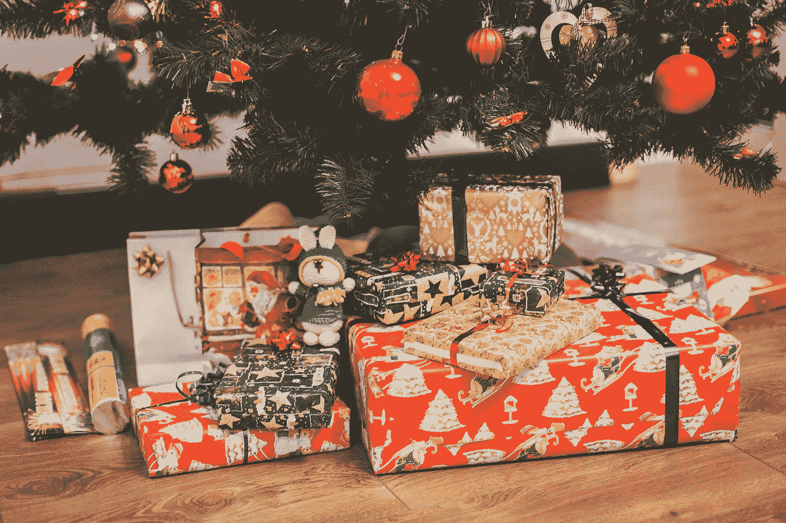
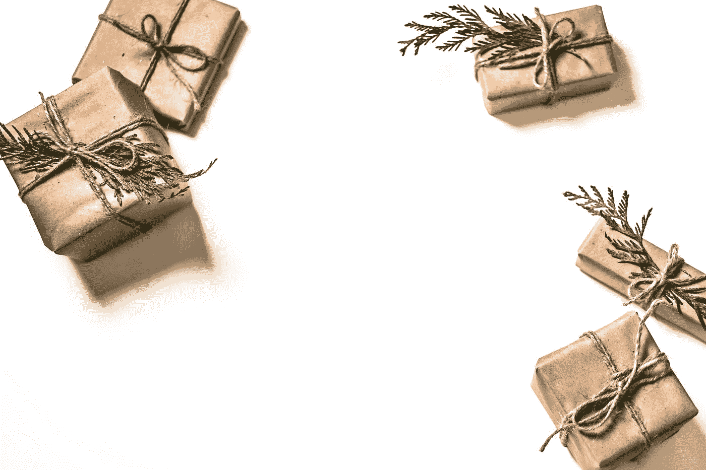
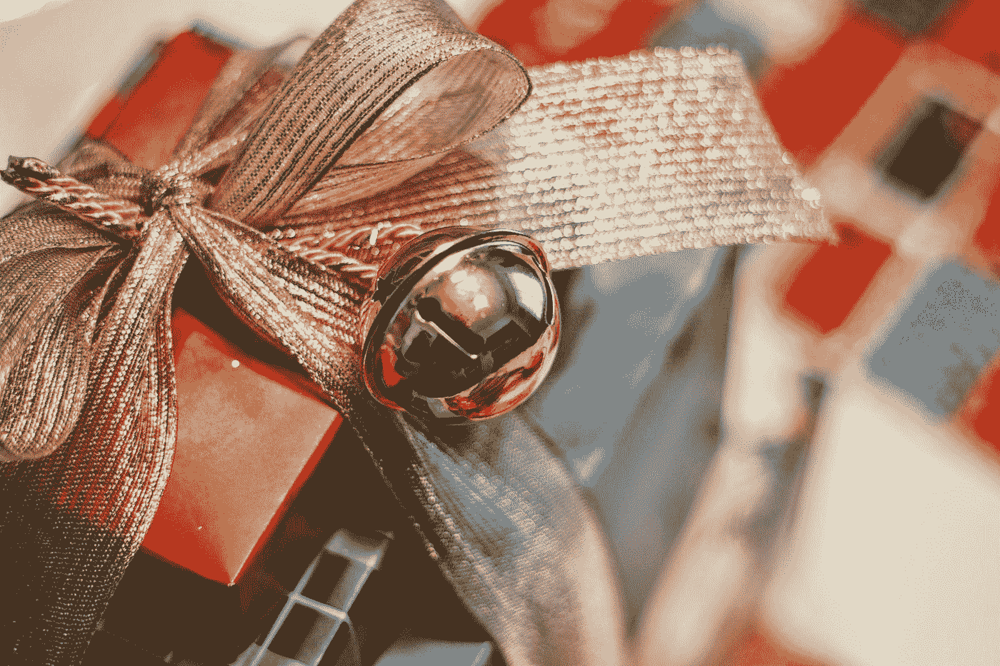
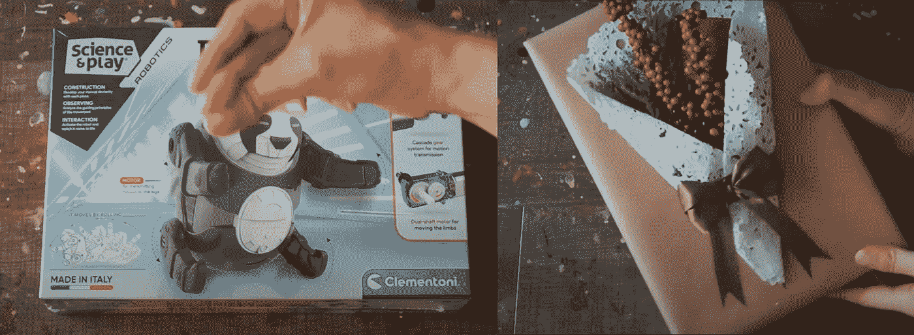
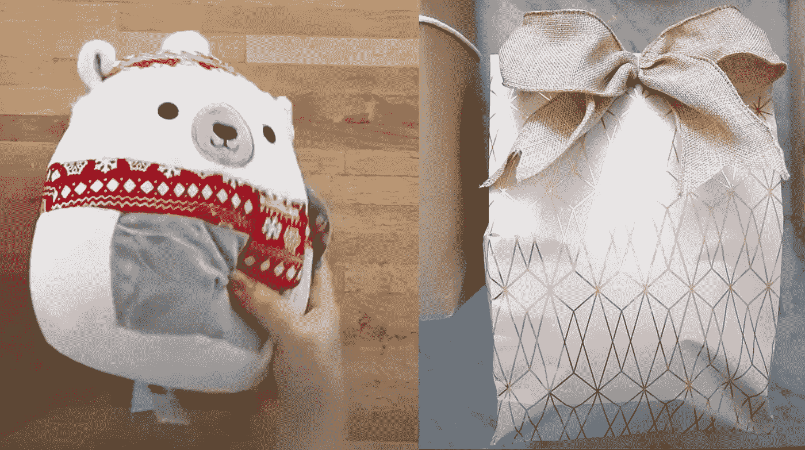

# 用人工智能预测圣诞礼物

> 原文：<https://towardsdatascience.com/predicting-christmas-presents-with-ai-3eaa2dc96e8?source=collection_archive---------28----------------------->

## 你圣诞节得到了什么？也许 AI 有答案。

尤金·日夫奇克在 [Unsplash](https://unsplash.com?utm_source=medium&utm_medium=referral) 上拍摄的照片

人工智能可以做很多事情。比专业人士更好地玩电子游戏，创作美丽的艺术作品，写故事。但是人工智能能预测圣诞节你会得到什么吗？

对图像进行分类是人工智能特别擅长的事情。一种被称为卷积神经网络的模型在图像任务上表现出色。

计算机视觉领域在不断进步和完善。因此，在越来越大的数据集和更广泛的模型的推动下，图像分类正在成为一项简单的任务。

但是所有这些模型和实验都有相同的假设。**图像显示您试图分类的对象。**

这个假设不适用于圣诞礼物。是的，你要识别的物体就在图像中。但不准确。有些材料挡住了去路。礼物包装好了。包装遮住了物品，使其难以预测，这是一个更加令人兴奋的圣诞节。

这篇文章分为三个部分。

1.  ***礼物预测的问题。***
2.  ***收集数据。***
3.  ***开发一个模型。***

你可能已经在想预测圣诞礼物里有什么的问题了。我在下面概述了这个项目中的几个大项目。

## 太多选择

由于许多原因，从包装好的礼物的图像中预测圣诞礼物是一项困难的任务。但是有一个巨大的原因使得这个任务对人工智能来说几乎不可能(对我们人类来说也很困难)

[卡莱·迪莫克](https://unsplash.com/@caleydimmock?utm_source=medium&utm_medium=referral)在 [Unsplash](https://unsplash.com?utm_source=medium&utm_medium=referral) 上的照片

礼物通常包装在盒子里，盒子的形状与里面的礼物形状无关。

这种结构意味着不同的礼物可以放在同一个盒子里。AI 不喜欢内容不同的相同盒子。究竟怎么会有人确定其中的区别。

这个问题让我想到这项特殊任务困难的第二个原因。我只是使用包装好的礼物的图片。

我不知道你怎么想，但是当我收到圣诞礼物时，我会立刻注意到礼物的重量。简单地把礼物递给我，就能让我知道里面有什么。

礼物太轻了——是的，里面没有煤。

甚至像快速摇动这样的事情(也许先检查一下以确保摇动不会破坏礼物)会给你提供更多关于礼物可能是什么或不是什么的信息。

## 圣诞礼物预测问题

所以为了把这个问题调整成对人工智能有效的东西，我要把这个问题简化成更可行的东西。

我可以从一套礼物中预测礼物的类型，而不是特定的礼物吗？这一改变将极大地降低问题的复杂性。

此外，即使我可以建立一个模型来预测特定的礼物，预测对象是正确的吗？有些人会说礼物的品牌也很重要。

也许我能看出你买的是内衣，但这是奢侈品牌的新内裤吗？还是你从大箱子里拿了一双？

所以预测礼物的种类看起来像是作弊。嗯，确实是。但是当我收集数据时，你会发现这并不是一个确定的问题。

因此，减少问题是启动这个项目的关键。

## 数据

尽管有各种花哨的模型，但人工智能最重要的方面是数据。你需要很多，你需要好的质量。

虽然您可能听说过“数据越多越好”，但实际情况是，数据越多，质量越好。

但由于圣诞礼物预测不是一个历史悠久的领域，我只能收集一个相对较小的数据集。**因此数据质量至关重要。**

# 收集数据

给圣诞礼物快速谷歌搜索。你会发现很多图像。事实上，你会发现数百万张图片。

数百万包装完美的各种形状和大小的圣诞礼物。原始的褶皱和美丽的蝴蝶结。

由[约书亚·赫内](https://unsplash.com/@mrthetrain?utm_source=medium&utm_medium=referral)在 [Unsplash](https://unsplash.com?utm_source=medium&utm_medium=referral) 拍摄的照片

但是那些照片告诉你里面是什么了吗？号码

尽管有这些包装精美的礼物的图片，它们并没有向你展示里面是什么。理所当然，那会破坏惊喜。

然而，要建立一个模型来解决我的问题，我需要知道里面有什么。我想知道那些漂亮的盒子里是什么。

## 标签数据

这些礼物图片的问题在于，它们主要向人们展示的是包装精美的礼物。

圣诞老人旁边商场里那些包装完美的礼物堆？它们很可能都是空盒子。也许他们已经满了，但关键是我们不能确定。

但是我需要标签。我需要知道盒子里有什么来训练一个模型来预测未来的礼物。因此，要找到我需要的信息，我需要在其他地方寻找我的数据。

## YouTube 来拯救

啊，YouTube，这个地方你可以找到几乎任何事情的视频。

这里是我实现我的解决方案的地方。我要找的不是包装好的礼物。是人们包装礼物的视频。所以在包装之前我能很好地看到礼物，也能很好地看到最终产品。

好消息是，YouTube 上有很多包装礼物的视频。很多。

这里是我为我的模型收集数据的地方。**首先，我仔细抓拍包装前后的礼物截图。**

包装前后的玩具(来自频道: [Vinn Pang](https://www.youtube.com/channel/UCu1VPbSjP1TwGx67OIvaN6Q) )

然而，由于数据集的性质，**我不会分享数据。适当地分发数据需要所有创造者的许可，他们中的许多人并不活跃。但是他们的包装视频保留了下来。**

## 数据集

我在那里，浏览视频，小心翼翼地使用屏幕捕捉来提取礼物的图像和里面礼物的图像，并采取额外的预防措施只选择图像中的礼物。

计划是成对收集图像。第一个图像代表实际的礼物，第二个图像是最终包装好的礼物。两张图片都有一个数字 ID，这样标签就可以使用礼品图片进行修改。

包装前后的礼物(来自频道:[DIY 妈咪](https://www.youtube.com/channel/UCbnY-O1Pse1lekxYWqVJwgg))

带着最后一套礼物和包装好的礼物。我还需要仔细检查并标记每张图片。这个过程将确定我要用于预测的类别。目的是将图像分成粗略的类别，每种类型有足够的图像来建立模型。

**最终数据集包含 64 张不同礼物的图像。**这个过程花了几个小时——只有在包装前识别礼物的视频才会被使用。此外，我希望图片能够一览无余地展示礼物。

在许多情况下，这需要一帧一帧地浏览视频，以获得没有被手臂、手或其他礼物遮挡的礼物的清晰图像。

不用说了。这是一个痛苦的过程。所以我有 64 张图片，我要让它发挥作用。

## 礼物的种类

你可以给别人无限不同的礼物。不幸的是，对于人工智能来说，我需要定义我试图预测的礼物类型。

我想在过于笼统或过于具体的类别之间取得平衡。

**我决定以玩具、书籍、布匹和其他为主。**

1.  玩具包含所有与儿童玩具相关的东西。
2.  书籍是书籍和其他相关的阅读材料。
3.  以布料为基础的礼物包括袜子、毛衣和填充动物玩具。
4.  其他包含电子产品，瓶子，香水和其他杂项。

## 数据扩充和处理

有了这么少的图像，我正在使用数据增强和处理图像来产生更多的模型来训练一个模型。这些增强有效地模拟了从不同的视角，也许是不同的角度或光线来观察物体。

我使用的第一种增强方式是反射和旋转。翻转垂直线、水平线和旋转可创建 4 倍数量的图像。

图像放大(来自频道: [Vinn Pang](https://www.youtube.com/channel/UCu1VPbSjP1TwGx67OIvaN6Q)

此外，我对每个图像应用灰度和大小调整来简化训练过程。灰度迫使模型学习基于形状的类，而调整大小确保我的所有屏幕截图都是模型要处理的一致大小。

数据转换(作者编写的代码)

数据扩充(作者代码)

# 创建模型和预测礼物

你可能已经猜到了，我将使用人工智能的一个分支——计算机视觉来预测圣诞礼物的内容。

特别是，我将使用一种叫做卷积神经网络(CNN)的深度学习模型。这些网络是图像分类的理想选择。他们使用几种不同类型的层。

模型创建(由作者编写代码)

CNN 使用卷积层、汇集层和密集层。在模型的最后，从四个类中预测一个类。

## AI 猜的有多准？

和大多数人工智能问题一样，有太多可用的度量标准，你应该检查分类问题。但是，对于这个问题，我只是用精度。

模型配置和培训(由作者编写代码)

您还会注意到其他几个设计选择，比如学习调度器、加权类和 Adam 优化器。这些小选择中的每一个都会影响整体性能。

模特培训(图由作者提供)

如你所见，**的模型相当糟糕**。没有足够的数据，深度学习模型无法很好地从数据中学习。尽管损失在减少，但在测试集上的准确度最高为 50%。

比有四个类的 random 稍好，但肯定不是很好。玩具占了 40%的课堂，扭曲了结果。考虑到数据集的大小，剩余的性能可以有效地归因于随机性。

然而，**圣诞礼物应该是神秘的。**礼物会故意放在与礼物形状不匹配的盒子里。

因此，CNN 了解到的包装礼物的大部分结构特征并不总是与礼物的形状直接相关。

由于这些原因以及更多的原因，预测礼物对人工智能来说是一项艰巨的任务。因此，我不希望这个问题在一段时间内被 AI 解决，如果有的话。

# 包裹

最终的模型表现不太好。但是你可能已经想到了改进模型的方法。

增加更多的数据肯定会改善模型。不幸的是，深度学习模型没有足够的图像来有效预测未来的圣诞礼物。但是权衡的结果是，有更多的明确定义的图像类别来决定更多的礼物。

添加关于礼物的其他属性也应该提高性能。没有人仅凭从远处看就能猜出一件礼物。你拿起它，摇一摇，感受它的重量。所有这些肯定会有助于预测。

但正如你所见，人工智能需要数据。预测礼物并不是一项既定的任务。所以，目前来说，预测圣诞礼物里会有什么是留给孩子们在圣诞节早上去做的。

圣诞快乐！

如果你有兴趣阅读关于新颖的数据科学工具和理解机器学习算法的文章，可以考虑在 Medium 上关注我。我总是在我的文章中包含代码，您可以将其应用到您的工作中！

*如果你对我的写作感兴趣，想直接支持我，请通过以下链接订阅。这个链接确保我会收到你的会员费的一部分。*

<https://zjwarnes.medium.com/membership>  

对于那些对优化深度学习模型感兴趣的人，这里有几篇我写的关于这个主题的文章。这些技术将帮助你从深度学习模型中挤出更多的性能。

</learning-rates-for-deep-learning-models-e500efe09f2e>  </weight-initialization-and-activation-functions-in-deep-learning-50aac05c3533>  </how-to-use-deep-learning-for-time-series-data-f641b1b41a96> 