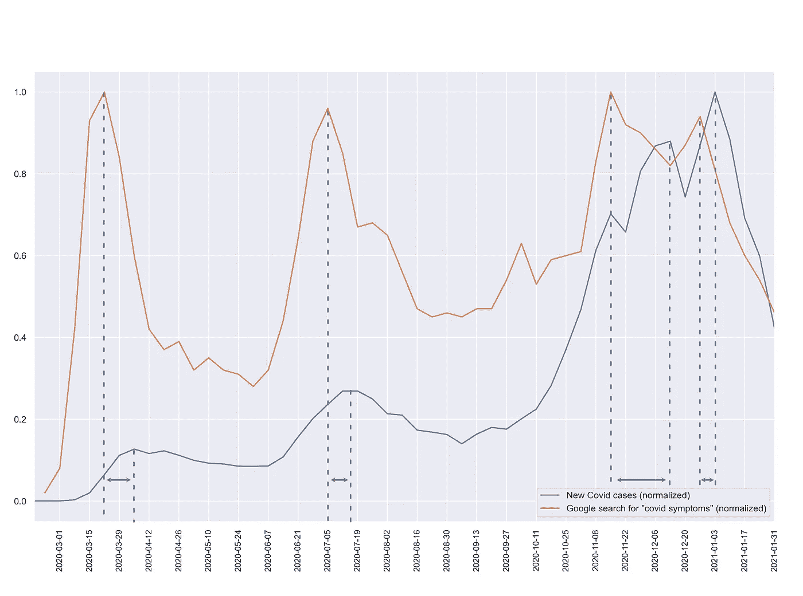

# 使用 Google 搜索统计预测 COVID 案例

> 原文：<https://towardsdatascience.com/predicting-covid-cases-using-google-search-statistics-4fb8814a064b?source=collection_archive---------57----------------------->


在 [Unsplash](https://unsplash.com?utm_source=medium&utm_medium=referral) 上 [engin akyurt](https://unsplash.com/@enginakyurt?utm_source=medium&utm_medium=referral) 拍摄的照片

## [实践教程](https://towardsdatascience.com/tagged/hands-on-tutorials)

## 搜索行为分析如何为流行病学提供信息

**本文涵盖的主题**

*   分析谷歌趋势数据
*   使用熊猫进行重采样
*   使用 Seaborn 和 Matplotlib 可视化日期时间格式的数据

# 介绍

在“谷歌医生”的时代，我们倾向于在去看“模拟”医生——我们当地的医生之前，先在网上咨询与健康相关的问题。令许多医疗保健专业人士烦恼的是，在一场广泛的在线研究马拉松之后，我们到达了医生的办公室，其中包括对问题的自我诊断。

虽然对于医生来说，与那些认为自己一小时的谷歌搜索至少相当于一个全面的医学学位的患者打交道可能是一件痛苦的事情，但人们的集体在线搜索行为实际上在早期发现和定位全球疾病爆发方面具有巨大的潜力。

在这篇文章中，我们将使用谷歌搜索趋势的数据，我们将研究它如何与美国新冠肺炎病例的增加有关。所以我们先来获取一些数据吧！

*注意:如果您主要是为了结果而来，请随意跳到最后的结果部分。*

# 获取数据

我们将处理两个数据集:

1.  过去 12 个月美国每天新增的 Covid 病例。
2.  显示相关搜索词的谷歌搜索趋势的数据集(也是过去 12 个月)。

这个名为[https://covidtracking.com/data/download](https://covidtracking.com/data/download)的网站允许你下载美国 Covid 案例的数据，并允许在知识共享许可(CC BY 4.0)下使用。太好了！所以现在我们有了相关的 Covid 数据，我们需要从 Google 获得一些统计数据。

谷歌趋势网站([https://trends.google.com/trends/?geo=US](https://trends.google.com/trends/?geo=US))允许你输入想要的搜索词，并显示在给定的时间段内这个词被搜索了多少次。我输入“covid 症状”这个词，下载了美国过去 12 个月的数据。这里的假设是，人们倾向于在咨询医生之前在网上搜索他们的症状。频繁搜索“电晕症状”是否预示着即将出现新的 covid 病例？我们会看到的！

# 检查数据

首先，让我们看看从 covidtracking.com 下载的数据。该文件有 17 列，详细统计了新病例、康复病人、死亡人数等。
出于本文的目的，我们将只使用数据集中的两列:

*   **日期**:数据所指的日期(我们处理的是日常数据)。
*   **positiveIncrease** :当天新报告的 Covid 病例数。

Google 趋势数据要简单得多，只包含两列:

*   **周**:数据所指的一周的第一天(我们正在处理周数据)。
*   **covid 症状**:在给定的一周内，这个术语被搜索的相对频率。(相对的意思是，我们得到的不是谷歌搜索的绝对数量，而是按最忙的一周计算的数据。)

# 处理数据

Pandas 是读取和操作我们数据的首选工具。我们将从每日 Covid 病例的数据开始。

```
import pandas as pd
covid_df = pd.read_csv('./national-history.csv',
                        parse_dates=['date'])
covid_df.sort_values(by='date', ascending=True, inplace=True)
```

我们还按日期对数据进行排序，以确保数据是升序排列的。

接下来，我们可以导入 Google 趋势数据，并确保它是数字格式的。

```
google_trends_df = pd.read_csv('./multiTimeline.csv', header=1,
                               parse_dates=['Week'])
google_trends_df['covid symptoms: (United States)'] = pd.to_numeric(google_trends_df['covid symptoms: (United States)'])
```

我们需要注意的另一件事是，Google 数据是以每周总和的形式给出的，而 Covid 数据是以每天为基础给出的。因此，让我们对 Covid 数据进行重新采样，以便获得每周的累积案例，而不是每天的数据。我们分两步来做:首先，我们从日期中减去 7 天，使日期类似于所讨论的一周的第一天(就像 Google 数据的情况一样)。因此，日期 2020-03-01 指的是 3 月 1 日(日-日)从开始的一周*。然后，我们将对每个 7 天期间的案例进行重新取样和汇总。*

```
covid_df['date'] = pd.to_datetime(covid_df['date']) -
                                  pd.to_timedelta(7, unit='d')covid_df = covid_df.resample('W-Sun', on='date')['positiveIncrease'].sum().reset_index().sort_values('date')
```

# 可视化数据

最后，我们准备开始绘制数据，并找出我们的谷歌搜索数据如何与当前的 Covid 案例相关联。

```
import matplotlib.pyplot as plt
import matplotlib.dates as mdates
import datetime
import seaborn as sns
sns.set()fig, ax = plt.subplots(figsize=(16, 10))plt.plot_date(covid_df.date, covid_df.positiveIncrease /
              covid_df.positiveIncrease.max(), fmt='-')plt.plot_date(google_trends_df.Week, 
              google_trends_df['covid symptoms: (United Sates)'] / \
              google_trends_df['covid symptoms: (United    
                               States)'].max(), fmt='-')ax.xaxis.set_major_locator(mdates.WeekdayLocator(byweekday=mdates.SU
                           , interval=2))
ax.xaxis.set_tick_params(rotation=90, labelsize=10)
plt.xlim([datetime.date(2020, 2, 18), datetime.date(2021, 1, 31)])
plt.legend(['New Covid cases (normalized)', 'Google search for "covid symptoms" (normalized)'])plt.show()
```

这里发生了很多事情，所以让我一步一步地向您介绍一下。我们使用 Seaborn 库进行绘图，因为它有漂亮的默认设置和创建好看图形的简单方法。导入 Seaborn 后，应用 Seaborn 样式就像运行`sns.set()`一样简单。绘制以日期时间序列形式给出的数据与常规绘制略有不同，但幸运的是 Matplotlib 有一个方便的`plot_date()`函数，可以为我们完成繁重的工作。我还归一化了这里的数据，使两个量的比例相等。水平轴限制需要作为日期时间对象输入，使用同名模块可以轻松处理。我们得到的是下图。好的，我已经添加了一些图形元素，但是你明白了。



# 结果

蓝色曲线代表过去 12 个月中每周的新确诊 Covid 病例。数据表明，有三波 Covid 感染，第一波始于 3 月初，第二波始于 6 月左右，第三波始于 10 月左右。每一波都在开始几周后达到顶峰，然后下降到一个较低的水平(但仍然很高)。最后一波实际上有两个波峰，但数据可能并不完全确定。

橙色曲线显示了同一时间段内“covid 症状”一词的谷歌搜索趋势。就像新 Covid 病例的数量一样，我们在看到三波感染的同时看到了三个高峰。在谷歌的兴趣在 2-4 周内迅速上升，然后急剧下降的情况下，这些峰值要尖锐得多。有趣的是，在线搜索的峰值在每一波中都达到了近似相等的高度，并没有随着三波的严重性增加而增加。

现在到了有趣的部分，回到本文最初的问题:谷歌搜索的峰值总是出现在感染(或者说诊断)率达到峰值之前的 1-2 周。这可能指向我们最初的假设，即感到不适的人会先谷歌他们的症状，然后去看医生，并成为官方统计数据的一部分。仔细观察三月份的第一波，可以确认在美国 Corona 案例显著增加之前，谷歌在 T2 的活动增加了。当然，网上兴趣增加的部分原因可能是媒体报道的增加，以及出现了一波电晕病例的纯粹事实，人们会在谷歌上搜索症状，尽管他们感觉很好。尽管如此，这并不能解释为什么在达到 Covid 案例峰值之前，人们的兴趣会下降。然而，我们最初的假设以及谷歌搜索和疾病诊断之间的相关延迟，可以作为一个合理的解释。因此，这些数据可能有价值，可能有一些预测能力可以利用。

# 判决

从相关性中推导出因果关系是一条不归路，尤其是当我们处理这样的多因素关系时。虽然这个案例研究不能在这方面提供确定性，但数据的强相关性是值得注意的。搜索引擎数据的预测能力已经在过去的其他案例中得到证明，这里提供的数据表明，类似的方法可能对新冠肺炎和未来的流行病有价值。

你对搜索查询统计的有用性有什么看法？自己试试吧，也许你会比我们其他人更早知道下一个疫情…

**最后声明** 显然，这篇文章中的轶事分析不符合科学标准。它仅用于娱乐和教育目的。