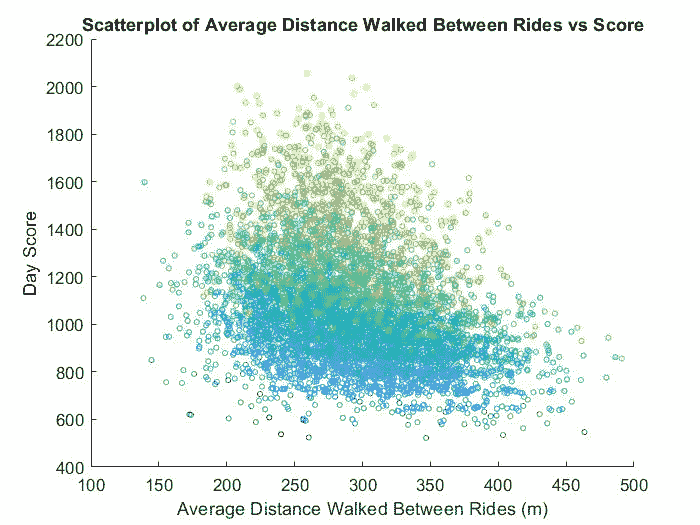
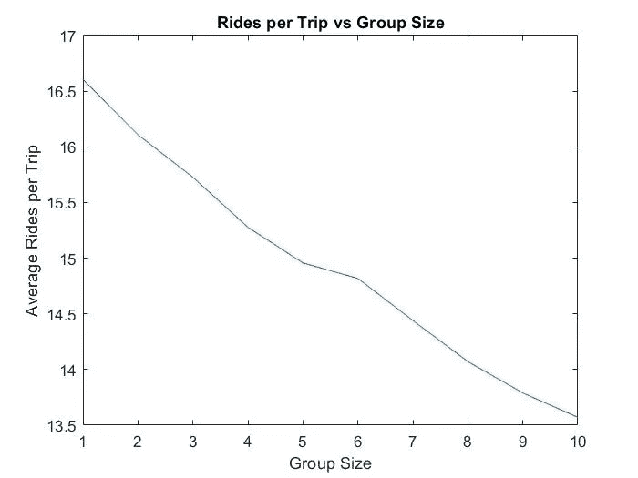
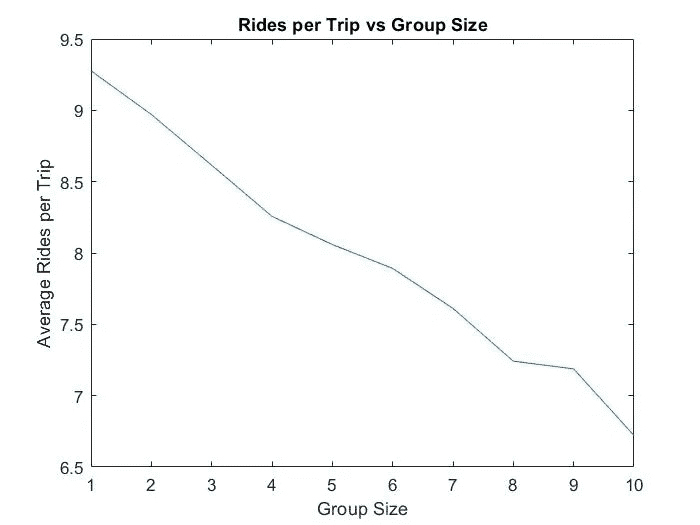
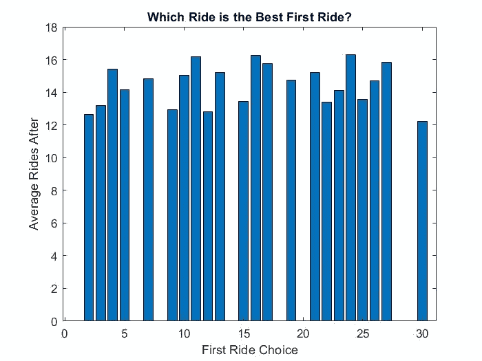
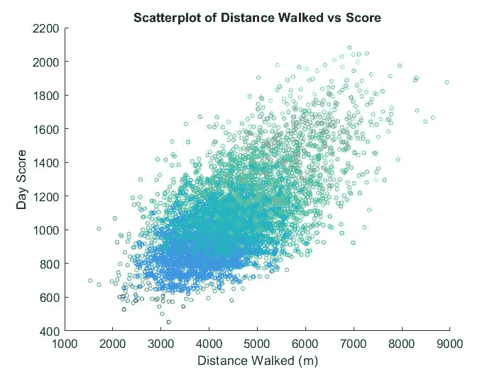

# 预测迪斯尼乐园:改善你的迪斯尼日的策略

> 原文：<https://towardsdatascience.com/predicting-disneyland-strategies-to-better-your-disney-day-e08f8b84f51?source=collection_archive---------35----------------------->

## 我用数学让你的迪士尼之旅更有效率

所有图片由作者提供

## 介绍

你的团队规模如何影响你的乘车次数？你应该先去哪个游乐设施？你在公园周围的步行距离有多重要？我希望在“预测迪斯尼乐园”的第二部分中回答所有这些问题。

在本系列的第一篇文章[通过人口模拟预测迪士尼乐园的等待时间](/predicting-disneyland-wait-times-through-population-simulations-20f44c7582f6)中，我展示了如何利用公园的每分钟模拟来证明走向等待时间更长的游乐设施实际上可以节省你一天中的时间。这给我留下了一些关于公园中群体决策以及某些群体属性如何影响体验的未解问题。

## 群体规模分析

大团队(5 人以上)比小团队(1-4 人)乘坐的次数少。有道理。更多的人意味着更多的上厕所时间，更慢的行走速度，因此，更少的乘车次数。然而，团队规模对乘车总量有多大影响呢？

左侧(公园内 21，000 人)是 COVID 后的平均上座率，右侧(公园内 51，000 人)是最大容量。图片由作者提供。

对于当前的公园游客量，左图更加准确，因为公园已经达到了最大容量的某个百分比。这向我们表明，你的团队中每增加一个人，你平均会少骑 0.33 次。在达到最大容量的日子里，每一个加入你的团队的人平均会少乘坐 0.28 次。这是有道理的，因为这些天每个人都骑得更少，走路速度也更慢。

## 最佳第一次乘坐

这个有点难，因为每个人都有自己最喜欢的骑行，他们把它放在所有其他骑行之上。为了衡量最好的第一次乘坐，我将查看第一次乘坐后每组进行了多少次乘坐，总共 30 次。x 轴是每个游乐设备，1-30，按字母顺序排列。

公园里的 21000 人。图片由作者提供。

前 5 名首次乘坐次数如下:

1.  太空山— 16.26 次预期总乘坐次数
2.  马特宏峰— 16.23 预计总乘坐次数
3.  印第安纳·琼斯——16.15 次预期总乘坐次数
4.  大雷山— 15.44 次预期总乘坐次数
5.  丛林巡游——预计总共 15.24 次

前三名是公园中最繁忙的游乐设施，并且靠近公园的前面，所以对大多数人来说，他们是首选。这也表明，尽早摆脱大型游乐设施可以增加你的游乐设施数量。这是因为当他们的等待时间远远低于一天的平均时间时，你正在乘坐更大的游乐设施，所以你比其他人节省时间。

但是从最差的 5 次乘坐开始呢？(不包括模拟中未被任何人选为第一游乐设备的 7 个游乐设备)

1.  Autopia — 13.25 次预期总乘坐次数
2.  兔子罗杰的汽车卡通旋转-13.14 预期总乘坐次数
3.  Gadget 的 Go 过山车——预计总乘坐次数为 12.93 次
4.  astro Orbiter——12.75 预计总乘坐次数
5.  这是一个小世界——预计总乘坐次数为 12.45 次

离入口较远的游乐设施会导致较少的预期总游乐设施，因为在你走向它们的时候，所有其他大型游乐设施会看到更多的人排队。此外，不应该首先选择像小世界(10 分钟以上)这样乘坐时间长的游乐设施，因为这样会错过大型游乐设施的低等待时间。

## 到达时间和步行距离

早一点到达(或晚一点停留)会决定你要去的游乐设施的数量吗？你要走多远才能称你的迪士尼日为成功？

为了确定一个小组在公园的表现，我把他们当天的所有成绩加到一个大的分数上。这可以与公园里的其他人进行比较，以了解团队的表现。我还用谷歌地球开发的距离矩阵计算了一组人行走的总量。我用这些信息做了一个散点图，用从深到浅的颜色来显示到达时间在分数上的差异(颜色越亮意味着在公园的时间越长，颜色越暗意味着时间越短)。

图片由作者提供

总的来说，看起来得分高的日子确实要多走。这是有道理的，因为更高的得分需要更多的骑行，这需要更多的步行。你还应该注意到，那些在公园里呆的时间越长的小组(黄色圆圈)通常得分越高。

## 乘坐之间的步行距离

骑行间隔少的组得分高吗？

我使用了大致相同的散点图，但 x 轴是乘坐之间的平均距离，而不是总距离。

图片由作者提供

似乎乘车之间的平均步行距离只对晚一点到达公园(或早一点离开)的那组人有影响。深蓝组(在公园里呆的时间最少)，他们的步行距离变化很大，平均每天得分变化不大。另一方面，那些在公园时间最多的人平均步行距离更短，一天的得分更高。

## 结论

你的团队规模如何影响你的乘车次数？

实际上，没我想的那么多。对于一般人群来说，你的团队中每多一个人，你的一天就会减少 0.33 次乘坐。如果额外的 0.33 次乘坐对你来说很重要，那么你绝对应该一个人去迪士尼旅行。单人骑行、只属于你自己的洗手间和一个人的移动订购最终会为你节省很多时间。

你应该先去哪个游乐设施？

三巨头:太空山、马特宏峰或印第安纳琼斯。在第一个小时内干掉其中两个肯定会让你的迪士尼之旅轻松许多。当等待时间远远低于平均水平时，乘坐这些交通工具可以节省你几个小时。

你在公园散步的距离有多重要？

迪士尼乐园一天的总距离确实与更好的分数有一些关联。如果你想坐更多的车，你必须跑 7-10 英里。骑行之间的平均步行距离和更高的分数之间也有一些关联。一般来说，那些走路效率更高的人骑得更多，日子也更好。那些较晚到达的人应该考虑选择离他们刚刚下车的地方更近的下一次乘坐，因为随着乘坐之间的平均步行距离的增加，分数会下降相当多。

我认为接下来应该问的一些问题是，是什么让那些散点图顶部的那些组如此成功？他们的第一次乘车、到达/离开时间或乘车顺序是什么？所有这些因素都可以向我们展示一个理想的迪斯尼乐园计划是什么样子的，它可能是你下次旅行可以实施的东西。