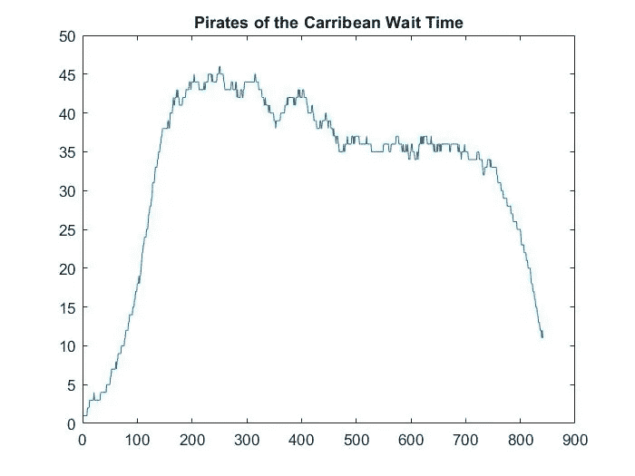
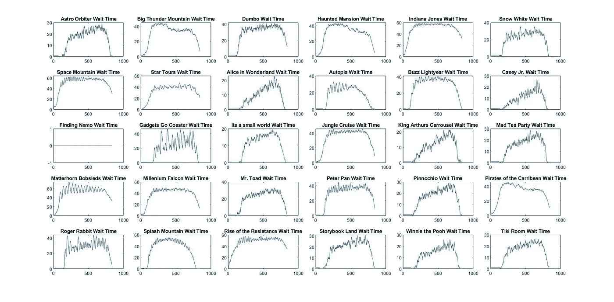
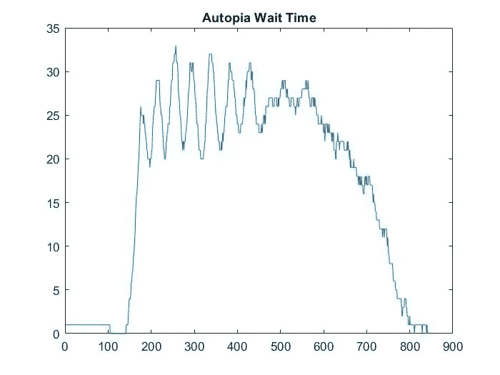
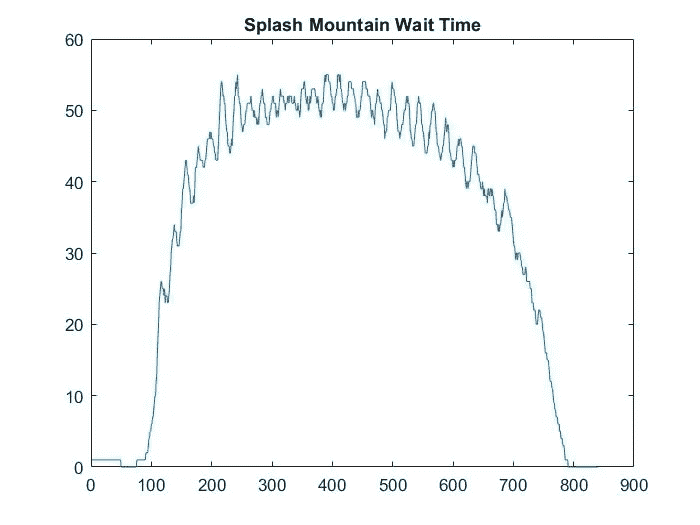

# 通过人口模拟预测迪士尼乐园的等待时间

> 原文：<https://towardsdatascience.com/predicting-disneyland-wait-times-through-population-simulations-20f44c7582f6?source=collection_archive---------17----------------------->

## 利用每分钟的模拟来分析迪士尼乐园内的人群决策

> 所有图片均由作者提供

## 介绍

如果你曾经计划去迪斯尼乐园旅行，你就会知道检查人群水平有多重要。只需要一次意想不到的人群涌动就能把地球上最快乐的地方变成完全相反的地方。十年前，这可以简单地通过一周中的旅行来避免，但是现代的迪斯尼乐园没有休息日。

这个项目的灵感来自于我最近的迪士尼乐园之旅中的一次乘车选择。加州冒险公园的灰熊河急流已经等了几个小时，等待时间长达 45 分钟，由于担心我们必须等到当天晚些时候气温下降，我们开始了向公园那一边的跋涉。排队 5 分钟后，我们注意到等待时间变成了 25 分钟。我们觉得我们玩了这个系统，因为这个举动节省了一些时间。

这让我想到，走向等待时间比平均时间长的游乐设施是明智之举吗？这听起来违反直觉，但在思考我们那天所做的所有选择后，很明显，如果我们觉得不值得等待，我们会避免乘坐。例如，70 分钟的太空山——不，谢谢，我们会等着看它是否会下降。《20 分钟后的雷山》——当然，这似乎很合理。假设一般人都是这样想的，那么灰熊河急流城有时会出现相对较大的落差是有道理的。人们看 45 分钟，然后等到更晚，所以由于排队的人越来越少，所以它下降了。如果你把握好时机，你就可以插队了，因为那里的人已经最少了。于是，一个模拟诞生了。

## 构建模拟

编写 MATLAB 代码的第一步是确定迪士尼乐园一天的总人数。迪士尼乐园的容量约为 85，000 人，在 COVID 期间，他们开始时只有 25%的容量(但自 5 月以来肯定增加了)。这使得我们的后 COVID 人群每天约有 21，000 人。这个数字用于模拟是不准确的，因为我们知道迪士尼乐园没有 21，000 名单身乘客。这些都是各种规模的家庭，因此项目必须与之相匹配。平均家庭规模是 3-4 人，但我在这个模拟中平均定为 3.78 人。现在我们只关注 5500 组不同的人在做决策，这可以大大加快模拟的速度。

每个组还必须分配其他属性，例如位置、他们在做什么、步行速度、乘车历史和到达/离开时间。

*   每组被分配一个数字，0-30，代表他们当前的位置(0 代表入口，1-30 代表 30 种不同的游乐设施)。
*   基于该组是在步行、排队还是在乘车，给他们一个值。
*   行走速度值是根据团队规模分配的，一个单独的骑手显然会比 10 个人的团队走得更快(而且也更少停下来上厕所)。
*   乘坐历史很重要，因为当提示一群人选择乘坐时，你希望有一些可变性，这样乘客就不会重复选择乘坐马特宏峰。
*   到达和离开的时间很重要，因为不是每个人都在公园开门的时候到达，也不是每个人都呆到关门。这些是基于公园出席人数与时间的预设分布随机确定的。

还有一些属性需要分配给公园中的每个游乐设施。诸如刺激、多少是“必须乘坐”、当前等待时间、乘坐容量(乘客/小时)和乘坐时间长度。

为 30 个游乐设备中的每一个与入口之间的距离分配最后一个数据矩阵。没错，一个 31 乘 31 的谷歌地球数据矩阵来表示从任何一个乘坐到另一个乘坐的距离。

现在，我们拥有了运行模拟迪士尼乐园日所需的所有工具，并获得了一些结果。

## 运行模拟

假设我们有总数为 5，500 的前 3 组，看看决策是什么样的(从一天开始)。

A 组:4 人，位于入口处，平均步行速度，无骑行史

B 组:2 人，位于入口处，行走速度快，无骑行史

C 组:7 人，位于入口处，行走速度慢，无骑行史

如果一个团体需要一个新的游乐设施，它会被提示选择一个。但是，它不会随机选择一个。基于上面列出的游乐设备属性，为每个游乐设备给出该组的偏好分数。在对游乐设施评分时，从当前等待时间、步行距离到可变性的一切都要考虑在内。然后，以给定的预设分布选择前 10 名(通常大约 25%的机会获得最高分的乘坐，然后 15%的机会获得第二名的乘坐，等等。)并且所选择的乘坐被分配给该组。根据骑行的距离和他们的步行速度，给这组人一个步行时间，然后他们开始一分钟一分钟地步行。这是为所有需要乘坐的组完成的，在我们的例子中是所有的组，A、B 和 c。

假设 A 组选择印第安纳琼斯。他们被分配了 5 分钟的步行时间。B 组选择太空山，并被分配 4 分钟的步行时间。C 组也挑了印第安纳琼斯，他们的行走时间是 10 分钟(一组 7 人 vs 4 人)。所有这些时间结束后，会根据排队人数和乘坐量(乘客/小时)为乘客分配等待时间。等待时间结束后，他们会被分配一个唯一的乘坐时间。乘坐时间结束后，他们会被提示选择下一次乘坐，循环继续。

这种情况持续一天中的每一分钟，并且每一次乘坐都记录该分钟的等待时间，以便在一天结束时以图形表示。

## 结果

下面显示的是一天 21，000 人的所有 30 个游乐设施的曲线图，开放时间为早上 8 点到晚上 10 点(x 轴上的 0 到 840)。

一些需要注意的事项:

*   《海底总动员》将在 2021 年冬季上映，所以这就是为什么这个情节在 0 分钟。
*   这只是一个模拟，意味着可能的数据点的实际范围比显示的要大。
*   不考虑游乐设施的停机时间，但将其计入游乐设施容量，因为这是无法预测的。
*   像飞溅山这样的水上游乐设施有一个特殊的评分方法，因为一天中较温暖的时间会增加等待时间。
*   游乐设施在开放时需要 1 分钟的等待时间，因为穿过开放的队列需要时间。

让我们来看三个具有不同等待时间曲线形状的单独乘坐(x 轴是实际时间，上午 8 点为 0，晚上 10 点为 840，y 轴是以分钟为单位的等待时间)。

Autopia 在公园开放后的 2-3 小时内有一个非常陡峭的增长，很可能是因为它靠近太空山和马特宏峰。一天中前半段等待时间的变化是排队时时间安排是多么重要的一个很好的例子。中午 12 点和 12:30 之间相差 10 分钟左右，比较显著。在现实生活中，如果你看到 Autopia 要等 30 多分钟，也许你可以走到那个区域，看它下降 5-10 分钟。

加勒比海盗的外形与 Autopia 有很大不同，每分钟的变化更少。它有一个很高的初始曲线，在中午左右慢慢消失，所以对于这个特定的例子，最好在上午 10 点之前或下午 4 点之后乘坐加勒比海盗。在一天结束时，下降可能是由于水骑方面，或者也许这是一个大多数人已经骑过，不想回去的骑行。

飞溅山是水骑效应的一个极端例子，这意味着它在一天的第一个和最后一个小时的等待时间非常短。它在几分钟之间有一些不错的波动，所以正确的计时可以让你节省 10 分钟的等待时间。

只有当模拟在精确匹配现实方面做得很好时，这才是真正重要的。在撰写本文时，即 8 月 5 日下午 1 点，三个示例的等待时间如下:

*   Autopia — 20 分钟
*   《加勒比海盗》——45 分钟
*   飞溅山——65 分钟

根据这个模拟，下午 1 点的估计等待时间如下:

*   Autopia — 22 分钟
*   《加勒比海盗》——43 分钟
*   飞溅山——53 分钟

《Autopia》和《加勒比海盗》非常接近现实，而《飞溅山》则明显低一些。这可能是由于气温较高，或者印第安纳琼斯当时正在下降，所以更多的骑手可能已经转移到飞溅山。

## 结论

当所有游乐设施运行正常，游客做出合理决定时，用这种模拟预测等待时间是相当可靠的。波动较大的游乐设施是那些在公园里做决定时时间安排得更好的游乐设施。走向那个游乐设施会对你的一天有益，每次可以节省你 5-10 分钟。

这种模拟可以很容易地改变以匹配预测的人群数量、游乐设施关闭、游乐设施增加和停车时间。游乐设备翻新会增加等待时间，可在该游乐设备的“必须乘坐”属性内进行更改，以反映新的等待时间。

这种模拟可以采取的一些后续步骤包括快速通行证、食物休息、游行和表演时间，以及登机牌对等待时间的影响。

此外，观察团队规模如何影响团队乘坐的次数，或者随着人群的增加等待时间如何变化可能会很有趣。调查最成功的团体和他们的决定也可以证明是那些真正想在迪斯尼乐园消磨一天的人的一个很好的模板。

回答我在这个项目中遇到的主要问题:是的，对于特定的乘坐项目来说，走向那些长的等待时间确实是有益的，但是对于其他人来说，就不那么有益了。高优先级游乐设施，如太空山、马特宏峰、印第安纳琼斯和千年隼，一天中不会有太多变化，除非你能在它从临时关闭重新开放时掌握好时间。然而，它表明，其他游乐设施有相当多的变化，你可以利用，也许会在你的迪士尼乐园一天多坐一两次。