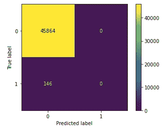

# 预测 EEOC 歧视调查

> 原文：<https://towardsdatascience.com/predicting-eeoc-discrimination-investigations-aa007ea470c8?source=collection_archive---------39----------------------->

丹尼尔·雷彻在[像素](https://www.pexels.com/photo/eggs-in-tray-on-white-surface-1556707/)上拍摄的照片

## 结果是暗淡的。

这篇文章的主要目的是分享一个数据科学项目的结果，该项目涉及预测美国平等就业机会委员会(EEOC)对就业歧视索赔的调查结果。这是一个高度不平衡(99:1)的二元分类问题。因此，目标是建立一个模型，可以最好地预测目标少数民族阶层，这是 EEOC 发现就业歧视的优点。长话短说，很难可靠地预测歧视调查，EEOC 会发现优点。这可能是由于数据质量差。

在过去的几年里，几位记者[报道了歧视指控的状况以及 EEOC 调查这些指控的能力](https://www.vox.com/policy-and-politics/2019/2/28/18241973/workplace-discrimination-cpi-investigation-eeoc)。这项研究的目的是看看调查结果是否可以预测，以帮助 EEOC 在预算不足的情况下开展调查。然而，应该注意的是，在创建有意义的模型之前，数据质量还有很长的路要走。目前，由于几十年的预算不足和一个没有真正能力保护大多数遭受就业歧视的人的机构，这些数据是有偏见的。因此，所使用的数据不能提供完整的信息，基线可能低估了美国歧视索赔的真实性质以及 EEOC 通过调查确定歧视的全部能力。

数据来自公共诚信中心，包括 2010 财年所有的歧视索赔。

# 一、争论数据

数据争论有三个部分:创建目标变量、工程特征、输入分类值，以及丢弃冗余或容易泄漏的变量。

目标变量(决策)根据“结束类型”进行了简化，以包括两种可能的结果:发现歧视和没有发现歧视。虽然从技术上讲，索赔可以结案，但不能做出任何决定。例如，如果 EEOC 需要或将需要 180 天以上的时间来完成调查，投诉人可以要求通知有权起诉(NRTS)。这样，EEOC 将自动结束调查，并且不会做出歧视的决定。

一些额外的功能被设计来尝试和提高模型的预测能力。这些因素包括:提出申诉时的“年龄”，“NAICS 准则”扩大到了行业层面，“调查持续时间”，以及申诉人是否获得了“金钱利益”

# 二。分割数据

该模型基于 2010 财政年度的时间序列数据。因此，数据按比例分割，以保持时间顺序。定型数据是前 60%的行，验证集和测试集各占 20%。

# 三。建立基线

在严重不平衡的二进制分类问题中，基线是由少数群体的普遍程度建立的。对于该数据集，发现区分价值的调查为 0.0127。该分数将在评估阶段根据精确召回曲线下面积(PR AUC)分数进行衡量。

# **四。建立模型**

SimpleImputer 和 StandardScaler 应用于数字特征，OrdinalEncoder 和 BinaryEncoder 分别应用于序数和名词性分类特征。

该数据集的基本模型是逻辑回归，替代模型是随机森林。为了评估他们的表现，我将使用平均加权的 f1_score 和 PR AUC 分数。

**线性模型:逻辑回归**

无调整的逻辑回归

开箱即用的逻辑回归模型返回了 0.033 的精确召回 AUC 分数，略好于基线。但是 f1_score 是< 0.50 which most likely indicates that the model is not predicting any of the claims as having discrimination.

**套袋模式:随机森林**

无调整的随机森林

在没有调整的情况下，随机森林模型返回的 PR AUC 得分为 0.092，明显优于逻辑回归模型和基线。f1_score 也大于 0.5，这可能意味着模型将一些索赔归类为有歧视的原因。另一个好迹象。

**混淆矩阵**

下一步是将更好的拟合模型 Random Forest 应用到我们的测试数据中，看看它的表现如何。我们可以使用混淆矩阵来实现这一点。为了进一步说明项目的结果，我为验证和测试集添加了一个混淆矩阵。

l:验证集的混淆矩阵；r:测试集的混淆矩阵

从这些矩阵中我们可以看出，这些模型在预测歧视方面没有实际用途，特别是在索赔数量特别低的情况下(测试集只包括 146 项确定存在歧视的索赔)。在验证集上，我们可以看到很高的精度，但这是一个难以置信的损失。

在我们让政府机构承担责任的实际环境中，如果预测模型具有较高的召回率，它将为员工的最佳利益服务。这意味着它准确地检测到了所有发生就业歧视的情况。通常，这也意味着它会得到一些错误的预测(即，一个实际上没有歧视的声明被标记为有歧视)。虽然一个高精度的模型不能捕捉所有真实的歧视案例，但当它预测一个索赔有价值时，它总是正确的。实际上，在这些措施之间几乎总是有一个权衡。

**排列重要性**

我们还可以考虑模型中使用的特征的排列重要性，这也反映了它们的弱点。

理想情况下，我们希望特性具有积极的重要性，因为这是它们具有预测能力的标志。在这种情况下，我们所有的特征都有积极的重要性，但它们的大小相当小(接近于零)。

# **五、结果+建议**

调查结果揭示了歧视索赔数据质量的一些缺陷，以及 EEOC 调查的模糊性。很难相信许多特征会有如此小的预测能力，但这可能是由于缺乏其他重要的变量。最明显的是围绕调查程序。不清楚它们是否标准化，也不清楚对索赔做出决定的门槛是什么。我们也不知道 EEOC 如何评价员工及其雇主提供的证据的力度。

公共诚信中心有一个更大的数据集，涵盖了 2011 年至 2017 年的[歧视指控。用更多的数据再次尝试这个项目可能是值得的。如果能够建立一个具有真正预测能力的模型，我们应该质疑高精度是否优先于低召回率。否则，将很难知道 EEOC 进行调查的真正效力。](https://github.com/PublicI/employment-discrimination/tree/master/data)

[*该项目的 GitHub 资源库。*](https://github.com/hillarykhan/LS-Unit2-Build)

 [## 越来越多的工作场所歧视案件甚至在调查之前就结案了

### 这是典型的华盛顿第 22 条军规:多年来，国会一直严厉批评调查工作场所的机构…

www.vox.com](https://www.vox.com/identities/2019/6/14/18663296/congress-eeoc-workplace-discrimination)