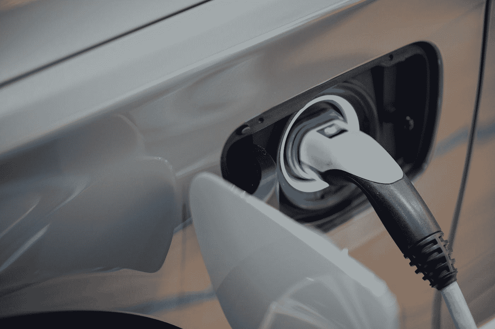
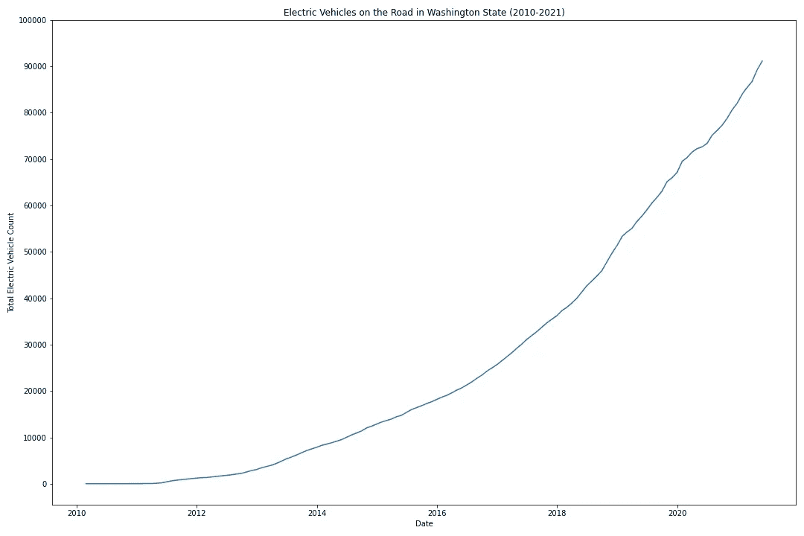
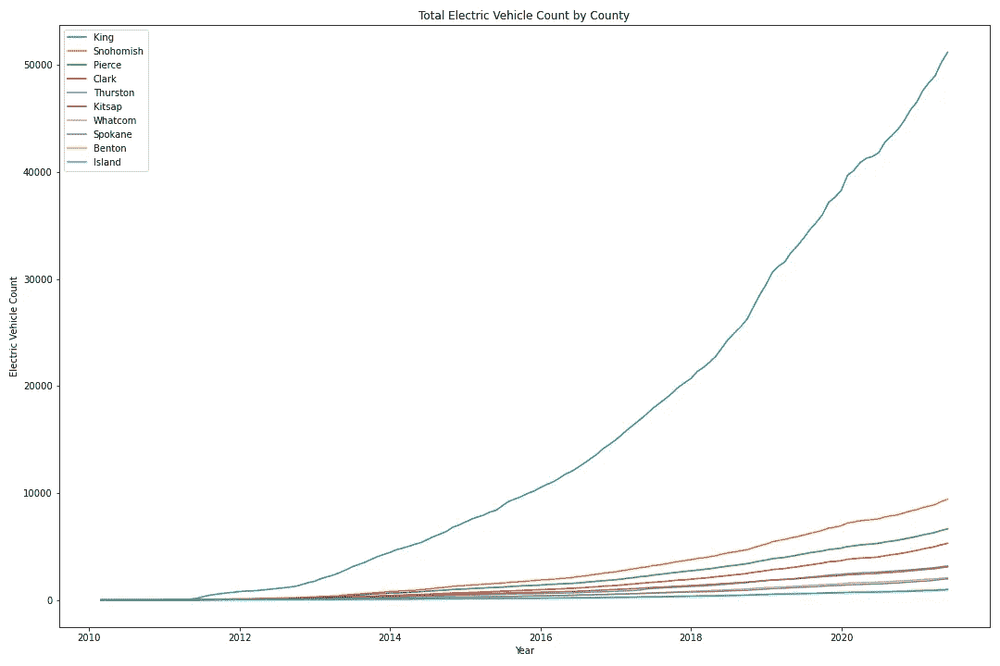
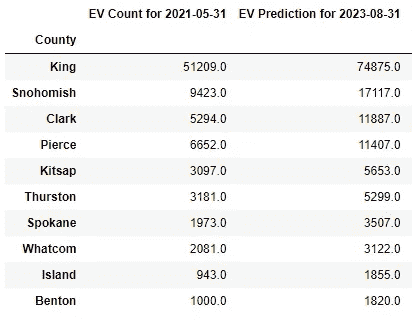
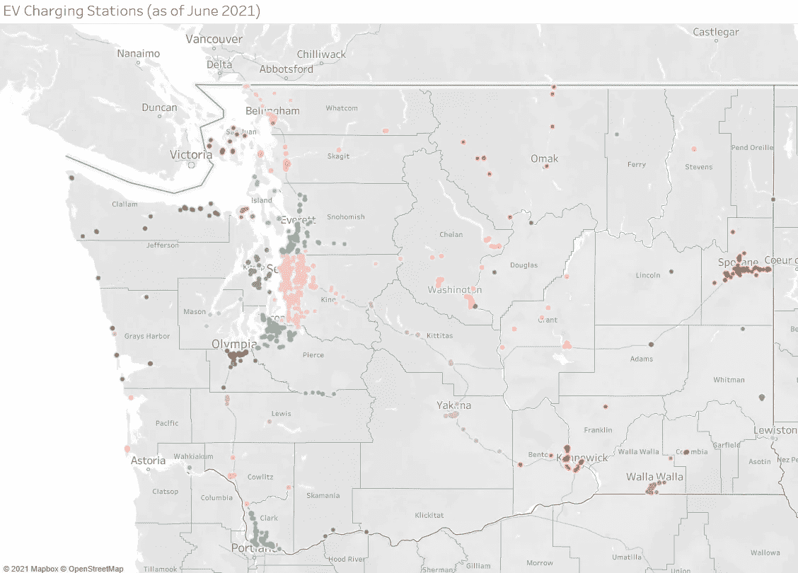
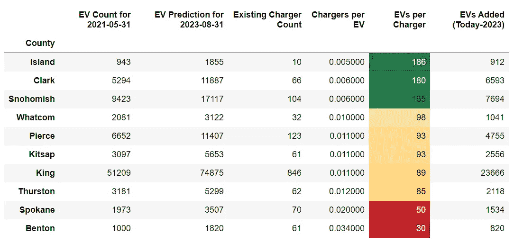
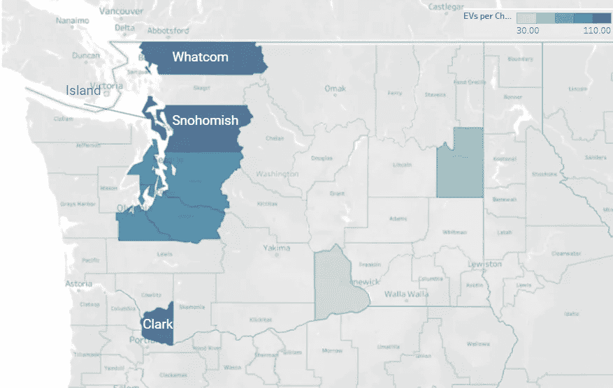

# 华盛顿州电动汽车和商用充电器需求预测

> 原文：<https://towardsdatascience.com/predicting-electric-vehicle-commercial-charger-demand-in-washington-state-feb04960feb1?source=collection_archive---------23----------------------->

## 哪些华盛顿县将拥有最多的电动汽车，需要最多的商用充电器？

如果你在过去的几个月里走出户外，你很可能会比其他任何一个夏天都更想吃一勺正在融化的冰淇淋。根据 NOAA 国家环境信息中心的数据，2021 年 6 月全球陆地表面温度是有记录以来最高的，这不是巧合。这些极端温度的发生是由于大气中温室气体的增加，这也被称为气候变化。

照片由 [Clark Douglas](https://unsplash.com/@clark_douglas?utm_source=medium&utm_medium=referral) 在 [Unsplash](https://unsplash.com?utm_source=medium&utm_medium=referral) 拍摄

**那么，有什么解决办法呢？**

这个问题非常复杂，没有一个放之四海而皆准的解决方案；然而，减少并最终消除由化石燃料驱动的车辆造成的温室气体排放将有益于环境。根据美国环境保护署(EPA)的数据，“交通运输的温室气体(GHG)排放约占美国温室气体排放总量的 29%，是美国 GHG 排放的最大贡献者。”

有鉴于此，在过去几年里，气候变化已成为美国和世界各地官员日益紧迫的关切。目前，在美国，乔·拜登总统和他的政府正在努力通过一项[两党基础设施协议](https://www.whitehouse.gov/briefing-room/statements-releases/2021/06/24/fact-sheet-president-biden-announces-support-for-the-bipartisan-infrastructure-framework/)，该协议将优先采取以下行动:

*   在高速公路沿线、农村和贫困社区建设由 500，000 个电动汽车(EV)充电器组成的全国网络。
*   为全国数千辆校车和公交巴士供电，以减少有害排放，推动零排放车辆和零部件的国内制造。
*   通过现代化和扩大全国范围内的交通和铁路网络，改善数百万美国人健康、可持续的交通选择，同时减少温室气体排放。

[丘特尔斯纳普](https://unsplash.com/@chuttersnap?utm_source=medium&utm_medium=referral)在 [Unsplash](https://unsplash.com?utm_source=medium&utm_medium=referral) 上拍照

除了国家层面的大规模政策建议，一些州也在自行采取行动。例如，加利福尼亚州和华盛顿州都在努力分别在 2035 年和 2030 年强制推行电动汽车，以逐步淘汰使用汽油的汽车。此外，在私营部门内，几家主要的汽车制造商(如福特、通用、沃尔沃等。)已经宣布，他们将在未来十年内实现全电动化，这将被证明是汽车行业的一次重大变革。总而言之，如果实施的话，公共和私营部门的这些变化将导致电动汽车(ev)以及商用电动汽车充电器需求的大幅增长。

我们决定利用我们的数据科学超能力，找到未来电动汽车需求最大的领域，并为电动汽车充电公司提供建议。这里可以找到分析[。](https://github.com/ebtezcan/dsc-phase-5-project)

**数据**

首先是数据。我们决定从华盛顿州的 API 中收集关于华盛顿州[电动汽车所有权和注册活动](https://data.wa.gov/Transportation/Electric-Vehicle-Title-and-Registration-Activity/rpr4-cgyd)的数据。这导致我们在 2010 年至 2021 年间有 433，172 笔电动汽车交易。由于我们试图预测随着时间的推移将有多少辆电动汽车上路，我们最终放弃了所有注册信息，使用了 91，255 个所有权交易。

**定义“区域”**

我们最初的计划是通过邮政编码集中分析这些数据；然而，由于时间限制，我们决定用县来代替。然后，我们对这些信息进行了重新采样，以反映每个县每月购买电动汽车的数量。但是，我们必须将这些信息转化为每个县一段时间内的电动汽车总数，所以我们取了这些数据的累计总和。此时，数据集已准备好用于时间序列建模。

**这项分析包括哪些县？**

同样，由于时间限制，我们决定将重点放在华盛顿州电动汽车交易最多的前 10 个县。这些县包括:**本顿、克拉克、海岛、金、基特萨普、皮尔斯、斯诺霍米什、斯波坎、瑟斯顿和沃特科姆县**。

**这一阶段的数据是什么样的？**

看看全州的电动汽车数量，也许并不奇怪，我们可以看到，在过去 10 年里，华盛顿州道路上的电动汽车数量一直呈指数增长。

在很高的层面上，这证实了华盛顿州有必要的电动汽车需求趋势，使投资电动汽车充电公司有利可图。

从单个县来看，我们发现金县的发展速度比其他县快得多。这是意料之中的，因为金县包括西雅图，西雅图是华盛顿州人口最多的城市。

**建模**

我们的工作流程在每个县都是一样的。在分解数据并查看电动汽车数量的趋势和季节性后，我们将数据分为每个县的训练集和测试集。在将 SARIMAX 模型拟合到训练集之后，我们使用了一个名为 pmdarima 的库，根据 AIC 分数为每个模型找到最佳参数。然后，我们预测“未来”,并将该信息与测试集进行比较。如果预测值与观察到的数据一致，我们继续将另一个 SARIMAX 模型拟合到整个观察到的数据(训练+测试集),并对每个县未来的电动汽车数量进行预测。如果不是，我们重复不同的训练测试分割，直到预测接近观察到的数据。

**那么，哪个县将拥有最多的电动汽车呢？**

我们的模型预测国王县将在 2023 年拥有最多的电动汽车。准确的说是 74875。斯诺霍米什县以 17，117 辆远远落后于第二名。

观察到的(左)与预测的(右)每个县的电动汽车数量。

但是，这有点误导。我们的分析目标是找到最有潜力投资电动汽车充电公司的县。我们必须考虑的一个主要因素是现有的充电基础设施。毕竟，如果一个国家已经有一船可用的充电器，那么商业充电市场可能已经饱和，即使未来几年将有更多的汽车上路。

**更多数据！**

因此，我们决定从[国家可再生能源实验室(NREL)的 API](https://developer.nrel.gov/docs/transportation/alt-fuel-stations-v1/) 中收集现有充电基础设施的数据。我们最终在华盛顿州建立了 1686 个充电站(如果您想查看每个充电器的确切位置，请点击[此处](https://public.tableau.com/app/profile/berke.tezcan/viz/ElectricVehiclePredictionsandExistingChargingInfrastructureinWashingtonState/Dashboard1))。以下是各县充电站数量的明细:

华盛顿州充电站数量(截至 2021 年 6 月)。

华盛顿电动汽车充电器的位置(截至 2021 年 6 月)。

正如我们在这里看到的，华盛顿州大约 50%的充电器位于金县。因此，如上所述，国王县充电器市场可能已经饱和，可能不需要更多的充电器。

我们如何在相对的基础上比较各县？

为了能够在各县之间进行比较，我们设计了一个指标“每个充电器的电动汽车数”，这是 2023 年电动汽车的预计数量除以每个县现有充电站数量的比率。该比率越高，预计该县未来的服务水平越低，这可能会转化为电动汽车充电公司的更多机会。当我们根据这一指标对数据进行排序时，我们发现，与其他 10 个县相比，国王县确实不太理想:

按电动汽车/充电器比率分类的数据。

上图中，电动汽车每充电器指标排名前四的县是 Island、Clark、Snohomish 和 Whatcom。然而，当我们考虑以下因素时，尽管 Island County 的电动汽车/充电器比率领先，但我们得出的结论是，它不是一个真正的竞争者。

**等等，为什么岛县出局了？**

首先，岛屿县由一系列岛屿组成，主要是住宅建筑和国家公园，很少有商业中心和办公楼。根据 JD Power 的一项研究，“80%的电动汽车充电是在家里进行的——几乎总是在夜间进行——或者在工作日停车时进行。”因此，居住在该县的电动汽车车主很可能会在自己家里为他们的汽车充电，而不是使用商业充电站。此外，由于土地的限制，该县的人口在未来可能会停滞不前，这可能会转化为对电动汽车的需求，因此充电器也会停滞不前。

描述所有 10 个县的电动汽车/充电器比率的地图。这可以在[项目仪表板](https://public.tableau.com/app/profile/berke.tezcan/viz/ElectricVehiclePredictionsandExistingChargingInfrastructureinWashingtonState/Dashboard1)中以互动形式获得。

**结论**

总而言之，电动汽车背后的动力——由最近的技术和政策进步产生——使今天成为投资充电基础设施的理想时机。作为在电气化交通方面领先的州之一，华盛顿州是美国建设新充电站的最佳地点之一。

我们认为，对于电动汽车充电公司而言，以下县(按排名顺序)具有巨大的高盈利潜力:

**1。克拉克县**

**2。斯诺霍米什县**

**3。Whatcom 县**

如果你想看我们的交互式仪表盘，你可以点击这里查看。否则，可以在 [GitHub](https://github.com/ebtezcan/dsc-phase-5-project) 上查看完整的分析。

**来源:**

NOAA 国家环境信息中心，气候状况:2021 年 6 月全球气候报告，2021 年 7 月在线发布，2021 年 7 月 28 日从[https://www.ncdc.noaa.gov/sotc/global/202106](https://www.ncdc.noaa.gov/sotc/global/202106)检索。

环保局。(2021).*交通运输产生的碳污染*。环保局。[https://www . EPA . gov/transportation-air-pollution-and-climate-change/carbon-pollution-transportation。](https://www.epa.gov/transportation-air-pollution-and-climate-change/carbon-pollution-transportation.)

福尔克尔，J. (2021 年 2 月 5 日)。*福布斯*。[https://www . Forbes . com/wheels/news/JD-power-study-electric-vehicle-owners-prefer-dedicated-home-charging-stations/。](https://www.forbes.com/wheels/news/jd-power-study-electric-vehicle-owners-prefer-dedicated-home-charging-stations/.)