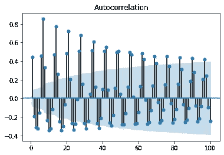

# 用 XGBRegressor 预测用电量

> 原文：<https://towardsdatascience.com/predicting-electricity-consumption-with-xgbregressor-a11b71104754?source=collection_archive---------24----------------------->

## 千瓦消费模式的时间序列分析


来源:图片由 [3938030](https://pixabay.com/users/3938030-3938030/) 发自 [Pixabay](https://pixabay.com/photos/forest-landscape-sun-trees-nature-1950402/)

在本例中，XGBRegressor 用于预测爱尔兰都柏林市市政办公室的千瓦消耗模式。正在讨论的数据集可从 data.gov.ie[获得。](https://data.gov.ie/dataset/energy-consumption-gas-and-electricity-civic-offices-2009-2012/resource/6091c604-8c94-4b44-ac52-c1694e83d746)

# XGBRegressor 是什么？

你以前用过 XGBoost(极限梯度提升)做分类任务吗？如果是这样，您将会熟悉这个模型的工作方式。

本质上，梯度推进模型通过以连续的方式将预测器添加到集合中来工作，新的预测器适合于由先前的预测器产生的残差。Aurelien Geron 的《Scikit-Learn & TensorFlow 机器学习实践指南》很好地概述了这一模型背后的理论，我建议参考该指南以获取更多信息。

XGBRegressor 试图完成同样的事情，唯一的区别是我们使用这个模型来解决回归问题，即结果变量是数字的。

特别是在时间序列的上下文中，XGBRegressor 使用时间序列的滞后作为预测结果变量的特征。

# 数据操作

在深入研究 XGBRegressor 模型之前，让我们看一下数据集本身。

原始数据集以 15 分钟为间隔显示每天的用电模式。

```
df = pd.read_csv('dccelectricitycivicsblocks34p20130221-1840.csv', engine='python', skipfooter=3)
df
```


来源:Jupyter 笔记本输出

为此，我们倾向于每天分析数据——每 15 分钟分析一次消费模式可能会给时间序列带来太多波动，从而无法识别数据中任何有意义的模式。

通过对每 15 分钟的消耗模式求和，将数据整理成每日格式，如下所示:

```
df2=df.rename(columns=df.iloc[0])
df3=df2.drop(df.index[0])
df3
df3.drop(df3.index[0])
df4=df3.drop('Date', axis=1)
df5=df4.drop('Values', axis=1)
df5
df6=df5.dropna()
df7=df6.values
df7
dataset=np.sum(df7, axis=1, dtype=float)
dataset
```

该数组现在以 numpy 格式显示，如下所示:


来源:Jupyter 笔记本输出

以下是日常消费模式的折线图:


来源:Jupyter 笔记本输出

现在，每天的时间序列已经形成，数据被分成训练和测试分区。

```
train_size = int(len(df) * 0.8)
test_size = len(df) - train_size
train, test = df[0:train_size,:], df[train_size:len(df),:]
```

然后创建数据集矩阵，将时间序列的滞后存储为特征:

```
def create_dataset(df, previous=1):
    dataX, dataY = [], []
    for i in range(len(df)-previous-1):
        a = df[i:(i+previous), 0]
        dataX.append(a)
        dataY.append(df[i + previous, 0])
    return np.array(dataX), np.array(dataY)
```

# 分析

下面的分析使用了来自[机器学习大师](https://machinelearningmastery.com/xgboost-for-time-series-forecasting/)的教程作为模板。

在配置 XGBRegressor 模型时，第一步是确定回望期，即模型在预测时间 *t* 的消耗值时应考虑多少个前期？



来源:Jupyter 笔记本输出

在分析自相关函数时，数据中似乎存在每周季节性，即消费相关性的峰值每隔 7 个滞后出现一次。

在这方面，为模型选择了 **7** 的回望期。

```
# Lookback period
lookback = 7
X_train, Y_train = create_dataset(train, lookback)
X_test, Y_test = create_dataset(test, lookback)
```

XGBRegressor 现在适合训练数据。

```
from xgboost import XGBRegressormodel = XGBRegressor(objective='reg:squarederror', n_estimators=1000)
model.fit(X_train, Y_train)
```

最初在集合中使用 1，000 棵树，以确保对数据的充分学习。然而，n 估计量的数量将被修改，以确定是否可以用较低的值获得相同水平的精度。

目标设置为 ['reg:squarederror'](https://xgboost.readthedocs.io/en/latest/parameter.html) ，即平方损失回归，对极值误差的惩罚更重。

然后，使用该模型对测试数据进行预测:

```
testpred = model.predict(X_test)
```

**Y_test** (实际测试值)和 **testpred** (预测值)均经过整形，以便使用均方根误差比较模型精度。

```
Y_test=Y_test.reshape(-1,1)
testpred=testpred.reshape(-1,1)
```

RMSE 现在计算出来了:

```
>>> import math
>>> from math import sqrt
>>> test_mse = mean_squared_error(Y_test, testpred)
>>> rmse = sqrt(test_mse)
>>> print('RMSE: %f' % rmse)RMSE: 437.935136
```

让我们将其与测试数据的平均值进行比较:

```
>>> np.mean(Y_test)3895.140625
```

误差的大小约为整个测试组的平均千瓦消耗值大小的 **11%** 。这表明该模型在预测相关消费趋势方面做得相当好。

# 修改树的数量

现在，还记得在获得这个值的过程中使用了 1000 个估计值吗？如果我们决定降低这个值呢？让我们试试 300 个 n_estimators。

```
>>> import math
>>> from math import sqrt
>>> test_mse = mean_squared_error(Y_test, testpred)
>>> rmse = sqrt(test_mse)
>>> print('RMSE: %f' % rmse)RMSE: 437.930710
```

我们可以看到，获得的 RMSE 实际上是相同的——这意味着该模型在预测整个测试集的千瓦消耗方面做得一样好。

当用 20 棵树做实验时，RMSE 略微上升到 440，在 10 棵树时，RMSE 上升到 471。

这意味着在构建该模型时应至少使用 **20** 棵树。然而，XGBRegressor 似乎不需要太多的训练来学习数据的模式-存在每周季节性和使用 7 的回顾期的事实表明，在模型中包括适当数量的滞后作为特征比简单地向模型中添加更多树的额外训练更重要。

在这个问题上，和其他问题一样，数据是王道。

# 结论

在本例中，您看到了:

*   如何正确处理时间序列数据以进行正确的分析
*   XGBRegressor 的使用以及如何适当地修改模型参数
*   跨测试集确定模型准确性时的 RMSE 计算
*   如何确定在模型中使用的合适的树的数量

非常感谢您的参与，您可以在[michael-grogan.com](https://www.michael-grogan.com/)找到更多我的数据科学内容。

*免责声明:本文是在“原样”的基础上编写的，没有担保。本文旨在提供数据科学概念的概述，不应被解释为任何形式的专业建议。作者与本文提及的任何第三方无任何关系。*