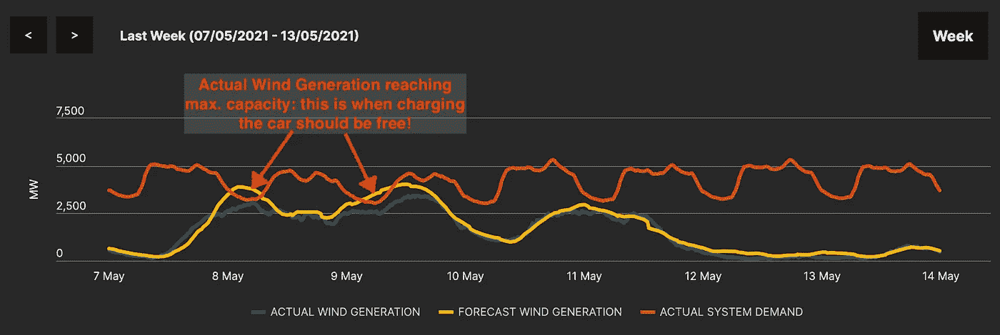
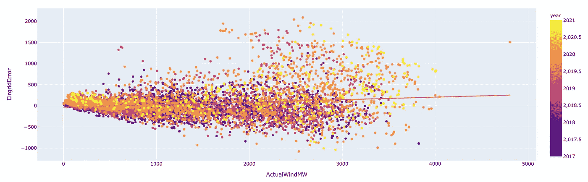

# 预测爱尔兰过剩的风力发电:应对气候变化的机器学习

> 原文：<https://towardsdatascience.com/predicting-excess-wind-electricity-in-ireland-machine-learning-against-climate-change-part-1-d042894026a6?source=collection_archive---------13----------------------->

## [变更数据](https://towardsdatascience.com/tagged/data-for-change)

## 机器学习算法能否发现复杂电力网络中的隐藏模式，从而进行可靠的预测？

不断变化的消费模式、电网约束和突然变化的天气条件之间的时间序列预测可能很棘手。我们很高兴分享我们在一系列 ML 算法方面的经验，以帮助我们优化电力消耗并减少碳足迹！

[RawFilm](https://unsplash.com/@rawfilm?utm_source=medium&utm_medium=referral) 在 [Unsplash](https://unsplash.com?utm_source=medium&utm_medium=referral) 拍摄的照片

我们将解释我们试图解决什么问题，我们使用、探索(EDA)什么数据，以及我们如何处理缺失数据、共线性、异常值和特征变换，以便为稳健建模做好准备。

然后，我们将涵盖机器学习/神经网络模型候选，具有强烈趋势的时间序列的特定训练/验证分割，以及模型和 ***剧透警报*** 默认 EirGrid 预测之间的结果比较！

# 问题是

与 1990 年的水平相比，可再生能源是欧洲到 2030 年减少至少 55%碳排放计划的基本要素。我们探索了爱尔兰的情况和风力发电的潜在智能使用。

“在爱尔兰，未来十年的能源需求增长在低需求情景下的 23%和高需求情景下的 47%之间变化。”根据[eir grid 2019–2028](http://www.eirgridgroup.com/site-files/library/EirGrid/EirGrid-Group-All-Island-Generation-Capacity-Statement-2019-2028.pdf)全岛发电能力声明。

截至 2018 年，风能贡献了 80%的可再生电力和 30%的总电力需求。爱尔兰的目标是将可再生电力增加到总发电量的 70%，欧盟的目标是到 2030 年达到 32%。然而，业界越来越担心每年“损失”的风能数量。2020 年，这相当于超过 140 万兆瓦时的电力，几乎是 2019 年的两倍。根据[风能爱尔兰 2021 报告](https://windenergyireland.com/latest-news/5364-annual-report-confirms-wind-energy-leads-fight-against-climate-change)，这不到总产量的 11.5%，足以为超过 30 万个家庭供电。

**但是为什么要“浪费”权力呢？**

传输系统运营商(TSO)，爱尔兰的 EirGrid，负责始终平衡从发电流向消费者的电力**。**

图 1 —电网必须始终保持发电和需求之间的平衡。作者图片

当发电量**超过耗电量**时，TSO 调节杆受到限制:

*   将电力转向“存储”:在爱尔兰，将水泵送到特劳山电站(但有限制)
*   出口(市场允许)到英国:最大。1 GW 连接(Ewic + Moyle)
*   要求天然气/煤炭发电厂减速，但是减速可能需要几个小时
*   目前，风力/太阳能发电的最大比例受到系统非同步渗透率(SNSP)“2018 年 Q1 的当前比例为 65%”和最近增加到 70%的非同步可再生能源水平的限制。
*   “可再生能源调度下降”(限制和削减):基本上是将风电场与电网断开，导致风能“损失”，这可以在 [EirGrid 集团系统和可再生能源报告](http://www.eirgridgroup.com/how-the-grid-works/renewables/)中看到。

欧洲绿色协议将促进对电网的大量投资，以支持更高比例的可再生能源，然而，可再生能源容量将大幅增加，导致更多的“浪费”电力。

消费者和工业用户的行为也需要改变，这是这个项目的重点。如图 2 所示，如果风电预计达到当前的 70%，则:

*   工业用户(如数据中心)可以为电池充电以备后用。
*   消费者可以设定他们的电器在这些时间运行，例如:1)给电动汽车充电；2)启动带有滚筒式烘干机的洗衣机；3)增加热泵等。

图 2—[www.smartgriddashboard.com](https://www.smartgriddashboard.com/#all/wind)风力发电可能被“浪费”的例子

# 数据

图 3 数据来源:由 EirGrid 集团数据和 Metéireann 数据支持

1.  Metéirean data:Copyright Metéireann，Source [www.met.ie](http://www.met.ie) ，许可声明:该数据在知识共享署名 4.0 International (CC BY 4.0)下发布。
2.  爱格瑞集团数据:爱格瑞集团数据支持，来源:【www.smartgriddashboard.com】T4，[开放数据许可](https://www.smartgriddashboard.com/#all/open-data-licence) e

如图 3 所示，从爱尔兰岛的 EirGrid Group 下载了一个包含 2017 年 1 月至 2021 年 2 月 145，936 个观测值的风电数据集，因为爱尔兰共和国和北爱尔兰是一个集成的单一电力市场(I-SEM)。数据描述了风力发电和电力需求的样本，频率为 15 分钟。为了构建完整的画面，爱尔兰岛上安装的总风力容量每月在“Eirgrid Group，Tech .“[系统和可再生能源数据汇总报告”中报告。众议员，2020](https://www.eirgridgroup.com/site-files/ library/EirGrid/System- and- Renewable- Data- Summary- Report.xlsx) 。

从 Metéirean 下载的历史天气信息描述了位于香农机场、都柏林机场、科克机场和贝尔穆莱特的四个气象站的每小时天气(37，225 行),因为许多并网风力发电场位于附近，并且都柏林是受电力消耗影响的主要人口中心。此外，在工作的后期阶段，即使是最好的模型也低估了都柏林低风速时的风力发电。我们意识到在爱尔兰北部风速很高，在那里我们没有具体的气象站数据。因此，马林首站的气象数据也被选入气象数据集中。

## 数据质量、缺失数据和异常值

总的来说，在过去 3 年里，这两个来源的数据质量都很好。

在 Eirgrid 数据集中，15 分钟周期的 66 行完全随机**缺失** (MCAR)，因此被回填。

在历史 Metéirean 中，从 2017 年初开始丢失了一大块数据，因此整个数据集减少到仅从 2017 年 7 月 1 日开始，而不会对模型产生影响。

查看温度和风数据的异常值，我们发现它们与爱尔兰短期极端温度一致(30 度以上非常罕见！)和暴风雨(更频繁，对风有好处！).

图 4— Met 异常值分析

我们对风能的一些负值感到惊讶，但发现涡轮机叶片上的周期性空气动力载荷对风力涡轮机产生了负面影响，主要是由于增强的风切变。

图 5 —电力需求和发电异常值

异常值控制图还提供了对电力生产和需求趋势的洞察，特别是季节性和风力发电量的增加。

图 6-实际风力发电控制图

要绘制控制图来帮助发现单变量异常值，这段代码非常方便:

SEAI 每月发电量数据也与爱尔兰共和国 15 分钟数据进行了交叉检查，以确认整体质量。

## 共线性处理

这里的直觉是，总的可能发电量密切依赖于主风电场附近的天气条件，特别是在[2]、[3]和[4]中发现的:风速、风向、相对湿度和平均海平面气压(百帕)。相反，电力消耗取决于一天中的小时、工作日与周末，还取决于空气温度，如[6]、[7]和[8]所示。

然而，由于需要来自多个站点的天气数据来获得完整的视图，所以许多测量值将是相互关联的。

数据共线性可能会降低模型性能，并模糊特征影响，应尽可能避免。

我们移除了高度相关的要素(高于 0.9)和高方差膨胀因子(VIF)，例如各气象站的温度，从而产生了更易于管理的数据集:

图 7-主要时间和天气特征相关性

要检查多重共线性，最好是使用 variance_inflation_factor。一个经验法则是，如果任何 VIF 大于 10，那么你真的需要考虑从你的模型中删除变量。

*具体实现，参见相关的 Colab 文件，文档在* [*Github*](https://github.com/CA683-Group99/Wind-Energy-Prediction) *的自述文件中。*

# 功能转换

## *将时间转换成 2D*

从图 8 所示的温度、风速和实际风力的快速傅立叶变换中，我们可以看到第 1 天和第 1 年的频率成分有明显的峰值，这意味着数据有一些潜在的日和年模式。

图 8—天气特征快速傅立叶变换

为了在我们的模型中强调这些模式，我们需要将 1D 观测时间戳转换成一个 2d 周期弧度时间空间(图 9)，如[9]中所建议的。

图 9:日期/时间转换

在这里，我们将时间转换为两个弧度时间空间:一个用于年周期[yearSin，yearCos],一个用于日周期[daySin，dayCos],它们由下式导出:

时间转换

## *2D 风矢量*

如图 10 所示，风向以度数记录，这不是很好的模型输入，因为 360°和 0°应该彼此接近，并且平滑地环绕。此外，如果风速很高，风向对模型没有影响。因此，更明智的做法是将风速和风向结合起来，创建一个 2D 风矢量特征。

图 10。将风速和风向转换为 2D 风矢量

如前所述，请关注第 2 部分，该部分将涵盖候选模型、具有强大趋势和结果的时间序列的特定训练/验证分割！

# 目标提醒！

此外，为了实现[欧洲到 2030 年将碳排放量减少至少 55%的计划，](https://www.bbc.com/news/world-europe-56828383#:~:text=The%20EU%20has%20adopted%20ambitious,2030%2C%20compared%20with%201990%20levels.)消费者和工业用电用户的行为需要改变，这也是本项目的重点。如图 1 所示，如果风电预计达到当前的 70%，则:

*   工业用户(如数据中心)可以为电池充电以备后用。
*   消费者可以设定他们的电器在这些时间运行，例如:1)给电动汽车充电；2)启动带有滚筒式烘干机的洗衣机；3)增加热泵等。

图 11 大风天气预报！—凌晨 1 点至 4 点/下午 3 点左右是给电池充电的最佳时间

基于这一目标，模型预测的成功将主要通过以下方面来衡量:

*   这项工作的主要相关指标是平均绝对误差(MAE ),因为绝对值是我们试图测量的，以便建议何时给电池充电。
*   当实际风力发电的比例较高时，准确的预测是最重要的，因为当风力较低时，电力碳强度无论如何都是不好的(其他可再生能源，如太阳能和水力发电，目前在爱尔兰影响较小)
*   均方根误差(RMSE)和[解释的方差回归得分](https://en.wikipedia.org/wiki/Explained_variation)也从模型中测量，以便更好地理解模型的局限性。

# 具有强劲上升趋势的时间序列的培训/验证拆分

数据集中 2021 年 3 月的最后 2 周被保留作为测试集，数据集中的其余部分被分成训练集和验证集。使用 scikit-learn 的标准随机分割提供了极好的验证结果，但在测试结果中非常差。这是因为，对于时间序列数据，模型通常预测一个接近上一个/下一个值的值。对于随机打乱的集合，该值通常非常接近实际值，实际上存在数据泄漏。

在时间序列中拆分训练/验证集的标准方法是简单地在大约 80%标记的日期拆分数据(如[10]中所建议的)。然而，如[第 1 部分](https://medium.com/@cath709/predicting-excess-wind-electricity-in-ireland-machine-learning-against-climate-change-part-1-d042894026a6)所示，目标变量有持续上升的趋势，因此最新数据的测试集结果很差。

因此，数据集在每个月的某一天(22 日)进行拆分，这样定型集就包含了截至该月 22 日的所有日期以及该月 22 日之前的验证集日期，从而保留了所有年份(趋势)和月份(季节性)的数据。对于给定的高性能模型和特征集(随机森林模型和 2DTime)，使用自定义训练-验证拆分的测试集的结果明显更好。

培训/验证分割选项:此处首选在月日之前/之后分割

# 输入要素集

为了探索每个输入特征对模型的影响，在不同的特征集合上训练和测试模型(表 I)。通过比较不同输入集的结果来检查每个输入要素的影响。

表 I —特性集组合

包含以前 24H 的实际风力(MW)的机组受媒体[的启发，用神经网络](/predict-daily-electric-consumption-with-neural-networks-8ba59471c1d)文章【11】预测日用电量，文章【11】涵盖了相关要求。

# 模特候选人

## 随机森林

我们选择随机森林回归模型作为我们早期分析的原型，以了解产生显著差异的功能，它还可以很好地处理线性和非线性关系以及偏差和方差平衡。[12]中对功率预测的研究也表明他们使用了这样的模型。默认的随机森林参数导致完全生长和未修剪的树，这些树可能非常大。在这种情况下，结果非常好，训练时间不到几分钟，所以他们很好。请注意，标准的 SkLearn GridSearch 实现可能难以用于时间序列，因为在嵌套交叉验证中可能会出现“数据泄漏”,如上所述。在“Rhum_Msl”特征集上发现了最佳结果，该特征集包括标准风速以及相对湿度和海平面气压数据。

为测试保留的最后 2 周数据的随机森林回归评估(2021 年 3 月 15 日至 29 日)平均绝对误差(MAE): 219。如图 2 所示，除了一些异常值之外，验证误差描绘了大致均匀的分布。绿色方框中突出显示的时期大约是 2020 年 4 月的第一次锁定，可以理解的是，模式(主要是能源需求)在那时发生了巨大变化。

图 12-验证集上的随机森林错误

如图 13 所示，基于气象历史数据的预测与测试集上的实际风力发电值非常接近。请注意，当需求相对较低时，Eirgrid 自己对风力发电的预测(Eirgrid 预测风力)往往会超过实际发电量。相反，所提出的 RF 模型的预测更加准确，并且有效地符合电网可以应对最大比例的风力发电的事实。

图 13 —随机森林预测与实际风力发电(兆瓦)

必须仔细考虑随机森林模型中的特征重要性(图 14 ),主要是因为气象站测量值之间存在大量残留共线性，但它们给出了对模型重要的特征的概念。

香农的风速(wdsp)以节为单位，以及马林角(wdsp MAL)、科克(wdsp COR)和贝尔穆莱特(wdsp BEL)的风速当然是预测整体风力发电的关键，因为大多数风力发电场都在这些地区。爱尔兰岛上的总风力发电能力逐年增加，这也是一个主要因素。一年中的每一天和每一小时都会影响天气模式和需求的季节性。都柏林目前的温度也很重要，大概是因为它会影响需求。

图 14 —功能重要性

## 人工神经网络—小时模型

人工神经网络模型的主要优势是它们的自学习能力，以确定变量之间的复杂关系，同时保持较高的数据容差。然而，为了实现准确的预测，人工神经网络的自学习过程需要大量的数据和相应的高计算成本。由于可用数据和计算能力的爆炸式增长，人工神经网络模型已成功用于建模非线性问题和复杂系统，以预测风力发电和能源消耗[13]、[14]、[15]。

因此，本计画也采用类神经网路的方法来比较其他的模型。本文中的人工神经网络模型是使用 Tensorflow 的 Keras 库构建的。有不同版本的 ANN 模型对应于表 1 中所示的特征集。所有版本都使用不同的模型设置进行实验，从 2 到 5 个密集层，每层神经元从 20 到 260 个。根据实验结果，ANN 模型被设置为具有 120 个中子的 3 层和具有 10 个神经元的最后一层。该模型使用 Adam 优化器和校正线性(ReLU)激活函数，因为 ReLU 在该项目中优于其他函数(如 Softplus、Sigmoid 和双曲线函数)。

神经网络模型

在图 15 中，不同特征集的训练和测试结果表明:1)2D 时间特征产生更好的性能，然而风矢量不是预期的；a)选择“time & rhum”数据集的人工神经网络模型用于以后的评估和比较。

图 5 —每个特性集的培训和验证损失(MAE)

## 长短期记忆模型

由于能够从天气观测中学习短期和长期的季节模式，LSTM 网络对于这个项目是合理的。本工作基于[“tensor flow 核心教程:时间序列预测”](https://www.tensorflow.org/tutorials/structured_data/time_series)实现了递归神经网络(RNN)模型，以预测未来 24 小时的爱尔兰风力发电量(图 16)，实现了:

*   一种 LSTM，其中模型在一个步骤中完成整个序列预测。
*   一种自回归 LSTM，它将预测分解为单个时间步长。然后，每一步的每一个输出都可以反馈到自身，并且可以根据前一步的情况进行预测，就像在使用 RNNs 的经典生成序列中一样[16]。

这两个模型都使用 24 小时窗口的先前天气值和实际风力作为输入，但是它们不使用未来 24 小时的当前天气预报。因此，它们的性能是次优的。

图 6。24 小时 LSTM 预测与实际风力发电对比示例

## 人工神经网络— 24 H 模型

由于上述发现，我们再次尝试了神经网络，但基于整个 24 小时的单次预测，类似于上面的 LSTM。

直觉告诉我们，风力发电不仅取决于当前吹过爱尔兰的风，还取决于几小时前发生的事情。例如，如果一个燃气发电站在高点启动并运行，风力开始增强，由于发电站可能需要几个小时才能逐渐减弱，风力发电将暂时“减弱”。

此外，紧接在 24 小时窗口之前的风力发电水平也可以通知模型，因此新的特征集也将包括该数据。

新的 ANN 模型也是使用 Tensorflow 的 Keras 库构建的，并且将所需 N 个特征的聚集 24 H 作为输入，并且由 5 层 N * 24 个神经元组成，随后是 2 层以展平为 24 H 预测的向量。

类似于每小时的 ANN 模型，不同特征集的训练和测试结果表明:1)2D 时间特征产生更好的性能，然而风矢量不是预期的；a)选择用于“时间& rhum & prev actual”数据集的人工神经网络模型用于以后的评估和比较。

图 17 —每个特征集的训练和验证损失(MAE)

# 击鼓！结果！

使用 MAE 在测试集(2021 年 3 月的最后 2 周)上对本工作中提出的 AI 模型进行评估和比较，以获得每个模型的最佳特征集。还将模型预测与 EirGrid 预测的风能发电量基准进行了比较。如图 18 所示，随机森林和 ANN 模型都比 EirGrid 模型提供了更高的精度(更低的 MAE)。然而，LSTM 模型的性能是最差的。这是因为当前的 LSTM 仅基于风能发电的历史数据，并且当天气特征被结合到未来的工作中时，预期具有改进的性能。

图 18 —每种型号的测试集 MAE(最佳特性集)

但是，等等，2021 年 3 月的最后两周，作为测试集所需的模型的全新数据，代表未来的表现吗？我们可以比较验证集来得到一个想法。

图 9 —验证集 MAE

啊哈，这里的结果没有那么引人注目，尽管很高兴看到 24H·安模型仍然表现最好。为什么会这样？我们应该意识到这种错误有什么模式吗？

事实上，如果我们将误差(预测值-实际值)与实际值进行对比，就会发现确实如此:

图 20 —按实际风力验证集 EirGrid 预测误差 MW

正如我们在一些例子中看到的，当有很多风时，EirGrid 提供的预测往往会高估风力发电，并且似乎没有考虑电网 SNSP 约束:我们可以从上面看到，误差与实际值正相关。这对于黄点(2021 年)和橙点(2020 年)来说尤其如此，在这些地方有更多的风力发电能力，并且在 2021 年电网中有更高比例的 SNSP 支持。

图 21——通过 ActualWindMW 验证集 24H 人工神经网络误差

另一方面，我们的 24 小时人工神经网络模型倾向于在较低的实际值时略微低估。一般来说，误差范围也更小。

由于 MAE 得分非常相似，因此也值得检查解释方差得分，在此我们可以看到 EirGrid 预测性能较差。

图 12 —验证集解释的每个模型的方差得分—越接近 1 越好

让我们仔细看看三月的最后两周:

图 23 —比较 24 小时人工神经网络预测、电网预测和实际风力

在第一周，当有小风和小风代时，预测都非常好。

当风力达到电网的最大容量(约为当时实际需求的 70%)时，EirGrid 的预测明显超调，而我们的最佳模型仅略微低估。

因此，我们选择的机器学习模型，包括神经网络和随机森林，能够从几个简单的气象站测量值、一年中的时间和日期以及连接的风电场容量中发现隐藏的发电和需求模式。

**我们的模型已经可以生产了！:=)**

# 后续步骤

对于生产，可能是一个简单的网站，每天晚上都有预测更新，供用户每晚检查，一个小的预算应该足够了。

然而，对于维护和保持模型定期重新训练将需要更多的努力。作为第一次[可再生能源电力支持计划(RESS)](https://www.gov.ie/en/publication/36d8d2-renewable-electricity-support-scheme/) 拍卖的结果，一些风力发电场以及太阳能生产正在进行中。

如果有更多的时间，我们将继续研究具有更合适特性集的 LSTM 模型。

此外，如此处所示，特征选择和转换对建模性能有很大的影响。这意味着进一步的特征工程研究也可以改善模型的预测。改进之一可能是从快速傅立叶变换和/或小波变换中发现的，这可以在频域中说明特征的季节性模式。

# 谢谢大家！

我们要感谢您迄今为止的阅读！我们还要感谢都柏林城市大学的数据挖掘教授 Andrew Mccarren 博士，感谢他在管理数据项目方面的清晰教学和他对我们最初项目的反馈，以及 [Kevin McElwee](https://kevinrmcelwee.medium.com/?source=post_page-----8ba59471c1d--------------------------------) 对 24H 模型的启发。

# 作者

[潘康宇](https://www.linkedin.com/in/kangyu-pan/)，[王南钧·马图兹](https://www.linkedin.com/in/krystianmatusz/)，[卡特琳娜·拉兰内](http://www.linkedin.com/in/catherine-lalanne-85b5ba)

# 参考

[1]“2020-2028 年全岛发电能力声明”，Eirgrid Group，Tech。众议员，2020。[ [在线](https://www.eirgridgroup.com/site-files/library/EirGrid/ All- Island- Generation- Capacity- Statement- 2020- 2029.pdf)

[2] J. Haslett 和 A. E. Raftery，“具有长期记忆依赖性的时空建模:评估爱尔兰的风力资源”，*《皇家统计学会杂志》。C 系列(应用统计数据)*，第 38 卷，第 1 号，第 10 页

[3] T.Brahimi，“利用人工智能预测风速在沙特阿拉伯的能源应用”，*能源*，第 12 卷，第 4669 页，12 2019。

[4] K.P.Moustris、D.Zafirakis、D.H.Alamo、R.J.NebotMedina 和 J.K. Kaldellis，“使用人工神经网络进行混合发电站最佳运行的 24 小时风速预测”，载于*大气科学透视*，T. Karacostas、A. Bais 和 P. T. Nastos 编辑。湛:施普林格国际出版公司，2017 年，第 409–414 页。

[5] A. Lahouar 和 J. Ben Hadj Slama，“基于随机森林的小时前风电功率预测”，*可再生能源*，第 109 卷，第-03 页，2017。

[6]蔡志祥，李，林明辉，林俊英，
徐国华，“用神经网络预测能源需求”，
2020。【在线】。可用:[https://towardsdatascience.com/](https://towardsdatascience.com/)预测-能耗-使用-神经网络- xgboost- 2032b6e6f7e2

[7] P. W. Khan、Y.-C. Byun、S.-J. Lee、D.-H. Kang、J.-Y. Kang 和 H.-S. Park，“基于机器学习的方法预测可再生和不可再生能源的能源消耗”，*能源*，第 13 卷，第 18 期，2020 年。【在线】。可用日期:[https://www.mdpi.com/1996-1073/](https://www.mdpi.com/1996-1073/)13/18/4870

[8] R. Gramillano，《洛杉矶电力需求预测》，
2019。【在线】。可用:[https://towardsdatascience.com/](https://towardsdatascience.com/)预测电力需求跑赢政府- a0921463fde8

[9] Moon，J，Park，J，Hwang，E，等.基于机器学习的高等教育机构电力消耗预测。j 超算 2018；74: 3778–3800.

[10] scikit-learn [时间序列 Spli](https://scikit-learn.org/stable/modules/cross_validation.html#time-series-split) t [Online]

[11] [凯文·麦克埃尔威](https://kevinrmcelwee.medium.com/?source=post_page-----8ba59471c1d--------------------------------)，“用神经网络预测日常用电量。”2020.【[在线](/predict-daily-electric-consumption-with-neural-networks-8ba59471c1d)】。

[12] V. Natarajan 和 n .活女神，*使用并行随机森林算法进行风力预测*。[新加坡斯普林格]，2020 年第 1 期，第 1048 卷，第 209-224 页。【在线】。可用:[https://doi.org/10.1007/978-981-15-0035-0](https://doi.org/10.1007/978-981-15-0035-0)16

[13] A. S. Qureshi 和 A. Khan，“深度神经网络中的自适应迁移学习:利用区域间和不同任务域间的知识迁移进行风力预测”，*计算智能*，第 35 卷，第 1088–1112 页，2019 年。

[14] D. Widodo、N. Iksan、E. Udayanti 和 Djuniadi，“使用深度学习方法进行可再生能源发电预测”，*IOP conference Series:Earth and Environmental Science*，第 700 卷，第 012026 页，第 03 2021 页。

[15] P. W. Khan、Y.-C. Byun、S.-J. Lee、D.-H. Kang、J.-Y. Kang 和 H.-S. Park，“基于机器学习的可再生和不可再生能源能耗预测方法”，*能源*，第 13 卷，第 18 期，2020 年。【在线】。可用:[https://www.mdpi.com/1996-1073/](https://www.mdpi.com/1996-1073/)13/18/4870

[16] A. Graves，“用递归神经网络生成序列”，2014 年。

# GitHub 链接到笔记本

<https://github.com/CA683-Group99/Wind-Energy-Prediction> 