# 使用自然语言处理和机器学习预测假新闻| Scikit-Learn | GloVe | Keras | LSTM

> 原文：<https://towardsdatascience.com/predicting-fake-news-using-nlp-and-machine-learning-scikit-learn-glove-keras-lstm-7bbd557c3443?source=collection_archive---------5----------------------->

## 在 Kaggle 的假新闻数据集上使用 Python 应用传统机器学习和深度学习技术的简单指南。它也简要地包括文章的正文和文体分析。


马库斯·温克勒在 [Unsplash](https://unsplash.com?utm_source=medium&utm_medium=referral) 上的照片

假新闻数据集是 [Kaggle](https://www.kaggle.com/c/fake-news/data) 上可用的经典文本分析数据集之一。它由不同作者的真假文章标题和正文组成。在这篇文章中，我使用传统的机器学习方法和深度学习走过了整个文本分类过程。

# **入门**

我开始在 Google Colab 上从 Kaggle 下载数据集。

接下来，我读取数据帧并检查其中的空值。在总共 20800 行中，text articles 有 7 个空值，title 有 122 个空值，author 有 503 个空值，我决定删除这些行。对于测试数据，我用空白填充。

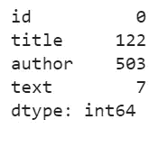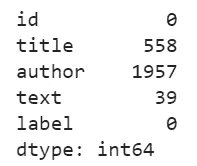

训练数据和测试数据中的空值数量

此外，我还检查“假”和“真”新闻在数据集中的分布。通常，我在导入 matplotlib 时为笔记本上的所有绘图设置 rcParams。

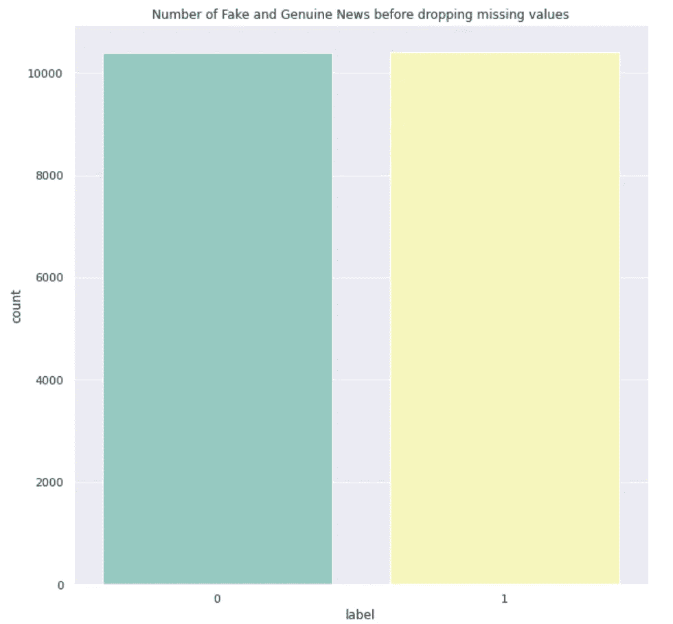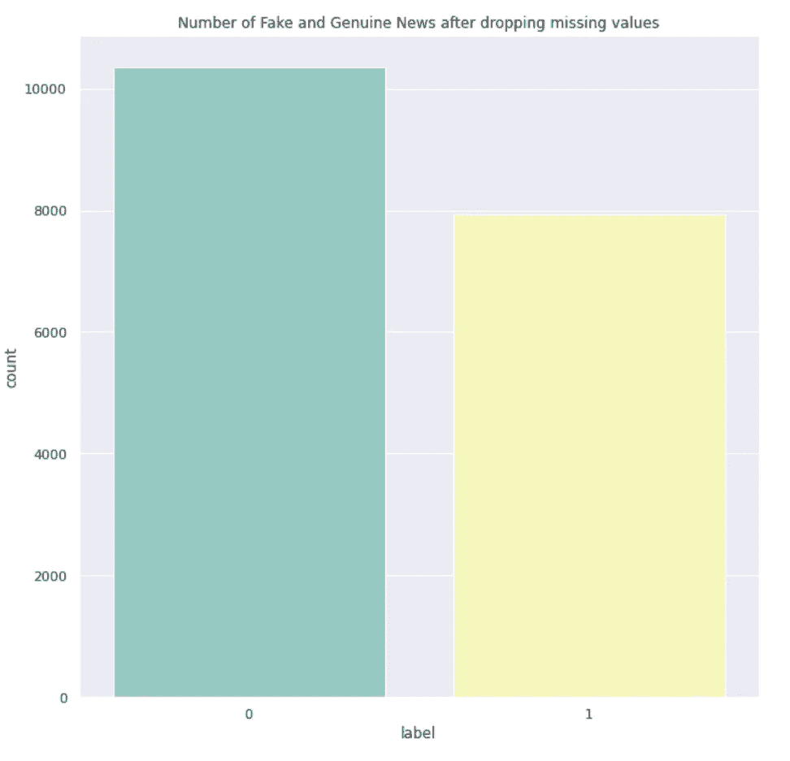

0 是真正的新闻，而 1 是假新闻

真假新闻的比例从 1:1 到 4:5。

接下来，我决定看看下面的文章长度—

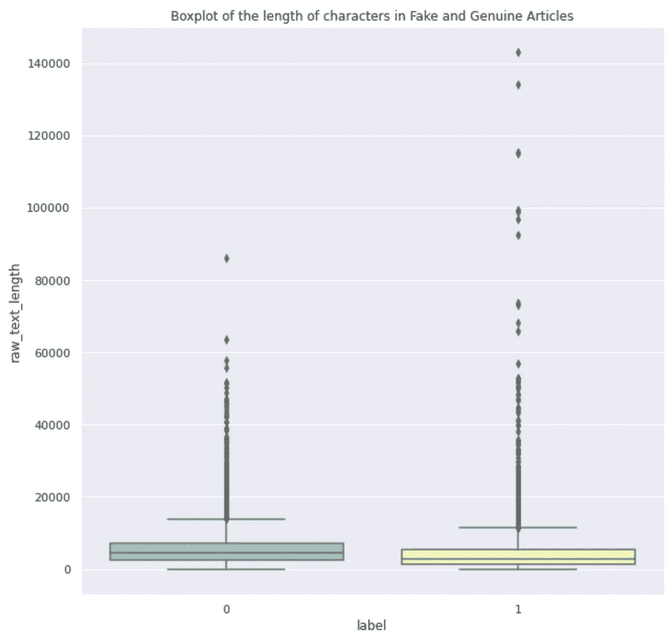

可以看出，假文章的中值长度较低，但也有大量异常值。两者的长度都为零。

可以看出，它们从 0 开始，这是令人关注的。我用的时候其实是从 1 开始的。描述()以查看数字。于是我看了一下这些文字，发现都是空白的。对此，显而易见的答案是条带和液滴长度为零。我检查了零长度文本的总数是 74。

我决定重新开始。因此，我会用一个空格填充所有的 nan，然后去掉它们，然后删除零长度的文本，这样就可以开始预处理了。下面是处理缺失值的新代码。数据的最终形状是(20684，6)，即包含 20684 行，只比 20800 少 116 行。

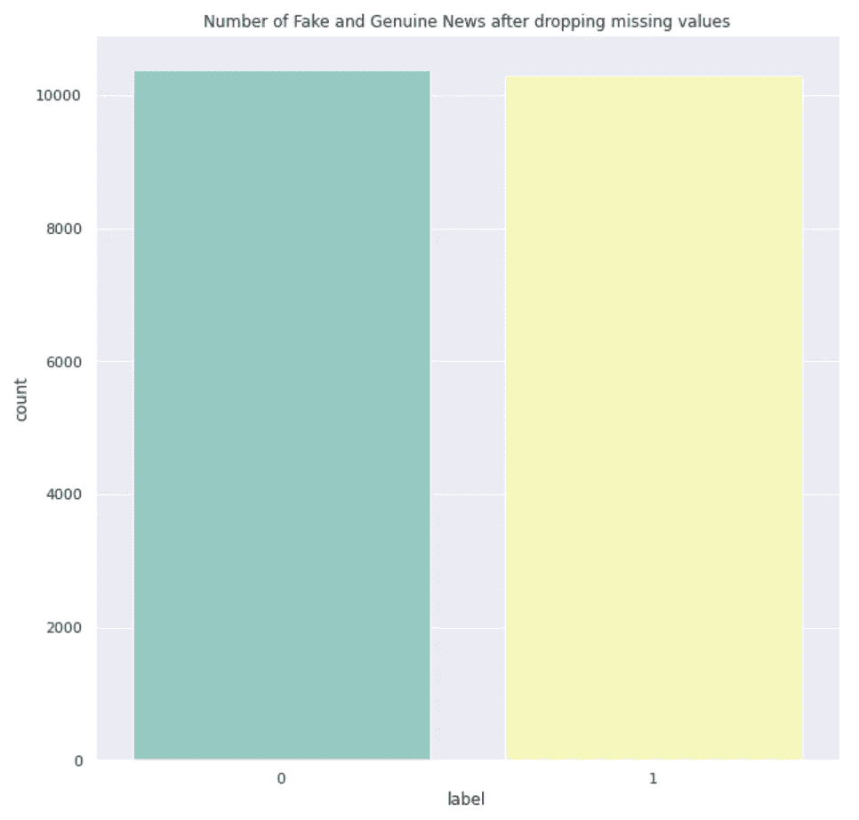

目标变量的分布形状是均匀的，这有利于模型训练。

此后，出现了更多个位数长度或低至 10 的文本。它们看起来更像评论，而不是正式的文本。我会暂时保留它们，然后进入下一步。

# 文本预处理

因此，在我开始进行文本预处理之前，我实际上查看了拥有假冒和正版文章的作者的重叠数量。换句话说，拥有作者的信息会有任何帮助吗？我发现有 3838 个作者，其中 2225 个是真实的，1618 个是假新闻的作者。其中有 5 位作者是真假新闻的作者。

为了开始预处理，我最初选择了通过空白和扩展收缩直接分割。然而，由于一些(我想是斯拉夫语)其他语言的文本，这已经产生了错误。因此，在第一步中，我使用 regex 只保留拉丁字符、数字和空格。然后，展开缩写，然后转换成小写。这是因为缩写如**I have**转化为 **I have** 。因此，向小写字母的转换发生在扩张收缩之后。完整代码如下:

一旦完成，常规单词标记化就完成了，随后是停用词移除。

# 文本分析

既然数据已经准备好了，我打算使用 wordcloud 查看常用词。为了做到这一点，我首先将所有标记化的文本连接到单独列中的字符串中，因为它们将在稍后的模型训练中使用。

接下来，为每个标签创建一个包含所有文本的字符串，并创建如下的单词云:

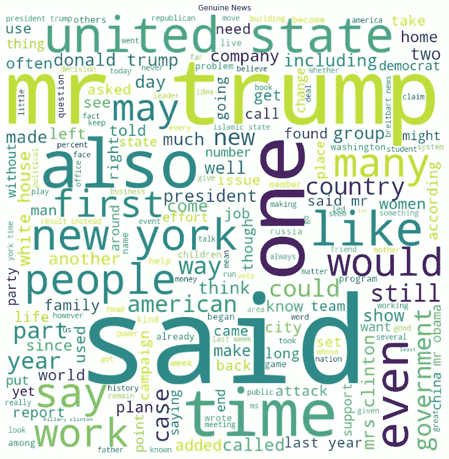

第一个 wordcloud 是真新闻，第二个是假新闻。

在假新闻词云中，一些词的出现频率明显高于其他词。在“真实新闻”的文字云上，有不同字体大小的混合。相反，在假新闻数据集中，较小的文本在背景中，一些词使用得更频繁。假新闻词云中的中等大小的词越来越少，或者换句话说，出现频率逐渐减少，这是一种脱节。频率不是高就是低。

# 风格分析

风格计量分析通常被称为对作者风格的分析。我将研究一些风格学特性，比如每篇文章的句子数量、文章中每句话的平均字数、每篇文章的平均字数以及词性标签数。

## **每篇文章的句子数量**

为了得到这个，我需要原始数据集，因为我在 train_df 中丢失了句子信息。因此，我在 orginal _ train _ df 中保存了一份实际数据的副本，用于将句子转换为序列。

接下来，我查看了每个目标类别的句子数量，如下所示:

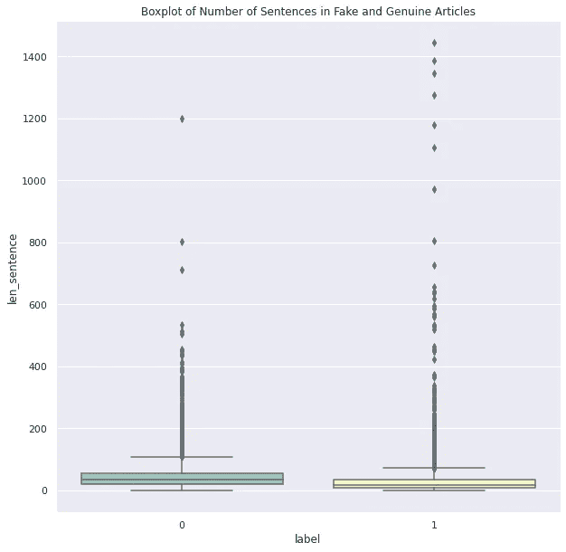

显然，虚假文章有很多异常值，但 75%的虚假文章的句子数量低于 50%的真实新闻文章。

# 文章中每句话的平均字数

在这里，我统计了每篇文章每句话的总字数，并返回平均值。然后我在箱线图上画出了这些数字，使它们可视化。

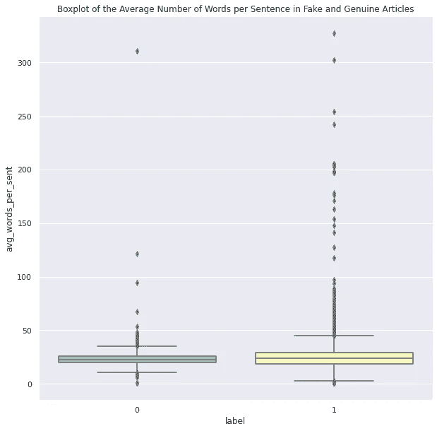

可以看到，平均来说，假文章比真文章更罗嗦。

## 每篇文章的平均字数

这是一篇文章的平均字数。在方框图中，很明显，假文章中的平均单词长度更高。


## POS 标签计数

接下来，我试着看了伪作 vs 正版文章中的词性(POS)组合。在遍历每篇文章时，我只将单词的词性存储到一个列表中，将相应的词性计数放在一个数据帧中，并使用一个条形图来显示假货和新闻文章中词性标签的百分比组合。两篇文章中的名词都高得多。总的来说，除了假新闻中动词过去式的比例是真实新闻的一半之外，没有明显的规律。除此之外，所有其他 POS 类型在假货和真品方面几乎相等。

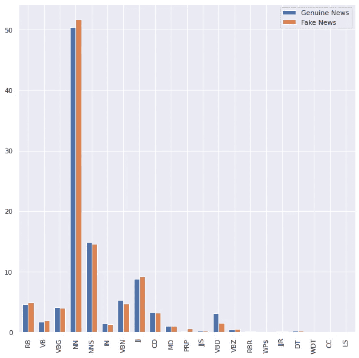

# 使用机器学习的文本分类

## Tf-idf 和计数矢量器

一旦分析完成，我首先采用传统的方法使用计数矢量器和术语频率-逆文档频率或 Tf-idf。代码中配置的计数矢量器也生成二元模型。使用 [CountVectorizer](https://scikit-learn.org/stable/modules/generated/sklearn.feature_extraction.text.TfidfTransformer.html) ()以矩阵的形式获得它们出现的次数，然后将这个字数矩阵转换成归一化的词频(tf-idf)表示。这里，我使用了 smooth=False，以避免零除法误差。通过提供 smooth=False，我基本上是在文档频率上加 1，因为它是 idf 计算公式中的分母，如下所示

```
**idf(t) = log [ n / (df(t) + 1) ]**
```

## 使用默认配置进行基准测试

接下来，我打算用默认配置来训练模型，并挑选出性能最好的模型稍后进行调优。为此，我遍历了一个列表，并将所有性能指标保存到另一个数据帧中，并将模型保存到一个列表中。

我使用了逻辑回归、多项式朴素贝叶斯、决策树、随机森林、梯度增强和 Ada 增强分类器。多项式 b 的精确度是所有方法中最好的，但是 f1 的分数由于召回分数低而不稳定。事实上，召回率最差，为 68%。结果中最好的模型是 Logistic 回归和 AdaBoost，它们的结果是相似的。我选择用逻辑回归来节省训练时间。

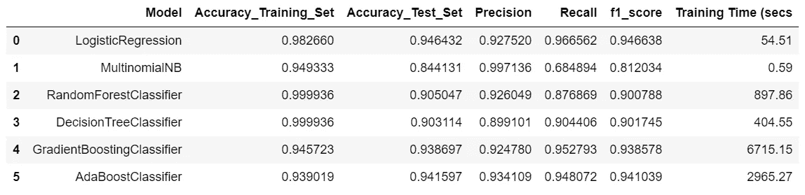

## 用于调整逻辑回归分类器的 GridSearchCV

所以，是时候调整我选择的分类器了。我开始使用更大范围的 max_iter 和 c。然后使用 cv=r 的[gridsearchcv](https://scikit-learn.org/stable/modules/generated/sklearn.model_selection.GridSearchCV.html)，即交叉验证的 5 倍，因为标签分布是公平分布的。我已经使用 f1-score 进行评分，并使用 refit 返回 f1-score 最好的训练模型。

得到的最佳模型的准确率为 97.62%，f1 值为 97.60%。对于这两者，我们都实现了 4%的改进。现在，我注意到 max_iter 的最佳值是 100，这是范围的下限，对于 C，它也是 100，但这是范围的上限。因此，为了适应参数搜索，我使用了 max_iter = 50，70，100 和 C = 75，100，125。在 max_iter=100 和 C=125 的情况下有微小的改进。因此，我决定保持不变，并将 C 的参数搜索从 120 扩大到 150，步长为 10。本次运行的所有性能指标与起始网格的结果相同。然而，这次运行的 C=140 的值。

最后一次，我在 max_iter=100 和 C = [100，125，140]上运行网格搜索，其中 C 具有所有运行中的最佳参数。最好的一个是 max_iter=100，C=140，我最终保存为最佳模型。

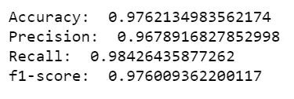

由于 GradientBoost 和 AdaBoost 分类器的性能也很好，因此未来可能的工作之一是用它们进行测试。在某些情况下，调优后的性能可能会好得多，但考虑到时间，我会在这里得出结论，因为逻辑回归是 max_iter=100 和 C=140 的最佳性能模型。

我终于把结果上传到 Kaggle 上了。这个挑战已经进行了 3 年，但是我对测试这个模型的测试数据的分数很感兴趣。

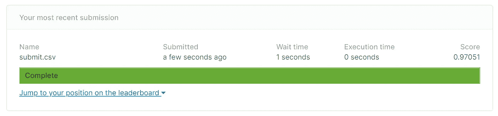

# 使用手套和 LSTM 的文本分类

## 数据准备

为了使用深度学习技术，文本数据必须以原始格式重新加载，因为嵌入会略有不同。在下面的代码中，我处理了缺少的值，并将文章的标题和作者附加到文章的正文中。

接下来，我使用 Keras API 的[标记器](https://keras.io/api/preprocessing/text/#tokenizer)类对文本进行标记，并使用 oov_token = " < OOV >"替换词汇外标记，这实际上创建了一个基于词频的词汇索引。然后，我在文本上安装标记器，并使用通过安装标记器创建的词汇索引将它们转换成整数序列。最后，由于序列可能有不同的长度，我使用 padding _ sequences 在末尾使用 padding=post 填充零。因此，根据代码，每个序列的长度预计为 40。最后，我将它们分成了训练集和测试集。

## 二元分类模型

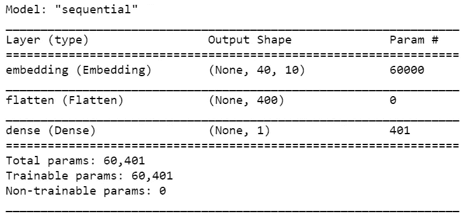

为了创建用于文本分类的模型，我从最简单形式的二进制分类模型结构开始，其中第一层是[嵌入](https://keras.io/api/layers/core_layers/embedding/)层，期望嵌入 6000 个 vocab 大小的文本(在 vocab_size 中指定)，每个长度为 40 的序列(因此，input_length=max_length ),并为每个输入序列给出 10 维的 40 个向量的输出。接下来，我使用[展平](https://keras.io/api/layers/reshaping_layers/flatten/)图层将形状(40，10)的矩阵展平成一个形状(400)的数组。然后，这个数组通过一个[密集](https://keras.io/api/layers/core_layers/dense/)层产生一维输出，并使用 sigmoid 激活函数产生二进制分类。我最初想用这个模型做更多的实验，所以为它创建了一个函数，我也喜欢把层组合成一个函数作为练习。这项工作并不真正需要它。最后，我使用 precision 和 recall 来编译模型，以便在训练和验证时进行监控。

我还使用了早期停止来节省时间，patience=15 表示如果在过去的 15 个时期中模型没有改进就停止，使用模型检查点来存储最好的模型，save_best_only=True。增加了模式=分钟，因为我在这里监测损失。

现在是适合模型的时候了！

因为我使用了精度和召回率以及损失，所以我也可以在这里跟踪精度和召回率值。如下图所示，验证损失在第 6 个时期最低，然后损失停滞或增加。因此，最佳模型在训练的第 6 个时期后被保存。很明显，随着训练损失的改善，模型是如何过度拟合的，而验证损失在第 6 代之后增加。

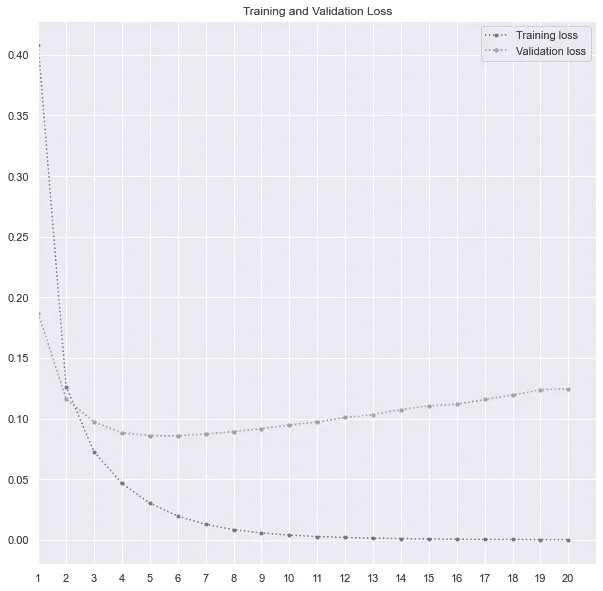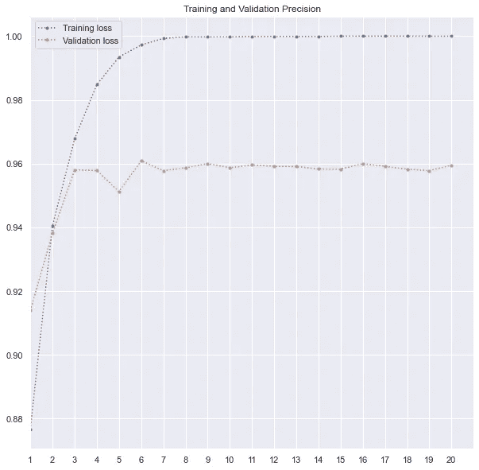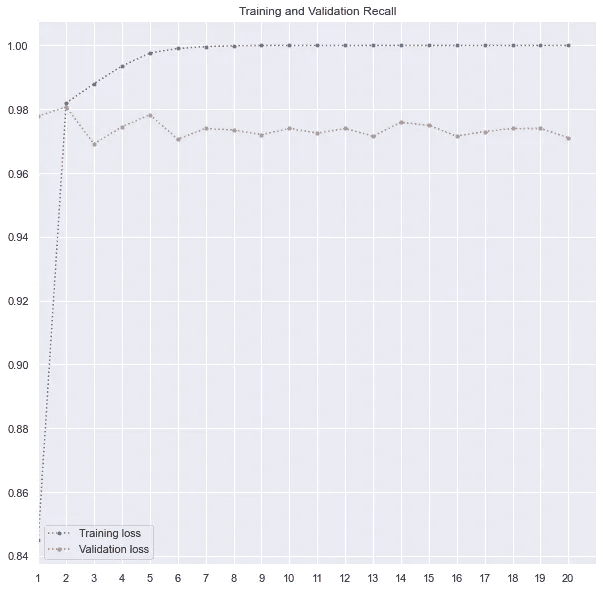

下面是我用来绘制训练和验证损失、精度和召回的代码。我在 range 函数中用了 max(history.epoch) + 2，因为 history.epoch 从 0 开始。因此，对于 20 个时期，最大值将是 19，范围将为 max(history.epoch)生成从 1 到 18 的列表。

该模型的准确度值为 96.6%，f1 值为 96.6%。我还在 Kaggle 测试数据上测试了这个模型的性能，它还不错，但不比我之前训练的逻辑回归好。

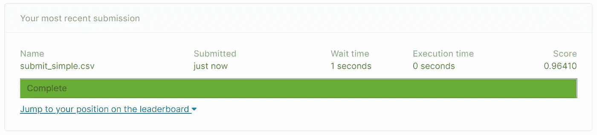

.

## LSTM

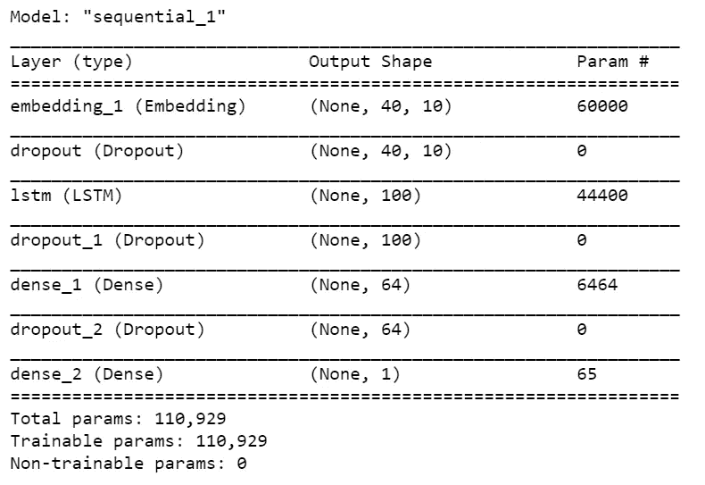

唷！现在让我们用 LSTM 模型来拟合文本数据。第一层和最后一层是相同的，因为输入和输出是相同的。在这两者之间，我使用了一个[辍学](https://keras.io/api/layers/regularization_layers/dropout/)层过滤掉 30%的单位，然后去 [LSTM](https://keras.io/api/layers/recurrent_layers/lstm/) 层的 100 个单位。长短期记忆(LSTM)，是一种特殊的 RNN，能够学习长期依赖。他们的特长在于记忆信息的时间更长。在使用 LSTM 后，我使用了另一个脱落层，然后是一个具有 64 个隐藏单元的全连接层，然后是另一个脱落层，最后是另一个具有“Sigmoid”激活函数的一个单元的全连接层，用于二进制分类。

完成后，我按照上一节中概述的相同过程编译、使用回调并拟合模型。我提供的纪元数量是 20。但是在这种情况下，模型只训练了 16 个时期，因为在第一个时期之后的 15 次连续迭代中，验证损失没有改善。从下面的图中也可以清楚地看到。由于过度拟合，验证损失一直在增加，而训练损失却在下降。回想一下回调设置，我对模型进行了编码，以在停止之前连续 15 个时期等待验证损失的改善。

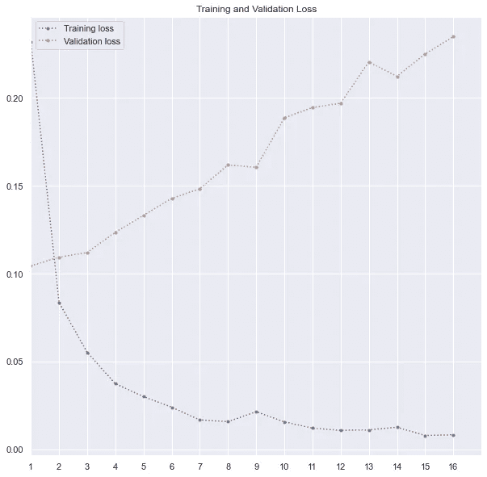

该模型没有显著的改进，尽管该模型有可能改进。其准确率为 96.1%，f1 评分为 96.14%。

## 使用预先训练的单词嵌入—手套

现在，我们也可以使用预先训练的单词嵌入，比如 GloVe。GloVe 是一种无监督学习算法，用于获取单词的矢量表示。在来自语料库的聚集的全局单词-单词共现统计上执行训练，并且所得的表示展示了单词向量空间的有趣的线性子结构。[ [4](https://nlp.stanford.edu/projects/glove/)

我使用的是一个在 60 亿个词汇上训练过的，词汇有 40 万个，用 300 维向量格式表示。

在下面的代码中，我有一个在 Google Colab 上加载 GloVe 的代码，因为我在 Colab 上做了部分工作。

在这里，我概述了如何从本地加载文件。从[这里](https://nlp.stanford.edu/projects/glove/)下载嵌入这个词。

接下来，我们的目标是在手套嵌入中找到假新闻数据中的标记，并获得相应的权重。

## 带手套的简单模型

现在，我已经为我们的训练数据嵌入了手套，我使用了 output_dim=300 的[嵌入](https://keras.io/api/layers/core_layers/embedding/)层，这是手套向量表示形状。此外，我使用了 trainable = False，因为我使用的是预训练的权重，所以我不应该在训练时更新它们。它们与其他单词有关系，所以最好不要打扰它们。

最后，使用与我之前使用的相同的过程，我用 50 个纪元来训练模型。然而，由于在第 3 个时期之后没有改善，该模型在第 18 个时期之后停止训练。得分低于前两款。准确率和 f1 值都在 93%左右。

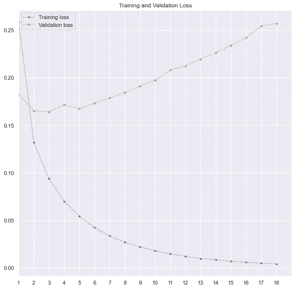

## LSTM 手套

和..最后，我使用手套嵌入来训练我之前使用的 LSTM 模型，以获得更好的结果。完整的代码如下-

同样，我使用了 50 个历元，模型在第三个历元后没有改进。因此，训练过程在第 18 个纪元后停止。准确率和 f1 值都提高到 96.5%，接近第一个 Keras 模型。

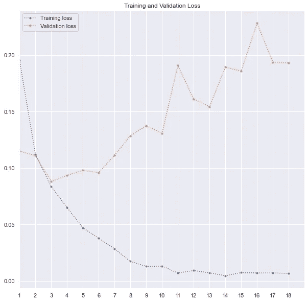

所以，我试着用 Kaggle 的测试数据来预测这个模型，这是我的结果

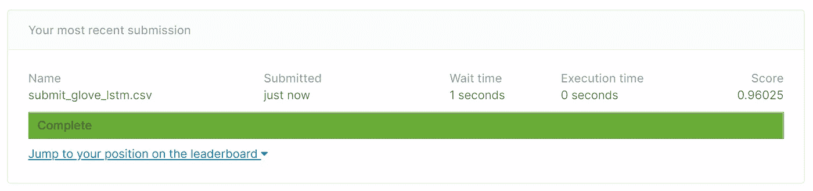

# 结论

在本练习中，最佳模型是优化的逻辑回归模型。这个用例还有很多需要进一步改进的地方，特别是设计更好的深度学习模型。此外，出于时间的考虑，我没有调整随机森林和 AdaBoost 分类器，这可能会导致比逻辑回归更好的性能。

# 参考

1.  [https://faroit . com/keras-docs/1 . 0 . 1/入门/sequential-model-guide/](https://faroit.com/keras-docs/1.0.1/getting-started/sequential-model-guide/)
2.  【https://colah.github.io/posts/2015-08-Understanding-LSTMs/ 
3.  [https://machine learning mastery . com/use-word-embedding-layers-deep-learning-keras/](https://machinelearningmastery.com/use-word-embedding-layers-deep-learning-keras/)
4.  [https://nlp.stanford.edu/projects/glove/](https://nlp.stanford.edu/projects/glove/)

## [完整代码在这里。](https://github.com/royn5618/Medium_Blog_Codes/tree/master/Fake_News)

*感谢光临！*

**我的链接:** [中](https://medium.com/@nroy0110)|[LinkedIn](https://www.linkedin.com/in/nabanita-roy/)|[GitHub](https://github.com/royn5618)