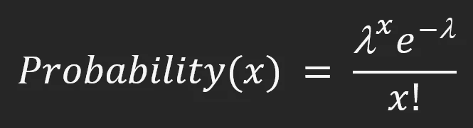
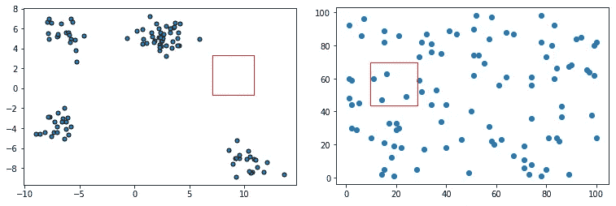
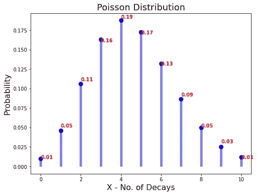
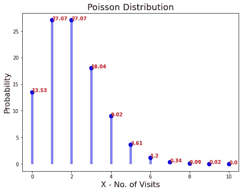
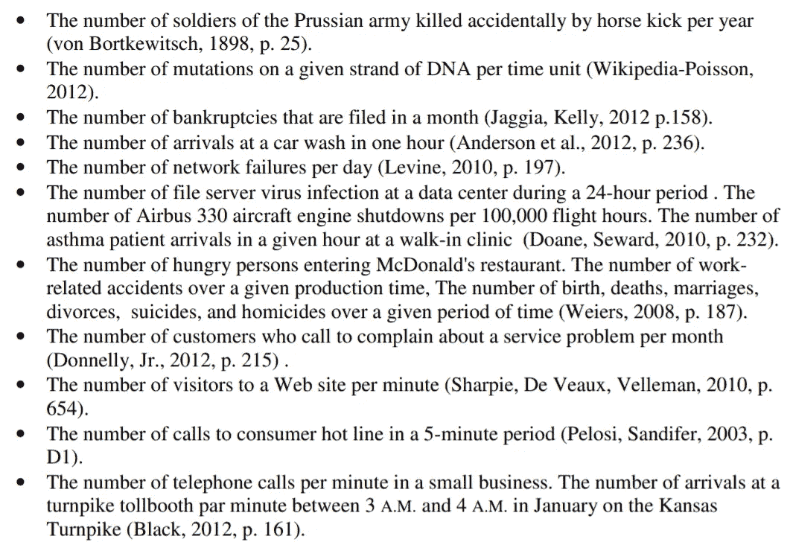
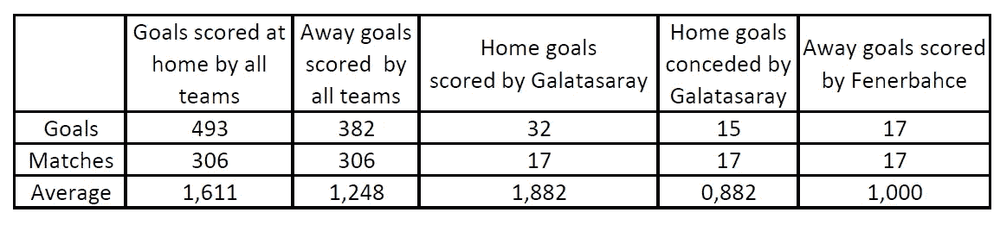
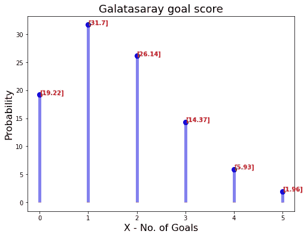
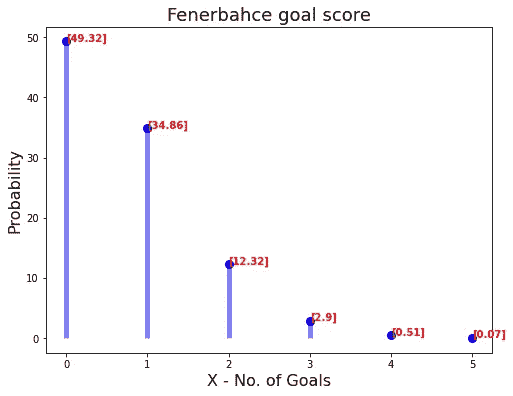

# 利用泊松分布预测足球比赛结果

> 原文：<https://towardsdatascience.com/predicting-football-match-result-using-poisson-distribution-ac72afbe36e0?source=collection_archive---------7----------------------->

## 探索泊松分布和预测加拉塔萨雷对费内巴赫比赛结果使用它与 python 实现

理解数据集、执行适当的预处理操作并解释结果对于根据更准确的数据训练机器是必不可少的。例如，如果我们考虑降维，降维方法的类型(线性或非线性)取决于数据集的结构。分布类型也是阅读、理解和推断数据集的最重要的方法之一。本文通过使用泊松分布和 2019-2020 土耳其足球联赛数据集解释了球队相互进球的概率，该数据集总是无记忆的，具有泊松分布。本文深入解释了泊松分布，并基于 2019-2020 土耳其足球联赛的真实数据集，使用泊松分布对加拉塔萨雷和费内巴切相互得分的概率进行了建模。

```
***Table of Contents* 1\. What is Poisson Distribution?
*1.1\. How can we decide whether is a poisson distribution?
1.2\. Examples
1.3\. Real Applications*
2\. Predicting Football Match Result
3\. References**
```


荷马·洛佩兹在 [Unsplash](https://unsplash.com?utm_source=medium&utm_medium=referral) 上的照片

# 1.什么是泊松分布？

以其最短的形式，在某个区间(这个区间可以是时间、距离、面积、体积等)内发生的独立事件数量的分布。)是泊松分布。比如某路口 24 小时的事故数量，一平方米地块的鸡，X 地区 3 个月的火灾数量等。在继续这些例子之前，让我们先来看看这个主题的理论背景:



泊松分布，按作者分类的图像

其中λ=某一时间间隔内出现的平均次数

e =欧拉常数

x =需要概率的事件的数量

## **1.1。我们如何决定是否是泊松分布？**

*   事件发生**随机**和**独立**呈泊松分布。
*   事件发生在特定范围内。
*   要使用泊松分布建模，应根据事件的**计数给出分布。例如，在 10 分钟内过马路的人的平均重量不是泊松分布，但是> x kg 的人数可以用泊松分布建模。**

查看图 1 中的两幅图和随机放置的红色方块:



图一。泊松分布与否？，作者图片

在左侧的图表中，可以看到正方形中的事件数(数据点)在某些地方为 0，而在其他地方为 15–20。这表明数据不是独立分布的，而是在一定条件下分组的，如果事件(数据点)在整个图中随机、独立且以相同的理论速率分布，那么如果在另一个方块中得到 0 个事件，那么在一个方块中得到 15-20 个事件是没有意义的。因此，它不能用泊松分布来建模。

当红色方块应用于右侧图表的不同部分时，方块中事件(数据点)的数量将彼此接近。这可以用泊松分布来模拟。

> 这里，用泊松建模的不是手边的数据集，而是应用于数据集的帧中的事件(数据点)的数量。

## 1.2.例子

让我们解决一些基本问题来进入正题。

1-1 毫微克的铀-234 平均每秒发生 4.6 次放射性衰变，让我们根据泊松分布计算每秒发生 3 次放射性衰变的概率。

*   λ= 4.6
*   X=3

下面的代码块解决了这个问题:



图二。衰变数的概率，按作者分类的图像

值的概率如图 2 所示，如果每秒 4.6 次放射性衰变，则 3 次放射性衰变的概率为 16%，其他值的概率如图所示。

*2-平均 12 个人在 30 分钟内参观一个博物馆。任何 5 分钟内没有新人来这个博物馆的概率是多少？*

*   如果 30 分钟内平均有 12 个人访问，那么 5 分钟内平均会有 2 个人访问，所以λ= 2；
*   如果 X 值，也就是概率，是期望值，就是 0。

下面的代码块解决了这个问题，而没有使用泊松分布库:



图 3。访问次数的概率，按作者分类的图像

在图 3 中，显示了访问多达 10 个人的概率。5 分钟内没有新访客的概率为 13.53%。

## 1.3.真实应用

以下列表包括泊松分布的实际应用:



图 4。泊松分布的应用[1]

# 2.预测足球比赛结果

该研究旨在确定加拉塔萨雷主场而费内巴切客场(GS vs FB)时球队进球数量的概率。在这种情况下，使用了以下包含 1959-2021 年间土耳其联赛所有比赛结果的数据集。为了找到他们在加拉塔萨雷主场和费内巴切客场比赛中相互进球的概率，我们研究了 2019-2020 赛季，如下面的代码块所示:

数据集(许可证: [CC0:公共领域](https://creativecommons.org/publicdomain/zero/1.0/))可以通过[链接](https://www.kaggle.com/faruky/turkish-super-league-matches-19592020/version/8)访问

1.  在第一部分中，通过选择 2019–2020 赛季并导入数据集；选择主场、客场、主场进球得分和客场进球得分列。
2.  第二部分计算 2019–2020 赛季主客场球队的总进球数和平均进球数。联赛共有 18 支球队，赛季进行了 18*17 = 306 场比赛，主队的总进球数为 493 个(平均:1.611)，而客场球队的总进球数为 382 个(平均 1.248)。
3.  在第三部分，计算了加拉塔萨雷在主场比赛中的总进球数和失球数以及平均进球数。加拉塔萨雷 17 个主场进 32 球(场均:1.882)，失 15 球(场均:0.882)。
4.  在第四部分，计算了费内巴切在客场比赛中的总进球数和失球数以及平均进球数。主队在费内巴赫 17 场客场比赛中的进球，这意味着费内巴赫的失球数是 24 球(平均 1.412)，而费内巴赫的失球数是 17 球(平均 1.00)。
5.  在第五部分中，对前一部分收集的值进行了汇编和列表。(图 5)



图 5。调查结果汇编，图片由作者提供

6.第六节加拉塔萨雷(主场)和费内巴切(客场)的攻防威力计算如下:

*   加拉塔萨雷攻击力:加拉塔萨雷主场/联赛主场的平均进球数
*   费内巴赫攻击力:费内巴赫客场比赛的平均进球/联赛客场平均进球
*   加拉塔萨雷防守力:加拉塔萨雷的平均失球数，加拉塔萨雷是主场/联赛客场平均失球数
*   费内巴赫防守实力:费内巴切客场比赛平均失球数/联赛主场平均失球数

> 这部分可以选择使用不同的数学运算符进行计算。

7.在第七节中，加拉塔萨雷主场对费内巴切的平均进球数和费内巴切客场对加拉塔萨雷的平均进球数是利用第六节中得到的各队的攻防力量计算出来的。(GS 1.649–0.707 FB)

当然，由于匹配结果不太可能以 1.649–0.707 结束，这些平均值的泊松分布已在以下部分获得:

8.第八集中，加拉塔萨雷对阵费内巴切的进球概率如图-6 所示。



图 6。加拉塔萨雷进球概率

加拉塔萨雷对阵费内巴赫进球概率最高的是 1 球(31.7%)，其次是 2 球 26.14%

9.第九节，费内巴切对阵加拉塔萨雷的进球概率如图-7 所示。



图 7。费内巴赫进球的概率

加拉塔萨雷对阵费内巴赫进球的最高概率是 0 球(49.32%)，也就是说加拉塔萨雷有 49.32%的几率不失球。第二个是 1 球 34.86%。

# 3.参考

[1] J. Letkowski，“泊松概率分布的应用”

[](https://ibrahimkovan.medium.com/machine-learning-guideline-959da5c6f73d) [## 机器学习指南

### 所有与机器学习相关的文章

ibrahimkovan.medium.com](https://ibrahimkovan.medium.com/machine-learning-guideline-959da5c6f73d)