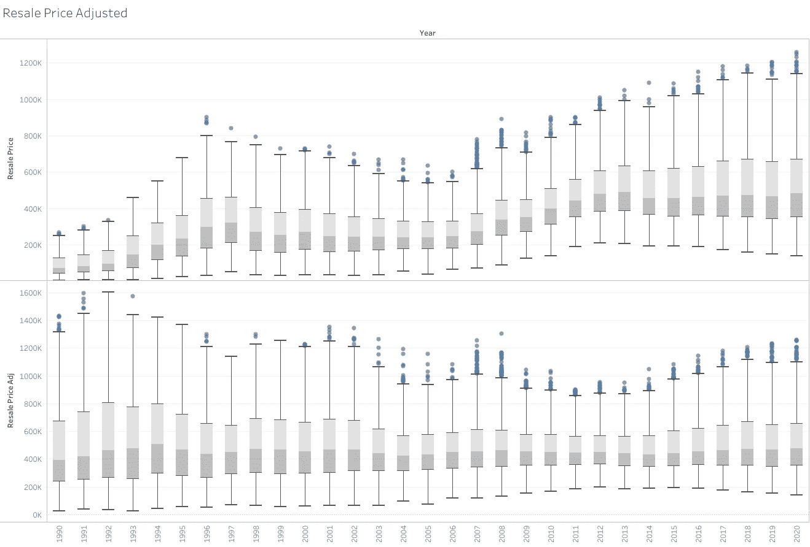
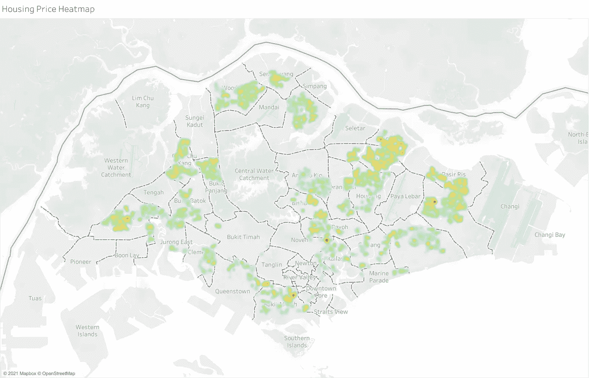
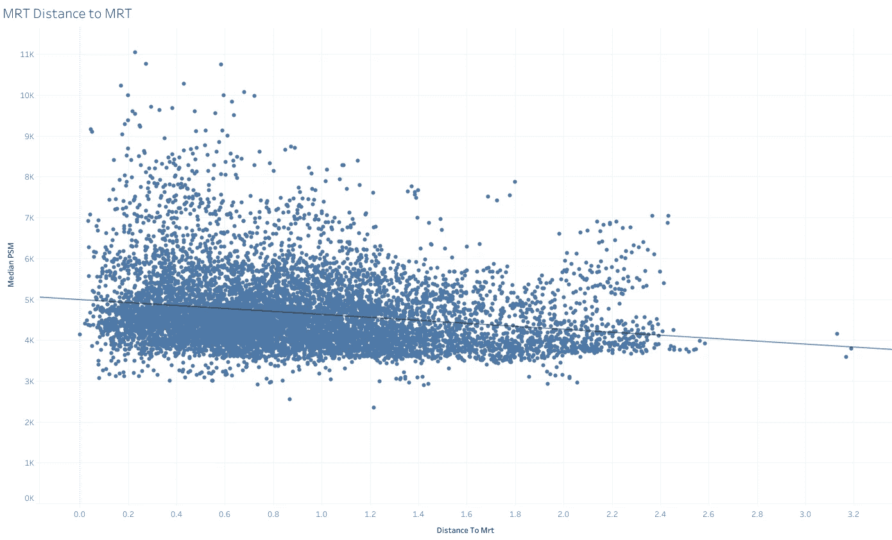
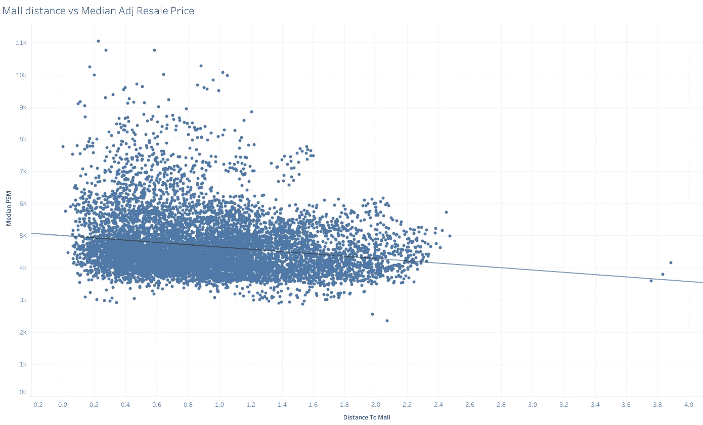
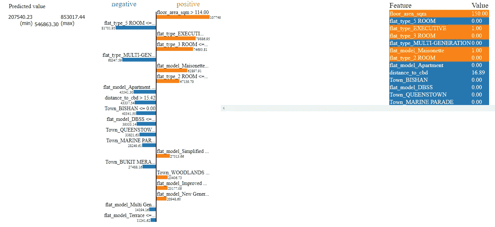
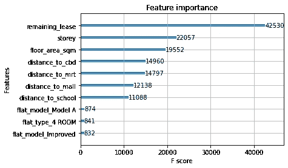
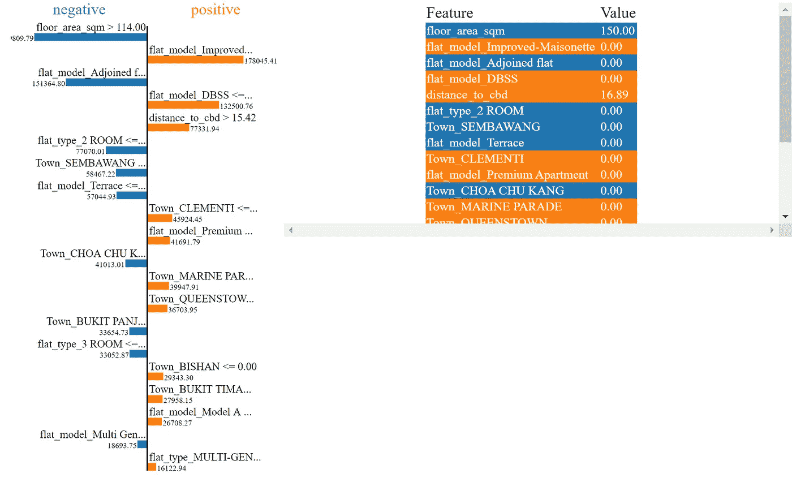
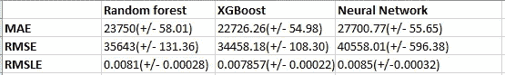

# 用机器学习算法预测 HDB 价格(下)

> 原文：<https://towardsdatascience.com/predicting-hdb-prices-using-machine-learning-algorithms-part-2-614c54646998?source=collection_archive---------33----------------------->

照片由[盖伦·克鲁特](https://unsplash.com/@galen_crout?utm_source=medium&utm_medium=referral)在 [Unsplash](https://unsplash.com?utm_source=medium&utm_medium=referral) 拍摄

第 1 部分:[使用神经网络预测 HDB 价格](/predicting-hdb-housing-prices-using-neural-networks-94ab708cccf8)。

注意:大家好，这个故事是我上一篇文章的后续。自从我的上一篇文章以来，我一直致力于通过特征工程改进模型的几种方法。我意识到数据集中有街道名称和街区编号，使用地理定位 API ( [OnemapSG](https://docs.onemap.sg/) )我能够创建新的功能来测量房屋和感兴趣的地方之间的距离(使用[哈弗辛公式](https://stackoverflow.com/questions/4913349/haversine-formula-in-python-bearing-and-distance-between-two-gps-points))。我的同事在地理定位 API 上给了我很多帮助。

# 概观

当前的机器学习算法增加了两个新功能。1.转售价格指数和 2。距离购物中心/捷运/CDB。目的是验证包含这两个新特性是否会导致 MAE 小于以前的模型(<20,000).

**重新定义业务案例**

在用神经网络预测 HDB 价格的第 1 部分中，我的商业案例是创建一个 HDB 预测模型*而不考虑销售年份*。回想起来，我没能考虑到它的真正适用性。为什么会有人有兴趣知道他们的房子在 10 年前卖了多少钱？预测模型应该预测今天价格中的转售价格。

因为有很多因素(如供求关系、SIBOR 等。)可以影响转售价格。这些因素会导致相同条件下的价格波动，这意味着具有完全相同特征(相同大小，相同位置)的房屋可能会根据销售年份的不同而定价不同。为了考虑到每年的价格波动，价格将标准化到 2020 年(转售价格调整)。转售住房指数可以在这里找到[。](https://data.gov.sg/dataset/hdb-resale-price-index)

**创建经纬度特征**

我们通过连接块名称和块编号创建了新的要素名称(称为地址),之后我们通过地理定位每个地址来创建纬度和经度要素。随后，我们所要做的就是根据学校或捷运站的列表计算地址之间的最小距离。

**删除不存在的 HDB 名字**

在地理标记过程中，我们发现一些没有坐标的组屋，很可能这些街区已经被拆除或被另一栋建筑取代。为了完整起见，我删除了空条目。此外，Lim Chu Kang 镇地区近年来没有组屋，因为该地区的所有组屋都已拆除。

# 调整后的转售价格

到 2020 年调整后的转售价格。低于 2020 年指数水平的房屋已经向上调整，最明显的是 1990 年。我们看到，1990 年的价格几乎翻了 3-4 倍。通过将价格调整到 2020 年的转售价格指数，我们可以去除销售年份的特征。

**调整后转售价格热图**

从地图上你可以看到诺维那、坦皮尼、丰戈尔和市中心的几个热点。要了解更多细节，请随意查看 tableau 公共页面。

# **到便利设施的距离**

大多数在新加坡买房的人都希望房子位于便利设施附近，如捷运、购物中心和/或学校。看到新加坡是一个金融中心，有些人甚至想住在中央商务区附近。

我们使用每平方米中值(PSM)作为目标特征，以查看距离和 PSM 之间是否有任何相关性。PSM 是用房价除以建筑面积得出的。看到数据错综复杂(多栋房屋具有不同的转售 PSM，与 MRT 的距离相同)，我选择对每个距离使用中位数 PSM。

**PSM 到 MRT 的距离**

对于不知道什么是 [MRT](https://en.wikipedia.org/wiki/Mass_Rapid_Transit_(Singapore)) 的国际读者。你可以把它想象成纽约的地铁，或者伦敦的地铁。

PSM 和到 MRT 的距离之间有轻微的负相关(R2=0.04)。

**PSM 到商场的距离**

同样，在 PSM 和到最近的购物中心的距离之间有轻微的相关性(R2= 0.037)。商城列表源自[data.gov](https://data.gov.sg/dataset/carpark-rates)，之后做了一些清理，删除了停车场和无关数据。

**PSM 到中央商务区的距离**

CBD(捷运来福士广场)距离显示出相对较强的负相关性(R2=0.258)。似乎我们离 CDB 地区越远，我们看到 PSM 下降。

**PSM 至学校**

PSM 对学校似乎是反直觉的，有一个正相关(R2=0.002)，尽管很弱。

# 系统模型化

在这篇文章中，我将包括其他机器学习模型，不仅要看看序列神经网络是否最好，还要比较特征重要性的差异。我将比较三种算法，即 1)序列神经网络，2)随机森林回归和 3) XGBoost。

我编码了所有的分类特征。至于神经网络，数据是有尺度的。

**随机森林回归+超参数调整**

我对随机森林回归随机搜索交叉验证应用了超参数调整。以下是用于随机森林算法的最佳超参数。

基于随机搜索 CV 的最佳参数

Scikit 学习特征重要性和 LIME(局部可解释模型不可知解释)都用于解释一些特征重要性，以了解哪些参数是重要的。LIME 还有助于我们了解该特征对预测有负面影响还是正面影响。

1 个样本的随机森林的石灰

我们可以立即看到，建筑面积在整体价格中占有很高的权重，这确实表明越大越好。此外，我们还可以看到，添加到模型中的新功能是预测价格的一个重要因素。

**XGBoost 回归器+超参数整定**

XGBoost 回归器与超参数调整一起使用。欲了解更多关于超参数调整的信息，请参考[此处](https://blog.cambridgespark.com/hyperparameter-tuning-in-xgboost-4ff9100a3b2f)。我想看看通过简单地调整超参数我们能获得多大的改进。超参数调整前的 MAE 为 24，907.30。在调优之后，我们设法获得了 22，726.26 的 MAE。在不改变数据集的情况下，MAE 提高了 10%。

1 个样品的 XGBoost 石灰

我们可以看到不同的特征如何影响房价。

**序列神经网络**

使用了一个三层神经网络，但是，这一次我们增加了批量大小以缩短训练时间。最新的模型并不比以前的模型表现得更好，也不比以前的两个算法表现得更好。在未来的工作中，我将致力于优化超参数，以改善神经网络模型。

# 估价

所有三种算法的结果都是通过随机 k-fold 获得的。结果是:

评估表

很明显，XGBoost 的性能优于 NN 和 Random Forest。此外，这三种算法都有不同的特征重要性。引入的新功能(距离)在确定房价方面意义重大。

XGBoost 的特性重要性非常直观。此外，这 7 个特征优于其他特征。前三个特征，即剩余租赁、楼层和到 CDB(地铁莱佛士广场)的距离，在所有三种模式中都非常重要。

这有什么用？

嗯，分析功能的重要性可以让用户在做住房决策时确定和优先考虑哪些功能。你现在可以优先选择一个较高楼层的 HDB 和一个靠近学校的 HDB。当然，这纯粹是从转售价格的角度来看，而不是投资回报，因为该模型没有考虑起始价格。

# 结论

虽然这个项目在选择 HDB 公寓时给了我们许多重要的见解，但我相信这种模式的应用是非常广泛的。目前，除了帮助我的房地产经纪人朋友估计售价，我还没有发现这个模型的任何真正用途。

在未来的第三部分，我将包括私人财产的数据，以便创造一个整体的工具，可以预测新加坡的房地产价格。让潜在买家和房屋中介更深入地了解房价以及各种特征如何影响预测价格。